<p align="center">
  
</p>

This book is licensed under [Creative Commons Attribution 4.0
International](https://creativecommons.org/licenses/by/4.0/). You may copy,
share, and adapt it for any purpose, including commercially; please give
appropriate credit, link to the licence, and indicate changes.

---

EyeProlog runs portable ISO Prolog programs and turns their facts and rules
into answers and inspectable proofs. This book teaches logic programming with
it: describe a world as relations, state the rules that connect them, and let
unification and search find the answers.

This book is also the reference for the EyeProlog implementation.
Chapters 38–40 define the supported ISO Prolog profile, every built-in and
library predicate, and the command line; Chapter 41 states the standards and
the limits of the implementation.

A logic program can be read in two ways: as a set of sentences that are true in
a domain, and as a procedure that searches for proofs. The first reading says
which answers are justified; the second says whether the machine will find
them. Robert Kowalski summed this up as “algorithm = logic + control”. Most of
the craft of Prolog lies in keeping the logic fixed while improving the
control.

## Getting started

EyeProlog requires Node.js 18 or newer. Check with:

```sh
node --version
```

Upgrade an older runtime through a Node version manager or the
[official Node.js download](https://nodejs.org/en/download). Then run
EyeProlog without installing it:

```sh
npx --yes eyeprolog
```

For a persistent command, install into a user-owned prefix and add its `bin`
directory to your `PATH` in your shell startup file:

```sh
npm install --global --prefix "$HOME/.local" eyeprolog
export PATH="$HOME/.local/bin:$PATH"
```

Do not use `sudo npm install`; npm's
[EACCES guidance](https://docs.npmjs.com/resolving-eacces-permissions-errors-when-installing-packages-globally/)
recommends a Node version manager or a user-owned prefix instead.

The first program says that Socrates is a man and that every man is mortal.
From a source checkout, run it with:

```sh
node bin/eyeprolog.js examples/socrates.pl
```

The EyeProlog command should print:

```text
type(socrates, mortal).
holds_result(test, true).
```

The answers are themselves Prolog facts, so the output can be saved, loaded and
queried like any other program. Now ask why they hold:

```sh
node bin/eyeprolog.js --proof examples/socrates.pl
```

After the answers, the proof lists the program clauses as `clause/3` records
and one `step/4` term per proved goal, naming the clause that justifies it, the
variable bindings, and the subgoals it used:

```text
step(type(socrates, mortal), rule(2), ['X' = socrates], [type(socrates, man)]).
step(type(socrates, man), fact(1), [], []).
step(holds_result(test, true), rule(3), [], [type(socrates, mortal)]).
```

[SPEC.md](SPEC.md) specifies this format and the checks a proof checker
performs on it.

If you would rather not install anything, paste the program into the
[browser playground](https://eyereasoner.github.io/eyeprolog/playground). It
runs the same engine and libraries as the command line; only file-system
predicates and `include/1` need Node.

### Reading the code

- An `eyeprolog` block is Prolog source. Complete blocks are also available as
  files under [`examples/book/`](https://github.com/eyereasoner/eyeprolog/tree/main/examples/book/),
  grouped by chapter; a short block may rely on facts from the surrounding
  text.
- A `text` block shows output, a trace, or a data shape.
- A `sh` or `js` block is a shell command or a JavaScript embedding example.

The complete runnable programs live under
[`examples/`](https://github.com/eyereasoner/eyeprolog/tree/main/examples/),
with their outputs in `examples/output/`, their proofs in `examples/proof/`,
and the results of checking those proofs in `examples/check/`.

Read beside a running interpreter. Before each run, predict the answer; after
it, change one fact or query and explain the difference.

### Where to start

Newcomers should read Parts I–III in order. Experienced Prolog programmers can
start with Chapters 3, 11, 13 and 17, which show how EyeProlog adds explicit
tabling, forward rules and proofs to ordinary depth-first Prolog. Parts V–VIII
can be read in any order, and Part IX is reference material to consult as
needed.

## Contents

Chapters are numbered continuously across ten parts, from Chapter 1 to Chapter 43.

**Part I — Relations**

- [1. A program is a little theory](#1-a-program-is-a-little-theory)
- [2. Terms, variables, and substitution](#2-terms-variables-and-substitution)
- [3. Rules and their two readings](#3-rules-and-their-two-readings)
- [4. Recursion: describing reachability](#4-recursion-describing-reachability)
- [5. Lists as relations](#5-lists-as-relations)

**Part II — Search**

- [6. Arithmetic and finite generation](#6-arithmetic-and-finite-generation)
- [7. Failure, negation, and quantification](#7-failure-negation-and-quantification)
- [8. Collecting and choosing answers](#8-collecting-and-choosing-answers)
- [9. Structured data, text, and contexts](#9-structured-data-text-and-contexts)
- [10. From puzzles to models](#10-from-puzzles-to-models)

**Part III — Trustworthy reasoning**

- [11. Queries, answers, and proofs](#11-queries-answers-and-proofs)
- [12. Integrity checks as ordinary predicates](#12-integrity-checks-as-ordinary-predicates)
- [13. Termination, tabling, and performance](#13-termination-tabling-and-performance)
- [14. Knowledge engineering](#14-knowledge-engineering)
- [15. Explicit data boundaries](#15-explicit-data-boundaries)
- [16. Embedding EyeProlog](#16-embedding-eyeprolog)

**Part IV — The craft of logic programming**

- [17. Logic and control](#17-logic-and-control)
- [18. Constructing a program](#18-constructing-a-program)
- [19. Correctness and termination](#19-correctness-and-termination)
- [20. Improving a program](#20-improving-a-program)

**Part V — Advanced relational design**

- [21. Reading the computation](#21-reading-the-computation)
- [22. Trees, languages, and symbolic evaluation](#22-trees-languages-and-symbolic-evaluation)
- [23. Transforming programs](#23-transforming-programs)
- [24. Designing finite search](#24-designing-finite-search)
- [25. Case study: an auditable decision service](#25-case-study-an-auditable-decision-service)

**Part VI — Mathematics made executable**

- [26. A proof can be a computation](#26-a-proof-can-be-a-computation)
- [27. Recursion is induction in motion](#27-recursion-is-induction-in-motion)
- [28. Algebra, symmetry, and representation](#28-algebra-symmetry-and-representation)
- [29. Search as experimental mathematics](#29-search-as-experimental-mathematics)
- [30. What mathematics promises](#30-what-mathematics-promises)

**Part VII — The reasoning laboratory**

- [31. Testing a theory](#31-testing-a-theory)
- [32. Debugging by meaning, search, and proof](#32-debugging-by-meaning-search-and-proof)
- [33. A pattern catalog for reasoning](#33-a-pattern-catalog-for-reasoning)

**Part VIII — Standard Prolog in practice**

- [34. Control, exceptions, and grouped solutions](#34-control-exceptions-and-grouped-solutions)
- [35. Reflective terms and atomic conversion](#35-reflective-terms-and-atomic-conversion)
- [36. Dynamic predicates, directives, and operators](#36-dynamic-predicates-directives-and-operators)
- [37. Streams and term I/O](#37-streams-and-term-io)

**Part IX — Reference as practice**

- [38. Language and ISO profile](#38-language-and-iso-profile)
- [39. Predicate reference](#39-predicate-reference)
- [40. Running EyeProlog: command line and corpus](#40-running-eyeprolog-command-line-and-corpus)
- [41. Standards, limits, and implementation boundaries](#41-standards-limits-and-implementation-boundaries)
- [42. Glossary and notes](#42-glossary-and-notes)

**Part X — Laboratories**

- [43. Laboratories](#43-laboratories)

# Part I — Relations

<figure>
  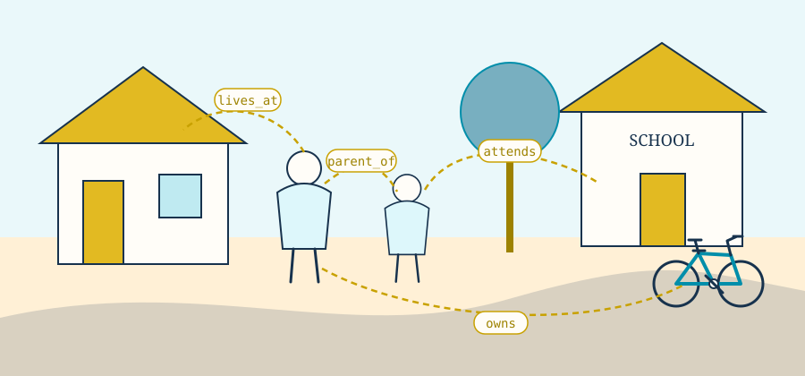
  <figcaption>One ordinary scene contains many relations: who lives where, who is a parent, who attends school, and who owns the bicycle.</figcaption>
</figure>

## 1. A program is a little theory

Instead of listing the steps that compute an answer, a logic program states
sentences that are true in a domain:

```eyeprolog
parent(ada, byron).
parent(byron, clara).
parent(clara, diego).
```

Each line is a **fact**. `parent/2` is a relation with name `parent` and arity
two; `parent/2` and `parent/3` would be different predicates.

A rule derives new sentences from old ones:

```eyeprolog
child(Child, Parent) :- parent(Parent, Child).
```

Ask for every `child/2` pair:

```sh
eyeprolog --goal 'child(X, Y)' program.pl
```

```text
child(byron, ada).
child(clara, byron).
child(diego, clara).
```

Nothing was copied through named slots. EyeProlog found substitutions for
`Child` and `Parent` that made the body true and applied them to the head.

The command line prints derived answers, not answers that merely repeat source
facts: `--goal 'parent(X, Y)'` finds three solutions but prints nothing.
Chapter 11 explains this output policy. It does not affect what rules can use.

### Relations have no direction

A function has an input side and an output side. A relation is a set of
tuples, and direction appears only when you ask a question. From the single
relation `parent/2` you can ask for a person's parents, a person's children,
whether two people are related, or every known pair. The program stays the
same; only the pattern of known arguments changes.

So name and shape a relation by reading one ground instance aloud:

> `parent(ada, byron)` means that Ada is a parent of Byron.

Then replace one argument at a time with a question: *For which `Child` is Ada
a parent? Who is a parent of Byron?* If each question is a natural use of the
same sentence, the relation is well shaped. If an argument means different
things in different questions, split the concept before the ambiguity spreads
into later rules.

Facts are statements, not commands. Their order can affect the order of
answers, but a fact never means “do this now”.

**Exercise.** Add `grandparent/2` using two calls to `parent/2`. Query all
grandparents, then only those of `diego`. Predict which output changes after
adding `parent(diego, elena).`

## 2. Terms, variables, and substitution

Everything in a Prolog program is a term:

- atoms: `ada`, `accepted`, `'atom with spaces'`;
- numbers: `42`, `-7`, `3.14159`, `1.2e3`;
- variables: `X`, `Person`, `_temporary`;
- compound terms: `point(3, 4)`, `reading(temp, 91)`;
- lists: `[]`, `[red, green, blue]`, `[Head | Tail]`;
- double-quoted text: `"sensor too hot"`, by default a list of one-character
  atoms.

Atoms begin with a lowercase letter or are quoted; variables begin with an
uppercase letter or an underscore. Each bare `_` is a fresh anonymous variable,
while repeated occurrences of `_Name` or `X` denote the same variable. A
variable is local to its clause.

Keep symbolic vocabulary as atoms (`ready`) and use character lists
(`"ready"`) only when text must be taken apart relationally.

Normal mode adds two conveniences that `--iso-strict` rejects: digit groups
such as `1_000` or `0xCA_FE`, and the splice notation `"ab"||Tail`, which
means `[a,b|Tail]` under `double_quotes(chars)` and `[97,98|Tail]` under
`double_quotes(codes)`.

### Unification

Unification asks whether two terms can be made identical by binding variables.

```text
reading(Sensor, 91)
reading(temp, Value)
```

These unify with `Sensor = temp` and `Value = 91`. Functor and arity must match,
and arguments are compared recursively: `point(X, X)` unifies with
`point(2, 2)` but not with `point(2, 3)`.

<figure>
  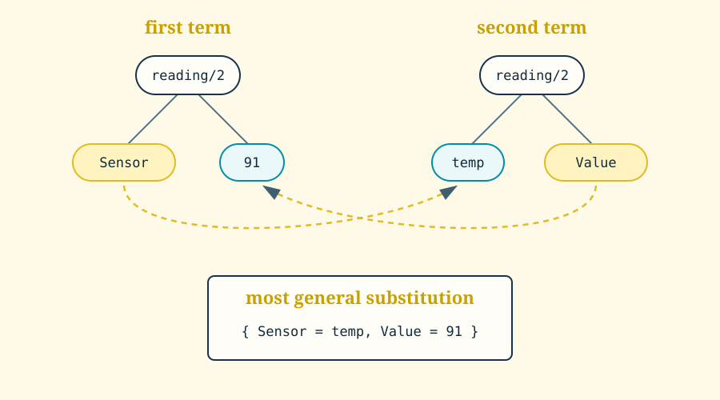
  <figcaption>Unification walks corresponding branches of two term trees and records the bindings needed to make them identical.</figcaption>
</figure>

Unification is not assignment. A variable on either side may be bound, and the
result is the *most general* substitution: it commits to exactly what
agreement requires and nothing more.

The built-in `=/2` performs unification:

```eyeprolog
same_shape(Pair) :- (Pair = pair(X, X)).
```

```sh
eyeprolog --goal 'same_shape(pair(red, red))' program.pl
eyeprolog --goal 'same_shape(pair(red, blue))' program.pl
```

Only the first succeeds. `\=/2` succeeds when two terms do not unify.

Compound terms carry domain structure directly:

```eyeprolog
measurement(battery_1, sample(17, volts(28.4), amps(12.1))).
route(a, d, path([a, b, d], cost(9))).
```

The outer `measurement(...)` is a statement; the nested `sample(...)` is data.
The syntax is the same, and position decides the role.

**Checkpoint.** Without running anything, decide whether each pair unifies:
`point(X, X)` with `point(red, red)`, `point(X, X)` with `point(red, blue)`,
and `[Head | Tail]` with `[a, b, c]`. Then check with `=/2`. Write
`diagonal/1`, which succeeds for `point(X, X)`.

## 3. Rules and their two readings

A rule has a head and a comma-separated body:

```eyeprolog
eligible(Person) :-
  age(Person, Years),
  (Years >= 18),
  registered(Person).
```

Read it **declaratively**: a person is eligible if they have an age of at least
18 and are registered. Read it **operationally**: to solve the head, solve the
body goals from left to right, carrying each binding into the later goals.

Both readings matter, and they answer different questions. The declarative
reading says what the program means and guards against an efficient program
that answers the wrong question. The operational reading says how answers are
found and guards against a correct specification that searches forever. Here,
`age/2` must run before `Years >= 18`, because comparison needs a number:
put a generator before a test that needs its input. (As a safe optimization,
EyeProlog may run a deterministic built-in test early once its inputs are
bound; that never adds answers.)

<figure>
  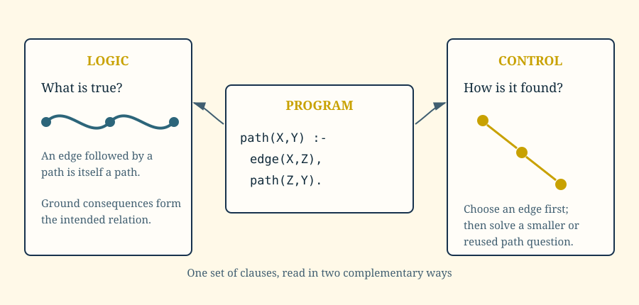
  <figcaption>A clause is both a sentence in a theory and a recipe for reducing a question to subquestions.</figcaption>
</figure>

Much of programming in Prolog is holding one reading steady while improving
the other. Later chapters refer back to this distinction rather than repeating
it.

Several clauses for the same head are alternatives:

```eyeprolog
can_enter(Person) :- staff(Person).
can_enter(Person) :- visitor(Person), escorted(Person).
```

Helper predicates name a concept once, which makes both the rules and their
proofs easier to read:

```eyeprolog
high_score(Case) :-
  score(Case, Score),
  threshold(Threshold),
  (Score >= Threshold).

status(Case, accepted) :- high_score(Case).
reason(Case, "score meets threshold") :- high_score(Case).
```

### Deeper foundations: the Herbrand world

The declarative reading needs a precise answer to a simple question: what does
a term denote? EyeProlog uses **Herbrand semantics**, named after Jacques
Herbrand, whose 1930 thesis made ground terms and their instances central to
proof theory. Robinson's resolution principle (1965) and the least-model
semantics of van Emden and Kowalski built on that foundation. You can skip to
Chapter 4 on a first reading.

The **Herbrand universe** contains exactly the ground terms that can be built
from the program's atoms, numbers, lists and functors: `pat`, `3`,
`[red, blue]`, `ticket(alice)`. A ground term denotes itself. The **Herbrand
base** contains the ground atomic formulas over those terms, such as
`person(pat)` or `owns(alice, ticket(17))`. A term is a possible argument; a
formula is a claim that may be true or false.

<figure>
  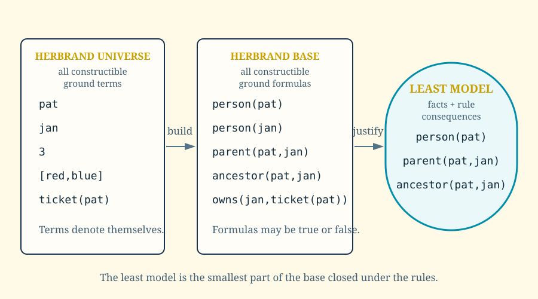
  <figcaption>Terms provide the vocabulary; atomic formulas provide the possible claims; facts and rules select the least model.</figcaption>
</figure>

A rule stands for all its ground instances, so

```eyeprolog
ancestor(X, Z) :- parent(X, Y), ancestor(Y, Z).
```

says that for every substitution of Herbrand terms for `X`, `Y` and `Z`, if both
body formulas are true, so is the head. Rule variables are implicitly
universally quantified.

The meaning of a pure program is its **least Herbrand model**: the smallest set
of ground formulas that contains every fact and is closed under every rule.
You can build it by starting from the facts and repeatedly adding the head of
any ground rule instance whose body is already true, until nothing changes.
That construction defines the meaning; it does not say that EyeProlog computes
it bottom-up.

### Terms denote themselves

In ordinary first-order logic, `alice` and `bob` might denote the same object,
and `ticket(alice)` and `ticket(bob)` might too, unless extra axioms rule it
out. In the Herbrand universe they differ by construction: distinct atoms are
distinct terms, and compound terms are equal only when functor, arity and
arguments are equal. Unification, output and proofs therefore all share one
predictable notion of identity:

```eyeprolog
different(alice, bob) :- (alice \= bob).
different(ticket(alice), ticket(bob)) :-
  (ticket(alice) \= ticket(bob)).
```

This is a property of the notation, not a claim about the world. If `robert`
and `bob` name the same person, say so with a domain relation such as
`same_as(robert, bob)` or normalize both to one term. The runnable
[`examples/herbrand-semantics.pl`](https://github.com/eyereasoner/eyeprolog/blob/main/examples/herbrand-semantics.pl)
shows the distinction with its outputs and proof.

### Witnesses instead of hidden objects

Variables in a query are existential: EyeProlog searches for substitutions that
make the goal follow. A rule head, however, cannot introduce an anonymous new
object. When a rule needs to name one, construct an explicit witness term:

```eyeprolog
has_parent(Child, parent_of(Child)) :-
  person(Child).

registration(Student, Course, registration_of(Student, Course)) :-
  takes(Student, Course).
```

The same inputs build the same witness, and different inputs build different
ones. The witness is printable, queryable and visible in a proof.

### The occurs check

EyeProlog performs the occurs check on every unification that binds a
variable, so terms are always finite trees. This clause fails instead of
building a cyclic term:

```eyeprolog
cyclic_unification :- X = wrapper(X).
```

(The goal sits inside a clause because a bare `X = wrapper(X).` in a file
would be a clause for the built-in `=/2`, which ISO forbids.)

ISO calls such unifications *subject to occurs check* (STO). For diagnosis,
setting the flag `occurs_check` to `error` turns a unification that fails only
because of the occurs check into an error:

```eyeprolog
:- set_prolog_flag(occurs_check, error).

sto_example :- X = wrapper(X).
% error(representation_error(term), [])
```

The flag accepts `true` (the default) and `error`; there is no `false`, because
EyeProlog never builds cyclic terms. `unify_with_occurs_check/2` ignores the
flag and simply fails on `unify_with_occurs_check(X, wrapper(X))`.

### Meaning is not the search strategy

EyeProlog solves goals top-down: it selects a goal, tries matching clauses in
order, and backtracks. For pure Horn clauses every answer it finds belongs to
the least Herbrand model, but it may fail to find a true answer if the search
runs into infinite recursion. Termination is a property of the procedure, not
of the meaning; Chapters 13 and 19 deal with it.

Built-ins extend the pure core. `X is 2 + 3` binds `X` to the term `5`, and
`\+ Goal` succeeds when a finite search finds no solution for `Goal`. Negation
adds no negative facts to the model, so negative dependencies should be
**stratified**: every negated predicate must be fully defined in a lower layer.

```eyeprolog
closed(X) :- blocked(X).
open(X) :- candidate(X), \+ closed(X).
```

A cycle through negation is not stratified:

```eyeprolog
p(X) :- q(X).
q(X) :- \+ p(X).
```

`eyeprolog --warnings` reports such programs. JavaScript embedders can inspect
`stratifiedNegation`, `negationStratificationErrors`, `negationDependencies`
and per-group `negationStratum`, request the analysis with `analyzeNegation`,
reject unstratified programs with `strictNegation`, or call
`program.assertStratifiedNegation()`.

**Checkpoint.** Take one rule from this chapter. Read it once as a sentence
about all of its ground instances and once as a sequence of subquestions, and
say which body goal first binds each variable.

## 4. Recursion: describing reachability

An ancestor is a parent, or a parent of an ancestor:

```eyeprolog
:- table ancestor/2.

ancestor(X, Y) :- parent(X, Y).
ancestor(X, Z) :- parent(X, Y), ancestor(Y, Z).
```

```sh
eyeprolog --goal 'ancestor(X, Y)' program.pl
```

The first clause is the base case. The second reduces a question to the same
question one edge farther along. To design a recursion, draw one proof, find
the repeated subquestion, and make sure every path can reach a base case.

A recursive program should carry the argument you would give on paper. For
`ancestor/2`: the base case is one `parent/2` edge; each recursive call moves
one vertex along the graph; and the program is finite because a finite graph
has finitely many endpoint pairs. Note that progress here is not “the term gets
smaller”. List recursion consumes a tail, arithmetic recursion decreases a
number, graph recursion walks a finite relation. State the real reason the
recursion stops.

Clause order is a control preference: trying the direct edge first finds short
proofs early but does not change which pairs are ancestors. Reordering the
body of the recursive clause is different. `ancestor(Y, Z), parent(X, Y)`
means the same thing, but asks an open recursive question before choosing an
edge and may never terminate.

### Cycles and tabling

Real graphs have cycles, and plain depth-first recursion can revisit the same
call forever. The declaration `:- table p/n.` makes EyeProlog record the
answers of `p/n` calls, iterate recursive calls to a fixed point, and reuse
the results. With `edge(a, b)`, `edge(b, c)` and `edge(c, a)`, the tabled
query `reach(a, Y)` returns `b`, `c` and `a` and stops. Predicates without a
`table` declaration keep ordinary Prolog control; the program decides where
tabling applies.

<figure>
  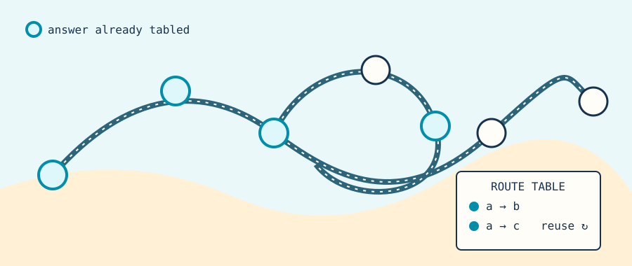
  <figcaption>Recursive route questions may return to the same station. A table acts like a route ledger: new destinations are recorded and recurring questions reuse them.</figcaption>
</figure>

Tabling does not make every relation finite. A rule that builds ever larger
terms still produces infinitely many distinct calls or answers.

A relation can also build the evidence for its answer:

```eyeprolog
path(X, Y, [X, Y]) :- edge(X, Y).
path(X, Z, [X | Rest]) :-
  edge(X, Y),
  path(Y, Z, Rest).
```

`ancestor/2` and `path/3` make different promises. There is at most one answer
per pair of endpoints, but there can be infinitely many paths between them on a
cyclic graph. Table the finite relation; bound the witness relation, for
example by keeping a list of visited vertices and requiring
`\+ member(Next, Visited)` so that only simple paths are built.

**Checkpoint.** For the family in Chapter 1, predict every `ancestor/2` answer.
For one indirect answer, name the clauses used and say what moves closer to a
known fact at each step.

## 5. Lists as relations

`[a, b, c]` abbreviates nested pairs ending in `[]`, and `[Head | Tail]`
exposes the first pair.

<figure>
  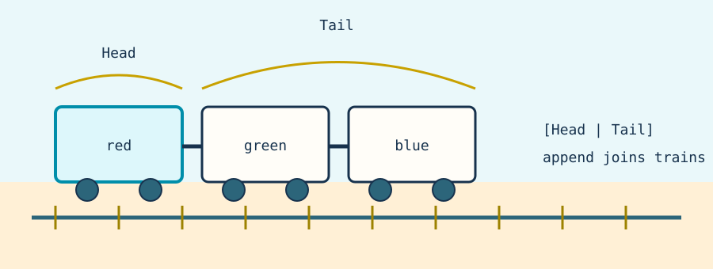
  <figcaption>A list resembles a train: expose the first carriage as the head, pass the remaining train as the tail, or join two trains with an append relation.</figcaption>
</figure>

```eyeprolog
first([Head | _], Head).

contains_item(X, [X | _]).
contains_item(X, [_ | Rest]) :- contains_item(X, Rest).

joins([], Ys, Ys).
joins([X | Xs], Ys, [X | Zs]) :- joins(Xs, Ys, Zs).
```

Because `joins/3` is a relation, one definition serves several uses: with the
first two arguments bound it concatenates; with only the third bound it
enumerates every way to split a list; with the first and third bound it finds
the missing suffix.

Some algorithms thread state through an accumulator:

```eyeprolog
reverse_acc(List, Reversed) :- reverse_go(List, [], Reversed).
reverse_go([], Acc, Acc).
reverse_go([X | Xs], Acc, Reversed) :-
  reverse_go(Xs, [X | Acc], Reversed).
```

Nothing is mutated; each call receives a new term.

The `lists` library provides the standard relations, including `member/2`,
`append/3`, `select/3`, `nth0/3`, `reverse/2` and `length/2`, alongside ISO
`sort/2`. A partial list such as `[a | Tail]` is a valid term whose length is
not yet known; a relation that needs a proper list may enumerate possible tails
or raise an instantiation error, so bind the tail first.

**Checkpoint.** Trace `joins([a], [b, c], Whole)` by hand. Then bind `Whole` to
`[a, b, c]`, leave the first two arguments open, and predict every split.

# Part II — Search

<figure>
  
  <figcaption>A route is found by exploring alternatives, recognizing dead ends and cycles, and carrying a productive choice toward the destination.</figcaption>
</figure>

A theory may justify many conclusions, but the machine still has to find them.
This Part is about the finite domains, failure, and choice that turn a field of
possibilities into a computation that ends.

## 6. Arithmetic and finite generation

Arithmetic is the standard `is/2` predicate, usually written infix:

```eyeprolog
next(X, Y) :- (Y is X + 1).
area_rectangle(W, H, Area) :- (Area is W * H).

hypotenuse(A, B, C) :-
  (A2 is A * A),
  (B2 is B * B),
  (C2 is A2 + B2),
  (C is sqrt(C2)).
```

`is/2` evaluates its right side, so every variable there must already hold a
number: `next(X, 4)` raises an instantiation error rather than finding `X = 3`.
Comparisons are filters on values something else produced:

```eyeprolog
safe_reading(Sensor, Value) :-
  reading(Sensor, Value),
  (Value >= 0),
  (Value =< 80).
```

`between(Low, High, Value)` is the usual generator. It enumerates the integers
in the range, or merely checks a bound `Value`:

```eyeprolog
square(N, Square) :-
  between(1, 10, N),
  (Square is N * N).
```

<figure>
  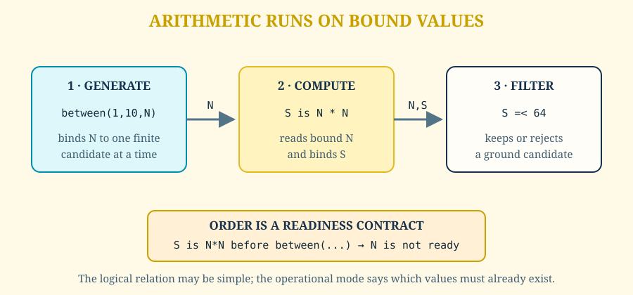
  <figcaption>Generate a finite candidate, compute from ready inputs, then filter the ground result.</figcaption>
</figure>

Recurrences work only in the direction they were written for:

```eyeprolog
factorial(0, 1).
factorial(N, F) :-
  (N > 0),
  (Previous is N - 1),
  factorial(Previous, PF),
  (F is N * PF).
```

`factorial(5, F)` gives `F = 120`; `factorial(N, 120)` raises an error at
`N > 0`. Record the intended mode in tests and comments.

**Checkpoint.** In `square/2`, which goal binds `N`? What happens if you swap
the two body goals?

## 7. Failure, negation, and quantification

A goal fails when nothing proves it under the current bindings, and search
backs up to the most recent choice. `\+ Goal` turns failure into a test: it
succeeds exactly when `Goal` has no solution:

```eyeprolog
allowed(User) :-
  user(User),
  \+ blocked(User).
```

With `user(ann)`, `user(bob)`, and `blocked(bob)`, the query `allowed(U)` gives
`allowed(ann)`. Swap the body goals and the query gives nothing: `\+ blocked(U)`
with `U` unbound asks "is nobody blocked?", which is false. Bind variables
before you negate them.

`\+` means "cannot be proved from this program", not "is false". Reading one
as the other is the **closed-world assumption**: right for a complete roster or
configuration, wrong for open data where a missing fact may just be unknown.
There, model the state you mean, such as `confirmed_absent(Item)`.

<figure>
  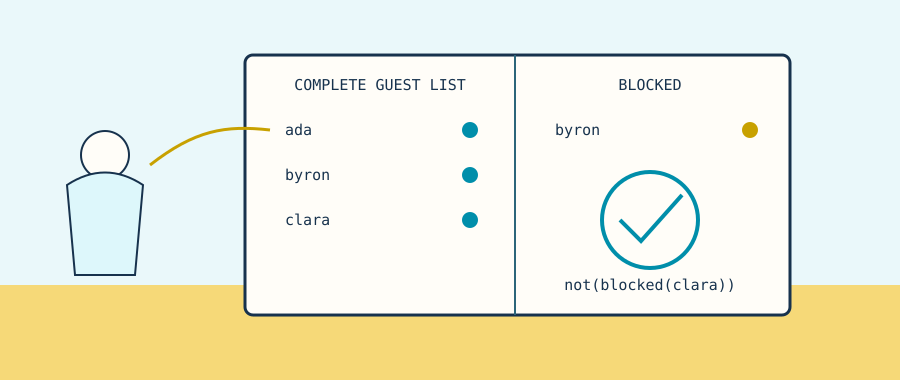
  <figcaption>Absence is informative only inside a boundary declared complete.</figcaption>
</figure>

Universal statements need no special predicate. "Every test in the suite
passes" is "no test in the suite fails":

```eyeprolog
all_tests_pass(Suite) :-
  \+ failing_test(Suite).

failing_test(Suite) :-
  test_in(Suite, Test),
  \+ passed(Test).
```

### Negation through recursion

Ordinary `\+` should be stratified: compute a relation completely, then negate
it from a higher layer. `eyeprolog --warnings program.pl` reports recursion
through negation.

Some finite rule systems need that recursion anyway. A game position is won if
there is a move to a position that is not won:

```eyeprolog
move(a, b).
move(b, a).
win(X) :- move(X, Y), tnot(win(Y)).
```

Plain `\+` would loop here. EyeProlog's normal mode provides `tnot/1`, which
evaluates such cycles under the **well-founded semantics**. When the component
is finite, function-free, and range-restricted Datalog, every atom is `true`,
`false`, or `undefined`. In this two-position cycle neither player can force a
win, and `wfs_truth/2` says so:

```text
?- wfs_truth(win(a), Truth).
   Truth = undefined.
```

Add `move(b, c)` and the cycle is broken: `win(c)` is false, `win(b)` true,
`win(a)` false.

An undefined atom is not an answer; the query `win(a)` prints nothing. The
goal of `wfs_truth/2` must be ground, as must direct calls to `tnot/1`, and in
WFS rules every variable in the head or under `tnot/1` must occur in a positive
body literal. Strict ISO mode has no `tnot/1`; `\+/1` is unchanged.

**Checkpoint.** In the three-position game, change `move(b, c)` to
`move(c, b)` and predict the truth value of each `win/1` atom before running
`wfs_truth/2`.

## 8. Collecting and choosing answers

Sometimes the question is about all the answers at once: how many, what total,
which one is best. Given `edge(From, To, Cost)` facts:

```eyeprolog
:- use_module(library(aggregate)).
outgoing_costs(Node, Costs) :-
  findall(Cost, edge(Node, _, Cost), Costs).

total_outgoing(Node, Total) :-
  sumall(Cost, edge(Node, _, Cost), Total).
```

`findall/3` collects a list, `countall/2` counts solutions, and `sumall/3` adds
them. On an empty search they return `[]`, `0`, and `0`. The inner goal is a
search of its own, and it must be finite.

Counting solutions is not the same as counting things. Two derivations can
yield the same value; `findall/3` keeps both. When identity matters, collect
the identifying term and remove duplicates with ISO `sort/2`. When the number of
derivations matters, keep them.

Optimization keeps only the best candidate:

```eyeprolog
:- use_module(library(aggregate)).
best_route(From, To, Route, Cost) :-
  aggregate_min(
    [CandidateCost, CandidateRoute],
    CandidateRoute,
    route(From, To, CandidateRoute, CandidateCost),
    [Cost, Route],
    Route
  ).
```

The key `[Cost, Route]` breaks ties deterministically by standard term order.
Unlike the collectors, `aggregate_min/5` and `aggregate_max/5` *fail* when there
are no candidates. That is the right behavior: "there is no route" should not be
disguised as a route with an artificial cost.

<figure>
  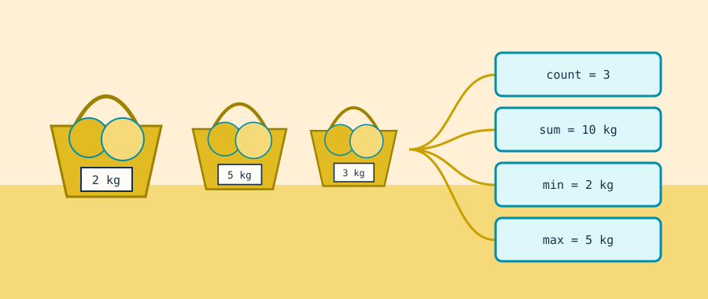
  <figcaption>The same finite family of solutions can be listed, counted, summed, or compared.</figcaption>
</figure>

Keep candidate generation (`route/4`) separate from choice (`best_route/4`).
The candidates can then be listed, counted, tested, and optimized by different
queries without rewriting the search.

**Checkpoint.** With no `route/4` facts at all, predict the result of
`findall/3`, `countall/2`, `sumall/3`, and `aggregate_min/5` over it.

## 9. Structured data, text, and contexts

Most of the time you know the shape of a term and match it directly. Generic
code that must work on any term uses the ISO inspectors:

```text
functor(Term, Name, Arity)
arg(Index, Term, Value)
Term =.. [Name | Arguments]
```

`arg/3` counts from 1. `=..` converts between a term and a list of its name and
arguments.

Text should be turned into terms as soon as it enters the program, so the rules
in the middle work on structure, not strings. `library(strings)` works on atoms
or lists of one-character atoms, and returns atoms:

```eyeprolog
:- use_module(library(strings)).
normalized(Input, Words) :-
  trim(Input, Trimmed),
  lowercase(Trimmed, Lower),
  split(Lower, ' ', Words).
```

The library also offers conversions such as `number_string/2` and
`term_string/2`, and pattern tests such as `contains/2`, `matches/2`, and
`matches/3` with named captures. Double-quoted source text follows the ISO
`double_quotes` flag; there is no separate string type.

A comma term can carry a bundle of related data:

```eyeprolog
message(event_17, (severity(high), source(sensor_3), reading(temp, 91))).

context_member((Left, _right), Member) :- context_member(Left, Member).
context_member((_left, Right), Member) :- context_member(Right, Member).
context_member(Member, Member) :- Member \= (_left, _right).

hot_event(Id) :-
  message(Id, Context),
  context_member(Context, severity(high)),
  context_member(Context, reading(temp, Value)),
  (Value > 80).
```

`hot_event(event_17)` succeeds. Notice what does *not* happen: `severity(high)`
never becomes a fact of the program. It stays data inside one message, and
`context_member/2` is an ordinary relation that walks it.

<figure>
  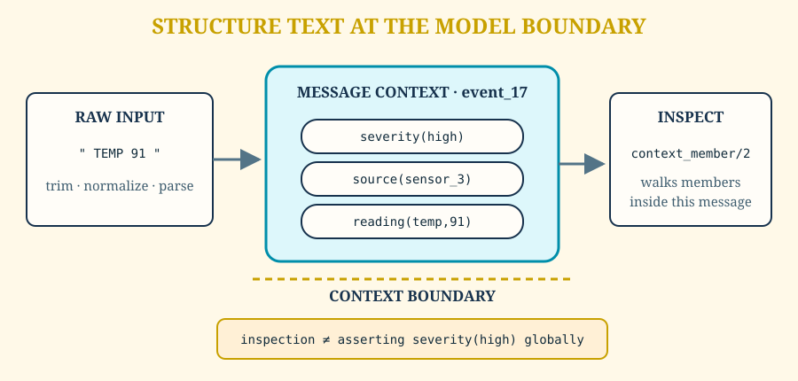
  <figcaption>Normalize text into structure at the boundary; inspecting a member inside one context does not make it a fact.</figcaption>
</figure>

## 10. From puzzles to models

A finite search problem has three layers: generate candidates, constrain them,
and report a witness. Coloring three mutually adjacent regions:

```eyeprolog
color(red).
color(green).
color(blue).

coloring(A, B, C) :-
  color(A),
  color(B),
  (A \= B),
  color(C),
  (B \= C),
  (A \= C).

answer(colors(A, B, C)) :- coloring(A, B, C).
```

```sh
eyeprolog --goal 'answer(X)' program.pl
```

```text
answer(colors(red, green, blue)).
answer(colors(red, blue, green)).
answer(colors(green, red, blue)).
answer(colors(green, blue, red)).
answer(colors(blue, red, green)).
answer(colors(blue, green, red)).
```

Each test runs as soon as its inputs are bound: `A \= B` prunes before `C` is
chosen. Moving the tests to the end gives the same answers after trying all 27
combinations; on larger problems that is the difference between instant and
hopeless.

For state-transition problems, make the state and the moves explicit, and carry
the states already visited:

```eyeprolog
:- use_module(library(lists)).

plan(State, State, _, []).
plan(State, Goal, Seen, [Move | Moves]) :-
  transition(State, Move, Next),
  \+ member(Next, Seen),
  plan(Next, Goal, [Next | Seen], Moves).
```

The visited list makes the search finite: no state is entered twice on one
path. EyeProlog is at its best when the answer has a small witness such as a
path, schedule, or proof; numerical kernels belong in the host.

**Checkpoint.** Remove `(A \= C)` from `coloring/3` and predict the number of
answers before running it. (There are twelve; account for the six new ones.)

# Part III — Trustworthy reasoning

<figure>
  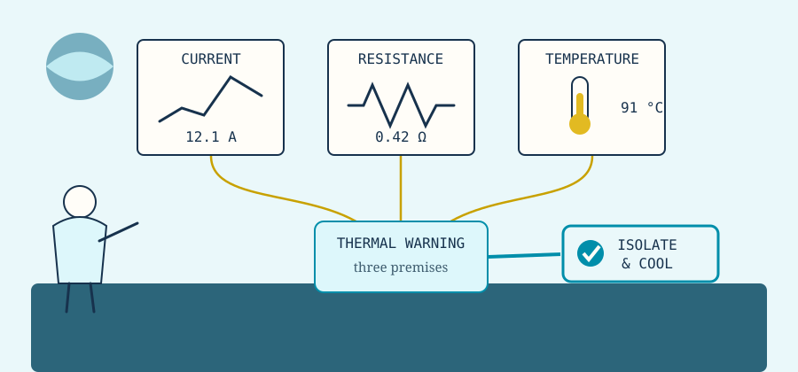
  <figcaption>Current, resistance, and temperature readings remain visible as independent premises for a thermal warning and safety action.</figcaption>
</figure>

An answer is useful when you can see what it rests on. This Part covers proofs,
integrity checks, termination, and the boundary between the logic program and
the system that feeds it.

## 11. Queries, answers, and proofs

The host supplies the goals, for example
`eyeprolog --goal 'child(X, Y)' program.pl`. EyeProlog prints the ground answers,
removes duplicates, and leaves out answers that merely repeat source facts.
Answers are never added back into the program.

Add `--proof` (or `-p`) and the output also says *why*:

```sh
eyeprolog --proof examples/socrates.pl
```

```text
type(socrates, mortal).
holds_result(test, true).

clause(1, type(socrates, man), true).
clause(2, type(var('X'), mortal), type(var('X'), man)).
clause(3, holds_result(test, true), type(socrates, mortal)).

step(type(socrates, mortal), rule(2), ['X' = socrates], [type(socrates, man)]).
step(type(socrates, man), fact(1), [], []).
step(holds_result(test, true), rule(3), [], [type(socrates, mortal)]).
```

The document has three layers. First come the claims, the same answers as
before. Then the `clause/3` records the proof cites, numbered by position in the
source file. Last, one `step/4` per conclusion:

```text
step(Conclusion, By, Bindings, Uses)
```

Read the first step as: `type(socrates, mortal)` holds by rule 2, with `X`
bound to `socrates`, using the conclusion `type(socrates, man)`. That
conclusion has its own step, citing fact 1. Each use is named by its
conclusion, so you can read a proof downward from the claim without joining
ids.

`By` is `rule(N)` or `fact(N)` for a program clause, `builtin` for a built-in
or bundled-library goal, `absent` for a completed `\+`, `collected` for a
completed `findall/3`, and `asserted` for a clause added at run time. Because
clauses are numbered by source position, `assert/1` and `retract/1` cannot
change what a citation means.

The document is flat. A resolution proof is a tree in which the same goal may
be proved twice (as in `p(ok) :- q(1), q(1).`), but each conclusion gets exactly
one step. Proofs grow with the number of distinct conclusions, not with the
shape of the search. Turning on `--proof`, `--warnings`, or `--stats` never
changes which answers are found.

### Checking a proof

A proof is valid EyeProlog input, so it can be saved and checked later:

```sh
eyeprolog --proof examples/socrates.pl > socrates.why.pl
eyeprolog --check-proof socrates.why.pl examples/socrates.pl
```

The checker does not search for a proof. It re-performs each recorded step
against the clause it cites: the clause must exist, and with the recorded
bindings it must yield exactly this conclusion from exactly these uses. Every
claim needs a step, every use must resolve, and no conclusion may rest on
itself. A `builtin` step cites no clause, so the checker recomputes it in a
program that holds only the bundled libraries, and the result must agree.
`absent`, `collected`, and `asserted` steps cannot be recomputed that way; they
are reported as **trusted boundaries**.

The report is itself a set of Prolog facts: one `condition/4` for each of the
seven conditions C1–C7, the counts of verified, recomputed, and trusted steps,
and a `verdict/1`. [SPEC.md](SPEC.md) specifies the format and the conditions.
The proof file is read as data, never executed, so a hostile proof cannot run
directives.

A run checks its own proof before printing it. If the solver found an answer
that the explanation cannot reproduce, the step is recorded as `unproven`, the
check fails, and the run reports an error instead of writing a proof that does
not hold.

A proof is also a design review: detours point at overgrown helpers, and a
premise hidden inside a computed value should become a fact.

**Checkpoint.** Edit `socrates.why.pl` so that the first step binds `'X'` to
`plato`, and run the check again. Which condition fails?

## 12. Integrity checks as ordinary predicates

An integrity check is a relation whose answers are defects:

```eyeprolog
invalid_probability(Disease, Probability) :-
  probability(Disease, Probability),
  (Probability > 1).

invalid_assignment(Person, Role, Other) :-
  assigned(Person, Role),
  incompatible_roles(Role, Other),
  assigned(Person, Other).
```

There is nothing special about these predicates. A host that needs valid input
queries them first, and then decides: reject the input, report every defect, or
continue in a diagnostic mode. The policy stays visible in the host instead of
being buried in the rules. Nothing runs implicitly before the supplied goals.

`examples/integrity-check.pl` shows the pattern end to end:

```sh
eyeprolog examples/integrity-check.pl
```

```text
invalid_state(stone, conflicting_colors).
status(stone, invalid(conflicting_colors)).
```

To write one, start from a sentence that must never be accepted — "no person
holds two incompatible roles" — and turn its counterexamples into positive,
finite goals. Give the relation arguments that identify the offending records,
so the answer is a diagnosis rather than a bare "no".

<figure>
  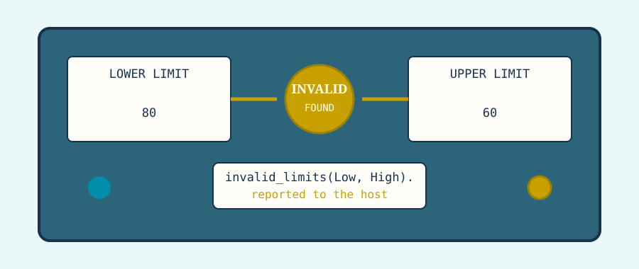
  <figcaption>The integrity relation reports the invalid state; the host decides whether it blocks later decisions.</figcaption>
</figure>

Reserve integrity checks for states that must be handled before any decision is
trusted. A declined application or an unreachable destination is usually a
perfectly valid answer, not invalid input. Keep four outcomes apart:

- **No answer:** the theory does not derive the goal. Check the data, the rules,
  and any closed-world assumption.
- **An integrity answer:** the input contains a forbidden combination.
- **A resource limit:** the search exceeded its budget. It says nothing about
  the answer.
- **An error:** the program or the call violates the language contract.

`false/0` keeps its ISO meaning: a built-in that always fails. Clauses for
`false` are rejected with `permission_error(modify, static_procedure)`.

## 13. Termination, tabling, and performance

Ordinary goals, including recursive calls, use depth-first resolution unless the source
explicitly declares `:- table p/n.` That is standard Prolog, and it has a
well-known failure mode: on a cyclic graph,

```eyeprolog
reach(X, Y) :- edge(X, Y).
reach(X, Z) :- edge(X, Y), reach(Y, Z).
```

can ask `reach(a, Z)` again inside its own proof, forever.

<figure>
  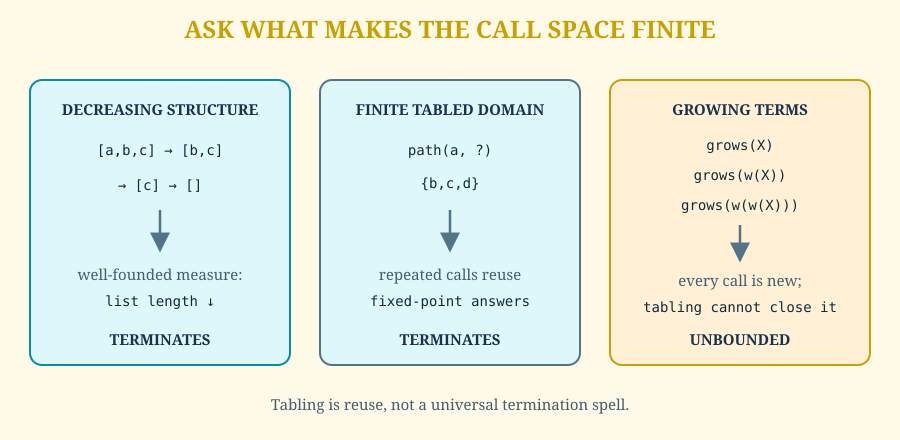
  <figcaption>Termination needs an argument: a decreasing measure, or a finite space of tabled calls and answers. Ever-growing terms have neither.</figcaption>
</figure>

A `:- table reach/2.` declaration changes the unit of work. Each call pattern
becomes a shared subproblem; its answers are stored, and a repeated call reuses
them instead of recursing again. For finite positive recursion, the table is
filled round by round until nothing new appears: the least fixed point. This
is the natural tool for reachability, grammars, and dependency analysis.

Tabling is never applied automatically. Undeclared predicates keep ordinary
depth-first control, so the source states when fixed-point execution is part of
the contract. For large finite Datalog cones rooted at a tabled predicate, the
engine may compute one shared most-general table and answer bound calls from
its indexes; that is an optimization of the declared table, not a change in
meaning.

Tabling repairs repeated questions, not unbounded ones. A rule that builds
ever-larger terms makes infinitely many distinct calls, and a table cannot help.
The usual causes of nontermination are:

- a recursive call placed before the goals that bind its arguments;
- terms that grow without bound;
- an open arithmetic or mathematical query;
- recursion through negation (use `tnot/1`, Chapter 7);
- path enumeration without a visited set.

The fixes are the same each time: bind the query more strongly, add a finite
domain, track visited states, or expose an argument that decreases.

### Measuring work

`--stats` prints counters to standard error and leaves the answers unchanged:

```sh
eyeprolog --stats examples/observability-log-correlation.pl
```

The counters (solver calls, unifications, depth, table and
`wfs_fixpoint_rounds`, `wfs_undefined_answers`, memory) measure work, not
truth; compare them only across equivalent queries on one EyeProlog version.

### Deeper implementation: clause indexing

Each predicate keeps indexes on scalar values in each argument position. The
key includes the type, so `7`, `'7'`, and `"7"` stay distinct. Clauses whose
indexed argument is a variable or a compound stay in a fallback set, and the
candidates are merged back into source order before unification. For
predicates with ten or more clauses, a call with several bound arguments may
build a combined index on demand, if it pays for itself.

An index decides where to look, never whether a clause matches. Removing every
index would change running time, not answers or their order.

### Forward rules

EyeProlog normal mode also accepts `:+` at priority 1200 as an `xfx` operator.
A source term

```text
Conclusion :+ Premise.
```

is a forward rule. When a program contains forward rules and no goal is given,
the engine loads `library(eyelet)` and runs its closure driver: solve each
premise against the current program, assert the new conjuncts of each
conclusion, and repeat until a round adds nothing.

Two conclusions are special. `true :+ Goal` is a query; it prints each distinct
instance of `Goal`. `false :+ Goal` is an integrity fuse; if `Goal` succeeds,
EyeProlog prints `fuse(Goal)` and exits with status 2. Variables that appear
only in a derived conclusion are existential and become `sk_0`, `sk_1`, and so
on. `stable(Level)` waits for a closure level, and `becomes(From, To)` replaces
state linearly without a separate `dynamic/1` declaration.

The driver is Prolog, in `src/lib/eyelet.pl`, not a second engine written in
JavaScript. From JavaScript, `run()` selects forward mode when no `goal` or
`goals` option is given; `hasForwardRules(program)` and
`executeForwardRules(program, solver, callbacks)` are available for finer
control. Strict ISO mode removes the `:+` operator.

Resource limits are never answers. Normal execution has no implicit depth
limit; if an embedder sets `maxDepth` and a search exceeds it, EyeProlog raises
`resource_error(depth_limit)` rather than quietly failing the branch.

**Checkpoint.** Classify three recursive calls: one over a shrinking list, one
over a finite cyclic graph, one that builds `s(s(...))` terms without bound.
Which terminate without tabling, which with it, and which with neither?

## 14. Knowledge engineering

A battery overheats when resistive heating exceeds a limit *and* the measured
temperature confirms it. Written as rules:

```eyeprolog
heating(Battery, Watts) :-
  current(Battery, Amps),
  resistance(Battery, Ohms),
  (I2 is Amps * Amps),
  (Watts is I2 * Ohms).

thermal_warning(Battery) :-
  heating(Battery, Watts),
  heating_limit(Limit),
  (Watts > Limit),
  temperature(Battery, Celsius),
  temperature_limit(TLimit),
  (Celsius > TLimit).

action(Battery, isolate_and_cool) :- thermal_warning(Battery).
```

Each layer is a separate predicate, so each becomes a separate step in the
proof: physics (`heating/2`), evidence from two independent sensors
(`thermal_warning/1`), and policy (`action/2`). A reviewer can dispute the
threshold without touching the physics, or replace the policy without
re-deriving the warning. `examples/spacecraft-battery-diagnosis.pl` is the
complete case.

<figure>
  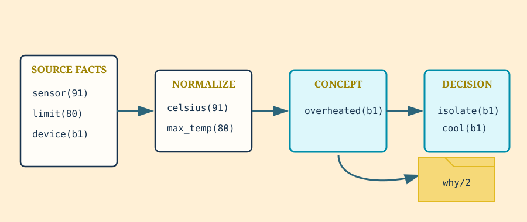
  <figcaption>A theory moves in visible layers from observations to decisions, and the proof keeps the route back to the evidence.</figcaption>
</figure>

The same layering works for most theories:

- **source facts:** measurements, records, asserted relationships;
- **helpers:** normalization, classification, reachability;
- **decisions:** `status/2`, `action/2`, `risk/2`;
- **integrity relations:** witnesses of invalid input (Chapter 12);
- **outputs:** the goals the host asks.

Prefer positive concepts, negate only across a closed boundary, and keep
confidence and provenance as data, not rule order.

**Checkpoint.** Which facts in the battery example can a proof *not*
authenticate? (Hint: where do the numbers come from?)

## 15. Explicit data boundaries

A proof shows that a conclusion follows from the clauses it was given. It cannot
show that those clauses were true, that a sensor was calibrated, or that a file
was authentic. That is the host's job, and EyeProlog keeps it there: the host
validates input, converts it to Prolog terms, and asks a focused goal.

Here is a host receiving one JSON temperature record:

```js
import { run } from 'eyeprolog';

const inputText = '{"sensor":"sensor_1","celsius":91}';
const allowedSensors = new Set(['sensor_1', 'sensor_2']);

function reasoningSource(record) {
  if (!record || typeof record !== 'object') throw new TypeError('record');
  if (!allowedSensors.has(record.sensor)) throw new TypeError('sensor');
  if (!Number.isFinite(record.celsius)) throw new TypeError('celsius');
  if (record.celsius < -100 || record.celsius > 200) {
    throw new RangeError('celsius');
  }

  return `
reading(${record.sensor}, ${record.celsius}).
thermal_alert(Sensor) :-
  reading(Sensor, Celsius),
  (Celsius >= 80).
`;
}

const record = JSON.parse(inputText);
const result = run(reasoningSource(record), {
  goal: `thermal_alert(${record.sensor})`,
  proof: true,
  maxDepth: 10_000,
  maxInferences: 100_000,
  maxMemoryBytes: 256 * 1024 * 1024,
  solutionLimit: 10
});

console.log(result.stdout);
```

Four separate claims are being made, each with its own owner:

1. **Parse:** the bytes are valid JSON (the host's parser).
2. **Validate:** the sensor is known and the temperature is in range (the
   adapter).
3. **Convert:** those values denote exactly these Prolog terms (the adapter).
4. **Derive:** the reading satisfies `thermal_alert/1` (EyeProlog, with a proof).

The allow-list is what makes string interpolation safe here: the sensor name
can only become one of two known atoms, and the temperature must be a finite
number. General text must go through a term constructor or serializer, never
straight into source. The resource options cap the work an untrusted input can
cause.

**Checkpoint.** For one record your application receives, write down what the
host validates, the term it builds, the goal it asks, and the limit that bounds
the work.

## 16. Embedding EyeProlog

The JavaScript API has a convenience runner and lower-level types:

```js
import { run } from 'eyeprolog';

const result = run(`
answer(ok) :- ok = ok.
`, { goal: 'answer(X)' });
console.log(result.stdout);
console.log(result.stats);
```

The first line prints `answer(ok).` and a newline; the second prints the work
counters for this run.

`run()` accepts source text or an already parsed `Program`. Its options include
`proof` (aliases `why` and `explain`), `proofDetail` (`abstract` or `expanded`),
`maxDepth`, `maxInferences`, `maxMemoryBytes`, `solutionLimit`, a custom
`registry`, and `strictNegation` or `analyzeNegation`. It returns `stdout`, the
numeric `stats`, and a nullable `haltCode`, and never writes to the process
streams.

When `run` receives an already parsed `Program`, bundled-library imports needed
only by its goals are added before solving, as they are when source text is
parsed. The autoload index covers every exported predicate in the bundled
`src/lib/` modules. Pass `autoload: false` to keep only explicitly imported
predicates.

### Proof certificates

Applications that exchange proofs separately from answers can use
`proofCertificate`, `proofCertificatesFromText`, and `verifyProof`:

```js
import {
  Program, parseGoalText,
  proofCertificate, proofCertificatesFromText, verifyProof
} from 'eyeprolog';

const program = Program.parse(`
p(a).
q(X) :- p(X).
`, { sourceMetadata: true });

const made = proofCertificate(program, parseGoalText('q(a)'));
console.log(verifyProof(program, made).ok); // true

const received = proofCertificatesFromText(made.text, program)[0];
console.log(verifyProof(program, received).ok); // true
```

`proofCertificate` returns both the proof text and a JSON-serializable
certificate. `verifyProof` walks the certificate instead of searching again; its
`trusted` array lists every built-in or library boundary it assumed. With
`proofDetail: 'expanded'`, bundled-library clauses appear in the certificate, so
the remaining trust shrinks to the built-ins those clauses use.

### Programs and solvers

To inspect or prepare a theory before running it, use `Program` and `Solver`
directly:

```js
import { Program, Solver, parseGoalText } from 'eyeprolog';

const source = `
edge(a, b).
edge(b, c).
path(X, Y) :- edge(X, Y).
path(X, Z) :- edge(X, Y), path(Y, Z).
`;

const program = Program.parse(source, { analyzeNegation: true });
const goal = parseGoalText('path(a, X)');
const path = program.findGroup('path', 2);

console.log(goal);
console.log(program.stratifiedNegation);
console.log(path?.recursive, path?.tabled, path?.tableInputPositions);

const solver = new Solver(program, {
  maxDepth: 50_000,
  maxInferences: 1_000_000,
  maxMemoryBytes: 256 * 1024 * 1024,
  solutionLimit: 100_000
});
```

Programs report stratification through `stratifiedNegation`,
`negationStratificationErrors`, and `assertStratifiedNegation()`.

The limits are safety ceilings, not logic. Reaching the depth, inference, or
solution limit may cut a search short; it never proves that no further answer
exists, so report it as an incomplete computation. At the `Solver` boundary
`solutionLimit` is opt-in: without it, re-executable goals such as `repeat/0`
and relations such as `call_nth/2` are never turned into failure by an internal
threshold.

Memory is guarded separately. EyeProlog periodically checks JavaScript heap use
and keeps a quarter of the host heap ceiling in reserve, so it can unwind and
raise `resource_error(memory)` before the host aborts. Under
`--max-old-space-size`, the guard compares against V8's old-generation spaces,
so short-lived allocations do not trigger it. `maxMemoryBytes` overrides the
derived ceiling; `Infinity` disables the check. V8 capacity errors such as
`Map maximum size exceeded` are also reported as `resource_error(memory)`. ISO
leaves the resource name implementation dependent; EyeProlog uses `memory` for
a finite host ceiling and reserves `finite_memory` for computations that no
finite amount of memory could finish. After a memory error the same solver can
run later queries, but the exhausted query is not resumed.

Treat remote source as executable logic. EyeProlog has no arbitrary host-call
primitive, but search alone can consume CPU and memory, so set depth, solution,
input-size, and time limits.

### Deeper implementation: execution details

These details affect speed and memory, never answers.

**Variable order.** ISO 13211-1 section 7.2.1 leaves the order of two distinct
variables implementation dependent and requires it to stay constant only while
one sorted list is built. EyeProlog ranks variables locally for each comparison,
and `sort/2`, `keysort/2`, and the sort inside `setof/3` share one ranking for
the duration of that operation. No global variable ordinal exists.

**Active-call frames.** The iterative solver keeps active-call frames only where
cut scope or recursive variant guards need them, so cut-free library helpers do
not copy a growing frame sequence at every step.

**Compact lists.** In the normal registry, the bundled `length/2` counts or
builds named lists without recursive interpreter frames, and does not
materialize an anonymous list at all. A new fixed-length list starts as a lazy
compact skeleton that expands one `./2` cell at a time when something inspects
it. It is a storage optimization, not a different kind of term. Embedders that
inspect the JavaScript term model can recognize it with `CompactListTerm`,
`isCompactList`, and `compactListLength`, or build one with
`compactVariableList`. `length/2` still reserves memory headroom in proportion
to the list, so a heap limit is raised inside its search as a catchable
`resource_error(memory)`.

**Fresh variables.** A variable that first appears in a direct `=/2` goal, or a
singleton head variable, cannot already occur in the value it receives, so
EyeProlog skips the occurs traversal for that binding only. `X = f(X)`, a
variable seen earlier in the clause, and `unify_with_occurs_check/2` keep the
full check. Such a first-use equality also acts as an ordering barrier for
deterministic-goal scheduling. This recovers much of the classic WAM "local
variable" optimization for DCG tails without a WAM stack layout.

**Grammars.** `phrase/2` passes its final remainder `[]` straight into the
expanded grammar. `phrase/3` keeps a private output variable and unifies its
third argument last, which keeps it steadfast. The ordinary `length/2` clauses
remain the definition used by the ISO-only registry and whenever delays or
finite-domain constraints need their wake-up points.

### Implementation boundary

The JavaScript runtime is flat under `src/`:

- `src/iso.js` is the stable ISO facade and built-in registry; arithmetic is in
  `src/iso-arithmetic.js` and error classes in `src/errors.js`.
- `src/dcg.js` implements grammar-rule and dynamic-body expansion without
  depending on the ISO registry.
- `src/cleanup.js` closes protected built-in iterators and registers
  `call_cleanup/2` and `setup_call_cleanup/3` for the normal profile.
- `src/program.js` is the `Program` facade and module loader; analysis
  (recursion, Datalog, WFS, stratification) lives in `src/program-analysis.js`
  and clause indexes in `src/program-indexing.js`. Hot execution paths stay in
  `src/solver.js`.
- `src/lib/` holds the bundled libraries as ordinary Prolog modules, registered
  for `library(Name)` by `src/standard-library.js` in Node and the browser.
- `src/playground-worker.js` runs the same program and module loader in a
  browser worker.

`src/ARCHITECTURE.md` records the layering rules, and a regression test
rejects JavaScript import cycles.

The CLI, the JavaScript API, `Solver`, proof checking, and the playground share
one parser, term representation, solver, stream layer, module loader, and
proof machinery. A library joins a `Program` only through `use_module/1` or
`use_module/2` (or autoloading); exported predicates are imported and private
ones stay module-local. `getStrictIsoRegistry()` with `isoStrict: true` selects
the strict Part 1 + Corrigenda surface.

### Extending the built-in registry

An embedder can add a host relation to the default registry. A handler is a
generator over environments: clone, bind, and yield only the environments in
which the call succeeds.

```js
import {
  atom,
  createEyePrologRegistry,
  run,
  unify
} from 'eyeprolog';

const registry = createEyePrologRegistry();

registry.add(
  'host_status',
  2,
  function* ({ goal, env }) {
    const next = env.clone();
    if (
      unify(goal.args[0], atom('service'), next) &&
      unify(goal.args[1], atom('ready'), next)
    ) {
      yield next;
    }
  },
  { deterministic: true }
);

const result = run(`
answer(X) :- host_status(service, X).
`, { registry, goal: 'answer(X)' });
```

Mark a built-in `deterministic` only if it yields at most one environment. An
unmarked iterator is treated as a possible further choice, and the solver never
resumes it just to find out. An iterator that knows its remaining positions can
provide `hasPendingAlternatives()`, updated before each yield, so its choice
point is dropped as soon as nothing is left. Mode-sensitive extensions can also
supply `ready`, `fallbackWhenNotReady`, and `shouldUse` metadata, which affect
dispatch and early filtering and are therefore part of the extension's
contract.

# Part IV — The craft of logic programming

<figure>
  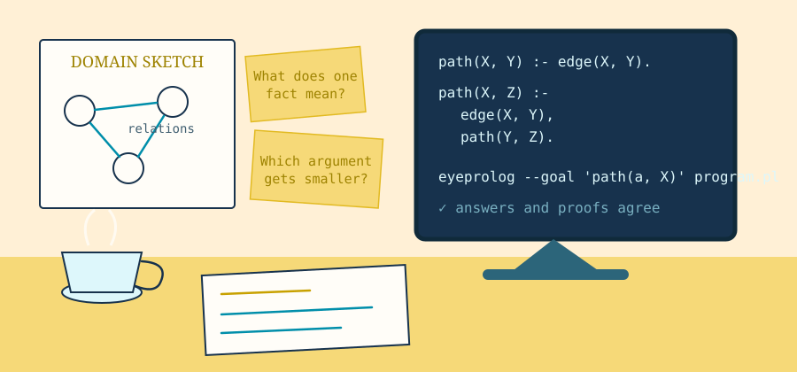
  <figcaption>Craft moves repeatedly between the real domain, the relations on paper, executable clauses, answers, and proofs.</figcaption>
</figure>

Good programs are rarely typed top to bottom. They are found through examples,
held in shape by invariants, and improved without losing the relation they
express. This part is about those habits.

## 17. Logic and control

Two clauses, two readings:

```eyeprolog
path(X, Y) :- edge(X, Y).
path(X, Z) :- edge(X, Y), path(Y, Z).
```

As logic, every edge is a path, and an edge followed by a path is a path. As
control, the solver tries a direct edge first, then picks an outgoing edge and
continues from its endpoint. Kowalski's 1979 slogan "algorithm = logic +
control" names the split: the logic fixes which answers are admissible, the
control decides which are explored, in what order, at what cost. Ideally you
can improve the second without touching the first. In practice, modeful
built-ins and incomplete search mean you reason about both.

So write the sentence first:

> `path(X, Y)` holds when there is a finite sequence of edges from `X` to `Y`.

That sentence does not mention clause order, and it is what examples and
counterexamples are judged against. Only then ask the procedural questions:
which argument is usually known, which goal generates a finite set, and which
recursive call is smaller or already tabled.

### Same meaning, different computation

Conjunction is commutative in logic, not in search. These two rules mean the
same thing:

```eyeprolog
adult(Person) :- person(Person), age(Person, Age), (Age >= 18).

adult(Person) :- (Age >= 18), age(Person, Age), person(Person).
```

The first works with `Person` unbound: `person/1` and `age/2` bind values
before `>=/2` compares them. The second reaches `>=/2` with `Age` unbound and
raises `instantiation_error`. Logical equivalence does not give equivalent
behaviour once built-ins have modes.

Recursion that calls itself before consuming anything is the classic control
bug:

```eyeprolog
% Poor control: recursion starts before one list cell is exposed.
bad_member(X, List) :- bad_member(X, Rest), (List = [_ | Rest]).
```

The usual definition exposes the decreasing structure first:

```eyeprolog
item(X, [X | _]).
item(X, [_ | Rest]) :- item(X, Rest).
```

### Modes are part of the design

`append(Prefix, Suffix, Whole)` has one meaning and several useful calling
patterns. With the first two arguments known it concatenates; with `Whole`
known it enumerates the finitely many splits. With all three free it is
useless as a generator, because there are infinitely many lists. Note the
intended modes next to a predicate — `append(+,+,-)`, `append(-,-,+)` — as
documentation; the marks are not Prolog syntax. A rule that calls a helper
outside its promised mode can stay logically plausible while becoming
operationally useless.

### Proof trees and search trees

A proof tree holds only the successful choices behind one answer. A search
tree also holds every failed alternative and repeated attempt. `--proof` shows
the first; `--stats` hints at the second. That is why a tiny proof can hide a
large search, and why removing a dead branch can make a program much faster
without changing its proof at all.

<figure>
  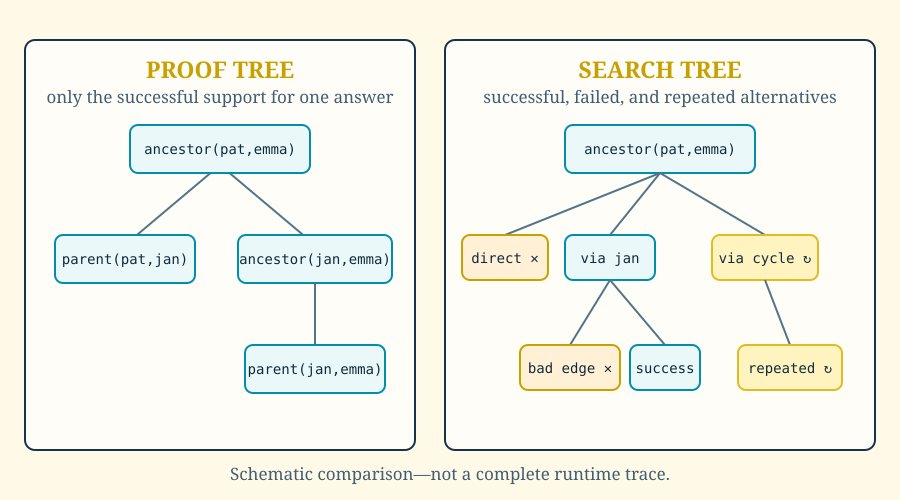
  <figcaption>The proof explains why an answer holds; the search tree explains the work needed to discover that proof.</figcaption>
</figure>

When a program is slow, sketch the first few levels of its search tree: the
selected goal, the clauses that match it, the bindings each produces, and the
calls that repeat. The sketch usually shows a generator that is too broad or a
test placed too late.

**Checkpoint.** Swap two body goals in a rule of your own. Before running it,
predict whether the answer set, termination, first answer, or proof shape
changes.

## 18. Constructing a program

<figure>
  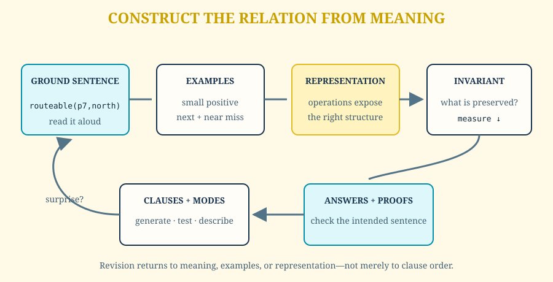
  <figcaption>Construction begins with meaning and examples, chooses a representation that exposes an invariant, and lets surprising answers send the design back to the right layer.</figcaption>
</figure>

### Begin with a ground sentence

Parcels must be routed through compatible hubs. Start without variables:

```eyeprolog
routeable(parcel_7, hub_north).
```

What does it claim — that the parcel can enter the hub, leave it, or complete
a route through it? An ambiguous ground sentence makes every rule built on it
ambiguous. Once the meaning is fixed, name the evidence:

```eyeprolog
routeable(Parcel, Hub) :-
  destination_zone(Parcel, Zone),
  serves(Hub, Zone),
  package_class(Parcel, Class),
  accepts(Hub, Class).
```

The shared variables are the joins already present in the English. A repeated
variable asserts identity; a variable that appears only "in case it is needed
later" asserts nothing and should go.

### Examples before recursion

For a recursive relation, write the smallest positive case, the next one, and
a near miss:

```text
prefix([], [a,b])          true
prefix([a], [a,b])         true
prefix([b], [a,b])         false
```

The empty case is the base clause. Comparing the second with a smaller one
suggests stripping a matching head from both lists:

```eyeprolog
prefix([], _).
prefix([X | Xs], [X | Ys]) :- prefix(Xs, Ys).
```

That is the general method: find something that shrinks, keep the invariant
while shrinking it, and state the case where nothing needs to shrink.

### Generate, then test

Finite combinatorial programs read better when generating and testing are
separate:

```eyeprolog
candidate_pair(A, B) :-
  person(A),
  person(B).

compatible_pair(A, B) :-
  candidate_pair(A, B),
  (A \= B),
  \+ conflict(A, B).
```

`candidate_pair/2` makes the closed domain visible and guarantees that `\=`
and `\+` see bound arguments. Proofs then say whether a step generated or
rejected a choice. The final clause may interleave the tests with the
generators for speed; the conceptual split survives.

### Representations follow the questions

A graph can be `edge/2` facts, a list of edge terms, or part of a state term.
Facts suit indexed lookup and proof provenance; a list suits a private,
changing graph passed through recursion; a compound state term suits
transitions that replace several components at once. Whatever you choose, do
not pack structure into strings and re-parse it throughout the theory. Parse
once at the boundary: `address(City, PostalCode)` can be unified, inspected,
and explained.

### Grow in layers

```text
source facts → normalized facts → domain concepts → decisions → answers
```

Point negation down this stack, at a complete lower layer. Cycles among
positive concepts can be tabled; a cycle through negation usually means a
concept has no stable meaning yet. Add one representative query per layer as
you go, so a silent failure in normalization shows up before the final
decision predicate does.

**Checkpoint.** For a domain of your own, write three positive ground
examples, one near miss, and the intended query mode before writing any rule.

## 19. Correctness and termination

<figure>
  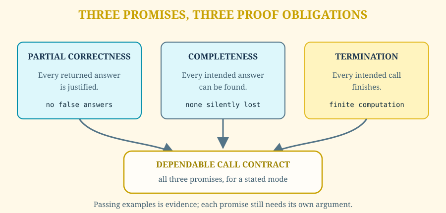
  <figcaption>Partial correctness, completeness, and termination are independent promises; a dependable intended call needs all three.</figcaption>
</figure>

Tests sample a relation; an argument covers it. Ask three separate questions:

1. **Partial correctness:** is every returned answer justified?
2. **Completeness:** for intended calls, is every required answer found?
3. **Termination:** do intended calls finish?

For `prefix/2`, both of the first two follow by induction. The base clause
returns only the empty prefix; the recursive clause adds the same head to a
smaller valid prefix, so the result is still a prefix. Conversely, every
nonempty prefix shares its first element with the list, and removing it leaves
a smaller prefix problem that the recursive clause covers. That is usually
enough: justify each base clause, assume the recursive calls are right, and
show each recursive clause preserves the property.

### Termination needs its own measure

Name a quantity that strictly decreases before each recursive call in the
intended mode and cannot decrease forever: list length, a nonnegative integer,
unvisited states, tree size. For factorial it is `N`:

```eyeprolog
factorial(0, 1).
factorial(N, F) :-
  (N > 0),
  (Previous is N - 1),
  factorial(Previous, PF),
  (F is N * PF).
```

Move the subtraction after the recursive call and the equation still holds,
but the measure is gone.

Tabled graph recursion terminates differently. Nothing need shrink at each
edge; termination comes from a finite number of distinct calls and answers.
Tabling cannot rescue a rule that builds `s(s(s(...)))` without bound.

### Negation and aggregation need bounded subsearch

`\+ Goal` and aggregates must settle a nested search before answering. Before
writing `\+ disqualified(Person)`, make sure `Person` is bound and
`disqualified/1` finishes for it. Before collecting routes, decide which
finite family you mean: simple routes, routes under a cost, and so on.

### Integrity is not failure

Failure says one attempted proof did not work. An integrity relation returns
the evidence that the input itself is wrong:

```eyeprolog
invalid_limits(Name, Low, High) :-
  lower_limit(Name, Low),
  upper_limit(Name, High),
  (Low > High).
```

A failed eligibility query may be a legitimate "no". A successful
`invalid_limits/3` query means the host should stop deciding until the data is
repaired.

**Checkpoint.** For one recursive relation of your own, state its invariant and
its termination measure in one sentence each.

## 20. Improving a program

Improvement starts with observation: keep representative answers and proofs,
collect `--stats`, and change one thing at a time.

### Ask a better question first

The cheapest optimization is a more specific call. Ask
`route(brussels, Destination)` instead of an open enumeration when the origin
is known. Put selective relations early so they bind arguments for later
goals. Don't build a witness when the caller needs only existence:

```eyeprolog
connected(X, Y) :- path_with_nodes(X, Y, _).
```

This may enumerate many distinct paths to establish one fact. A tabled
reachability relation records the pair itself; keep the path-producing
relation for callers that actually need a path.

### Name invariants with helpers

```eyeprolog
within_thermal_limits(Battery) :-
  temperature(Battery, T),
  temperature_limit(Max),
  (T =< Max).
```

The helper puts a domain statement into every proof that uses it and gives
the limit policy one home. Prefer helpers that add vocabulary; `step2/3` adds
none.

### Hoist invariant work

If every recursive step recomputes the same value, compute it once and pass it
in:

```eyeprolog
search(Request, Answer) :-
  normalized_request(Request, Normalized),
  search_normalized(Normalized, initial_state, Answer).
```

The helper's arguments then show exactly which values change from step to
step.

### Check that the meaning survived

After reordering goals or specializing a predicate, rerun positive examples,
expected failures, boundary values, cyclic data, and duplicate derivations,
and compare proof premises, not just printed conclusions. A change that alters
which proof is found first also changes `once/1`, tie-breaking aggregates, and
explanations, even when the answer set is identical. If callers depend on
those, they are part of the contract.

Finally, resist generality nobody needs. A predicate that supports three modes
can be harder to terminate, explain, and index than two simple predicates with
clear contracts. Generalize when the second real use appears.

**Checkpoint.** Make exactly one control change to a program and classify each
difference in answers, proofs, and `--stats` as intended, harmless but
observable, or a regression.

# Part V — Advanced relational design

<figure>
  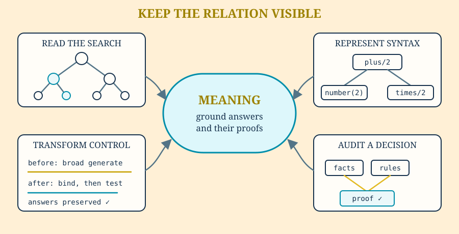
  <figcaption>Advanced design keeps meaning at the center while search is inspected, syntax is represented, control is transformed, and decisions remain auditable.</figcaption>
</figure>

This part works with whole computations: tracing a search, treating languages
and evaluators as relations, transforming correct programs, and building a
decision service whose conclusions can be audited.

## 21. Reading the computation

```eyeprolog
parent(ada, byron).
parent(byron, clara).
parent(clara, diego).

ancestor(X, Y) :- parent(X, Y).
ancestor(X, Z) :- parent(X, Y), ancestor(Y, Z).
```

```sh
eyeprolog --goal 'ancestor(ada, Who)' program.pl
```

The query branches two ways. An **or** step chooses between the two clauses;
an **and** step requires every goal in the chosen body. The first clause asks
`parent(ada, Who)` and yields `byron`. The second asks `parent(ada, Y)`, binds
`Y = byron`, and leaves `ancestor(byron, Who)` — the same choice one generation
down. The three answers sit at increasing depths of one proof family:

```text
ancestor(ada, byron)
  parent(ada, byron)

ancestor(ada, clara)
  parent(ada, byron)
  ancestor(byron, clara)
    parent(byron, clara)

ancestor(ada, diego)
  parent(ada, byron)
  ancestor(byron, diego)
    parent(byron, clara)
    ancestor(clara, diego)
      parent(clara, diego)
```

<figure>
  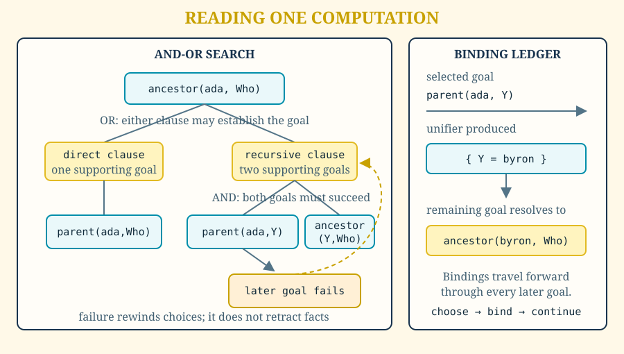
  <figcaption>Search alternates between choices and conjunctions; substitutions flow forward, while failure returns to the latest unfinished choice.</figcaption>
</figure>

### Bindings flow forward

A binding is not a local return value. Once a goal binds a variable, every
later occurrence sees the same term:

```eyeprolog
grandparent(X, Z) :-
  parent(X, Y),
  parent(Y, Z).
```

After `parent(ada, Y)` binds `Y = byron`, the second goal is the selective
`parent(byron, Z)`. A repeated variable in a head or goal is an equality built
into the pattern:

```eyeprolog
loop_edge(Node) :- edge(Node, Node).
```

This does not fetch an arbitrary edge and compare its endpoints afterwards; it
only matches edges whose endpoints already unify.

### Failure rewinds choices, not facts

```eyeprolog
eligible(Person) :-
  applicant(Person),
  age(Person, Age),
  (Age >= 18),
  verified(Person).
```

If `verified(Person)` fails, the current combination of bindings is rejected
and search resumes at the latest open choice — another `age/2` fact, another
applicant. Nothing in the program is retracted, and answers already printed
stay printed. Backtracking explores alternatives; it does not undo the world.

### Variants and tables

`path(a, X)` and `path(a, Y)` differ only in variable names; they are
**variants** and pose the same question. Tabling shares their answers and
stops a cycle from re-asking forever. It cannot help when every call is new:

```eyeprolog
grows(X) :- grows(wrapper(X)).
```

`grows(A)`, `grows(wrapper(A))`, `grows(wrapper(wrapper(A)))` are distinct
calls, and remembering them does not make them finitely many.

### Tracing by hand

When a query surprises you, write down for each step the selected goal, its
current arguments, the matching clause, the unifier, the new body goals, and
where failure would return. Compare with `--proof` for one successful answer
and `--stats` for the total work. Neither is a full trace, but together they
usually locate the problem.

**Exercises.**

1. Draw the and–or tree for `ancestor(byron, Who)`, then add a second parent
   of `clara` and mark where it branches.
2. Write a cyclic `edge/2` graph, table `path/2`, and compare its answers with
   the table rounds reported by `--stats`.
3. Write a recursive rule whose call grows a list each step and explain why
   tabling does not make it finite.

## 22. Trees, languages, and symbolic evaluation

Compound terms are finite trees: the functor labels a node, the arguments are
its children. Lists are one tree encoding; syntax, plans, formulas, and
circuits can be represented just as directly.

```eyeprolog
tree(
  oak,
  tree(birch, empty, empty),
  tree(pine, empty, empty)
).
```

A structural relation follows the shape:

```eyeprolog
tree_member(X, tree(X, _, _)).
tree_member(X, tree(_, Left, _)) :- tree_member(X, Left).
tree_member(X, tree(_, _, Right)) :- tree_member(X, Right).
```

The clauses also fix a search order — root, left, right. For membership the
order is invisible; under `once/1` it becomes observable.

<figure>
  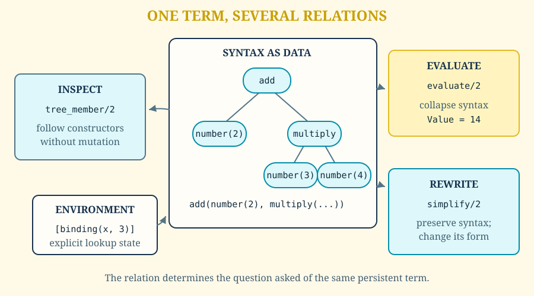
  <figcaption>A compound term remains persistent data; different relations inspect, evaluate, or rewrite it according to the question being asked.</figcaption>
</figure>

### Relating two trees

```eyeprolog
mirror(empty, empty).
mirror(
  tree(Value, Left, Right),
  tree(Value, MirroredRight, MirroredLeft)
) :-
  mirror(Left, MirroredLeft),
  mirror(Right, MirroredRight).
```

Called forward, `mirror/2` builds a mirror; with both trees ground, it checks
one. Nothing is mutated; the rule relates two persistent terms. Its
correctness argument is structural induction: the empty tree is its own
mirror, and if both recursive calls are right, so is the rebuilt node.

### A definite clause grammar

Grammar rules (ISO/IEC TS 13211-3) describe sequences; the processor adds the
two list arguments that thread the input through:

```eyeprolog
sentence --> noun_phrase, verb_phrase.

noun_phrase --> [the], noun.
noun_phrase --> [a], noun.

noun --> [robot].
noun --> [scientist].

verb_phrase --> verb, noun_phrase.

verb --> [helps].
verb --> [observes].

complete_sentence(Words) :- phrase(sentence, Words).
```

```sh
eyeprolog --goal 'complete_sentence([the, robot, helps, a, scientist])' program.pl
```

`sentence//0` expands to an ordinary `sentence/2`: input before, suffix after.
`noun_phrase//0` hands its leftover input to `verb_phrase//0`. `phrase/2`
demands that everything is consumed; `phrase/3` returns the rest. A grammar is
also a search program, so a recursive grammar called with unbound `Words` can
generate sentences without end. It needs the same mode and termination
thinking as any other recursion.

### An evaluator

Keep the expression separate from evaluating it:

```eyeprolog
evaluate(number(N), N).

evaluate(add(Left, Right), Value) :-
  evaluate(Left, L),
  evaluate(Right, R),
  (Value is L + R).

evaluate(multiply(Left, Right), Value) :-
  evaluate(Left, L),
  evaluate(Right, R),
  (Value is L * R).
```

```sh
eyeprolog --goal 'evaluate(
    add(number(2), multiply(number(3), number(4))),
    Value
  )' program.pl
```

The value is `14`, and the proof follows the syntax tree: two literal
evaluations support a multiplication, which supports the addition. Variables
need an environment, passed explicitly as data rather than held in global
state:

```eyeprolog
lookup(Name, [binding(Name, Value) | _], Value).
lookup(Name, [_ | Rest], Value) :- lookup(Name, Rest, Value).

evaluate(variable(Name), Environment, Value) :-
  lookup(Name, Environment, Value).
```

List order decides shadowing; say so in the contract of `lookup/3`.

### Rewriting

Evaluation collapses syntax into a value. Rewriting keeps syntax and replaces
one form with an equivalent one:

```eyeprolog
simplify(add(number(0), X), X).
simplify(add(X, number(0)), X).
simplify(multiply(number(1), X), X).
simplify(multiply(X, number(1)), X).

simplify(add(A, B), add(SA, SB)) :-
  simplify(A, SA),
  simplify(B, SB).
```

Overlapping rules give several answers — useful for exploring equivalent
forms, but a normalizer needs a strategy and a measure. Add the reverse of the
first rule, expanding `X` into `add(X, number(0))`, and rewriting never stops.

**Exercises.**

1. Define `tree_size/2` and `tree_height/2`.
2. Add adjectives to the grammar and subtraction to the evaluator.
3. Define constant folding for `add(number(A), number(B))`.

## 23. Transforming programs

A transformation rewrites clauses while trying to keep the relation. The real
question is not whether the new version runs but for which calls it preserves
answers, termination, answer order, and explanations. Four transformations
recur: **unfolding** replaces a call by the bodies of its clauses;
**folding** names a repeated conjunction; **specialization** fixes known
arguments; an **accumulator** carries a partial result through recursion.

<figure>
  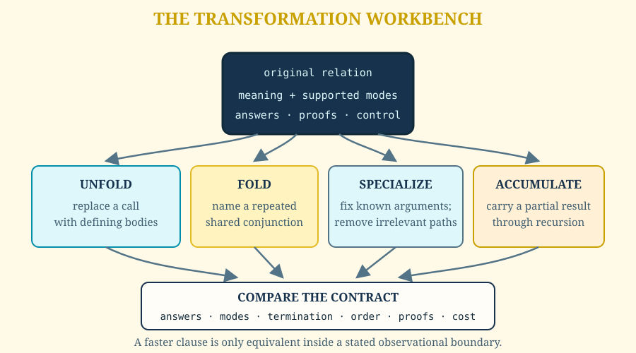
  <figcaption>Transformation is a controlled experiment: change the clauses, then compare meaning, supported modes, termination, proof shape, and cost.</figcaption>
</figure>

### Unfolding and folding

```eyeprolog
adult(Person) :-
  recorded_age(Person, Age),
  adult_age(Age).

adult_age(Age) :- (Age >= 18).
```

Unfolding `adult_age/1` gives:

```eyeprolog
adult(Person) :-
  recorded_age(Person, Age),
  (Age >= 18).
```

The answers are unchanged, but the proof has lost the concept `adult_age/1` —
a real loss in an auditable policy. A helper with several clauses unfolds into
several caller clauses; a recursive one may unfold forever.

Folding goes the other way. Two rules repeat a condition:

```eyeprolog
can_board(Person) :-
  registered(Person),
  identity_checked(Person),
  \+ suspended(Person),
  has_ticket(Person).

can_enter_lounge(Person) :-
  registered(Person),
  identity_checked(Person),
  \+ suspended(Person),
  lounge_pass(Person).
```

Name it:

```eyeprolog
traveler_in_good_standing(Person) :-
  registered(Person),
  identity_checked(Person),
  \+ suspended(Person).

can_board(Person) :-
  traveler_in_good_standing(Person),
  has_ticket(Person).

can_enter_lounge(Person) :-
  traveler_in_good_standing(Person),
  lounge_pass(Person).
```

The gain is not three lines saved. The closed-world assumption behind
`\+ suspended(Person)` now has one place to be stated and tested.

### Specialization

A rail planner over a general `connection(Mode, From, To, Cost)` relation can
define:

```eyeprolog
rail_connection(From, To, Cost) :-
  connection(rail, From, To, Cost).
```

The wrapper states a stronger contract and gives indexing a bound first
argument. Deeper specialization precomputes invariant classifications or drops
irrelevant branches. Keep the general relation as the specification the
specialized one is checked against.

This idea runs deep. In the 1970s Futamura observed that specializing an
interpreter to a fixed source program yields a compiled program; partial
evaluation of logic programs grew from the same unfold-fold-specialize toolkit.

### Accumulators change modes

```eyeprolog
sum_numbers([], 0).
sum_numbers([X | Xs], Sum) :-
  sum_numbers(Xs, Rest),
  (Sum is X + Rest).
```

With an accumulator, the partial sum becomes an argument:

```eyeprolog
sum_numbers_acc(List, Sum) :- sum_from(List, 0, Sum).

sum_from([], Accumulator, Accumulator).
sum_from([X | Xs], Accumulator, Sum) :-
  (Next is Accumulator + X),
  sum_from(Xs, Next, Sum).
```

On a ground numeric list both return the same sum. They are not the same
relation in every mode: the accumulator version needs each element ready on
the way down. Claim equivalence for the intended mode, not unconditionally.

### Comparing versions

Before replacing a definition, write down its intended relation, supported
modes, termination measure, whether duplicates and answer order matter, and
whether callers read its proofs. Compare semantics first, then cost. `--stats`
counts calls and unifications, but counts are not time: one expensive host
call can outweigh thousands of cheap ones. A faster program that silently
drops a mode is a different program.

**Exercises.**

1. Unfold a two-clause helper and count the resulting caller clauses.
2. Compare direct and accumulator-based list length in several modes.
3. Find a transformation that keeps the answer set but changes the first proof
   that `once/1` selects.

## 24. Designing finite search

Nondeterminism is not randomness. A nondeterministic relation has several
legitimate continuations, and search explores them systematically. The design
task is to keep the useful ones, make their number finite, and put the
productive ones first.

<figure>
  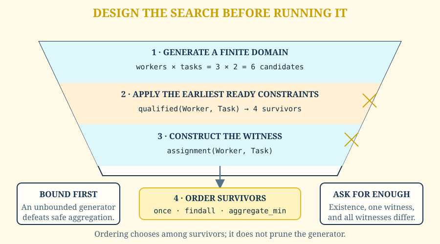
  <figcaption>Finite search is designed from the top down: bound generation, prune with ready constraints, preserve the witness, then order only the survivors.</figcaption>
</figure>

### Generate and constrain

```eyeprolog
worker(ada).
worker(byron).
worker(clara).

task(inspect).
task(repair).

qualified(ada, inspect).
qualified(byron, repair).
qualified(clara, inspect).
qualified(clara, repair).

assignment(Worker, Task) :-
  worker(Worker),
  task(Task),
  qualified(Worker, Task).
```

```sh
eyeprolog --goal 'assignment(Worker, Task)' program.pl
```

`worker/1` and `task/1` make the search space explicit and finite;
`qualified/2` prunes it. A caller that knows the task asks
`assignment(Worker, repair)` and never generates the other task.

### Search over states

A state-space search needs a state term, a finite move relation, a goal test,
a policy for repeated states, and a witness. Here the visited list is both the
repeat policy and the witness:

```eyeprolog
:- use_module(library(lists)).

simple_path(From, To, Path) :-
  walk(From, To, [From], Reversed),
  reverse(Reversed, Path).

walk(To, To, Visited, Visited).
walk(From, To, Visited, Path) :-
  edge(From, Next),
  \+ member(Next, Visited),
  walk(Next, To, [Next | Visited], Path).
```

On a finite graph this terminates — but it also changes the question from
walks to simple paths. That is a modeling decision, not an optimization. A
caller who wants repeated stops needs a different bound, such as a step or
cost limit.

### Existence, one witness, all witnesses

```text
reachable(From, To)                                 one pair; table it
once(simple_path(From, To, Path))                   stops at the first path
findall(Path, simple_path(From, To, Path), Paths)   may be exponential
```

All three are finite on a finite graph, and their costs differ enormously.
Ask for the weakest result that meets the caller's need.

### Optimization is search plus an order

```eyeprolog
:- use_module(library(aggregate)).

best_plan(Request, Plan, Cost) :-
  aggregate_min(
    [CandidateCost, CandidatePlan],
    CandidatePlan,
    candidate_plan(Request, CandidatePlan, CandidateCost),
    [Cost, Plan],
    Plan
  ).
```

The key `[Cost, Plan]` breaks ties deterministically. It does not shrink the
search: `aggregate_min/5` enumerates every candidate before it knows the
minimum. It is not branch-and-bound. For a large problem, strengthen
`candidate_plan/3` or write a domain-specific dynamic program.

### Depth-first is not fair

Depth-first search can disappear into an infinite branch before reaching a
finite proof further along. Put reachable base cases before recursive
expansion, and make each recursive step consume a finite resource or enter a
finite table. `once/1` turns the first success into a deliberate choice; use
it only when that order is part of the specification.

**Exercises.**

1. Add skills and time slots to the assignment example.
2. Make `simple_path/3` return an accumulated cost.
3. Write a recursive first clause that starves a valid later base clause, then
   repair it.

## 25. Case study: an auditable decision service

This chapter turns a small access policy from prose into an explainable
theory.

<figure>
  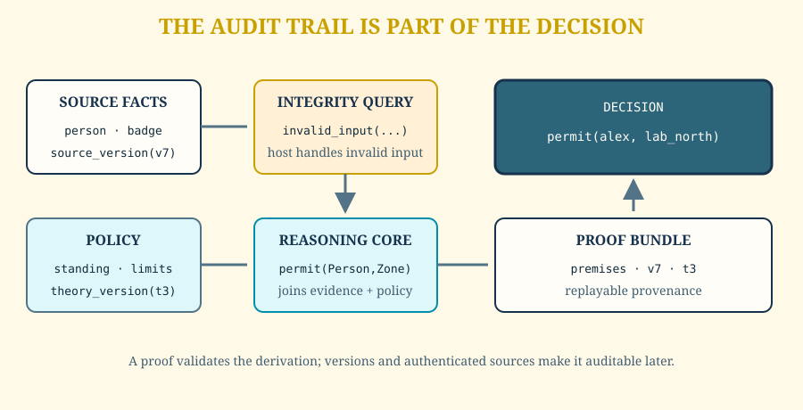
  <figcaption>An auditable service keeps source and theory versions attached to the premises, blocks invalid input at an integrity gate, and returns the decision with replayable provenance.</figcaption>
</figure>

### The requirements

A research facility says: a person may enter a zone when their badge is
active, the badge grants the zone's clearance, their training is current, and
they are not suspended. Contradictory badge records invalidate the service.
Every permit must be traceable to source facts.

The prose leaves questions open. Is the suspension list complete? Is missing
training a denial or unknown? Can someone hold two active badges? Which clock
defines "current"? A rule engine cannot answer these; it can only make the
chosen answers precise.

### Sources and concepts

Record observations, not decisions:

```eyeprolog
person(ada).
badge(b17, ada).
badge_status(b17, active).
badge_clearance(b17, laboratory).
zone_requires(clean_room, laboratory).
training_valid(ada, clean_room).
```

Keeping the badge identifier explicit matters. `active_badge(ada)` would hide
the record used as evidence and make conflicting records harder to see. Then
build vocabulary that reads like the policy:

```eyeprolog
active_badge(Person, Badge) :-
  badge(Badge, Person),
  badge_status(Badge, active).

cleared_for(Badge, Zone) :-
  badge_clearance(Badge, Clearance),
  zone_requires(Zone, Clearance).

prepared_for(Person, Zone) :-
  training_valid(Person, Zone).
```

### The closed-world choice

If the suspension list is authoritative and complete, absence is evidence:

```eyeprolog
in_good_standing(Person) :-
  person(Person),
  \+ suspended(Person).
```

If it is incomplete, this rule is unsound policy; require a positive fact such
as `standing(Person, good)` instead. The difference is an agreement about
what the data covers, not a matter of syntax.

### Decision and reason

```eyeprolog
permit(Person, Zone) :-
  active_badge(Person, Badge),
  cleared_for(Badge, Zone),
  prepared_for(Person, Zone),
  in_good_standing(Person).

reason(Person, Zone, badge_and_training_verified) :-
  permit(Person, Zone).
```

```sh
eyeprolog --goal 'permit(Person, Zone)' program.pl
eyeprolog --proof --goal 'permit(Person, Zone)' program.pl
```

`reason/3` is a stable summary in domain vocabulary. `--proof` gives the
derivation: the actual clauses and bindings. Users read the first; auditors
check the second.

### Integrity before decisions

```eyeprolog
incompatible_status(active, revoked).
incompatible_status(revoked, active).

invalid_badge_status(Badge, Status, Other) :-
  badge_status(Badge, Status),
  incompatible_status(Status, Other),
  badge_status(Badge, Other).
```

An answer here does not mean a permit failed. It means the input is unfit for
a trusted decision. The host queries it — together with checks for a badge
held by two people or a zone with conflicting clearances — before any permit
goal.

### Tests are policy examples

Test an ordinary permit, missing training, suspension, insufficient
clearance, contradictory status, and a proof that names the exact badge and
training facts. Boundary cases expose requirements: with two valid badges,
`permit(Person, Zone)` yields one decision with two proofs. If the badge
belongs in the answer, the relation should be `permit(Person, Zone, Badge)`.

### Embedding and audit

```text
authenticated source snapshot
  -> normalized EyeProlog facts
  -> integrity checks
  -> permit and reason
  -> proof referencing clauses and facts
```

The host authenticates sources and converts records to facts; EyeProlog
derives and explains; the host stores the answer with its proof and the input
and theory versions. The solver can explain logical support. It cannot attest
that the badge database was current. Keep old inputs, theories, and proofs, so
a past decision can be reconstructed under the rules that governed it.

**Exercises.**

1. Add time-bounded training using explicit dates and `difference/3` from `library(dates)`.
2. Model `denial/3` without assuming every failed permit has the same reason.
3. Write an integrity relation for a badge assigned to two people.

# Part VI — Mathematics made executable

<figure>
  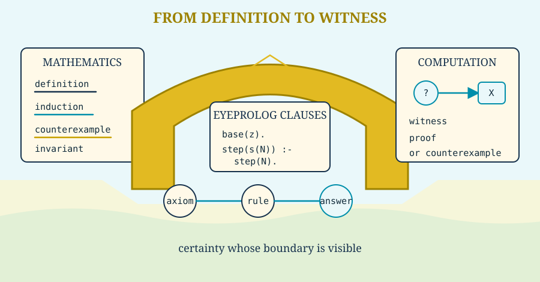
  <figcaption>Formal clauses form a bridge: definitions and invariants become computations that return witnesses, counterexamples, and inspectable proofs.</figcaption>
</figure>

A logic program works because parts of mathematical reasoning can be written
as finite symbols, transformed by explicit rules, and checked step by step.
EyeProlog is not a theorem prover or a computer algebra system, but its small
fragment of logic makes the old mathematical acts visible: a clause defines a
class, a variable is an unknown, a helper relation is a lemma, two clauses are
a case split, recursion is induction, a binding is a witness, and a proof term
is the argument. This Part follows that correspondence and marks where it
stops.

For a short route, read Chapters 26, 27, and 29, then continue at Chapter 31.

## 26. A proof can be a computation

Ask for Pythagorean triples with sides up to 20:

```eyeprolog
:- use_module(library(between), [between/3]).

triple(A, B, C) :-
  between(1, 20, A),
  between(A, 20, B),
  between(B, 20, C),
  (C * C =:= A * A + B * B).
```

```sh
eyeprolog --goal 'triple(A, B, C)' program.pl
```

```text
triple(3, 4, 5).
triple(5, 12, 13).
triple(6, 8, 10).
triple(8, 15, 17).
triple(9, 12, 15).
triple(12, 16, 20).
```

The query is an existential claim: *there are* `A`, `B`, and `C` in range with
`A² + B² = C²`. Each answer does more than say "true". It hands back the
object that makes the claim true. The substitution is the computational
content of the existence statement.

### Witnesses need a source

With all three arguments bound, the same clause only checks a candidate. With
them unbound, the bounded `between/3` goals supply candidates and the
comparison filters them. The equation by itself says nothing about where
numbers come from.

That is the gap between mathematical existence and executable witness. A
classical proof may show that something exists without saying how to build
it. An EyeProlog query produces a witness only when its clauses and control
actually reach one.

### Proofs as evidence

Run the same goal with `--proof` and each answer carries its derivation: the
facts, rules, built-in calls, and bindings that produced it. That record
supports three distinct activities:

- **rechecking** that every step follows from the theory and the built-in
  contracts;
- **auditing** which premises were actually used;
- **explaining** the conclusion in terms a person can follow.

These are different jobs. A derivation can be valid and unreadable, readable
and built on a bad source fact, or correct for floating-point arithmetic and
wrong for the physical quantity it was meant to model. Proof output makes
scrutiny possible; it does not do the scrutiny for you.

### The least model as closure

```eyeprolog
edge(a, b).
edge(b, c).

path(X, Y) :- edge(X, Y).
path(X, Z) :- edge(X, Y), path(Y, Z).
```

Start from the facts and repeatedly add every rule head whose body is already
satisfied. The first round adds `path(a, b)` and `path(b, c)`; the second adds
`path(a, c)`; the third adds nothing. That fixed point is the least Herbrand
model, and it is what the program means. Goal-directed search reaches the same
meaning from the other side: it asks only what this particular goal needs.

A tabled predicate makes the connection concrete. Its table grows with each
new answer until no rule adds another — a local, demand-driven fixed-point
computation.

### Where the idea came from

The path to logic programming ran through mathematics examining its own
methods. Hilbert made formal proof and consistency mathematical subjects.
Gödel showed that sufficiently expressive consistent systems cannot prove
every arithmetical truth. Church and Turing made "effective procedure" exact
and proved that some decision problems have no algorithm. Herbrand reduced
quantified statements to ground instances, Robinson turned unification into a
uniform inference rule, and van Emden and Kowalski gave definite programs
their least-model meaning. Each step made one idea precise and exposed a new
limit; resolution, in particular, still needed control — selection order,
clause order, and eventually tabling.

**Exercises.**

1. Run `triple/3` with one, two, and three arguments bound. Compare the
   question asked, the answers, and the amount of search.
2. Keep only primitive triples by rejecting those whose sides share a divisor.
   Which generators make the negation safe?
3. In `examples/fundamental-theorem-arithmetic.pl`, separate the witness it
   constructs from the property it verifies.
4. Draw the fixed-point rounds for a four-edge graph with one cycle.

**Checkpoint.** For one printed answer, state the existential claim its
bindings witness, the finite domain that made search possible, and what
further argument a universal theorem would need.

## 27. Recursion is induction in motion

Represent natural numbers as `z`, `s(z)`, `s(s(z))`, and so on:

```eyeprolog
natural(z).
natural(s(N)) :- natural(N).

plus(z, Y, Y).
plus(s(X), Y, s(Z)) :- plus(X, Y, Z).
```

The two `plus/3` clauses are the textbook definition of addition: zero plus
`Y` is `Y`, and the successor of `X` plus `Y` is the successor of `X` plus
`Y`. Run backwards, the same clauses split a number into summands:

```sh
eyeprolog --goal 'plus(X, Y, s(s(z)))' program.pl
```

```text
plus(z, s(s(z)), s(s(z))).
plus(s(z), s(z), s(s(z))).
plus(s(s(z)), z, s(s(z))).
```

To prove something about `plus/3` for every natural number, induct on the
first argument: the base clause is the base case, the recursive call is the
induction hypothesis, and the rule head is the conclusion it preserves.

<figure>
  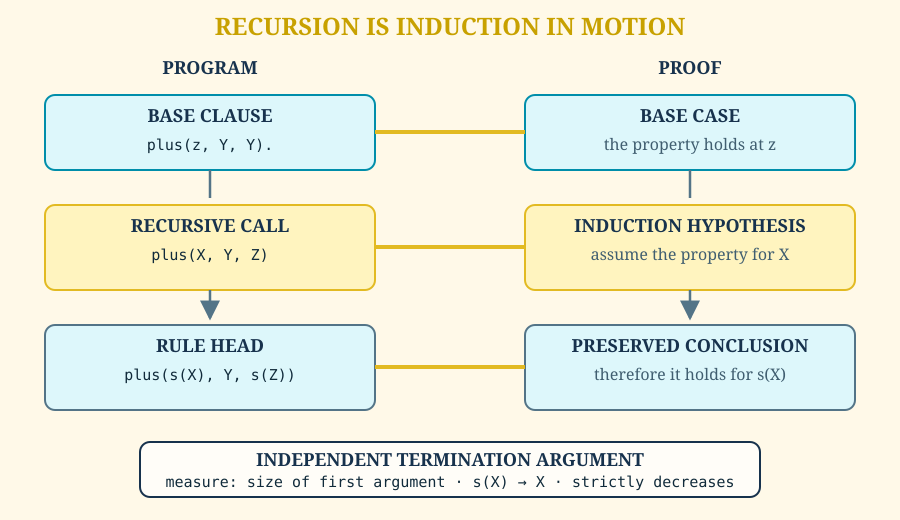
  <figcaption>Recursion and induction can share a structural skeleton, but termination still requires its own well-founded decreasing measure.</figcaption>
</figure>

### Correctness is not termination

Induction shows that every answer is right. It does not show that the search
finishes. Chapter 19 separates the three claims — partial correctness,
completeness for a mode, and termination — and they apply here unchanged.

For `plus(+,+,-)` the termination measure is the number of `s/1` wrappers on
the first argument. Every recursive call removes one, and natural numbers
have no infinite descending chain. "It seems to get smaller" is not an
argument; a measure into a well-founded set, decreasing on every recursive
branch, is.

### Data shapes give you the induction

Lists carry their induction principle in their constructors: `[]` and
`[Head | Tail]`. A relation that follows them is easy to prove correct:

```eyeprolog
list_length([], 0).
list_length([_ | Tail], N) :-
  list_length(Tail, M),
  (N is M + 1).
```

Prove the empty case, assume the claim for `Tail`, prove it for
`[Head | Tail]`. Program and proof share a skeleton because both follow the
same constructors.

Representation decides whether that skeleton is available. An expression tree
built from `number/1`, `plus/2`, and `times/2` supports structural recursion
directly; a flat token list must be parsed first. Good representations make
the proof principle visible, not just the code shorter.

### Accumulators need stronger invariants

```eyeprolog
reverse_acc(List, Reversed) :-
  reverse_go(List, [], Reversed).

reverse_go([], Acc, Acc).
reverse_go([X | Xs], Acc, Reversed) :-
  reverse_go(Xs, [X | Acc], Reversed).
```

"`Reversed` is the reverse of `Xs`" is false for `reverse_go/3` and cannot be
proved by induction. The statement that works is stronger:

> `reverse_go(Xs, Acc, Reversed)` holds when `Reversed` is the reverse of
> `Xs` followed by `Acc`.

This is the mathematician's standard move: when a theorem is too weak to carry
its own induction, generalize it until the hypothesis contains what the next
step needs. Program transformation and proof discovery meet at the invariant.

### Tabling changes the argument

On a cyclic graph, following an edge can lead back to a vertex already seen,
so no term gets smaller. Tabled reachability terminates for a different
reason: a finite graph has finitely many ground `path/2` answers, the table
only grows, and each productive round adds an answer it did not have.
Termination comes from a finite answer space, not from structural descent.

The argument also states its own limit. If rules build terms of unbounded
depth, the space of calls or answers is infinite and tabling no longer bounds
it.

**Exercises.**

1. Define multiplication on Peano naturals and give its decreasing measure.
2. Prove the strengthened `reverse_go/3` invariant on paper.
3. Compare the termination arguments for list membership and for reachability
   on a cyclic graph.
4. In `examples/peano-calculus.pl`, find where the data constructors determine
   the available induction.

**Checkpoint.** Line up one recursive program with its induction proof — base
clause and base case, recursive call and hypothesis, head and conclusion —
then give a separate termination measure.

## 28. Algebra, symmetry, and representation

Unification solves equations between terms:

```text
?- pair(X, f(Y)) = pair(g(a), f(b)).
X = g(a), Y = b.
```

The outer functors and arities agree, so the arguments must agree pairwise.
But unification works in the *free* term algebra: distinct constructors are
always different, and two terms are equal only if they have the same shape.
It knows nothing of commutativity, so `2 + 3 = 3 + 2` fails even though both
evaluate to 5.

Keep two kinds of equality apart:

- **syntactic equality** — identical structure, decided by unification;
- **domain equality** — equal by the laws of the domain, which needs
  normalization or a decision procedure.

A canonical representation turns some domain equalities into syntactic ones.
For polynomials, sets, or fractions that is often the right design, but the
normalizer then owes a proof: equivalent objects must normalize alike, and
inequivalent ones must not.

### Symmetry reduces search

A triangle given by three side lengths can be listed in six orders. Generate
only the ordered one:

```eyeprolog
:- use_module(library(between), [between/3]).

triangle(A, B, C) :-
  between(1, 20, A),
  between(A, 20, B),
  between(B, 20, C),
  (A + B > C).
```

Because `A =< B =< C`, each triangle appears once. This is more than a speedup.
It picks one representative from each permutation class — a quotient. Much of
mathematics advances by choosing the right equivalence: fractions with equal
cross-products, graphs up to renaming, formulas up to variable renaming. A
logic program must decide which distinctions belong to the problem and which
are accidents of notation.

### Relations expose inverse problems

A function runs one way. A relation can be asked in several:

```eyeprolog
:- use_module(library(between), [between/3]).

integer_rectangle(Area, W, H) :-
  between(1, Area, W),
  between(W, Area, H),
  (Area =:= W * H).
```

```sh
eyeprolog --goal 'integer_rectangle(24, W, H)' program.pl
```

```text
integer_rectangle(24, 1, 24).
integer_rectangle(24, 2, 12).
integer_rectangle(24, 3, 8).
integer_rectangle(24, 4, 6).
```

Multiply versus factor, evaluate versus interpolate, simulate versus infer
the initial state: mathematics constantly moves between direct and inverse
problems. A relation lets both share one specification, provided some
argument supplies a finite direction for search — here, `between/3`.

### Laws as testable relations

If a mapping is meant to preserve an operation, write the law as a relation.
For a mapping `image/2` and an operation `combine/3`:

```eyeprolog
preserves_combine(X, Y) :-
  combine(X, Y, XY),
  image(X, IX),
  image(Y, IY),
  image(XY, IXY),
  combine(IX, IY, IXY).
```

Over a finite carrier, define a relation for a violating pair and ask with
`\+/1` whether it has any answer. Over an infinite carrier, finite testing is
evidence, not proof.

The examples cover the main roles: `d3-group.pl` computes a finite operation
table, `matrix-noncommutativity.pl` refutes commutativity with one pair,
`group-inverse-uniqueness.pl` proves uniqueness from axioms, and
`composition-of-injective-functions-is-injective.pl` composes preserved
properties.

### Representation is a commitment

Writing a rational number as `fraction(N, D)` raises questions at once. May
`D` be zero? Are signs normalized? Are `fraction(1, 2)` and `fraction(2, 4)`
the same term or merely equivalent? These are not serialization details: they
fix the equality relation, the search space, and the meaning of every later
proof. Before choosing a representation, state its valid values, its
equivalence, whether it has a canonical form, which operations must be fast,
and which induction it exposes.

**Exercises.**

1. Give two representations of an undirected edge. Compare their equality and
   indexing behavior.
2. Design a normalized rational representation and write integrity relations
   for a zero denominator and a noncanonical zero.
3. Use `examples/d3-group.pl` to check identity, inverses, and associativity.
   Which checks are exhaustive, and why?

**Checkpoint.** Take a value with two possible representations. Say whether
EyeProlog treats them as structurally equal, whether the domain treats them as
equivalent, and what connects the two.

## 29. Search as experimental mathematics

Mathematicians compute small cases, look for patterns, and hunt for
counterexamples long before they prove anything. Logic programming makes that
experiment transparent: generate a finite world, state the property as a
relation, and ask for witnesses or failures.

```eyeprolog
:- use_module(library(between), [between/3]).

counterexample_to_odd_square(N) :-
  between(1, 100, N),
  (N mod 2 =:= 1),
  ((N * N) mod 2 =\= 1).
```

```sh
eyeprolog --goal 'counterexample_to_odd_square(N)' program.pl
```

The run prints nothing. That means only that no odd number from 1 to 100 has
an even square under the implemented arithmetic. The theorem for every odd
integer needs algebra: `(2k+1)² = 2(2k²+2k)+1`.

<figure>
  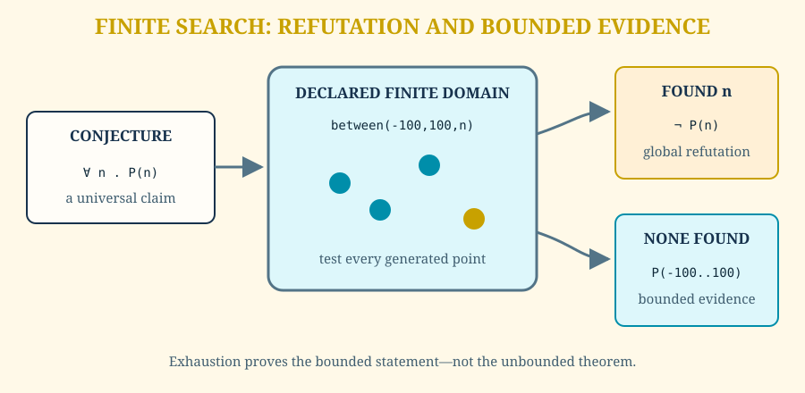
  <figcaption>Finite search is asymmetric: one valid counterexample defeats a universal claim, while finding none establishes only the explicitly bounded statement.</figcaption>
</figure>

### The asymmetry of counterexamples

Search is weak at confirming and strong at refuting. No answer over a bounded
range is evidence. One answer refutes a universal claim outright.
`examples/matrix-noncommutativity.pl` multiplies two fixed 2×2 matrices both
ways and gets different results; that single pair settles that matrix
multiplication is not commutative.

When the claim itself is bounded — "for every integer from 1 to 10,000" —
exhaustive search is a proof, provided the generator is complete, the
predicate says what is meant, and the arithmetic is trusted.

### Finite model exploration

A finite structure is a finite carrier plus interpretations of its operations.
EyeProlog can enumerate candidate tables, apply axioms as filters, and return
models or countermodels. For three elements a binary operation has nine
entries and 3⁹ possible tables. The axioms prune them: closure keeps outputs
in the carrier, an identity fixes a whole row and column, commutativity ties
mirrored cells, associativity checks triples.

The order of those filters is itself mathematics. A strong law applied to
partial tables collapses the search; the same law applied after full
generation merely rejects thousands of finished candidates.

### Count before you optimize

Search cost is usually a counting problem first. `n` alternatives at each of
`k` positions give `nᵏ` leaves; ignoring a symmetry multiplies them; a
constraint checked on partial choices removes whole subtrees. So before
reordering goals or adding indexes, ask:

> What objects are being counted, and when do two branches denote the same
> object?

Otherwise the optimization may only speed up the production of duplicates.
`clpz-n-queens.pl`, `send-more-money.pl`, `integer-partitions.pl`,
`stirling-bell-numbers.pl`, and `weighted-interval-scheduling.pl` show
different shapes of choice: permutations, digit assignments, recursive
decompositions, set partitions, and ordered optimization. (The N-queens
example searches at four queens; its eight-queens goal checks a known
solution against the same model.)

### Numerical models

`beam-deflection.pl`, `orbital-transfer-design.pl`,
`competitive-enzyme-kinetics.pl`, and `least-squares-regression.pl` combine
rules with floating-point models. A derivation inside such a model proves a
conditional: *given* these measurements, equations, units, approximations, and
thresholds, the conclusion follows under the implementation's numeric
semantics. It does not show that the sensor was calibrated, that the model
applies in this regime, or that a float is an exact real. Name those
conditions alongside the result.

**Exercises.**

1. Turn a familiar universal conjecture into a bounded counterexample search.
   State what an empty result does and does not prove.
2. Estimate the naive search space of `send-more-money.pl`, then identify the
   constraint that removes the most branches.
3. Search a three-element carrier for a noncommutative operation with an
   identity.
4. For one scientific example, list every premise that is not pure logic.

**Checkpoint.** Label a computation as witness construction, counterexample,
exhaustive finite check, bounded evidence, or numerical model evaluation. In
one sentence each, say what its success proves and what its failure leaves
open.

## 30. What mathematics promises

Mathematics does not promise that premises describe the world. It promises
that one can check whether a conclusion follows from them. An EyeProlog
answer has the same shape as a theorem:

```text
axioms + definitions + inference rules       -> theorem
source facts + clauses + built-in semantics  -> ground answer + proof
```

The proof disciplines the arrow. It cannot vouch for the premises just by
using them.

### Four layers of trust

1. **Sources:** are the facts authentic, current, complete enough, and in the
   right units?
2. **Model:** do the predicates and rules say what the domain means?
3. **Engine:** do parsing, unification, built-ins, tabling, and proof output
   behave as the documented profile says?
4. **Derivation:** does this answer have a valid proof from this exact
   theory?

Integrity relations catch contradictions inside the theory. Conformance tests
cover the engine. Proof checking covers the derivation. Provenance, signatures,
calibration, and domain review cover the rest. No single mechanism replaces
the others.

### Limits are part of the result

Gödel, Church, and Turing did not weaken mathematics by proving limits; they
made vague hopes precise enough to refute. EyeProlog has smaller, everyday
limits, and a trustworthy tool states them:

- some relations have infinitely many answers;
- depth-first search can follow an unproductive branch forever;
- mode-sensitive built-ins are not equations that run in every direction;
- negation as failure is not classical negation;
- floating-point arithmetic is not real arithmetic;
- tabling terminates only when the call and answer spaces are finite;
- a proof explains the derivation that succeeded, not the branches that
  failed.

A counterexample deserves standing against any number of confirming cases.
Write the negative tests before the theory becomes expensive to change, keep
the failed model that forced a redesign, and record which conclusions came
from which version of the theory.

### Before trusting a conclusion

1. What does the ground answer say in the domain?
2. Which facts and rules support it, and which facts came from outside?
3. Which built-ins add semantics of their own?
4. Was the search finite, and why?
5. Does any negation mean "not proved" where "false" was intended?
6. What counterexample would overturn the model?

**Exercises.**

1. Classify every dependency of one policy example under the four layers of
   trust.
2. Write a conclusion that is valid from false premises, and explain why proof
   checking cannot repair it.
3. Write a one-page trust contract for an embedded EyeProlog service: accepted
   sources, model scope, numeric assumptions, resource bounds, proof
   retention, and known limits.

**Checkpoint.** Prefix one strong conclusion with every condition it depends
on: source authenticity, model scope, built-in semantics, finite search,
theory version, and derivation validity. If the qualified claim still
matters, the model has earned its confidence.

# Part VII — The reasoning laboratory

<figure>
  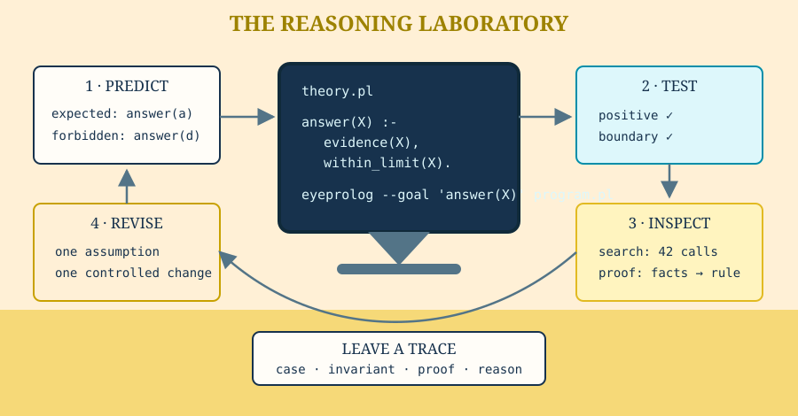
  <figcaption>A theory becomes dependable through a repeated laboratory cycle: predict, test, inspect the search and proof, then revise one assumption at a time.</figcaption>
</figure>

This Part adds no language features. It is about keeping a theory correct
while it changes: testing it, debugging it, and recognizing the designs that
work.

## 31. Testing a theory

A unit test usually compares one returned value with one expected value. A
relation needs more: a call can have several answers, none, duplicates, or
several useful modes. Its contract covers the answer set, the absence of
forbidden answers, the shape of witnesses, and the finiteness of the search.

<figure>
  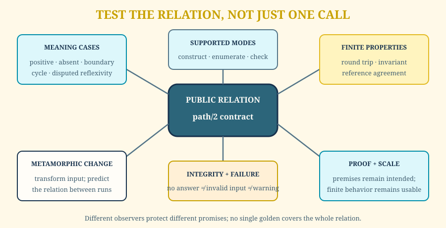
  <figcaption>A relational contract has several observable surfaces; examples, mode tests, bounded properties, metamorphic checks, integrity cases, proofs, and scale checks protect different promises.</figcaption>
</figure>

### Start with a table in domain language

| Case | Given | Question | Expected | Why |
| --- | --- | --- | --- | --- |
| direct | `edge(a,b)` | path from `a` to `b`? | yes | base clause |
| composed | `a→b→c` | path from `a` to `c`? | yes | recursive clause |
| absent | disconnected `d` | path from `a` to `d`? | no | false positive |
| cycle | `c→a` | all destinations from `a`? | finite set | tabling or visited set |
| reflexive | no loop edge | path from `a` to `a`? | design choice | relation boundary |

The last row matters most. Many bugs are not coding mistakes but meanings
nobody settled. Does a path need at least one edge? No test framework can
decide that for you.

### Positive and negative observers

```eyeprolog
edge(a, b).
edge(b, c).

path(X, Y) :- edge(X, Y).
path(X, Z) :- edge(X, Y), path(Y, Z).

no_path_to_d :-
  \+ path(a, d).
```

```sh
eyeprolog --goal 'path(a, X)' --goal no_path_to_d program.pl
```

```text
path(a, b).
path(a, c).
no_path_to_d.
```

The first goal pins down the answer set; the second turns an expected absence
into a visible success. Both are ground or finite questions. `no_path_to_d`
does not assert that classical negation holds; it records that this finite
theory derives no such path. For a small example, the golden output file is
the executable specification of the expected answers.

### Test every supported mode

```sh
eyeprolog --goal 'append([a, b], [c], Whole)' program.pl
eyeprolog --goal 'append(Prefix, Suffix, [a, b])' program.pl
```

The first call builds one list; the second must enumerate three splits.
Testing only the first misses a regression in relational generality. Testing
the fully open call asks for an infinite relation and proves little. For each
public predicate, record its principal mode, any secondary modes, meaningful
modes that are deliberately unsupported, and which calls must be finite.

### Properties over finite domains

Examples test points. A bounded property tests every point in a declared
range:

```eyeprolog
:- use_module(library(between), [between/3]).

double_is_even(N) :-
  (0 =:= (N + N) mod 2).

bounded_double_counterexample(N) :-
  between(-100, 100, N),
  \+ double_is_even(N).

bounded_double_law :-
  \+ bounded_double_counterexample(_).
```

That is exhaustive for 201 integers and nothing more; the name says so.
Useful bounded properties include round trips (parse then render), idempotence
(normalizing twice equals once), symmetry, invariants on every generated
state, and agreement between a simple reference relation and an optimized
one.

### Metamorphic tests

When the right answer is hard to list, a controlled change may still have a
predictable effect. Adding an isolated vertex should not change existing
reachability. Scaling every edge cost by a positive constant should not change
the cheapest route. Reordering source facts should not change the answer set,
only its order. These tests check an invariant across runs rather than one
frozen output, which makes them well suited to guarding optimizations.

### Answers, proofs, and integrity

An answer golden asks whether the conclusions changed; a proof golden asks
whether their support changed. A new proof may be welcome after introducing a
clearer helper — or may reveal that a decision now rests on an unintended
fact. Review proof goldens; never regenerate them blindly. Use answer goldens
broadly and proof goldens where provenance is part of the product.

Keep three outcomes distinct:

- an ordinary query with no answer: the goal was not established;
- an integrity query that succeeds: the input violates a forbidden condition;
- a `--warnings` report of unstratified negation: execution proceeds, but the
  program has crossed a semantic and portability boundary.

### A minimum test matrix

| Dimension | Minimum evidence |
| --- | --- |
| Meaning | one positive, one absent, and one boundary case per public relation |
| Modes | every documented mode; a clear rejection for unsupported ones |
| Recursion | base case, multi-step case, cycle, termination argument |
| Search | smallest witness, competing witnesses, ties, empty domain |
| Negation | ground success, ground failure, stratification |
| Aggregation | empty, singleton, duplicates, tie handling |
| Integrity | each invalid state detected; valid input not flagged |
| Proof | one representative derivation with source premises visible |
| Scale | a case large enough to expose indexing or table behavior |

**Exercises.**

1. Build the domain-language test table for `ancestor/2`, including a cycle and
   the disputed reflexive case.
2. Write bounded commutativity and associativity tests for a finite operation
   table. Which is cheaper, and why?
3. Write a metamorphic test for a route planner.
4. Design a test that tells "no answer" apart from "invalid input".

**Checkpoint.** Fill in the test matrix for one public relation and say which
expected outputs should be exact goldens.

## 32. Debugging by meaning, search, and proof

"The query failed" is not a diagnosis. Failure can mean a missing fact, a
variable bound too early, a built-in called outside its mode, a negation that
saw an unintended answer, recursion that never reaches its base case, or a
relation that was misstated from the start. Look through four lenses, in
order:

1. **Meaning:** what should a ground instance say?
2. **Bindings:** what is known before each goal?
3. **Search:** which alternatives are explored, repeated, or pruned?
4. **Proof:** which premises support the answer you got?

<figure>
  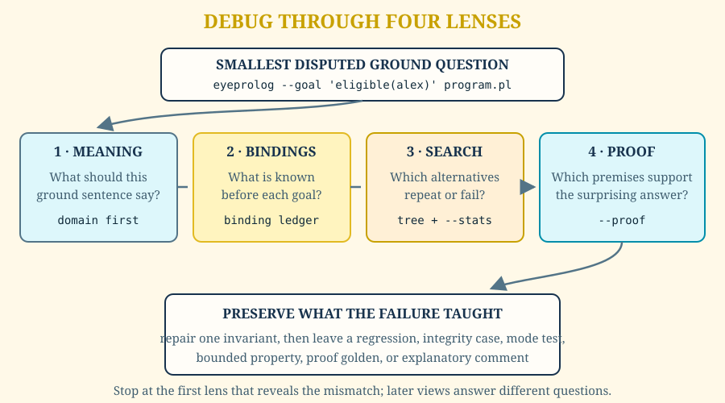
  <figcaption>Each debugging lens answers a different question; begin with meaning, move outward only as needed, and preserve the lesson as an executable check.</figcaption>
</figure>

### Shrink to one ground question

Don't start from an open query that prints hundreds of answers. Name one
conclusion that is missing or wrong, such as `eligible(alex)`, and expand only
the clause meant to prove it. If you can't say what the ground question should
answer, stop debugging code and fix the domain sentence.

### Follow bindings left to right

```eyeprolog
age(alex, 19).

eligible(Person) :-
  (Age >= 18),
  age(Person, Age).
```

```sh
eyeprolog --goal 'eligible(alex)' program.pl
```

```text
eyeprolog: error(instantiation_error)
```

The comparison runs before anything binds `Age`. A binding ledger shows it
immediately:

| Before goal | Goal | Bindings produced |
| --- | --- | --- |
| `Person = alex` | `Age >= 18` | none; `Age` unbound, error |
| — | `age(Person, Age)` | never reached |

Swap the goals so `age/2` binds `Age` first, and the clause works. For longer
bodies, the ledger reveals more than rereading the source. Record structure as
well as values: a variable may be bound to a partial list or a compound term
with open variables inside.

### Symptoms and first moves

- **No answers.** Check the predicate name and arity. Ground one expected
  answer and find a clause whose head matches it. Walk the body with a ledger.
  Check that each arithmetic, string, list, and term built-in has its inputs.
  Check that a negation is not too early and that a base clause is reachable.
- **Too many answers.** Pick the answer that violates the domain sentence and
  read its proof for the first overbroad premise. Look for a missing join —
  two variables where one shared variable was meant.
- **Right answers, wrong order.** Inspect clause and generator order, and any
  `once/1` or tie-breaking that makes order observable.
- **Nontermination.** Name the intended finite domain. Find the recursive call
  and its decreasing measure, or the finite tabled space. Move selective
  generators and ready filters earlier. Look for terms that grow on every call.
- **A surprising proof.** Confirm the answer itself is intended, then find the
  earliest premise that should not be there.

### Compare with a reference

Temporary relations expose intermediate concepts. A stronger version of the
same idea is differential testing: write a deliberately simple reference
relation over a bounded domain and look for disagreement with the optimized
one.

```eyeprolog
:- use_module(library(between), [between/3]).

reference_square(N, S) :-
  between(0, 20, N),
  (S is N * N).

optimized_square(N, S) :-
  between(0, 20, N),
  (S is N * N).

disagreement(N, S) :-
  reference_square(N, S),
  \+ optimized_square(N, S).
```

A full equivalence check needs the other direction as well. Within a finite
domain, this is the best guard you have while transforming a program. Once a
fault is understood, delete temporary helpers or promote them to real domain
concepts; `debug2/3` does not belong in a theory whose proofs people read.

### Read statistics as questions

`--stats` reports work, not meaning. Many solutions may be necessary or may
point to a generator that should be constrained. Many table hits show reuse;
many distinct table entries may show an argument that keeps calls from
sharing. On the Node CLI it also reports heap use, the amount counted against
the memory guard, resident-set size, and the soft and hard memory ceilings,
even when the run ends in a Prolog error.

`--stats` summarizes at the end. For a long or deliberately non-terminating
computation, call the EyeProlog extension `statistics/0` where a live snapshot
helps, as in `loop :- work, statistics, loop.` `statistics/2` gives the program
one value, for example `statistics(memory_guard_used_bytes, Used)`; with an
unbound key it enumerates all of them, and an unknown key raises a
`domain_error` for `statistics_key`. Neither is available under
`--iso-strict`.

Compare statistics only across runs with the same query, data, and answer
contract. A faster program that loses answers is not an optimization.

### Keep the lesson

Every repaired defect should leave something behind: a new positive or
negative case, an integrity regression, a documented mode, a bounded property,
a proof golden, or a comment stating the invariant that was violated.
Otherwise the repository remembers the fix and forgets the reason.

**Exercises.**

1. Introduce a missing join into a two-relation rule, then use the proof of a
   false positive to find it.
2. Write a term-growing recursive rule and explain why tabling cannot make its
   answer space finite.
3. Compare `--stats` before and after moving an invariant calculation out of a
   recursion.

**Checkpoint.** Turn one defect into a regression: the smallest disputed
ground question, the expected answer, the first wrong binding or search
choice, the repaired invariant, and the test that fails if it returns.

## 33. A pattern catalog for reasoning

A pattern is a recurring arrangement of meaning, representation, and control
that solves a named problem. Choose one when its problem is present, not
because the code looks similar.

<figure>
  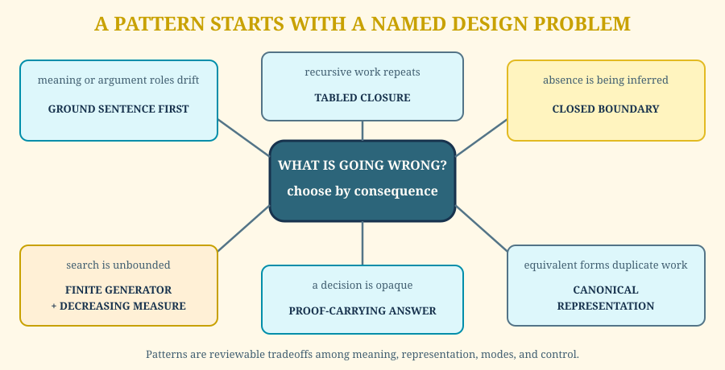
  <figcaption>Choose a pattern by the design problem and its consequence, not by superficial code shape; each pattern coordinates meaning, representation, modes, and control.</figcaption>
</figure>

**1. Ground sentence first.** When argument order and meaning start to drift,
write one representative ground fact and read it aloud before adding
variables. `assigned_badge(alex, badge_17).` makes argument roles reviewable.

**2. Normalize at the boundary.** Keep source spellings, aliases, and units out
of domain rules. Retain the source facts, derive one canonical vocabulary, and
make the core rules depend only on it:

```eyeprolog
:- use_module(library(strings)).

source_role(person_7, 'Doctor').

canonical_role(Person, clinician) :-
  source_role(Person, Text),
  lowercase(Text, doctor).
```

Adapters can change without touching policy, and proofs still trace back to
the source.

**3. Generate, constrain, describe.** Produce a finite candidate, apply the
cheapest selective constraints in dependency order, then build the witness or
reason:

```eyeprolog
:- use_module(library(between), [between/3]).

chosen_pair(pair(X, Y), reason(sum_is_ten)) :-
  between(0, 10, X),
  between(X, 10, Y),
  (10 is X + Y).
```

**4. Carry the witness.** A yes/no relation that did the work of finding a
path should return the path. Add an argument for the path, assignment,
schedule, or evidence (see `path/3` in Chapter 4). Witness size and duplicate
witnesses then become explicit design questions.

**5. Bound absence.** Bind the subject and the finite scope before `\+/1`, and
give the closed-world step one named home:

```eyeprolog
unregistered(Person) :-
  person(Person),
  \+ registered(Person).
```

This is not an explicit fact that the person is unregistered; the name and
the bound domain make that visible.

**6. Explicit state transition.** Instead of mutable state, relate an old
state, an action, and a new state:

```eyeprolog
step(state(Room, outside), enter(Room), state(Room, inside)).
```

Histories become ordinary lists and invariants become queries over states.

**7. Fixed-point closure.** For reachability, inheritance, and dataflow, state
the positive recursive relation directly and table it. Termination then rests
on a finite call and answer space, not on pretending the graph is acyclic.

```eyeprolog
:- table depends/2.

depends(X, Y) :- direct_dependency(X, Y).
depends(X, Z) :- direct_dependency(X, Y), depends(Y, Z).
```

**8. Proof façade.** When helper clauses make proofs unreadable, introduce
named domain concepts and a small public decision relation whose premises
read as reasons:

```eyeprolog
within_limit(Device) :-
  reading(Device, Value),
  maximum(Max),
  (Value =< Max).

status(Device, safe) :-
  within_limit(Device).
```

**9. Integrity before inference.** Encode forbidden combinations as ordinary
relations with diagnostic arguments, so a caller can list every defect before
asking for decisions:

```eyeprolog
invalid_badge_assignment(Badge, PersonA, PersonB) :-
  assigned_badge(PersonA, Badge),
  assigned_badge(PersonB, Badge),
  (PersonA \= PersonB).
```

**10. Version the evidence.** Keep the source snapshot, theory version, and
numeric assumptions beside the proof, so an old decision can be reconstructed
under the theory that made it rather than rerun under today's:

```eyeprolog
theory_version("2026-07-24").
source_snapshot("telemetry-0042").
numeric_model(ieee_754_double).
```

### Anti-patterns

- **The unbounded open query:** every argument free over an infinite
  relation.
- **The premature test:** a mode-sensitive built-in or negation before the
  goals that bind its inputs.
- **The accidental Cartesian product:** two variables for what should be one
  entity.
- **The mega-clause:** normalization, search, policy, and explanation in one
  rule with no named concepts.
- **The witness eraser:** a relation that finds a path and returns only `yes`.
- **The silent closed world:** failure used as falsity with no stated scope.
- **The proof-hostile helper:** names like `step3/2` or `tmp/4`.
- **Optimization by answer loss:** `once/1` or early aggregation that changes
  the answer contract to win a benchmark.
- **The timeless decision:** conclusions with no record of the theory version
  that produced them.

Patterns compose; a decision service typically normalizes at the boundary,
generates and constrains, carries witnesses, presents a proof façade, checks
integrity, and versions its evidence. A three-fact example needs none of
that. Use the smallest set of patterns the problem actually calls for.

**Exercises.**

1. Find three patterns and two anti-patterns in one of the large examples.
2. Refactor an opaque rule into boundary, concept, and decision layers, and
   compare the proofs before and after.
3. Write a versioned evidence envelope for the Chapter 25 decision service.

**Checkpoint.** For one real theory, pick the smallest set of patterns that
solves its problem and name the pressure that justifies each.

# Part VIII — Standard Prolog in practice

<figure>
  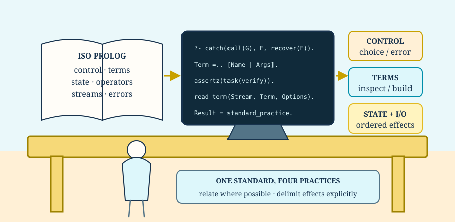
  <figcaption>Relational term operations stay at the center; control, mutable state, and I/O enter at explicit boundaries.</figcaption>
</figure>

Libraries, language tools and programs that touch files need more than the
relational core: control, reflection, state, operators and streams. Term
inspection and atomic conversion are still relations. Cut, database updates
and stream operations are not, so keep them at named boundaries.

`--iso-strict` on the CLI, or `isoStrict: true` in the JavaScript API, limits
the language to ISO/IEC 13211-1:1995 plus Technical Corrigenda 1–3. Both modes
use the same processor character set: Unicode scalar values U+0000..U+10FFFF
without surrogates, collated by scalar value. Isolated and error cases live in
`test/conformance/cases/iso/`.

## 34. Control, exceptions, and grouped solutions

```eyeprolog
travel_status(From, To, Status) :-
  (route(From, To) -> Status = connected ; Status = disconnected).
```

<figure>
  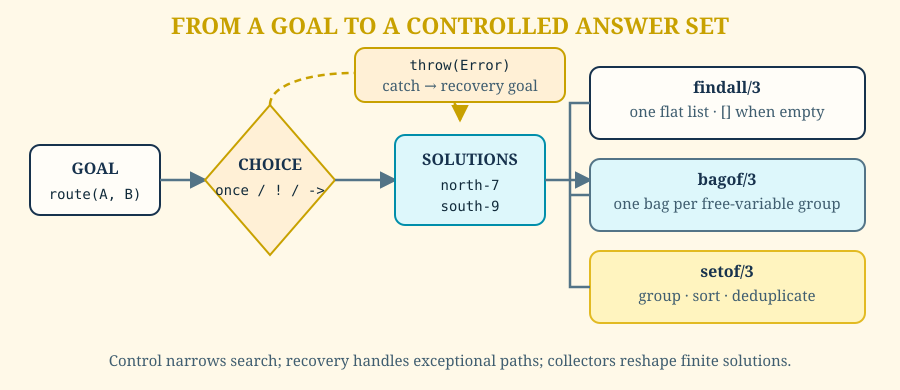
  <figcaption>Control narrows or redirects search; collection gives a finite solution stream a list or grouping shape.</figcaption>
</figure>

If-then-else commits to the first solution of its condition. `call/1` runs a
goal held in a variable, and `call/2-8` add arguments to a closure; a
meta-call is its own cut boundary. `once(Goal)` keeps one solution of `Goal`,
while cut discards every alternative created since the current predicate was
entered. A cut inside a predicate called from one branch of `Left ; Right`
stays local to that predicate, so if the branch later fails, `Right` is still
tried. Keep cuts next to the choice they document, and compare the full answer
set before and after adding one.

### Exceptions

A missing route is an ordinary negative answer and should fail. A call the
caller cannot interpret should throw:

```eyeprolog
require_route(From, To) :-
  (route(From, To) -> true ; throw(no_route(From, To))).

checked_route(From, To, Result) :-
  catch(
    (require_route(From, To), Result = accepted),
    no_route(From, To),
    Result = rejected
  ).
```

The catcher is unified with the thrown term; on a match the recovery goal runs
in the environment of the `catch/3` call, and other exceptions continue
outward. ISO instantiation, type, domain, permission, representation and
evaluation errors travel the same way.

Normal mode also has `call_cleanup(Goal, Cleanup)` and
`setup_call_cleanup(Setup, Goal, Cleanup)`, which `--iso-strict` omits.
`Cleanup` runs exactly once, whether the goal finishes deterministically, is
exhausted, is cut, is abandoned at the top level or throws. It is installed
only after `Setup` succeeds. After a cut it sees the goal's bindings; after an
exception, only those of `Setup`. If a deterministic goal runs `Cleanup`
before answering, the cleanup's bindings are part of the answer. Cleanup
failure is ignored, an exception already in flight beats a cleanup exception,
and nested cleanups run inside-out.

### Grouped solutions

`findall/3` returns one list. `bagof/3` returns one list per binding of the
goal's free variables and fails when there are none; `setof/3` also sorts and
removes duplicates. `Var^Goal` hides a variable from grouping:

```eyeprolog
regional_total(Region, Total) :-
  bagof(Amount, Seller^sale(Region, Seller, Amount), Amounts),
  sum_amounts(Amounts, Total).
```

This gives one total per region. Without `Seller^` it would give one per
region and seller, which is the usual reason a collection arrives as several
answers instead of one.

### Integer arithmetic

Integer division has two roundings. For `-7` and `3`, `//` truncates to `-2`
and `div` floors to `-3`; `mod` gives `2` and `rem` gives `-1`. Bitwise
operations and shifts require integers.

The examples
[`iso-control-and-errors.pl`](https://github.com/eyereasoner/eyeprolog/blob/main/examples/iso-control-and-errors.pl),
[`iso-grouped-solutions.pl`](https://github.com/eyereasoner/eyeprolog/blob/main/examples/iso-grouped-solutions.pl)
and
[`iso-integer-arithmetic.pl`](https://github.com/eyereasoner/eyeprolog/blob/main/examples/iso-integer-arithmetic.pl)
run each of these side by side.

**Checkpoint.** Name one absence in a route planner that should fail and one
broken precondition that should throw.

## 35. Reflective terms and atomic conversion

When the shape of a term is itself the input, as in walkers, schema checkers
and interpreters, reflect on it:

```eyeprolog
term_shape(Term, shape(Name, Arity, Arguments)) :-
  functor(Term, Name, Arity),
  (Term =.. [Name | Arguments]).
```

<figure>
  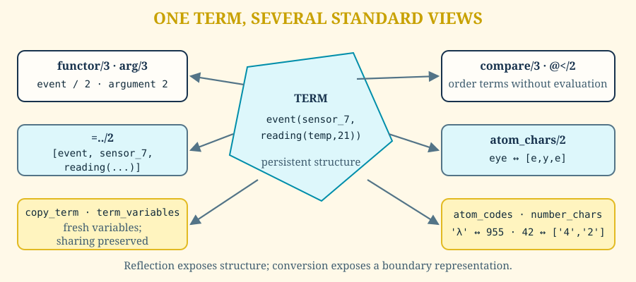
  <figcaption>Reflection does not change a term; it exposes its structure, ordering, or spelling.</figcaption>
</figure>

`functor/3` relates a term to its name and arity, `arg/3` picks a one-based
argument, and `=../2` ("univ") relates a term to the list of its functor and
arguments. Run backwards, they build terms. A missing name, negative arity or
partial list raises an error instead of failing quietly.

`copy_term/2` renames variables apart and keeps their sharing.
`term_variables/2` lists distinct variables in order of first occurrence.
`==/2` and `\==/2` test identity without binding; `unify_with_occurs_check/2`
rejects cyclic bindings explicitly. `compare/3` and `@<`, `@=<`, `@>`, `@>=`
order terms without evaluating them: `3 + 4 < 8` compares numbers, and
`3 + 4 @< 8` compares syntax.

At text boundaries, `atom_concat/3` joins or splits atoms, `sub_atom/5`
relates an atom to a fragment and its position, `atom_chars/2`,
`atom_codes/2` and `char_code/2` convert to characters or codes, and
`number_chars/2` and `number_codes/2` parse and render numbers. `'λ'` is an
atom; with the default flag, `"λ"` is the list `['λ']`.

See
[`iso-reflective-terms.pl`](https://github.com/eyereasoner/eyeprolog/blob/main/examples/iso-reflective-terms.pl)
and
[`iso-atomic-conversion.pl`](https://github.com/eyereasoner/eyeprolog/blob/main/examples/iso-atomic-conversion.pl),
which lists every three-character sub-atom of `eyeprolog`.

**Checkpoint.** Given `pair(X, X)`, predict `term_variables/2` before and
after `copy_term/2`.

## 36. Dynamic predicates, directives, and operators

```eyeprolog
:- dynamic(task/2).

prepare_queue :-
  asserta(task(check_power, urgent)),
  assertz(task(check_network, normal)).
```

<figure>
  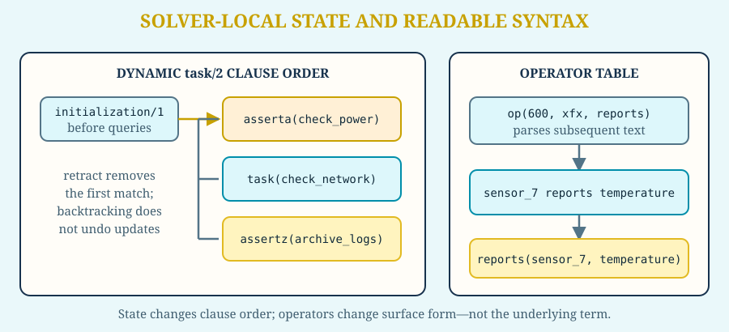
  <figcaption>Database updates change solver-local clause order; operator declarations change how later source is parsed.</figcaption>
</figure>

`asserta/1` adds a clause at the front and `assertz/1` at the end.
`retract/1` removes the first matching clause and retries for later ones, and
`abolish/1` removes a dynamic procedure. `clause/2` and `current_predicate/1`
inspect the program. Changing a static or built-in procedure raises a
permission error.

Backtracking does not undo updates, so later goals see the changed database.
Each update invalidates cached tabled and ground-chain answers, and a rule
change refreshes the recursion and negation analysis. Run setup from an
initialization goal so the state does not depend on query order:

```eyeprolog
:- initialization(prepare_queue).
```

Initialization goals run after the program is prepared and before host
queries. `include/1` expands a file in place, and `ensure_loaded/1` loads it at
most once. `multifile/1` and `discontiguous/1` permit clause layouts. Flags
and character conversions are per solver.

### Operators

```eyeprolog
:- op(600, xfx, reports).

sensor_7 reports temperature.
```

The fact is exactly `reports(sensor_7, temperature)`. Priority sets binding
strength, and `fx`, `fy`, `xf`, `yf`, `xfx`, `xfy` and `yfx` set position and
associativity. A declaration affects only later text; `current_op/3`
inspects the table and `op(0, Specifier, Name)` removes an entry.

An operator atom may appear bare as an argument, list element, or the whole
content of parentheses or braces: `current_op(P, S, :-)`, `[:-,-]`, `(+)` and
`{*}` are all valid. `writeq/1` follows the same rule, so `writeq({*})`
writes `{*}` and `writeq(f(;,'|',';;'))` writes `f(;,'|',';;')`. The bar stays
quoted because an unquoted `|` is a list separator.

ISO declares `?-` as prefix operator 1200 `fx`. Because EyeProlog's embedded
quads allow `Label ?- Query.`, it also declares `?-` as 1200 `xfx`, and
`current_op(P, S, ?-)` returns both. In normal mode a quad is recognized from
the parsed `?-/2` term, so `?-(Label, Query).` and other spellings of the same
term work too. The label is an ordinary term and must be ground; a non-ground
label is reported as `BAD_ID` and later quads still run. Under
`--iso-strict`, `?-/2` is plain term syntax.

See
[`iso-dynamic-database.pl`](https://github.com/eyereasoner/eyeprolog/blob/main/examples/iso-dynamic-database.pl)
and
[`iso-operators.pl`](https://github.com/eyereasoner/eyeprolog/blob/main/examples/iso-operators.pl).

**Checkpoint.** Give the clause order after one `asserta/1` and two
`assertz/1` calls.

## 37. Streams and term I/O

To write a term another Prolog can read back, open a text stream, write
canonical syntax, end with a period and always close:

```eyeprolog
write_event(Path, Event) :-
  setup_call_cleanup(
    open(Path, write, Stream, [type(text)]),
    ( write_canonical(Stream, Event),
      put_char(Stream, '.'),
      nl(Stream)
    ),
    close(Stream)
  ).
```

<figure>
  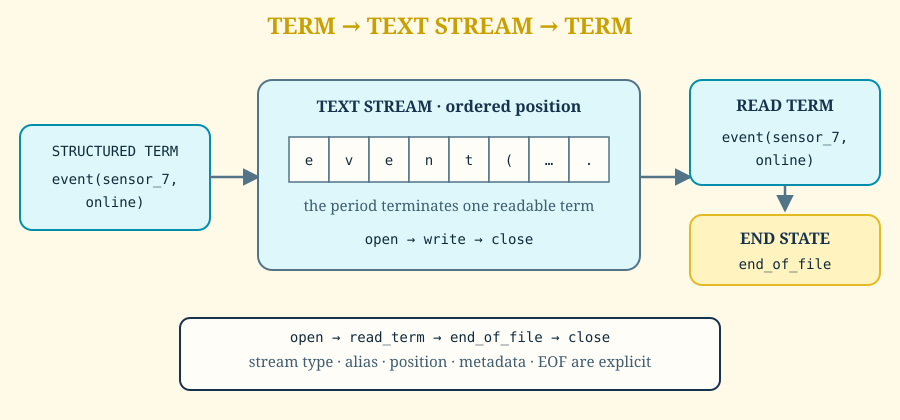
  <figcaption>Open the right stream type, write readable syntax with a period, read in order, observe the end, and close.</figcaption>
</figure>

`open/4` adds options to `open/3`: type, alias, repositioning and end-of-file
action. In strict mode, which lacks `setup_call_cleanup/3`, close streams on
every path yourself.

`write/1-2` writes readable syntax, `writeq/1-2` adds quotes where needed, and
`write_canonical/1-2` ignores operators. Output uses only the separators the
syntax needs: `writeq([a,b])` writes `[a,b]` and `writeq(1+2)` writes `1+2`,
but `a+ -b` keeps its space so the tokens do not merge. A graphic atom with a
period, such as `./*`, needs no quotes.

`write_term/2-3` takes `quoted/1`, `ignore_ops/1`, `numbervars/1` and
`variable_names/1`. Normal mode adds two options that strict mode rejects:

- `double_quotes(true)` writes character and code lists as `"text"`. A list
  whose last segment has two or more characters is written `[A|"bcdef"]`, and
  a partial list `[a,b|Tail]` as `"ab"||Tail`. The option combines with
  `ignore_ops(true)`, so
  `write_term(f("ab",a+b),[quoted(true),ignore_ops(true),double_quotes(true)])`
  writes `f("ab",+(a,b))`.
- `spacing(true)` adds conventional spaces around operators, so
  `write_term(1+1,[spacing(true)])` writes `1 + 1`; `spacing(false)`, the
  default, writes `1+1`. The REPL always uses minimal spacing.

`get_char`, `peek_char`, `put_char` and their code forms work on text streams,
and the byte predicates on binary streams. Mixing them raises a permission
error instead of guessing an encoding. `read/1-2` reads the next term, and
`read_term/2-3` can also return its variables, their source names and its
singletons. Every read makes fresh variables: an `X` in one read term shares
nothing with an `X` anywhere else. `stream_property/2` reports a stream's mode,
type, alias, position and end state, and `set_input/1` and `set_output/1`
change the defaults.

With `eof_action(eof_code)`, reading at the end returns `end_of_file` for terms
and characters and `-1` for codes and bytes; `at_end_of_stream/1` tests for
it.
[`iso-term-io.pl`](https://github.com/eyereasoner/eyeprolog/blob/main/examples/iso-term-io.pl)
writes a fixture under `/tmp`, reads it back and observes the end of the
stream.

**Checkpoint.** Why does `write_event/2` belong outside the relation that
decides what an event means?

### Historical note: the practical language becomes portable

In the late 1970s and 1980s Prolog spread from Marseille into several
implementation traditions. The Edinburgh and DECsystem-10 lineage settled the
practical vocabulary of ordered control, term inspection, dynamic clauses,
operators and streams, and the differences between systems made portability a
lasting concern. ISO/IEC 13211-1:1995 gave that practice a common core, against
which later constraints, modules, tabling and coroutining could be named as
extensions.

# Part IX — Reference as practice

Enter the reference with a question. Chapter 38 says what source means,
Chapter 39 helps you choose a predicate, and Chapter 40 turns a file into
answers and proofs and points to further examples. Chapter 41 states the
standards and implementation boundaries, and Chapter 42 collects notes and
vocabulary. Look things up as needed; there is no need to read them straight
through.

## 38. Language and ISO profile

The strict-core baseline is ISO/IEC 13211-1:1995, as corrected by Technical
Corrigenda 1:2007, 2:2012 and 3:2017. The post-N289 WG17/STC working draft is
used to find defects, not treated as an unpublished fourth Corrigendum.
`test/conformance/STC-DRAFT-STATUS.md` tracks the 2026-08-23 draft through
items #73-#76. Where a proposal changes published semantics, such as #75's
conditional power-underflow proposal, strict mode keeps the published
baseline until the change is standardized or adopted as a compatibility
extension.

Normal EyeProlog adds a module interface aligned with later WG17 module
amendment work and a definite clause grammar profile following ISO/IEC TS
13211-3. The requirements clarified by the 2013 Part 2 amendment have their
own executable coverage ledger. The rest of Part 2 and the Part 3 profile are
documented and tested compatibility surfaces, not clause-by-clause
certifications.

### Source text

Normal-mode source is UTF-8. `%` starts a line comment and `/* ... */` a block
comment. Plain atoms begin with a lowercase ASCII letter; variables begin with
an uppercase letter or underscore, and each bare `_` is fresh. Single quotes
delimit quoted atoms, and double quotes use ISO double-quoted-list notation.
Integers, decimals, scientific notation, binary, octal and hexadecimal
integers, and character-code constants are accepted. Normal mode also accepts
digit-separated integers such as `1_000` and `0xCA_FE` (layout may follow the
underscore) and the Trealla-compatible `"text"||Tail` splice for `chars` and
`codes` lists. Strict ISO mode accepts neither extension.

The processor character set is the same in normal and `--iso-strict` modes,
because Part 1 leaves it implementation defined. EyeProlog's PCS (processor
character set) is the Unicode scalar repertoire. Printable ASCII keeps the
Part 1 lexical classes. Unicode letters extend alphanumeric names, Unicode
white space is layout, and the remaining non-ASCII symbols and punctuation are
extended graphic characters. Character codes and collation values are the
Unicode scalar integers. Quote any atom whose spelling should not depend on an
extended lexical class:

```eyeprolog
city('München').
message("café").
```

Inside a quoted atom, a single quote is doubled: `'don''t'`. Escapes follow
the ISO quoted-character grammar:

- the symbolic control escapes are `\a`, `\b`, `\r`, `\f`, `\t`, `\n` and
  `\v`;
- backslash, single quote, double quote and back quote may follow a backslash;
- octal and hexadecimal escapes end with a backslash, so `'\7\'` and `'\x7\'`
  both denote the alert character;
- `\c`, `\d`, `\e`, `\u`, `\.` and `\ ` are not ISO escapes and are syntax
  errors.

A literal layout character other than space, such as a tab or newline, is not
allowed inside quotes. A quoted token crosses a line only through a
continuation escape: a backslash followed directly by the newline, which adds
no character. NUL is written `'\0\'`. `8` and `9` are not octal digits, so
`'\8\'` is a syntax error. `writeq/1` writes other non-symbolic control
characters as octal escapes; ESC is `'\33\'`. Double-quoted lists use the
same rules. Doubling the active delimiter works in both quoted forms, so `""`
inside double quotes is one double-quote character. Whitespace between tokens
is insignificant.

Graphic tokens use the characters `#$&*+-./<=>?@^~\`; `!` and `;` are solo
atoms. A colon is the Part 2 module qualification operator in `Module:Goal`.
Normal mode predeclares it; `--iso-strict` does not, since it is not in the
Part 1 operator table. Quote an atom whose name contains a colon. Unquoted
angle-bracket IRIs are not syntax.

`/*` opens a block comment only at the start of a token; inside a graphic
token the slash and star are atom characters. Graphic tokens are formed
maximally before a period can count as the end of a clause. So `*.` or `./*.`
typed at the prompt is not yet a complete term: the period belongs to the
atom, and the reader waits for a separate full stop. `./*. .` reads the atom
`./*.` and takes the second period as the terminator.

### Grammar

Below, `{ x }` means zero or more repetitions of `x`, `[ x ]` means optional
`x`, and parentheses group alternatives. These marks are not EyeProlog source
characters.

```text
program             ::= { clause }
clause              ::= head "."
                      | head ":-" goal-list "."
head                ::= term
goal-list           ::= term { "," term }
term                ::= variable | atom-constant | double-quoted-list | number
                      | compound | list | curly-term | parenthesized-term
compound            ::= atom-constant "(" term { "," term } ")"
list                ::= "[" "]"
                      | "[" term { "," term } [ "|" term ] "]"
double-quoted-list  ::= '"' { quoted-character } '"'
curly-term          ::= "{}" | "{" term "}"
parenthesized-term  ::= "(" term [ "," term { "," term } ] ")"
variable            ::= "_"
                      | variable-start { name-continue }
atom-constant       ::= plain-atom | quoted-atom | graphic-atom
plain-atom          ::= lowercase-letter { name-continue }
number              ::= [ "-" ] digits [ "." digits ] [ exponent ]
exponent            ::= ( "e" | "E" ) [ "+" | "-" ] digits
variable-start      ::= uppercase-letter | "_"
name-continue       ::= uppercase-letter | lowercase-letter | digit | "_"
```

Zero-arity compounds such as `ready()` are not supported; write `ready`. Every
clause ends in a period. The initial operator table contains these operators,
all read as ordinary compound terms:

- prefix: ISO `?-`, `\+`, unary `+`, unary `-` and `\`;
- control: `,`, `;` and `->`;
- normal Part 2 module profile: `:` at priority 600 (`xfy`) and
  `meta_predicate` at priority 1150 (`fx`), so the amendment's spelling
  `:- meta_predicate run(:).` parses directly; `--iso-strict` does not
  predeclare these;
- quad syntax extension: `?-` is also a priority-1200 `xfx` operator, so a
  label may precede a quad query;
- grammar rules: `-->` and the Part 3 alternative `|`;
- unification and comparison: `=`, `\=`, `==`, `\==`, `@<`, `@=<`, `@>`,
  `@>=`, `is`, `=:=`, `=\=`, `<`, `=<`, `>` and `>=`;
- arithmetic: `+`, `-`, `*`, `/`, `//`, `div`, `mod`, `rem`, `/\`, `\/`,
  `<<`, `>>`, `**` and `^`.

`op/3`, as a directive or a call, defines or removes prefix, infix and postfix
operators with the ISO specifiers `fx`, `fy`, `xf`, `yf`, `xfx`, `xfy` and
`yfx`. Variables cannot stand in functor or predicate position. Parentheses
around one term denote that term; around two or more comma-separated terms
they build a right-associated `','/2` term, which is conjunction in goal
position and plain data elsewhere.

### Meaning and execution

The pure definite-clause fragment has a Herbrand reading: ground terms denote
themselves, predicates denote sets of ground atomic formulas, variables have
clause scope, and unification is structural. Unification is first-order
finite-tree unification with an occurs check: binding a variable to a term
that contains it fails.

An **atom constant** such as `pat` is a term. An **atomic formula** such as
`parent(pat, jan)` is a proposition that may be a fact, rule head or goal.
Nested inside another term, the same text is compound data; context decides
the role. Predicate identity includes arity, so `edge/2` and `edge/3` are
different predicates.

Execution is goal-directed, not bottom-up saturation. Body goals normally run
left to right, though the solver may run a ready deterministic built-in early
as a pure filter. Ordinary user-defined calls,
including recursive calls, use depth-first resolution unless the source
explicitly declares `:- table p/n.`. An explicitly tabled grammar invoked
through `phrase/2-3` gets a separate invocation-keyed table scope, so tables are
not retained across unrelated input sequences. `\+/1` is negation as failure,
not classical negation; the separate `tnot/1` extension provides well-founded
semantics for eligible finite Datalog components.

EyeProlog supports cut, operator declarations, dynamic database updates,
grouped solutions, exceptions, flags, initialization and inclusion directives,
and standard stream and term I/O. Normal mode adds `call_cleanup/2` and
`setup_call_cleanup/3`, which `--iso-strict` excludes, the module
compatibility surface, and a Part 3-oriented DCG profile.

### Module compatibility profile

A module adds one component to predicate identity: module name, predicate name
and arity. The first directive of a module source names the module and its
public predicates:

```text
% colors.pl
:- module(colors, [tone/1]).

tone(blue).
hidden(module_private).
```

Another source imports all exports or selected indicators. An unqualified call
uses a predicate local to the calling module first and then an import, so a
local `hidden/1` stays distinct from the private one in `colors`:

```text
:- use_module('colors.pl', [tone/1]).

hidden(user_local).
answer(Tone, Hidden) :- tone(Tone), hidden(Hidden).
qualified(ok) :- colors:tone(blue).
```

`use_module(library(lists))` and `use_module(library(strings))` resolve the
bundled modules in Node and the browser. Atom designations such as
`'colors.pl'` resolve relative to the importing file in Node. `use_module/1`
imports every export; `use_module/2` imports only the listed indicators, and
an empty list imports nothing when only qualified calls are wanted.
`Module:Goal` selects a module explicitly. Loading a module again has no
effect. Conflicting imports and imports of unexported predicates are errors.

### Part 3-oriented definite clause grammars

A grammar rule `Head --> Body.` becomes an ordinary predicate with two extra
difference-list arguments. A parameterized nonterminal keeps its written
arguments, so `token(Type)//1` is implemented by `token/3`. Nonterminal
indicators can be exported and imported:

```text
:- module(vocabulary, [word//1]).

word(noun) --> [robot] | [scientist].
```

Grammar bodies may use terminal lists, `[]`, sequencing with a comma,
alternatives with `;` or `|`, if-then-else, embedded goals `{Goal}`,
`call//1`, `phrase//1` and `!//0`. A pushback (semicontext) looks ahead by
returning terminals to the remaining sequence:

```eyeprolog
look_ahead(X), [X] --> [X].
```

`phrase(+Body,?Sequence)` accepts or generates a complete sequence.
`phrase(+Body,?Sequence,?Rest)` leaves `Rest` unconsumed and is steadfast in
that argument. A variable body raises `instantiation_error`, and a
non-callable body raises `type_error(callable)`.

EyeProlog performs the optional terminal-sequence checks of the ISO/IEC TS
13211-3 working draft, 8.18.1.3 g and h. It reports
`type_error(list, Culprit)` for an invalid sequence in both arities and for an
invalid remainder in `phrase/3`, including improper lists. Variables, proper
lists and partial lists pass. The check runs before the grammar, so a failing
grammar does not hide the error. Dedicated regressions enforce this choice,
while the portable quads accept both checking and non-checking outcomes.
[`ISO-PART3.md`](test/conformance/ISO-PART3.md) records that the 2023-08-14
working draft specifies `type_error(terminal_sequence, Culprit)` for this
case.

Part 3 leaves `\+//1` and standalone `->//2` implementation dependent.
EyeProlog's `\+ Body` tests from the current state without consuming input,
and `->//2` threads the state produced by the condition into the then-branch.

#### A bidirectional expression grammar

[`dcg-expression-language.pl`](https://github.com/eyereasoner/eyeprolog/blob/main/examples/dcg-expression-language.pl)
parses arithmetic into a syntax tree with correct precedence and left
associativity, using an accumulator instead of left recursion:

```text
expression(AST) -->
  term(First),
  additive_tail(First, AST).

additive_tail(Left, AST) -->
  ['+'], term(Right),
  { Next = add(Left, Right) },
  additive_tail(Next, AST).
additive_tail(AST, AST) --> [].
```

A second grammar prints the tree back to tokens with only the parentheses it
needs, and the checked answers in
[`examples/output/dcg-expression-language.pl`](https://github.com/eyereasoner/eyeprolog/blob/main/examples/output/dcg-expression-language.pl)
confirm the round trip.

#### Deep sequence hand-off

`library(dcgs)` provides `... //0`, which matches any number of elements. It
is not in ISO Part 3. In a grammar such as

```text
a --> ..., epsilon.
epsilon --> [].
```

the remaining sequence is handed from `... //0` to another nonterminal at
every suffix. For a finite compact list, EyeProlog scans iteratively instead
of using one solver depth level per cell, and when the continuation is
provably a zero-width identity such as `epsilon//0` it skips building a
resolution frame per suffix. The list is still traversed. Open or non-compact
inputs, and continuations that consume or constrain the remainder, keep
ordinary behavior, and `phrase/3` still enumerates every remainder. The
inference count of `time/1` covers solver-level inferences, not the scanner's
internal steps.

### Directives and protected built-ins

`false/0` is the ISO always-failing built-in. It is a protected static
procedure, so a source clause with head `false` is rejected, not read as a
directive or integrity constraint.

The standard directives are `dynamic/1`, `multifile/1`, `discontiguous/1`,
`op/3`, `char_conversion/2`, `initialization/1`, `include/1`,
`ensure_loaded/1`, `module/2`, `use_module/1`, `use_module/2`,
`meta_predicate/1` and `set_prolog_flag/2`. Initialization goals run once,
after the program is prepared and before host queries. Included text is
expanded in place, and a repeated `ensure_loaded/1` designation loads once.

Normal output contains only ground query answers, one term and period at a
time. Source facts are not echoed as conclusions, duplicate answers are
suppressed, and answers are not asserted back into the program. Supported
output syntax reads back as EyeProlog input.

#### Explicit tabling and recursion planning

The loader analyzes predicate dependencies and recursion so the solver can
choose indexes and fast paths that preserve meaning. That analysis does
**not** decide tabling. Ordinary predicates, recursive ones included, use
indexed depth-first resolution unless the source declares `:- table p/n.`.

A tabled positive recursive predicate is evaluated through an answer table:
recurring calls consume answers already found, new answers are recorded, and
evaluation continues to a fixed point. For eligible large, finite,
function-free Datalog components, EyeProlog may represent a declared table as
one shared most-general relation or an indexed least model. For other declared
tables it may infer structurally bound input positions to improve reuse. These
choices happen inside an explicit declaration; they never table an undeclared
predicate.

Ordinary `\+/1` remains ISO negation as failure. `tnot/1` requests
well-founded evaluation for eligible finite, range-restricted Datalog
dependencies, and `wfs_truth/2` reports the three-valued state of a ground
callable as `true`, `false` or `undefined`. Strict ISO mode has no `table`,
`tnot/1` or `wfs_truth/2`.

#### Query execution

A host-supplied goal must be callable and may contain constants or variables.
An unbound goal raises `instantiation_error`, and a non-callable goal raises
`type_error(callable)`. A program run without a goal prints no normal answers.
The host:

1. parses all inputs into one program;
2. collects source facts and host-supplied goals;
3. runs initialization goals;
4. solves each supplied goal;
5. keeps only ground answers;
6. drops answers identical to source facts and suppresses duplicates;
7. prints each answer and, only when requested, its proof.

Goal selection changes what the host runs, not what the program means. One
goal's answers are not asserted for later goals, though declared tables may be
reused within the run. For stable output, goals for known predicates are
grouped in the source order of their predicate groups, keeping the supplied
order within a group. Goals for predicates with no group come last.

## 39. Predicate reference

EyeProlog's normal predicate surface has two layers: **129 core registry indicators** and **404 distinct non-ISO library or normal-extension indicators**. Because `phrase/2` and `phrase/3` occur in both layers, their union contains **533 distinct predicate indicators**.

Core predicates need no import. Bundled libraries add relations for collections, constraints, graphs, text, time, cryptography, files, and other domains. The interoperability notes identify the subset shared with Trealla and Scryer, and the alphabetical reference at the end gives one compact contract per indicator.

### Notation and conventions

Call patterns use `+` for an argument that must be sufficiently instantiated,
`-` for a result normally produced by the call, and `?` for an argument that
may be supplied or returned. These are principal modes, not a mode system the
parser enforces. A *semidet* call succeeds at most once; a *nondet* call may
yield more answers on backtracking. Unless stated otherwise, a supplied result
that does not unify simply fails.

Built-in dispatch is authoritative: built-ins cannot be modified through the
dynamic database, and source clauses with the same indicator do not replace
them. `clause/2` and `op/3` are the exceptions: a program that defines a source
predicate with either indicator gets its own clauses. `false/0` is stricter
still and is rejected as a clause head. Portable programs should avoid every
such collision, since other Prolog systems commonly reject it at load time.

### Core registry

The default registry contains the built-ins of EyeProlog's ISO compatibility
profile. Where ISO/IEC 13211-1:1995 defines a predicate, EyeProlog uses its
standard indicator; the registry also includes the later or common
compatibility predicates listed below. Arithmetic is expressed through `is/2`,
not through output arguments on arithmetic predicates. The registry
contains 129 name/arity entries across 100 names.

#### Core registry at a glance

<!-- eyeprolog-core-catalog:start -->
- **Control and exceptions** — `true/0`, `fail/0`, `false/0`, `!/0`, `call/1`, `call/2`, `call/3`, `call/4`, `call/5`, `call/6`, `call/7`, `call/8`, `\+/1`, `once/1`, `repeat/0`, `;/2`, `->/2`, `catch/3`, `throw/1`, `halt/0`, `halt/1`
- **Unification and identity** — `=/2`, `unify_with_occurs_check/2`, `\=/2`, `subsumes_term/2`, `==/2`, `\==/2`
- **Type tests** — `var/1`, `nonvar/1`, `atom/1`, `integer/1`, `float/1`, `number/1`, `atomic/1`, `compound/1`, `callable/1`, `ground/1`, `acyclic_term/1`
- **Term order** — `compare/3`, `@</2`, `@=</2`, `@>/2`, `@>=/2`, `sort/2`, `keysort/2`
- **Term inspection** — `functor/3`, `arg/3`, `=../2`, `copy_term/2`, `term_variables/2`
- **Collection** — `findall/3`, `bagof/3`, `setof/3`
- **Grammar processing** — `phrase/2`, `phrase/3`
- **Database and information** — `clause/2`, `asserta/1`, `assertz/1`, `retract/1`, `retractall/1`, `abolish/1`, `current_predicate/1`
- **Operators, conversion, and flags** — `op/3`, `current_op/3`, `char_conversion/2`, `current_char_conversion/2`, `current_prolog_flag/2`, `set_prolog_flag/2`
- **Atomic terms** — `atom_length/2`, `atom_concat/3`, `sub_atom/5`, `atom_chars/2`, `atom_codes/2`, `char_code/2`, `number_chars/2`, `number_codes/2`
- **Stream control** — `open/3`, `open/4`, `close/1`, `close/2`, `current_input/1`, `current_output/1`, `set_input/1`, `set_output/1`, `flush_output/0`, `flush_output/1`, `stream_property/2`, `set_stream_position/2`, `at_end_of_stream/0`, `at_end_of_stream/1`
- **Character input** — `get_char/1`, `get_char/2`, `peek_char/1`, `peek_char/2`, `get_code/1`, `get_code/2`, `peek_code/1`, `peek_code/2`
- **Character output** — `put_char/1`, `put_char/2`, `put_code/1`, `put_code/2`, `nl/0`, `nl/1`
- **Byte input/output** — `get_byte/1`, `get_byte/2`, `peek_byte/1`, `peek_byte/2`, `put_byte/1`, `put_byte/2`
- **Term input** — `read/1`, `read/2`, `read_term/2`, `read_term/3`
- **Term output** — `write/1`, `write/2`, `writeq/1`, `writeq/2`, `write_canonical/1`, `write_canonical/2`, `write_term/2`, `write_term/3`
- **Arithmetic** — `is/2`, `=:=/2`, `=\=/2`, `</2`, `=</2`, `>/2`, `>=/2`
<!-- eyeprolog-core-catalog:end -->

#### Control, search, and exceptions

- **`true`** — Succeeds once without binding variables.
- **`fail`, `false`** — Always fail. `false/0` is a compatibility alias and is forbidden as a clause head.
- **`!`** — Commits to choices made since entry into the current predicate invocation; it does not erase alternatives of an enclosing caller.
- **`call(+Goal)`** — Calls an atom or compound goal. An unbound argument raises *instantiation_error*; another non-callable term raises *type_error(callable)*.
- **`call(+Closure,?Arg,...)`** — `call/2` through `call/8` append their extra arguments to an atom or compound closure, as specified by Corrigendum 2.
- **`\+(+Goal)`** — Negation as finite failure. Succeeds once when `Goal` has no solution and never exports bindings made while testing it. Bind the variables the test needs first.
- **`once(+Goal)`** — Returns only the first solution of `Goal`, or fails.
- **`repeat`** — Succeeds without limit; normally paired with a test, cut, exception, or `halt/0`.
- **`Left ; Right`** — Enumerates `Left`, then `Right`, restoring the incoming environment between branches. A cut inside a called predicate cannot discard the other branch.
- **`If -> Then`** — Commits to the first solution of `If` and runs `Then`; there is no else branch.
- **`(If -> Then ; Else)`** — Runs `Then` from the first solution of `If`, otherwise `Else`. Alternatives of `If` are discarded.
- **`catch(+Goal,?Catcher,+Recovery)`** — Runs `Goal`; on a matching thrown ball or `PrologError`, unifies it with `Catcher` and calls `Recovery`. Runtime errors appear as *error(Formal,eyeprolog)*.
- **`throw(+Ball)`** — Throws a copy of a nonvariable term. An unbound ball raises `instantiation_error`.
- **`halt`, `halt(+Status)`** — Stops the processor with status `0` or the given integer. The JavaScript API reports the status without terminating its host process.

`;/2` recognizes an `->/2` term on its left and implements ISO if-then-else
commitment. Cuts and committed conditions are control; use ordinary relations
when all alternatives should stay observable.

#### Definite clause grammar processing

- **`phrase(+Body,?Sequence)`** — Parses or generates `Sequence` with a Part 3 grammar body, requiring complete consumption.
- **`phrase(+Body,?Sequence,?Rest)`** — Parses or generates a prefix described by `Body` and unifies `Rest` with the unconsumed remainder. The final unification is delayed so the third argument is steadfast.

Grammar rules are expanded during program preparation, so the solver sees
ordinary predicates with two extra arguments. Grammar bodies passed to
`phrase/2-3` at run time use the same expansion, including module qualification
and the caller module of embedded or meta-called nonterminals.

#### Unification, type tests, and term order

- **`?Left = ?Right`** — Unifies two terms. EyeProlog rejects direct and indirect cyclic bindings.
- **`unify_with_occurs_check(?Left,?Right)`** — Occurs-check-safe unification. Because ordinary unification is already cycle-safe, it succeeds with the same bindings as `=/2`.
- **`?Left \= ?Right`** — Succeeds only when the terms cannot unify at call time. A test, not a delayed disequality.
- **`subsumes_term(+General,+Specific)`** — Tests one-sided unification without binding either argument.
- **`?Left == ?Right`, `?Left \== ?Right`** — Test identity or non-identity without binding. Two distinct unbound variables are not identical.
- **`var(?Term)`, `nonvar(?Term)`** — Test whether the dereferenced term is an unbound variable.
- **`atom(?Term)`, `integer(?Term)`, `float(?Term)`, `number(?Term)`** — Test the scalar category. Integers have arbitrary precision; finite noninteger values are floats.
- **`atomic(?Term)`, `compound(?Term)`, `callable(?Term)`, `ground(?Term)`, `acyclic_term(?Term)`** — Test for an atomic term, a compound, a callable atom or compound, a term without unbound variables, or a finite acyclic term. A default double-quoted value is a list, hence compound unless empty.
- **`compare(?Order,+Left,+Right)`** — Unifies `Order` with `<`, `=`, or `>` by standard term order. A supplied order must be one of those atoms.
- **`Left @< Right`, `Left @=< Right`, `Left @> Right`, `Left @>= Right`** — Compare terms without evaluation or binding. Semidet.
- **`sort(+List,?Sorted)`** — Sorts by standard term order and removes identical duplicates.
- **`keysort(+Pairs,?Sorted)`** — Stably sorts `Key-Value` pairs by key, keeping duplicates.

Standard term order is variables, numbers, atoms, then compounds; compounds
compare by arity, functor, and arguments. Among numbers, floats precede
integers; floats compare by value and integers exactly. ISO leaves the order of
two distinct variables implementation dependent, provided it is stable while a
sort runs. EyeProlog attaches no permanent ordinal to a variable: it ranks
variables in order of first encounter within one comparison, and `sort/2`,
`keysort/2` and `setof/3` share one ranking for the whole operation. No
process-global table of variables is kept, so long-running generators can
create and discard variables without growing host state. Double-quoted source
follows the `double_quotes` flag and never creates an extra scalar category.

#### Term construction and inspection

- **`functor(+Term,?Name,?Arity)`** — Decomposes a term. Scalars have arity zero.
- **`functor(-Term,+Name,+Arity)`** — Constructs a scalar when `Arity` is zero, otherwise a compound with fresh arguments. Arity must be a nonnegative representable integer, and a positive-arity name an atom.
- **`arg(+Index,+Term,?Argument)`** — Selects the one-based argument of a compound. Index zero or beyond the arity fails; a negative index is a domain error.
- **`?Term =.. ?List`** — Converts a term to `[Functor\|Arguments]` or constructs one from a nonempty proper list. A one-item list constructs its atomic item.
- **`copy_term(+Term,-Copy)`** — Copies the term, replacing each distinct unbound variable with a fresh one and preserving sharing.
- **`term_variables(+Term,?Variables)`** — Returns distinct variables in first-occurrence order. A supplied result may be a proper or partial list.

Construction raises `instantiation_error` when neither side supplies the shape.
`=../2` distinguishes an incomplete list (`instantiation_error`) from an
improper one (`type_error(list)`).

#### Solution collection

- **`findall(+Template,+Goal,?Bag)`** — Collects a copy of `Template` for every solution of `Goal`, in solution order. Succeeds with `[]` when there are none; all free variables are existential.
- **`bagof(+Template,+Goal,?Bag)`** — Groups answers by the free variables not in `Template`, yielding one nonempty bag per group, and fails when there is none. Mark variables existential with `^`.
- **`setof(+Template,+Goal,?Set)`** — Groups like `bagof/3`, then sorts each group by term order and removes identical duplicates.

Each collector runs its goal in an isolated inner search that shares the
current program and stream state. Collected terms are copied, so local
variables cannot escape. The bag must be a proper or partial list.

#### Dynamic database and procedure information

- **`clause(+Head,?Body)`** — Enumerates fresh copies of the clauses matching a callable `Head`; facts have body `true`. Only *public* procedures can be inspected. A procedure defined by Prolog text is static unless declared *dynamic/1*; one first created by *assertz/1* or *asserta/1* is dynamic. Inspecting a static user procedure or a built-in raises *permission_error(access,private_procedure)* in every mode, not only under `--iso-strict`, mirroring the *permission_error(modify,static_procedure)* raised by *assertz/1* and *retract/1*. Normal mode also accepts a *public/1* directive and a `default_procedure_access` flag; see below.
- **`asserta(+Clause)`, `assertz(+Clause)`** — Insert a copied clause at the beginning or end of a dynamic predicate. Static and built-in procedures cannot be modified.
- **`retract(+Clause)`** — Removes matching dynamic clauses one at a time on backtracking, under the logical update view captured when the call began. A fact pattern matches facts only.
- **`retractall(+Head)`** — Removes every matching clause, succeeds when none match, and keeps the emptied predicate known as dynamic.
- **`abolish(+Name/+Arity)`** — Removes a dynamic procedure and its clauses. The indicator must hold an atom and a nonnegative representable integer.
- **`current_predicate(?Name/?Arity)`** — Enumerates predicates of the loaded program, including empty dynamic ones, but not registry-only built-ins.

Declare mutable predicates explicitly, including empty ones:

```text
:- dynamic(cache/2).

remember(Key, Value) :- retract(cache(Key, _)), !, assertz(cache(Key, Value)).
remember(Key, Value) :- assertz(cache(Key, Value)).
```

Assertions and retractions invalidate affected tables. Changing a predicate
not declared dynamic raises a permission error instead of silently altering a
static program.

#### Operators, character conversion, and flags

- **`op(+Priority,+Specifier,+NameOrNames)`** — Defines or removes operators in the current program. Priority is `0..1200`; specifiers are `fx`, `fy`, `xf`, `yf`, `xfx`, `xfy`, `yfx`; names are one atom or a proper list. Priority zero removes the definition. `,` and `\|` cannot be modified.
- **`current_op(?Priority,?Specifier,?Name)`** — Enumerates active operator definitions.
- **`char_conversion(+Input,+Output)`** — Installs a one-character conversion. With `char_conversion=on`, later **unquoted** characters in prepared text are converted; quoted characters are not. The same mapping initializes run-time term input. Mapping a character to itself removes its mapping.
- **`current_char_conversion(?Input,?Output)`** — Enumerates installed nonidentity conversions.
- **`current_prolog_flag(?Flag,?Value)`** — Enumerates flags or retrieves one. An unknown bound flag raises *domain_error(prolog_flag)*.
- **`set_prolog_flag(+Flag,+Value)`** — Changes a mutable flag after validating its value. Read-only flags raise a permission error.

- **`bounded`** — **Default:** `false`; **Allowed:** `false`; **Mutable:** no.
- **`integer_rounding_function`** — **Default:** `toward_zero`; **Allowed:** `toward_zero`; **Mutable:** no.
- **`char_conversion`** — **Default:** `on`; **Allowed:** `on`, `off`; **Mutable:** yes.
- **`debug`** — **Default:** `off`; **Allowed:** `on`, `off`; **Mutable:** yes.
- **`max_integer`** — **Default:** no current value because `bounded=false`; **Allowed:** not applicable; **Mutable:** no.
- **`min_integer`** — **Default:** no current value because `bounded=false`; **Allowed:** not applicable; **Mutable:** no.
- **`max_arity`** — **Default:** `unbounded`; **Allowed:** `unbounded`; **Mutable:** no.
- **`unknown`** — **Default:** `error`; **Allowed:** `error`, `fail`, `warning`; **Mutable:** yes.
- **`double_quotes`** — **Default:** `chars`; **Allowed:** `chars`, `codes`, `atom`; **Mutable:** yes.
- **`occurs_check`** — **Default:** `true`; **Allowed:** `true`, `error`; **Mutable:** yes.

Because `bounded=false`, `current_prolog_flag(max_integer, _)` and
`current_prolog_flag(min_integer, _)` fail; EyeProlog does not invent an
`unbounded` sentinel. This is a deliberate choice, not a requirement: ISO
7.11.1.2 and 7.11.1.3 give `max_integer` and `min_integer` an
implementation-defined value unconditionally, so the `bounded` flag constrains
what the value *means* rather than whether it exists. A processor with
unbounded integers has no largest integer to report. See `conformance-report.md`
for the alternative reading. Setting `char_conversion` to `off` disables
conversion for the source text that follows.

Normal and strict ISO mode both default to `unknown=error`. Interactive
`set_prolog_flag/2` changes survive when the REPL consults another file or
imports a module. A program that wants an undefined predicate to fail must opt
in with `set_prolog_flag(unknown, fail)`; the bundled examples that rely on it
do so explicitly.

### Reading static procedures

A procedure defined by Prolog text is static, so `clause/2` refuses it
(ISO 7.5.2, 7.5.3, 8.8.1.3). Declaring it `dynamic` lifts the restriction but
also makes it modifiable, and for a meta-interpreter it means annotating a
program you may not want to edit.

ISO 7.5.3 notes that a `public/1` directive for user-defined procedures would
be an extension. Normal EyeProlog provides it:

```eyeprolog
:- public(elk/1).

elk(X) :- moose(X).

moose(bertha).
```

`clause(elk(bertha), Body)` now succeeds with `Body = moose(bertha)`, while
`moose/1` stays private. A public procedure is still *static*:
`assertz(elk(clara))` raises *permission_error(modify,static_procedure)*. The
directive grants read access only.

To open every user-defined procedure at once, set `default_procedure_access`
to `public`:

```eyeprolog
:- set_prolog_flag(default_procedure_access, public).

solve(true) :- !.
solve((A, B)) :- !, solve(A), solve(B).
solve(H) :- clause(H, Body), solve(Body).

elk(X) :- moose(X).
moose(bertha).
grazes(X) :- elk(X).
```

`solve(grazes(W))` yields `W = bertha` with no declaration on the interpreted
program. The flag changes access, not mutability: procedures remain static,
and built-ins remain private, so `clause(atom(_), _)` still raises
*permission_error(access,private_procedure)*. The values are `private` (the
ISO default) and `public`.

Both are extensions, so strict ISO mode offers neither: `public/1` is rejected
as an implementation-specific directive, and
`current_prolog_flag(default_procedure_access, _)` raises
*domain_error(prolog_flag)*.

The `occurs_check` flag is likewise a normal-mode diagnostic extension, absent
in strict mode; it defaults to `true` and offers `error` to report STO
attempts. Operator and flag directives apply per program, not to global
JavaScript state. The `double_quotes` setting affects subsequent source text,
included files, command-line and API goals, and terms read by `read_term/*`:

```text
% Default: a list of one-character atoms.
chars("ab").                 % chars([a,b])

:- set_prolog_flag(double_quotes, codes).
codes("ab").                 % codes([97,98])

:- set_prolog_flag(double_quotes, atom).
quoted_atom("ab").           % quoted_atom(ab)
```

#### Atomic-term operations and conversions

- **`atom_length(+Atom,?Length)`** — Counts Unicode code points, not UTF-16 units. A supplied length must be a nonnegative integer.
- **`atom_concat(?Prefix,?Suffix,?Whole)`** — Concatenates, removes a supplied prefix or suffix, or enumerates every split when only `Whole` is bound.
- **`sub_atom(+Atom,?Before,?Length,?After,?SubAtom)`** — Enumerates substrings with code-point offsets. Supplied counts must be nonnegative integers.
- **`atom_chars(?Atom,?Chars)`, `atom_codes(?Atom,?Codes)`** — Convert between an atom and a list of one-character atoms or codes. Codes are Unicode scalars; surrogates and values above U+10FFFF are rejected. One side must be instantiated.
- **`char_code(?Character,?Code)`** — Relates a character atom and its Unicode scalar code.
- **`number_chars(?Number,?Chars)`, `number_codes(?Number,?Codes)`** — Convert a finite number to canonical text, or parse a character or code list using number and negative-number syntax, including radix integers, character-code constants, and leading layout. Normal mode also accepts digit separators in integers; strict mode keeps ISO syntax. The input is not a general term: `(0)` is a syntax error. Malformed input raises *syntax_error(number)*.

Conversions accept a partial output list when the atomic input is known, but
constructing an atom or number requires a proper list with no unbound
elements. Layout may precede tokens, including between a minus sign and the
number. So a `%` comment may follow `-` directly, since `%` cannot continue a
graphic token, while `-/**/1` remains a syntax error under the eager token
rule. The apostrophe code is written `0'''` (value 39) and a space `0' `
(value 32); a character-code constant consumes one Unicode scalar, including
non-BMP characters. Trailing material is rejected. Integers convert to
canonical decimal; finite floats use the shortest decimal that round-trips,
always with a fractional part, so `1.0000000000000001` becomes `1.0`.
Non-finite values are rejected. The behavior follows the 74 numbered cases of
Ulrich Neumerkel's `number_chars/2` comparison, including the Corrigendum 2
error-precedence cases; `number_codes/2` shares the parser.

#### Streams and unit I/O

A stream argument is an alias atom or the handle returned by `open/3-4`.
Omitting it selects the current input or output.

- **`open(+Source,+Mode,-Stream)`, `open(+Source,+Mode,-Stream,+Options)`** — Opens an atom path in `read`, `write`, or `append` mode. Options: *type(text or binary)*, *alias(Atom)*, *reposition(true or false)*, *eof_action(error, eof_code, or reset)*.
- **`close(+Stream)`, `close(+Stream,+Options)`** — Closes a nonstandard stream. The only option is *force(true or false)*; standard streams stay available.
- **`current_input(?Stream)`, `current_output(?Stream)`** — Return or test the current input or output.
- **`set_input(+Stream)`, `set_output(+Stream)`** — Select an existing stream of the right direction.
- **`flush_output`, `flush_output(+Stream)`** — Validate and flush an output stream. EyeProlog writes synchronously.
- **`stream_property(?Stream,?Property)`** — Enumerates streams and their properties: *mode/1*, *type/1*, *reposition/1*, *eof_action/1*, *position/1*, *input*, *output*, *end_of_stream/1*, and optional *alias/1* and *file_name/1*.
- **`set_stream_position(+Stream,+Position)`** — Repositions a stream opened with *reposition(true)*. `Position` is a nonnegative integer or *position(Integer)*.
- **`at_end_of_stream`, `at_end_of_stream(+Stream)`** — Succeeds when the input position is at or past the end.
- **`get_char(?Character)`, `get_char(+Stream,?Character)`** — Reads one character; end of input is `end_of_file`.
- **`peek_char(?Character)`, `peek_char(+Stream,?Character)`** — Observes the next character without advancing.
- **`get_code(?Code)`, `get_code(+Stream,?Code)`** — Reads a Unicode scalar code; end of input is `-1`.
- **`peek_code(?Code)`, `peek_code(+Stream,?Code)`** — Observes the next code without advancing.
- **`get_byte(?Byte)`, `get_byte(+Stream,?Byte)`** — Reads one byte from a binary stream; end of input is `-1`.
- **`peek_byte(?Byte)`, `peek_byte(+Stream,?Byte)`** — Observes the next byte without advancing.
- **`put_char(+Character)`, `put_char(+Stream,+Character)`** — Writes one character to a text stream.
- **`put_code(+Code)`, `put_code(+Stream,+Code)`** — Writes one Unicode scalar code to a text stream.
- **`put_byte(+Byte)`, `put_byte(+Stream,+Byte)`** — Writes an integer in `0..255` to a binary stream.
- **`nl`, `nl(+Stream)`** — Writes a newline to a text stream.

Text operations on binary streams, and byte operations on text streams, raise
permission errors. After end of file, `eof_action(error)` rejects another
consuming read, `eof_code` keeps returning the end value, and `reset` starts
again from the beginning. A peek does not mark a stream as past the end.

#### Term input and output

- **`read(?Term)`, `read(+Stream,?Term)`** — Reads one full-stop-terminated term; returns `end_of_file` when none remains.
- **`read_term(?Term,+Options)`, `read_term(+Stream,?Term,+Options)`** — Reads a term with *variables(List)*, *variable_names(Pairs)*, and *singletons(Pairs)*. Unknown options raise *domain_error(read_option)*.
- **`write(+Term)`, `write(+Stream,+Term)`** — Writes operator notation without quoting atoms. Number variables are enabled.
- **`writeq(+Term)`, `writeq(+Stream,+Term)`** — Like `write`, but quotes atoms where needed to read them back.
- **`write_canonical(+Term)`, `write_canonical(+Stream,+Term)`** — Writes quoted functional notation, ignoring operators and *$VAR/1*.
- **`write_term(+Term,+Options)`, `write_term(+Stream,+Term,+Options)`** — Writes with *quoted(true or false)*, *ignore_ops(true or false)*, *numbervars(true or false)*, and *variable_names([Name=Variable,...])*. Normal mode adds *double_quotes(true or false)* and *spacing(true or false)*; `double_quotes(true)` still applies under `ignore_ops(true)`, in any option order.

Term input uses the program's current operators and the same quoted-character
syntax as source text, including backslash-terminated escapes such as `'\7\'`
and `'\x7\'`, for both `read/1-2` and `read_term/2-3`. Character conversions
apply outside quotes when `char_conversion` is `on`. `variable_names/1` and
`singletons/1` omit anonymous variables. Output predicates add no period or
newline; write `.` and call `nl/0` yourself to emit a complete clause.

A standalone number read as a term uses the same scanner as `number_chars/2`,
so every sequence that predicate accepts has the same value when read as a
full-stop-terminated term.

#### Arithmetic expressions

- **`is(?Result,+Expression)`** — Evaluates `Expression` once and unifies the value with `Result`. Evaluation plus unification, not assignment.
- **`Left =:= Right`, `Left =\= Right`** — Evaluate both sides and test numeric equality or inequality. Integer versus float representation alone does not make values unequal.
- **`Left < Right`, `Left =< Right`, `Left > Right`, `Left >= Right`** — Evaluate both sides and compare.

Every variable in an expression must already be bound to a number or an
evaluable expression. Integer operations use arbitrary precision; operations
that need floating point convert their operands to finite JavaScript numbers.

- **Literals and constants** — Integer and finite float literals; `pi` and `e` are float constants.
- **Unary arithmetic** — Unary `+`, unary `-`, and integer bitwise complement `\`.
- **Basic binary arithmetic** — `+`, `-`, and `*` stay integer for integer operands. `/` produces a float and rejects a zero divisor.
- **Exponentiation** — `Base ^ Exponent` stays integer for nonnegative integer operands; Corrigendum 3 requires a float base for most negative integer exponents. `**` is float exponentiation.
- **Integer division** — `//` and `div` require integers and a nonzero divisor. `//` rounds toward zero (see `integer_rounding_function`); `div` rounds down.
- **Integer remainder** — `rem` truncates; `mod` takes the divisor's sign. Both require integers and a nonzero divisor.
- **Bit operations** — Integer `/\`, `\/`, `xor`, `<<`, `>>`, and unary `\`.
- **Numeric normalization** — `abs`, `sign`, and `float`. Integer `abs` and `sign` stay integer.
- **Rounding** — `truncate`, `round`, `ceiling`, and `floor` produce integers.
- **Float decomposition** — `float_integer_part` and `float_fractional_part` take and return floats.
- **Min/max and transcendental functions** — `min`, `max`, `sin`, `cos`, `atan`, `asin`, `acos`, `atan2`, `tan`, `exp`, `log`, and `sqrt`; `pi` is the Corrigendum 2 constant.

Arithmetic comparison evaluates; term-order comparison (`@<` and friends) does
not, and it distinguishes floats from integers. Double-quoted text is compared
as the list or atom selected by `double_quotes`.

#### Errors

ISO built-ins distinguish failure from error. Insufficient instantiation raises
`instantiation_error`, a wrong category `type_error`, an invalid value
`domain_error`, and an arithmetic fault `evaluation_error`. JavaScript
embedders receive these as `PrologError` instances whose message holds the
Prolog error term.

- ***instantiation_error*** — A required callable, stream, number, list, option value, or construction input is unbound.
- ***type_error(Expected,Culprit)*** — A bound value has the wrong category, such as a noninteger index or a non-callable goal.
- ***domain_error(Domain,Culprit)*** — The type is right but the value is outside the domain, such as a bad stream option or operator priority.
- ***representation_error(Flag)*** — A value cannot be represented, such as an invalid Unicode scalar code.
- ***evaluation_error(zero_divisor)*** — Division by zero.
- ***evaluation_error(undefined)*** — Floating-point evaluation produced a non-finite or undefined result.
- ***permission_error(Operation,Permission,Culprit)*** — A static procedure was modified, a stream was used in the wrong mode, or a protected resource was accessed.
- ***existence_error(Object,Culprit)*** — A stream, source sink, or required procedure does not exist.
- ***syntax_error(number)*, *syntax_error(read_term)*** — Number conversion or term parsing failed.

`catch/3` presents a `PrologError` as `error(Formal,eyeprolog)`. `throw/1`
copies its ball before unwinding: bound parts are kept, repeated variables stay
shared within the copy, and unbound variables are fresh relative to the
protected goal and the catcher. The interactive top level shows uncaught errors
in the same `error(Formal,eyeprolog)` form, naming their variables `_A` and so
on rather than reusing query variable names. An unmatched ball continues
outward.

Streams belong to one solver run and are shared by nested calls, exceptions,
and collectors. `user_input` and `user_output` always exist. The JavaScript
`ioOptions.input` and `ioOptions.write` hooks connect the standard streams to
an embedder. File streams are synchronous, so side effects happen in Prolog
execution order.

### Normal-mode extensions

The normal profile adds a few runtime controls outside the isolated ISO
registry, listed separately to keep that boundary visible.

#### Cleanup controls

`call_cleanup/2` and `setup_call_cleanup/3` protect a goal across deterministic completion, exhaustion, cut, top-level abandonment, and exception unwinding, running Cleanup exactly once. `setup_call_cleanup/3` runs Setup once and installs Cleanup only after Setup succeeds. A Cleanup that runs before a deterministic answer contributes its bindings to that answer. Nested cleanups run inside-out. Strict ISO mode provides neither predicate.

### Bundled libraries

EyeProlog exposes **404 distinct non-ISO library and normal-extension predicate
indicators** in addition to the 129 indicators in its isolated ISO profile.
**282 are defined entirely as ordinary Prolog clauses** in focused modules under
`src/lib/`; **122 use host support** for control, attributed variables,
constraints, character conversion, filesystem and OS access, timing,
cryptography, or observability. Together the ISO and library catalogs cover **533 distinct predicate indicators**. A normal-runtime predicate re-exported by
a compatibility module is counted once: `call_cleanup/2` and
`setup_call_cleanup/3` are exported by `library(iso_ext)`, and `time/1` and
`statistics/2` by `library(time)`. `statistics/0`, `tnot/1`, and `wfs_truth/2`
remain normal-runtime extensions outside the library catalog. None of these are
in the strict ISO registry.

The sources are `src/lib/aggregate.pl`, `src/lib/arithmetic.pl`,
`src/lib/assoc.pl`, `src/lib/atts.pl`, `src/lib/between.pl`,
`src/lib/charsio.pl`, `src/lib/clpb.pl`, `src/lib/clpz.pl`,
`src/lib/comparison.pl`, `src/lib/crypto.pl`, `src/lib/dates.pl`, `src/lib/dcgs.pl`,
`src/lib/debug.pl`, `src/lib/dif.pl`, `src/lib/error.pl`,
`src/lib/eyelet.pl`, `src/lib/files.pl`, `src/lib/format.pl`, `src/lib/http.pl`,
`src/lib/freeze.pl`, `src/lib/gensym.pl`, `src/lib/iso_ext.pl`, `src/lib/json.pl`,
`src/lib/lambda.pl`, `src/lib/lists.pl`, `src/lib/ordsets.pl`,
`src/lib/os.pl`, `src/lib/pairs.pl`, `src/lib/pio.pl`, `src/lib/primes.pl`,
`src/lib/prologue.pl`, `src/lib/random.pl`, `src/lib/reif.pl`, `src/lib/si.pl`,
`src/lib/sockets.pl`, `src/lib/strings.pl`, `src/lib/tabling.pl`, `src/lib/terms.pl`,
`src/lib/time.pl`, `src/lib/ugraphs.pl`, `src/lib/uuid.pl`, and
`src/lib/when.pl`. Each declares a same-named module with `module/2`; there is
no catch-all `library(eyeprolog)`. A program imports only the modules it needs,
and `use_module/2` can narrow that to a list of indicators. `library(prologue)`
exposes p.p.1 through p.p.11 of the
[working-draft Prologue](https://www.complang.tuwien.ac.at/ulrich/iso-prolog/prologue)
as a facade over the canonical `lists`, `between`, `iso_ext`, and `freeze`
modules.

`src/standard-library.js` registers the module sources and their host adapters.
When `src/lib/foo.pl` needs a private runtime primitive, it is registered from
`src/foo-host.js`: attributed-variable support lives in `src/atts-host.js`,
cryptography in `src/crypto-host.js`. Pure Prolog libraries have no host file.
Each runtime bridge thus stays with the module that owns its public semantics.
Explicit `use_module/1-2` loads always work; outside strict ISO mode, the
autoloader may also load the canonical owner of any exported `src/lib/`
predicate.

For low-level embedding, the core registry is available through
`createDefaultRegistry()` and `getDefaultRegistry()`, and the stricter Part 1
plus Corrigenda registry through `createStrictIsoRegistry()` and
`getStrictIsoRegistry()`, paired with `isoStrict: true` for a complete
strict-language boundary. Module-local predicate identity keeps private helpers
and same-named predicates in different modules apart.

#### Module catalog

<!-- eyeprolog-library-catalog:start -->

- **`library(aggregate)`** — Aggregation, including Trealla-compatible aggregate templates  
  **Exports:** `sumall/3`, `aggregate_min/5`, `aggregate_max/5`, `aggregate_all/3`, `aggregate/3`
- **`library(arithmetic)`** — Scryer-compatible arithmetic helpers and rational-form conversion  
  **Exports:** `expmod/4`, `lcm/3`, `lsb/2`, `msb/2`, `number_to_rational/2`, `number_to_rational/3`, `popcount/2`, `rational_numerator_denominator/3`
- **`library(assoc)`** — AVL association trees; reused from the shared portable source  
  **Exports:** `empty_assoc/1`, `assoc_to_keys/2`, `assoc_to_list/2`, `assoc_to_values/2`, `del_assoc/4`, `del_max_assoc/4`, `del_min_assoc/4`, `gen_assoc/3`, `get_assoc/3`, `get_assoc/5`, `is_assoc/1`, `list_to_assoc/2`, `map_assoc/2`, `map_assoc/3`, `max_assoc/3`, `min_assoc/3`, `ord_list_to_assoc/2`, `put_assoc/4`
- **`library(atts)`** — Attributed variables  
  **Exports:** `put_atts/2`, `get_atts/2`, `put_attr/3`, `get_attr/3`, `del_attr/2`, `term_attributed_variables/2`, `call_residue_vars/2`
- **`library(between)`** — Integer generation  
  **Exports:** `between/3`, `gen_int/1`, `gen_nat/1`, `numlist/2`, `numlist/3`, `repeat/1`
- **`library(charsio)`** — Character classification, UTF-8, chars/term conversion, and Base64  
  **Exports:** `char_type/2`, `chars_base64/3`, `chars_utf8bytes/2`, `get_line_to_chars/3`, `get_n_chars/3`, `get_single_char/1`, `read_from_chars/2`, `read_term_from_chars/3`, `write_term_to_chars/3`
- **`library(clpb)`** — Boolean constraints and BDD reasoning; upstream Prolog source with small state adapters  
  **Exports:** `labeling/1`, `random_labeling/2`, `sat/1`, `sat_count/2`, `taut/2`, `weighted_maximum/3`
- **`library(clpz)`** — Constraint logic programming over integers; the final three indicators support reified compatibility libraries  
  **Exports:** `#>/2`, `#</2`, `#>=/2`, `#=</2`, `#=/2`, `#\=/2`, `#\/1`, `#<==>/2`, `#==>/2`, `#<==/2`, `#\//2`, `#\/2`, `#/\/2`, `in/2`, `ins/2`, `all_different/1`, `all_distinct/1`, `nvalue/2`, `sum/3`, `scalar_product/4`, `tuples_in/2`, `labeling/2`, `label/1`, `indomain/1`, `lex_chain/1`, `serialized/2`, `global_cardinality/2`, `global_cardinality/3`, `circuit/1`, `cumulative/1`, `cumulative/2`, `disjoint2/1`, `element/3`, `automaton/3`, `automaton/8`, `zcompare/3`, `chain/2`, `fd_var/1`, `fd_inf/2`, `fd_sup/2`, `fd_size/2`, `fd_dom/2`, `clpz_t/2`, `#=/3`, `#</3`
- **`library(comparison)`** — Generic comparison  
  **Exports:** `lt/2`, `gt/2`, `le/2`, `ge/2`
- **`library(crypto)`** — Scryer-compatible hashing, KDFs, authenticated encryption, Ed25519, X25519, and secp256k1 helpers  
  **Exports:** `crypto_curve_generator/2`, `crypto_curve_order/2`, `crypto_curve_scalar_mult/4`, `crypto_data_decrypt/6`, `crypto_data_encrypt/6`, `crypto_data_hash/3`, `crypto_data_hkdf/4`, `crypto_n_random_bytes/2`, `crypto_name_curve/2`, `crypto_password_hash/2`, `crypto_password_hash/3`, `curve25519_generator/1`, `curve25519_scalar_mult/3`, `ed25519_keypair_public_key/2`, `ed25519_new_keypair/1`, `ed25519_seed_keypair/2`, `ed25519_sign/4`, `ed25519_verify/4`, `hex_bytes/2`
- **`library(dates)`** — ISO duration differences  
  **Exports:** `difference/3`
- **`library(dcgs)`** — Full Scryer DCG export surface; nonterminals are shown at their expanded arities  
  **Exports:** `-->/2`, `.../2`, `phrase/2`, `phrase/3`, `phrase/4`, `phrase/5`, `seq/3`, `seqq/3`
- **`library(debug)`** — Declarative debug operators plus compatibility re-exports of the canonical `iso_ext` blackboard  
  **Exports:** `*/1`, `$/1`, `$-/1`, `debug/1`, `debug/3`, `nodebug/1`, `bb_get/2`, `bb_put/2`, `bb_b_put/2`
- **`library(dif)`** — Common module facade over native delayed disequality  
  **Exports:** `dif/2`
- **`library(error)`** — Error checking and construction  
  **Exports:** `must_be/2`, `can_be/2`, `instantiation_error/0`, `instantiation_error/1`, `domain_error/2`, `domain_error/3`, `type_error/2`, `type_error/3`, `representation_error/1`, `resource_error/1`, `resource_error/2`, `call_with_error_context/2`
- **`library(eyelet)`** — forward-reasoning driver and state helpers; the `:+` operator is exported by the module and its fixed point is implemented in Prolog  
  **Exports:** `stable/1`, `becomes/2`
- **`library(files)`** — Full Scryer filesystem surface backed by the Node host where filesystem access is required  
  **Exports:** `delete_directory/1`, `delete_file/1`, `directory_exists/1`, `directory_files/2`, `file_access_time/2`, `file_copy/2`, `file_creation_time/2`, `file_exists/1`, `file_modification_time/2`, `file_size/2`, `make_directory/1`, `make_directory_path/1`, `path_canonical/2`, `path_segments/2`, `rename_file/2`, `working_directory/2`
- **`library(format)`** — Formatted DCG text and output; `format_/4` and `portray_clause_/3` are the expanded nonterminals  
  **Exports:** `format_/4`, `format/2`, `format/3`, `listing/1`, `portray_clause_/3`, `portray_clause/1`, `portray_clause/2`
- **`library(http)`** — Merged Scryer/Trealla HTTP(S) client helpers plus Trealla request/server predicates; Node-backed client I/O
  **Exports:** `http_open/3`, `http_get/3`, `http_post/4`, `http_patch/4`, `http_put/4`, `http_delete/3`, `http_server/2`, `http_request/5`
- **`library(freeze)`** — Delayed goals and residual suspension inspection  
  **Exports:** `freeze/2`, `frozen/2`
- **`library(gensym)`** — Process-local generated atoms  
  **Exports:** `gensym/2`, `reset_gensym/1`
- **`library(iso_ext)`** — Scryer ISO extensions plus EyeProlog compatibility helpers  
  **Exports:** `bb_b_put/2`, `bb_get/2`, `bb_put/2`, `call_cleanup/2`, `call_nth/2`, `call_residue_vars/2`, `call_with_inference_limit/3`, `cfor/3`, `copy_term/3`, `copy_term_nat/2`, `countall/2`, `findall/4`, `forall/2`, `partial_string/1`, `partial_string/3`, `partial_string_tail/2`, `setup_call_cleanup/3`, `succ/2`, `time/1`, `variant/2`
- **`library(json)`** — Shared Scryer/Trealla bidirectional JSON DCG
  **Exports:** `json_chars/3`
- **`library(lambda)`** — Higher-order lambda notation  
  **Exports:** `^/3`, `^/4`, `^/5`, `^/6`, `^/7`, `^/8`, `^/9`, `^/10`, `\/1`, `\/2`, `\/3`, `\/4`, `\/5`, `\/6`, `\/7`, `\/8`, `+\/2`, `+\/3`, `+\/4`, `+\/5`, `+\/6`, `+\/7`, `+\/8`, `+\/9`
- **`library(lists)`** — List relations and shared matrix/permutation helpers; `tasklist/*` is a sequential compatibility fallback  
  **Exports:** `member/2`, `memberchk/2`, `select/3`, `selectchk/3`, `subtract/3`, `union/3`, `intersection/3`, `is_set/1`, `append/2`, `append/3`, `last/2`, `same_length/2`, `nth0/3`, `nth0/4`, `nth1/3`, `nth1/4`, `reverse/2`, `length/2`, `include/3`, `exclude/3`, `maplist/2`, `maplist/3`, `maplist/4`, `maplist/5`, `maplist/6`, `maplist/7`, `maplist/8`, `maplist/9`, `tasklist/2`, `tasklist/3`, `tasklist/4`, `tasklist/5`, `tasklist/6`, `tasklist/7`, `tasklist/8`, `foldl/4`, `foldl/5`, `foldl/6`, `sum_list/2`, `min_list/2`, `max_list/2`, `list_to_set/2`, `list_max/2`, `list_min/2`, `permutation/2`, `transpose/2`, `set_nth0/4`, `take/3`, `drop/3`, `slice/4`
- **`library(ordsets)`** — Ordered-set relations; reused upstream source  
  **Exports:** `is_ordset/1`, `list_to_ord_set/2`, `ord_add_element/3`, `ord_del_element/3`, `ord_disjoint/2`, `ord_empty/1`, `ord_intersect/2`, `ord_intersect/3`, `ord_intersection/2`, `ord_intersection/3`, `ord_intersection/4`, `ord_memberchk/2`, `ord_selectchk/3`, `ord_seteq/2`, `ord_subset/2`, `ord_subtract/3`, `ord_symdiff/3`, `ord_union/2`, `ord_union/3`, `ord_union/4`
- **`library(os)`** — Environment, shell, PID, and command-line access backed by the Node host  
  **Exports:** `argv/1`, `getenv/2`, `pid/1`, `raw_argv/1`, `setenv/2`, `shell/1`, `shell/2`, `unsetenv/1`
- **`library(pairs)`** — Key-value pair support  
  **Exports:** `pairs_keys_values/3`, `pairs_keys/2`, `pairs_values/2`, `group_pairs_by_key/2`, `map_list_to_pairs/3`
- **`library(pio)`** — Scryer-compatible eager DCG file/stream I/O with character-list and atom paths  
  **Exports:** `phrase_from_file/2`, `phrase_from_file/3`, `phrase_from_stream/2`, `phrase_to_file/2`, `phrase_to_file/3`, `phrase_to_stream/2`
- **`library(primes)`** — Prime factor support  
  **Exports:** `smallest_divisor_from/3`
- **`library(prologue)`** — Legacy facade over canonical focused modules  
  **Exports:** `member/2`, `append/3`, `length/2`, `between/3`, `select/3`, `succ/2`, `maplist/2`, `maplist/3`, `maplist/4`, `maplist/5`, `maplist/6`, `maplist/7`, `maplist/8`, `nth0/3`, `nth0/4`, `nth1/3`, `nth1/4`, `call_nth/2`, `freeze/2`, `foldl/4`, `foldl/5`, `foldl/6`, `countall/2`
- **`library(random)`** — Trealla-compatible probability helpers plus the common mutable-seed interface and EyeProlog's pure state-threaded generator  
  **Exports:** `maybe/0`, `maybe/1`, `maybe/2`, `random/1`, `random/3`, `random_integer/3`, `set_random/1`
- **`library(reif)`** — Reified conditions and list filtering; reused upstream source  
  **Exports:** `,/3`, `;/3`, `=/3`, `cond_t/3`, `dif/3`, `if_/3`, `memberd_t/3`, `tfilter/3`, `tmember/2`, `tmember_t/3`, `tpartition/4`
- **`library(si)`** — Sufficient-instantiation checks used by CLP(Z)  
  **Exports:** `atom_si/1`, `integer_si/1`, `atomic_si/1`, `list_si/1`, `character_si/1`, `term_si/1`, `chars_si/1`, `compare_si/3`, `dif_si/2`, `not_si/1`, `when_si/2`
- **`library(sockets)`** — Scryer-compatible TCP clients and servers represented as bidirectional streams  
  **Exports:** `socket_client_open/3`, `socket_server_open/2`, `socket_server_accept/4`, `socket_server_close/1`, `current_hostname/1`
- **`library(strings)`** — Text relations  
  **Exports:** `matches/3`, `split/3`, `replace/4`, `lowercase/2`, `uppercase/2`, `trim/2`, `number_string/2`, `atom_string/2`, `term_string/2`, `string_concat/3`, `contains/2`, `matches/2`, `join/3`, `substring/4`
- **`library(tabling)`** — Common helpers for explicitly declared tabling, including targeted invalidation  
  **Exports:** `abolish_all_tables/0`, `abolish_table/1`, `start_tabling/2`
- **`library(terms)`** — Term operations used by bundled libraries  
  **Exports:** `numbervars/3`, `copy_term_nat/2`
- **`library(time)`** — Clock timestamps, sleep limits, timing/statistics, and the expanded `format_time//2` nonterminal  
  **Exports:** `current_time/1`, `format_time/4`, `max_sleep_time/1`, `sleep/1`, `statistics/2`, `time/1`
- **`library(ugraphs)`** — Directed graph relations; reused upstream source  
  **Exports:** `add_edges/3`, `add_vertices/3`, `complement/2`, `compose/3`, `connect_ugraph/3`, `del_edges/3`, `del_vertices/3`, `edges/2`, `neighbors/3`, `neighbours/3`, `reachable/3`, `top_sort/2`, `top_sort/3`, `transitive_closure/2`, `transpose_ugraph/2`, `ugraph_union/3`, `vertices/2`, `vertices_edges_to_ugraph/3`
- **`library(uuid)`** — Common UUID byte/string conversion and generation plus pure state threading  
  **Exports:** `uuid/3`, `uuid_string/2`, `uuidv4/1`, `uuidv4_string/1`
- **`library(when)`** — Shared delayed-condition interface over attributed variables  
  **Exports:** `when/2`

<!-- eyeprolog-library-catalog:end -->

#### Using bundled libraries

A program states its library dependencies with ordinary directives:

```sh
printf '%s\n' ':- use_module(library(lists)).' 'answer(X) :- member(X, [ready]).' > program.pl
eyeprolog --goal 'answer(X)' program.pl
eyeprolog -p --goal 'answer(X)' program.pl   # with proof output
```

JavaScript uses the same library registry by default:

```js
import { run } from 'eyeprolog';

const source = `
:- use_module(library(lists)).
answer(Whole) :- append([red, green], [blue], Whole).
`;

const result = run(source, { goal: 'answer(X)' });
console.log(result.stdout);
```

### Library relations by programming role

The mode marks below are descriptive, as in the core registry. Most library
predicates are projections or filters: given an unbound, malformed,
out-of-domain, or incompatible argument they normally **fail** rather than
raise the ISO errors above, and they never invent open-ended domains. Bind
operands, text, lists, indexes, dates, and aggregate generators before the
call.

#### Portable numeric, comparison, and date relations

- **`lt(+A,+B)`, `le(+A,+B)`, `gt(+A,+B)`, `ge(+A,+B)`** — Compare integers exactly, numeric text numerically, `PnYnMnD` durations component-wise, and other lexical values as strings. Unlike ISO arithmetic comparison and standard term order.
- **`random(-Value)`** — Stateful Park-Miller step from the seed set by `set_random/1`; a private native fast path that yields the same sequence as `random/3`.
- **`random(+Seed0,-Value,-Seed)`** — Park-Miller generator with explicit state. `Value` is in `[0,1)`; pass `Seed` to the next call. The same initial seed always reproduces the same sequence.
- **`difference(+End,+Start,-Duration)`** — Nonnegative calendar difference between ISO dates (atoms or character lists) as atom `'PnYnMnD'`. Invalid dates, or an end before the start, fail.

```eyeprolog
:- use_module(library(dates)).
:- use_module(library(between), [between/3]).
:- use_module(library(random)).
answer(square, S) :- (S is 12 * 12).
answer(day_count, N) :- between(3, 5, N).
answer(age, D) :- difference('2026-07-28', '2020-05-20', D).
answer(random_pair, [A,B]) :- random(42, A, S), random(S, B, _).
```

```sh
eyeprolog --goal 'answer(Kind, Value)' program.pl
```

There are no named arithmetic wrappers such as `add/3`, `abs/2`, or `sqrt/2`;
ISO arithmetic already says `R is A + B`, `R is abs(A)`, `R is sqrt(A)`, and
likewise for the other operations. `between/3` (in `library(between)`) and
`smallest_divisor_from/3` (in `library(primes)`) are ordinary Prolog. Choose a
minimum or maximum with ISO control, for example `(A =< B -> Min = A ; Min = B)`.

#### List relations

These are the Prolog definitions in `src/lib/lists.pl`. Each list argument
must be a proper list unless stated otherwise; indexes and counts are
nonnegative safe integers.

- **`append(+Prefix,+Suffix,-Whole)`** — Appends a proper prefix to any suffix, including an improper tail.
- **`append(-Prefix,-Suffix,+Whole)`** — Enumerates every split of a proper `Whole`.
- **`member(?Item,+List)`** — One answer per matching position, so duplicates stay observable.
- **`select(?Item,+List,-Rest)`** — Removes one occurrence at a time, preserving the order of the rest.
- **`\+ member(+Item,+List)`** — Succeeds when `Item` unifies with no member. Bind both first.
- **`nth0(?Index,+List,?Item)`** — Checks a zero-based index or enumerates indexes and items.
- **`nth1(?Index,+List,?Item)`** — The same, one-based.
- **`maplist(+Closure,+List1,?List2)`** — Applies a two-argument closure pairwise via `call/3`; partially applied closures are supported.
- **`[Head|Tail] = List`** — Decomposes a nonempty list by unification; no wrapper needed.
- **`set_nth0(+Index,+List,+Item,-NewList)`** — Replaces one existing position, returning a new list.
- **`last(+List,?Last)`** — The final element of a nonempty list.
- **`take(+Count,+List,-Prefix)`, `drop(+Count,+List,-Suffix)`** — Take or remove the first `Count` elements; too large a count fails.
- **`slice(+Start,+Count,+List,-Slice)`** — Exactly `Count` elements from `Start`; out of range fails.
- **`reverse(+List,-Reversed)`** — Reverses a proper list.
- **`length(?List,?Length)`** — Reports or checks a length, or builds a list skeleton for a bound length.
- **`sum_list(+List,-Sum)`** — Sums with `is/2`; the empty sum is `0`, and bad arithmetic raises the ISO error.
- **`min_list(+List,-Min)`, `max_list(+List,-Max)`** — Select by term order, not numeric coercion. Empty lists fail.
- **`list_to_set(+List,-Set)`** — Removes later duplicates, keeping first occurrences in order.

```eyeprolog
:- use_module(library(lists)).

answer(split, pair(Prefix, Suffix)) :-
  append(Prefix, Suffix, [a, b]).

answer(second, Item) :-
  nth0(1, [a, b, c], Item).
```

```sh
eyeprolog --goal 'answer(Kind, Value)' program.pl
```

#### Portable text, lexical values, and pattern matching

The text API works on **ISO atoms or proper lists of one-character atoms**, and
generated text is an atom. With the default `double_quotes=chars`, a
double-quoted literal is already such a list. The library has no
JavaScript string dependency.

- **`string_concat(?Left,?Right,?Text)`** — Concatenates or splits text. Two arguments must be known; the result is an atom.
- **`contains(+Text,+Needle)`** — Literal containment.
- **`matches(+Text,+Pattern)`** — Matches `|`-separated literal alternatives.
- **`matches(+Text,+Pattern,-Context)`** — Named-capture matcher supporting literals, `^`/`$`, named groups `(?<name>...)`, optional named groups, `\w+`, `[A-Za-z]+`, `[0-9]+`, and literal group bodies. Captures are atoms in a comma context such as `(year('2026'), month('07'))`.
- **`split(+Text,+Separator,-Parts)`** — Literal split into a list of atoms.
- **`join(+Parts,+Separator,-Text)`** — Joins atoms, numbers, or character lists; the empty list gives `''`.
- **`substring(+Text,+Start,+Count,-Part)`** — Extracts characters by zero-based index.
- **`replace(+Text,+Search,+Replacement,-Result)`** — Replaces every literal occurrence; an empty search changes nothing.
- **`lowercase(+Text,-Lower)`, `uppercase(+Text,-Upper)`** — ASCII case mapping; other characters are unchanged.
- **`trim(+Text,-Trimmed)`** — Removes ASCII whitespace at both ends.
- **`number_string(?Number,?Text)`** — Historical name kept for compatibility; converts between a number and text.
- **`atom_string(?Atom,?Text)`** — Historical name kept for compatibility; relates an atom to text.
- **`term_string(+Term,-Text)`** — Renders a nonvariable term as text. It does not parse.

The matcher is a small, auditable Prolog subset, not JavaScript regular
expressions. Use a host predicate when an application needs a full regex
engine.

```eyeprolog
:- use_module(library(strings)).
answer(words, Words) :-
  trim('  Logic Made Visible  ', Clean),
  lowercase(Clean, Lower),
  split(Lower, ' ', Words).

answer(captures, Context) :-
  matches('Ada Lovelace',
          '^(?<first>[A-Za-z]+) (?<last>[A-Za-z]+)$',
          Context).
```

```sh
eyeprolog --goal 'answer(Kind, Value)' program.pl
```

#### Portable aggregation and bounded control

These relations follow the collection, arithmetic, and term-order contracts
above. The caller keeps the search finite; bind outer variables first when they
should restrict the nested goal.

- **`countall(+Goal,-Count)`** — Counts all solutions, including ones that look the same. The empty count is `0`.
- **`sumall(+Template,+Goal,-Sum)`** — Sums `Template` over all solutions. The empty sum is `0`; bad arithmetic raises the ISO error.
- **`aggregate_min(+KeyTemplate,+ValueTemplate,+Goal,-BestKey,-BestValue)`** — Keeps the solution with the smallest key by term order.
- **`aggregate_max(+KeyTemplate,+ValueTemplate,+Goal,-BestKey,-BestValue)`** — Keeps the largest. Both fail on no solutions and keep the first of equal keys.

Like `findall/3`, these aggregates let nothing escape the nested search except
through their templates and outputs. There is no `not/1`; use `\+/1`.
`forall/2` comes from `library(iso_ext)`, and `once/1` is core.

```eyeprolog
:- use_module(library(aggregate)).
:- use_module(library(iso_ext)).

cost(a, 8).
cost(b, 3).
cost(c, 3).

answer(count, N) :- countall(cost(_, _), N).
answer(best(Name), Cost) :-
  aggregate_min(CandidateCost, CandidateName,
                cost(CandidateName, CandidateCost),
                Cost, Name).
```

```sh
eyeprolog --goal 'answer(Kind, Value)' program.pl
```

#### Contexts with ordinary terms

A comma context needs no special predicate. A small relation walks its
members, and `=../2` exposes each member's name and arguments.

```eyeprolog
message(event_17,
        (severity(high), source(sensor_3), reading(temp, 91))).

context_member((Left, _right), Member) :- context_member(Left, Member).
context_member((_left, Right), Member) :- context_member(Right, Member).
context_member(Member, Member) :- Member \= (_left, _right).

context_parts(Context, Name, Args) :-
  context_member(Context, Member),
  (Member =.. [Name | Args]),
  atom(Name).

answer(field(Name, Args)) :-
  message(event_17, Context),
  context_parts(Context, Name, Args).
```

```sh
eyeprolog --goal 'answer(X)' program.pl
```

Use `=../2` to decompose or build whole argument lists, `=/2` to unify, and
`\=/2` to test non-unifiability; no redundant aliases are registered.

#### Typical ISO extensions

`library(iso_ext)` supplies solution counting, universal checks, inclusive
integer ranges, difference-list collection, and variant comparison:

```eyeprolog
:- use_module(library(iso_ext)).

task(parse).
task(check).
task(report).

extension_answer(all_tasks_are_atoms, true) :-
  forall(task(Task), atom(Task)).

extension_answer(numbered, Pairs) :-
  findall(N-S, (cfor(1, 3, N), succ(N, S)), Pairs).

extension_answer(with_tail, Tasks) :-
  findall(Task, task(Task), Tasks, [done]).

extension_answer(same_shape, true) :-
  variant(node(X, X), node(Y, Y)).
```

### Interoperability, autoloading, and portability

Four layers are kept apart:

- **ISO core** — The documented ISO predicate profile built into the processor. No import is involved.
- **EyeProlog library surface** — Every public module and exported predicate in the bundled libraries, normally reached with `use_module/1-2`.
- **Interoperability profile** — A smaller set of library names and interfaces kept source-compatible with Trealla and Scryer where practical.
- **Autoload surface** — Every bundled predicate, with one canonical provider per unambiguous indicator.

A predicate written in pure Prolog may still lie outside the interoperability
profile, and an interoperable one may rely on a host adapter. Here
**portable** means source portability between Prolog systems, not the language
a predicate happens to be implemented in.

The conservative Trealla/Scryer profile is derived from Scryer library modules
and indicators that Trealla also documents. Where Trealla exposes a predicate
globally, EyeProlog follows Scryer's module name so Scryer-style imports keep
working. The profile spans 27 modules and is deliberately narrower than either
system's exports; EyeProlog's explicit-state `random/3` and `uuid/3`, for
example, are extensions rather than shared interfaces. Separately, all 33
bundled modules whose basenames match Scryer's `src/lib/` tree cover the
corresponding Scryer public predicates, and the 26 modules with counterparts in
Trealla's `library/` cover Trealla's exports at pinned upstream commit
`f7a93bd521c07a4841f5123348111dd005918c89`. That is module-overlap coverage;
EyeProlog does not bundle Trealla's native host libraries such as `curl`,
`gsl`, `janus`, `raylib`, `socket`, or `sqlite3`.

Upstream source is reused rather than translated where possible. `clpb.pl`,
`ordsets.pl`, `reif.pl`, and `ugraphs.pl` keep the upstream algorithms and
license headers; `assoc.pl` is the complete upstream AVL implementation.
`gensym.pl` and `when.pl` keep their algorithms with small blackboard and
parser-safe closure adaptations. `dif.pl`, `tabling.pl`, and part of `time.pl`
are thin facades over runtime facilities. `charsio.pl` covers Scryer's UTF-8,
chars/term, and Base64 relations; `pio.pl` covers Scryer's full export surface
and accepts both character-list and atom paths. `files.pl` covers Scryer's
filesystem exports and `os.pl` its environment and shell surface, with the
side effects isolated in module-owned Node adapters. `crypto.pl` exposes
Scryer's public crypto surface; its strict Trealla/Scryer overlap is
`hex_bytes/2`, `crypto_n_random_bytes/2`, and `crypto_data_hash/3`.
Trealla-specific additions include `aggregate_all/3`, `aggregate/3`,
`frozen/2`, the set, filter, and list helpers, `tasklist/2-8`, `maybe/1-2`,
`resource_error/2`, and `abolish_table/1`. With no task scheduler,
`tasklist/2-8` runs sequentially with `maplist`-like success and failure; it
does not promise Trealla's parallelism. The
[portable library overlap example](https://github.com/eyereasoner/eyeprolog/blob/main/examples/portable-library-overlap.pl)
combines Boolean constraints, ordered sets, graphs, reification, delayed goals,
generated names, character conversion, transposition, and table declarations in
one program.

The `builtins.pl` files of Scryer and Trealla are not exposed as a library:
EyeProlog keeps those procedures in the core registry rather than creating a
second authority for them.

`library(http)` combines Scryer's `http_open/3` options with Trealla's `http_get/3`, `http_post/4`, `http_patch/4`, `http_put/4`, `http_delete/3`, `http_server/2`, and `http_request/5`. Requests go through the Node adapter in `src/http-host.js`. `http_open/3` returns the body as a text stream that pulls bytes lazily in bounded chunks; the convenience predicates return complete character lists. A GET or HEAD sends no entity unless `data/1` is given, repeated request headers are preserved, and an explicitly empty entity gets `Content-Length: 0`. The client follows redirects and accepts Scryer request and response options, Trealla `header(Name,Value)` options, and Trealla's `host/path` address lists. `http_request/5` parses a request line and headers from a stream. `http_server/2` accepts one connection per call, since there is no `fork` primitive.

`library(json)` is the BSD-licensed Scryer JSON grammar also shipped by Trealla. `json_chars//1` is bidirectional: objects are `pairs/1`, arrays `list/1`, strings `string/1`, numbers `number/1`, booleans `boolean/1`, and null `null`. `\u` escapes are UTF-16 units: surrogate pairs combine into one scalar when parsing and are emitted as a pair when generating escapes; unpaired surrogates are rejected. See `examples/json.pl` and `examples/http-client.pl`.

`library(sockets)` follows Scryer's TCP stream interface.
`socket_client_open/3` connects to `Host:Port`; `socket_server_open/2` takes a
port or `Host:Port` and binds an unbound port to the chosen ephemeral one.
`socket_server_accept/4` returns the peer address and a bidirectional stream.
Socket streams report `mode(read_append)`, `position(0)`, and their address as
`file_name/1`, and support text or binary I/O, aliases, `eof_action/1`,
`flush_output/1`, and `close/1`, but not `reposition(true)`. Closing a server
stops new accepts without closing accepted streams. `current_hostname/1`
returns the host name. Without the Node socket capability these predicates
raise `resource_error(sockets)`.

`library(arithmetic)` provides `number_to_rational/2` and
`rational_numerator_denominator/3`. Processor numbers are still integers and
IEEE-754 floats, so a non-integral rational is the ordinary term
`rdiv(Numerator,Denominator)`, which `is/2` and arithmetic comparison do not
yet evaluate.

`library(files)` uses Scryer's character-list paths and includes
`directory_files/2`, `delete_file/1`, `rename_file/2`, `make_directory/1`,
`make_directory_path/1`, and `working_directory/2`. `library(os)` likewise
uses character lists for environment names, values, commands, and arguments;
Trealla documents the same indicators, though some of its versions take atoms.
Both need the Node host and raise a resource error in a browser.

`library(crypto)` follows Scryer's character-list and byte-list conventions:
hexadecimal conversion, secure random bytes, hashes and HMAC, HKDF,
PBKDF2-SHA512 password hashes, ChaCha20-Poly1305, Ed25519, X25519, and Scryer's
secp256k1 representation and helpers. Hashing, key derivation, authenticated
encryption, Ed25519, and X25519 use Node's backend; `crypto_n_random_bytes/2`
can also use Web Crypto. Without a backend these raise `resource_error(crypto)`;
`hex_bytes/2` and the static curve data still work. As in Scryer, prefer X25519
over the generic secp256k1 helper for new key agreement.

The interoperable part of `library(lists)` is `member/2`, `memberchk/2`,
`select/3`, `append/2-3`, `last/2`, `same_length/2`, `nth0/3-4`, `nth1/3-4`,
`reverse/2`, `length/2`, `maplist/2-8`, `foldl/4-6`, `sum_list/2`,
`list_to_set/2`, `list_max/2`, `list_min/2`, `permutation/2`, and
`transpose/2`. Other exports such as `min_list/2`, `max_list/2`, `set_nth0/4`,
`take/3`, `drop/3`, and `slice/4` remain available but outside that subset.

`length/2` is fully relational: `length(Xs, N)` with both unbound enumerates
`Xs = [], N = 0`, then one-element lists, and so on, under the normal memory
guard, so heap exhaustion stays a catchable `resource_error(memory)`. A bound
length or a closed list gives one answer and leaves no choicepoint.

Only part of `library(iso_ext)` belongs to the shared profile: `call_nth/2`,
`time/1`, and `.../2`. `time/1` measures each solution of a goal and prints
elapsed time, inferences, and MLips in Trealla's form, for example
`% Time elapsed 0.832s, 65551 Inferences, 0.079 MLips`; `... //0` describes any
number of input elements. With these, the Trealla/Scryer DCG hand-off benchmark
runs unchanged. Each predicate has one implementation owner;
`library(prologue)` re-exports those owners, so it combines with
`library(lists)`, `library(iso_ext)`, and `library(freeze)` in any import order
without collisions.

`library(lambda)` follows Scryer's higher-order notation, adapted from Ulrich
Neumerkel's permissively licensed implementation:

```text
\X1^X2^...^XN^Goal
Free+\X1^X2^...^XN^Goal
```

The closure is copied before each call, so its local variables are fresh on
each `maplist/2-8`, `foldl/4-6`, or `call/N` use; in the second form the
variables in `Free` stay shared with the surrounding goal. Importing the
library installs `+\` as a priority-201 `xfx` operator; `\` and `^` keep their
ISO definitions. Parenthesize lower-priority goals after `^`, as in
`\X^(X > 3)`.

A lambda may leave arguments for a later call:

```text
f(x, y).

answer(A, B) :- call(\X^f(X), A, B).
```

This is the same as supplying both arguments directly. Calling a lambda with
too few parameters raises `existence_error(lambda_parameter, ...)`. The copy
step uses ISO `copy_term/2`; no `copy_term_nat/2` is needed.

Autoloading is a convenience on top of the module system, independent of the interoperability profile. An otherwise unresolved predicate in source, initialization code, an explicit CLI/API goal, or an interactive top-level query autoloads its canonical bundled provider.
For example:

- **`member/2`** — `library(lists)`
- **`pairs_keys_values/3`** — `library(pairs)`
- **`uppercase/2`** — `library(strings)`
- **`smallest_divisor_from/3`** — `library(primes)`
- **`between/3`** — `library(between)`

Resolution is conservative: a predicate the program defines wins; ISO built-ins
are never replaced; an explicit import wins over autoloading; only then is the
autoload index consulted. Facades such as `library(prologue)` re-export, so
autoloading picks the module that actually defines the predicate. If two
bundled modules genuinely define the same export, EyeProlog reports the
ambiguity and asks for an explicit `use_module/1-2`. The top level resolves a
query the same way after parsing it. Autoloading therefore supplies
predicates, not retroactive syntax: a library that adds operators (for example
`library(clpz)` and `ins`) must be imported before a query or clause uses them.

Explicit imports remain the clearest statement of dependencies:

```text
:- use_module(library(lists)).
:- use_module(library(iso_ext), [call_nth/2]).
```

`--no-autoload`, or the JavaScript option `autoload: false`, requires every
dependency to be explicit. `--iso-strict` always disables autoloading.

`-w` / `--warnings` reports dependencies on non-profile libraries and calls to non-profile predicates from shared modules; `--portable` turns those warnings into a failing run, for use in continuous integration. With EyeProlog, Trealla, and Scryer installed, `node test/run-interop.mjs` exercises cross-engine portability.

### Specialized library implementation notes

These notes cover libraries whose attributed variables, delayed goals, host
services, tabling, or runtime state have consequences worth knowing. They do
not extend the cross-engine compatibility claims.

`freeze(?Term,:Goal)` runs `Goal` at once when `Term` is nonvariable, and
otherwise delays it until `Term` is bound. Suspensions live in the logical
environment, so backtracking keeps solution branches isolated. A woken goal has
its own cut scope: a `!` inside it commits only that invocation, not
alternatives created before `freeze/2` was called. Several suspensions on one
variable are kept as a binary join tree, so each merge is constant-time;
wakeup and residual projection walk it left to right and report each
suspension separately. Thus `call(((Y=1;Y=2),freeze(X,!),X=c));Y=3` keeps all
three answers `Y=1`, `Y=2`, and `Y=3`.

`dif(?Left,?Right)` posts a delayed finite-tree disequality when its arguments
can still unify. Residuals are normalized by implication: equivalent
constraints share one residual, and a stronger one removes weaker ones in any
order, while independent disequalities stay separate. Projection is redone in
each solution, so a compound disequality stays whole until bindings reduce it
to one aligned pair:

```text
?- dif(f(X,A),f(Y,B)), ( true ; A = B ).
   dif(f(X, A), f(Y, B))
;  A = B, dif(X, Y).
```

`library(atts)` is the Prolog layer over the persistent attributed-variable
machinery in `src/term.js`, with its host bridge in `src/atts-host.js`. It
provides the attribute operations Scryer libraries use, accepts
`:- attribute ...` declarations, calls module-local `verify_attributes/3`
before an attributed binding is committed, and runs the returned goals right
after it. Attribute maps are copied only when changed, so they backtrack with
the environment; the top level projects `attribute_goals//1` hooks as residual
goals. [`examples/attributed-variables.pl`](https://github.com/eyereasoner/eyeprolog/blob/main/examples/attributed-variables.pl) shows binding verification and attribute transfer across aliases.

`library(clpz)` is Markus Triska's MIT-licensed CLP(Z) from Scryer Prolog,
bundled as `src/lib/clpz.pl` and run unchanged on the generic attributed-variable
machinery. It provides relational arithmetic and reification, finite and union
domains, labeling, all-different and all-distinct, sums and scalar products,
tuple tables, lexicographic chains, serialized and cumulative scheduling,
global cardinality with costs, Hamiltonian circuits, `disjoint2/1`,
`automaton/3,8`, value counting, comparison, and domain reflection. It relies
on ordinary EyeProlog facilities: module-local and `user` `term_expansion/2`
and `goal_expansion/2`, clause-list expansion, `expand_term/2` for DCG
lowering, a copy-on-write backtrackable blackboard, and the modules `assoc`,
`pairs`, `between`, `dcgs`, `terms`, `error`, `si`, `freeze`, `arithmetic`,
`debug`, and `format`. The bundled source matches Scryer commit
`e3df91e25f8a09ee942c04e8baef553bba5c6110`, Git blob
`806445c11e14c8b2515f3de7f309e0ac04d9ad04`.

Besides `call_nth/2`, `time/1`, and `.../2`, `library(iso_ext)` re-exports
`call_cleanup/2`, `setup_call_cleanup/3`, `call_residue_vars/2`, and
`copy_term_nat/2` from their canonical implementations, and exports the
extensions `countall/2` (count solutions), `forall/2` (check every solution),
`succ/2` (adjacent nonnegative integers), `cfor/3` (inclusive evaluated integer
range), `findall/4` (collect into a difference list), and `variant/2` (equal up
to renaming). Sharing the `iso_ext` module does not put them in the interop
subset.

`library(format)` accepts `format/[2,3]`, `format_//2`, `portray_clause/[1,2]`,
`portray_clause_//1`, and `listing/1`. The formatter implements literal text,
`~~`, `~n`, `~w`, `~q`, `~a`, and `~d`; field widths and float presentation are
not supported yet. `library(pio)` reads or materializes a DCG character list
around ISO streams eagerly; unlike Scryer's lazy lists, it does not defer file
reads.

`library(tabling)` is a compatibility module for `:- table Name/Arity.`
source. Tabling stays explicit: only declared predicates are tabled. The
library adds `start_tabling/2`, `abolish_all_tables/0`, and `abolish_table/1`
on top of the processor's own tables rather than providing a second tabling
engine. `library(time)` returns a timestamp association list from the local
clock; `format_time//2` supports year, month, day, time, month-name,
weekday-name, and day-of-year specifiers. It also exports `sleep/1`,
re-exports `time/1`, and exposes `statistics/2`.

`random/1` keeps the common mutable-seed interface through a private native
step for speed; its sequence is the same Park-Miller sequence as the
explicit-state `random/3`. That helper is internal and appears in neither the
ISO nor the library catalog.

`uuidv4/1`, `uuidv4_string/1`, and `uuid_string/2` provide the common UUID
byte-list and character-list interface, using the stateful generator seeded by
`set_random/1`. The extension `uuid(+Seed0,-UUID,-Seed)` creates a version 4
UUID atom from pure `random/3`; passing the returned seed on yields the next
UUID, and the same initial seed reproduces the sequence.

<!-- eyeprolog-predicate-reference:start -->
### Complete predicate indicator reference

The normal EyeProlog surface contains **533 distinct predicate indicators**: 129 core registry indicators plus 406 bundled-library indicators, with `phrase/2` and `phrase/3` present in both layers and therefore counted once.

Each entry is a compact contract. `+` marks a principal input, `-` a principal output, and `?` an argument that may be supplied or produced. These are documented operating modes rather than parser-enforced mode declarations. **Solutions** uses `det`, `semidet`, `multi`, `nondet`, `delayed`, `meta`, `mode-dependent`, `declaration`, or `terminal`; `meta` means the solution behavior depends materially on a called goal.

#### Predicate index

Each indicator links directly to its contract.

**Symbols:** [`-->/2`](#predicate-reference-0001) · [`->/2`](#predicate-reference-0002) · [`,/3`](#predicate-reference-0003) · [`;/2`](#predicate-reference-0004) · [`;/3`](#predicate-reference-0005) · [`!/0`](#predicate-reference-0006) · [`.../2`](#predicate-reference-0007) · [`@</2`](#predicate-reference-0008) · [`@=</2`](#predicate-reference-0009) · [`@>/2`](#predicate-reference-0010) · [`@>=/2`](#predicate-reference-0011) · [`*/1`](#predicate-reference-0012) · [`\/1`](#predicate-reference-0013) · [`\/2`](#predicate-reference-0014) · [`\/3`](#predicate-reference-0015) · [`\/4`](#predicate-reference-0016) · [`\/5`](#predicate-reference-0017) · [`\/6`](#predicate-reference-0018) · [`\/7`](#predicate-reference-0019) · [`\/8`](#predicate-reference-0020) · [`\+/1`](#predicate-reference-0021) · [`\=/2`](#predicate-reference-0022) · [`\==/2`](#predicate-reference-0023) · [`#/\/2`](#predicate-reference-0024) · [`#\//2`](#predicate-reference-0025) · [`#\/1`](#predicate-reference-0026) · [`#\/2`](#predicate-reference-0027) · [`#\=/2`](#predicate-reference-0028) · [`#</2`](#predicate-reference-0029) · [`#</3`](#predicate-reference-0030) · [`#<==/2`](#predicate-reference-0031) · [`#<==>/2`](#predicate-reference-0032) · [`#=/2`](#predicate-reference-0033) · [`#=/3`](#predicate-reference-0034) · [`#=</2`](#predicate-reference-0035) · [`#==>/2`](#predicate-reference-0036) · [`#>/2`](#predicate-reference-0037) · [`#>=/2`](#predicate-reference-0038) · [`^/10`](#predicate-reference-0039) · [`^/3`](#predicate-reference-0040) · [`^/4`](#predicate-reference-0041) · [`^/5`](#predicate-reference-0042) · [`^/6`](#predicate-reference-0043) · [`^/7`](#predicate-reference-0044) · [`^/8`](#predicate-reference-0045) · [`^/9`](#predicate-reference-0046) · [`+\/2`](#predicate-reference-0047) · [`+\/3`](#predicate-reference-0048) · [`+\/4`](#predicate-reference-0049) · [`+\/5`](#predicate-reference-0050) · [`+\/6`](#predicate-reference-0051) · [`+\/7`](#predicate-reference-0052) · [`+\/8`](#predicate-reference-0053) · [`+\/9`](#predicate-reference-0054) · [`</2`](#predicate-reference-0055) · [`=:=/2`](#predicate-reference-0056) · [`=../2`](#predicate-reference-0057) · [`=/2`](#predicate-reference-0058) · [`=/3`](#predicate-reference-0059) · [`=\=/2`](#predicate-reference-0060) · [`=</2`](#predicate-reference-0061) · [`==/2`](#predicate-reference-0062) · [`>/2`](#predicate-reference-0063) · [`>=/2`](#predicate-reference-0064) · [`$-/1`](#predicate-reference-0065) · [`$/1`](#predicate-reference-0066)

**A:** [`abolish_all_tables/0`](#predicate-reference-0067) · [`abolish_table/1`](#predicate-reference-0068) · [`abolish/1`](#predicate-reference-0069) · [`acyclic_term/1`](#predicate-reference-0070) · [`add_edges/3`](#predicate-reference-0071) · [`add_vertices/3`](#predicate-reference-0072) · [`aggregate_all/3`](#predicate-reference-0073) · [`aggregate_max/5`](#predicate-reference-0074) · [`aggregate_min/5`](#predicate-reference-0075) · [`aggregate/3`](#predicate-reference-0076) · [`all_different/1`](#predicate-reference-0077) · [`all_distinct/1`](#predicate-reference-0078) · [`append/2`](#predicate-reference-0079) · [`append/3`](#predicate-reference-0080) · [`arg/3`](#predicate-reference-0081) · [`argv/1`](#predicate-reference-0082) · [`asserta/1`](#predicate-reference-0083) · [`assertz/1`](#predicate-reference-0084) · [`assoc_to_keys/2`](#predicate-reference-0085) · [`assoc_to_list/2`](#predicate-reference-0086) · [`assoc_to_values/2`](#predicate-reference-0087) · [`at_end_of_stream/0`](#predicate-reference-0088) · [`at_end_of_stream/1`](#predicate-reference-0089) · [`atom_chars/2`](#predicate-reference-0090) · [`atom_codes/2`](#predicate-reference-0091) · [`atom_concat/3`](#predicate-reference-0092) · [`atom_length/2`](#predicate-reference-0093) · [`atom_si/1`](#predicate-reference-0094) · [`atom_string/2`](#predicate-reference-0095) · [`atom/1`](#predicate-reference-0096) · [`atomic_si/1`](#predicate-reference-0097) · [`atomic/1`](#predicate-reference-0098) · [`automaton/3`](#predicate-reference-0099) · [`automaton/8`](#predicate-reference-0100)

**B:** [`bagof/3`](#predicate-reference-0101) · [`bb_b_put/2`](#predicate-reference-0102) · [`bb_get/2`](#predicate-reference-0103) · [`bb_put/2`](#predicate-reference-0104) · [`becomes/2`](#predicate-reference-0105) · [`between/3`](#predicate-reference-0106)

**C:** [`call_cleanup/2`](#predicate-reference-0107) · [`call_nth/2`](#predicate-reference-0108) · [`call_residue_vars/2`](#predicate-reference-0109) · [`call_with_error_context/2`](#predicate-reference-0110) · [`call_with_inference_limit/3`](#predicate-reference-0111) · [`call/1`](#predicate-reference-0112) · [`call/2`](#predicate-reference-0113) · [`call/3`](#predicate-reference-0114) · [`call/4`](#predicate-reference-0115) · [`call/5`](#predicate-reference-0116) · [`call/6`](#predicate-reference-0117) · [`call/7`](#predicate-reference-0118) · [`call/8`](#predicate-reference-0119) · [`callable/1`](#predicate-reference-0120) · [`can_be/2`](#predicate-reference-0121) · [`catch/3`](#predicate-reference-0122) · [`cfor/3`](#predicate-reference-0123) · [`chain/2`](#predicate-reference-0124) · [`char_code/2`](#predicate-reference-0125) · [`char_conversion/2`](#predicate-reference-0126) · [`char_type/2`](#predicate-reference-0127) · [`character_si/1`](#predicate-reference-0128) · [`chars_base64/3`](#predicate-reference-0129) · [`chars_si/1`](#predicate-reference-0130) · [`chars_utf8bytes/2`](#predicate-reference-0131) · [`circuit/1`](#predicate-reference-0132) · [`clause/2`](#predicate-reference-0133) · [`close/1`](#predicate-reference-0134) · [`close/2`](#predicate-reference-0135) · [`clpz_t/2`](#predicate-reference-0136) · [`compare_si/3`](#predicate-reference-0137) · [`compare/3`](#predicate-reference-0138) · [`complement/2`](#predicate-reference-0139) · [`compose/3`](#predicate-reference-0140) · [`compound/1`](#predicate-reference-0141) · [`cond_t/3`](#predicate-reference-0142) · [`connect_ugraph/3`](#predicate-reference-0143) · [`contains/2`](#predicate-reference-0144) · [`copy_term_nat/2`](#predicate-reference-0145) · [`copy_term/2`](#predicate-reference-0146) · [`copy_term/3`](#predicate-reference-0147) · [`countall/2`](#predicate-reference-0148) · [`crypto_curve_generator/2`](#predicate-reference-0149) · [`crypto_curve_order/2`](#predicate-reference-0150) · [`crypto_curve_scalar_mult/4`](#predicate-reference-0151) · [`crypto_data_decrypt/6`](#predicate-reference-0152) · [`crypto_data_encrypt/6`](#predicate-reference-0153) · [`crypto_data_hash/3`](#predicate-reference-0154) · [`crypto_data_hkdf/4`](#predicate-reference-0155) · [`crypto_n_random_bytes/2`](#predicate-reference-0156) · [`crypto_name_curve/2`](#predicate-reference-0157) · [`crypto_password_hash/2`](#predicate-reference-0158) · [`crypto_password_hash/3`](#predicate-reference-0159) · [`cumulative/1`](#predicate-reference-0160) · [`cumulative/2`](#predicate-reference-0161) · [`current_char_conversion/2`](#predicate-reference-0162) · [`current_hostname/1`](#predicate-reference-0163) · [`current_input/1`](#predicate-reference-0164) · [`current_op/3`](#predicate-reference-0165) · [`current_output/1`](#predicate-reference-0166) · [`current_predicate/1`](#predicate-reference-0167) · [`current_prolog_flag/2`](#predicate-reference-0168) · [`current_time/1`](#predicate-reference-0169) · [`curve25519_generator/1`](#predicate-reference-0170) · [`curve25519_scalar_mult/3`](#predicate-reference-0171)

**D:** [`debug/1`](#predicate-reference-0172) · [`debug/3`](#predicate-reference-0173) · [`del_assoc/4`](#predicate-reference-0174) · [`del_attr/2`](#predicate-reference-0175) · [`del_edges/3`](#predicate-reference-0176) · [`del_max_assoc/4`](#predicate-reference-0177) · [`del_min_assoc/4`](#predicate-reference-0178) · [`del_vertices/3`](#predicate-reference-0179) · [`delete_directory/1`](#predicate-reference-0180) · [`delete_file/1`](#predicate-reference-0181) · [`dif_si/2`](#predicate-reference-0182) · [`dif/2`](#predicate-reference-0183) · [`dif/3`](#predicate-reference-0184) · [`difference/3`](#predicate-reference-0185) · [`directory_exists/1`](#predicate-reference-0186) · [`directory_files/2`](#predicate-reference-0187) · [`disjoint2/1`](#predicate-reference-0188) · [`domain_error/2`](#predicate-reference-0189) · [`domain_error/3`](#predicate-reference-0190) · [`drop/3`](#predicate-reference-0191)

**E:** [`ed25519_keypair_public_key/2`](#predicate-reference-0192) · [`ed25519_new_keypair/1`](#predicate-reference-0193) · [`ed25519_seed_keypair/2`](#predicate-reference-0194) · [`ed25519_sign/4`](#predicate-reference-0195) · [`ed25519_verify/4`](#predicate-reference-0196) · [`edges/2`](#predicate-reference-0197) · [`element/3`](#predicate-reference-0198) · [`empty_assoc/1`](#predicate-reference-0199) · [`exclude/3`](#predicate-reference-0200) · [`expmod/4`](#predicate-reference-0201)

**F:** [`fail/0`](#predicate-reference-0202) · [`false/0`](#predicate-reference-0203) · [`fd_dom/2`](#predicate-reference-0204) · [`fd_inf/2`](#predicate-reference-0205) · [`fd_size/2`](#predicate-reference-0206) · [`fd_sup/2`](#predicate-reference-0207) · [`fd_var/1`](#predicate-reference-0208) · [`file_access_time/2`](#predicate-reference-0209) · [`file_copy/2`](#predicate-reference-0210) · [`file_creation_time/2`](#predicate-reference-0211) · [`file_exists/1`](#predicate-reference-0212) · [`file_modification_time/2`](#predicate-reference-0213) · [`file_size/2`](#predicate-reference-0214) · [`findall/3`](#predicate-reference-0215) · [`findall/4`](#predicate-reference-0216) · [`float/1`](#predicate-reference-0217) · [`flush_output/0`](#predicate-reference-0218) · [`flush_output/1`](#predicate-reference-0219) · [`foldl/4`](#predicate-reference-0220) · [`foldl/5`](#predicate-reference-0221) · [`foldl/6`](#predicate-reference-0222) · [`forall/2`](#predicate-reference-0223) · [`format_/4`](#predicate-reference-0224) · [`format_time/4`](#predicate-reference-0225) · [`format/2`](#predicate-reference-0226) · [`format/3`](#predicate-reference-0227) · [`freeze/2`](#predicate-reference-0228) · [`frozen/2`](#predicate-reference-0229) · [`functor/3`](#predicate-reference-0230)

**G:** [`ge/2`](#predicate-reference-0231) · [`gen_assoc/3`](#predicate-reference-0232) · [`gen_int/1`](#predicate-reference-0233) · [`gen_nat/1`](#predicate-reference-0234) · [`gensym/2`](#predicate-reference-0235) · [`get_assoc/3`](#predicate-reference-0236) · [`get_assoc/5`](#predicate-reference-0237) · [`get_attr/3`](#predicate-reference-0238) · [`get_atts/2`](#predicate-reference-0239) · [`get_byte/1`](#predicate-reference-0240) · [`get_byte/2`](#predicate-reference-0241) · [`get_char/1`](#predicate-reference-0242) · [`get_char/2`](#predicate-reference-0243) · [`get_code/1`](#predicate-reference-0244) · [`get_code/2`](#predicate-reference-0245) · [`get_line_to_chars/3`](#predicate-reference-0246) · [`get_n_chars/3`](#predicate-reference-0247) · [`get_single_char/1`](#predicate-reference-0248) · [`getenv/2`](#predicate-reference-0249) · [`global_cardinality/2`](#predicate-reference-0250) · [`global_cardinality/3`](#predicate-reference-0251) · [`ground/1`](#predicate-reference-0252) · [`group_pairs_by_key/2`](#predicate-reference-0253) · [`gt/2`](#predicate-reference-0254)

**H:** [`halt/0`](#predicate-reference-0255) · [`halt/1`](#predicate-reference-0256) · [`hex_bytes/2`](#predicate-reference-0257) · [`http_delete/3`](#predicate-reference-0258) · [`http_get/3`](#predicate-reference-0259) · [`http_open/3`](#predicate-reference-0260) · [`http_patch/4`](#predicate-reference-0261) · [`http_post/4`](#predicate-reference-0262) · [`http_put/4`](#predicate-reference-0263) · [`http_request/5`](#predicate-reference-0264) · [`http_server/2`](#predicate-reference-0265)

**I:** [`if_/3`](#predicate-reference-0266) · [`in/2`](#predicate-reference-0267) · [`include/3`](#predicate-reference-0268) · [`indomain/1`](#predicate-reference-0269) · [`ins/2`](#predicate-reference-0270) · [`instantiation_error/0`](#predicate-reference-0271) · [`instantiation_error/1`](#predicate-reference-0272) · [`integer_si/1`](#predicate-reference-0273) · [`integer/1`](#predicate-reference-0274) · [`intersection/3`](#predicate-reference-0275) · [`is_assoc/1`](#predicate-reference-0276) · [`is_ordset/1`](#predicate-reference-0277) · [`is_set/1`](#predicate-reference-0278) · [`is/2`](#predicate-reference-0279)

**J:** [`join/3`](#predicate-reference-0280) · [`json_chars/3`](#predicate-reference-0281)

**K:** [`keysort/2`](#predicate-reference-0282)

**L:** [`label/1`](#predicate-reference-0283) · [`labeling/1`](#predicate-reference-0284) · [`labeling/2`](#predicate-reference-0285) · [`last/2`](#predicate-reference-0286) · [`lcm/3`](#predicate-reference-0287) · [`le/2`](#predicate-reference-0288) · [`length/2`](#predicate-reference-0289) · [`lex_chain/1`](#predicate-reference-0290) · [`list_max/2`](#predicate-reference-0291) · [`list_min/2`](#predicate-reference-0292) · [`list_si/1`](#predicate-reference-0293) · [`list_to_assoc/2`](#predicate-reference-0294) · [`list_to_ord_set/2`](#predicate-reference-0295) · [`list_to_set/2`](#predicate-reference-0296) · [`listing/1`](#predicate-reference-0297) · [`lowercase/2`](#predicate-reference-0298) · [`lsb/2`](#predicate-reference-0299) · [`lt/2`](#predicate-reference-0300)

**M:** [`make_directory_path/1`](#predicate-reference-0301) · [`make_directory/1`](#predicate-reference-0302) · [`map_assoc/2`](#predicate-reference-0303) · [`map_assoc/3`](#predicate-reference-0304) · [`map_list_to_pairs/3`](#predicate-reference-0305) · [`maplist/2`](#predicate-reference-0306) · [`maplist/3`](#predicate-reference-0307) · [`maplist/4`](#predicate-reference-0308) · [`maplist/5`](#predicate-reference-0309) · [`maplist/6`](#predicate-reference-0310) · [`maplist/7`](#predicate-reference-0311) · [`maplist/8`](#predicate-reference-0312) · [`maplist/9`](#predicate-reference-0313) · [`matches/2`](#predicate-reference-0314) · [`matches/3`](#predicate-reference-0315) · [`max_assoc/3`](#predicate-reference-0316) · [`max_list/2`](#predicate-reference-0317) · [`max_sleep_time/1`](#predicate-reference-0318) · [`maybe/0`](#predicate-reference-0319) · [`maybe/1`](#predicate-reference-0320) · [`maybe/2`](#predicate-reference-0321) · [`member/2`](#predicate-reference-0322) · [`memberchk/2`](#predicate-reference-0323) · [`memberd_t/3`](#predicate-reference-0324) · [`min_assoc/3`](#predicate-reference-0325) · [`min_list/2`](#predicate-reference-0326) · [`msb/2`](#predicate-reference-0327) · [`must_be/2`](#predicate-reference-0328)

**N:** [`neighbors/3`](#predicate-reference-0329) · [`neighbours/3`](#predicate-reference-0330) · [`nl/0`](#predicate-reference-0331) · [`nl/1`](#predicate-reference-0332) · [`nodebug/1`](#predicate-reference-0333) · [`nonvar/1`](#predicate-reference-0334) · [`not_si/1`](#predicate-reference-0335) · [`nth0/3`](#predicate-reference-0336) · [`nth0/4`](#predicate-reference-0337) · [`nth1/3`](#predicate-reference-0338) · [`nth1/4`](#predicate-reference-0339) · [`number_chars/2`](#predicate-reference-0340) · [`number_codes/2`](#predicate-reference-0341) · [`number_string/2`](#predicate-reference-0342) · [`number_to_rational/2`](#predicate-reference-0343) · [`number_to_rational/3`](#predicate-reference-0344) · [`number/1`](#predicate-reference-0345) · [`numbervars/3`](#predicate-reference-0346) · [`numlist/2`](#predicate-reference-0347) · [`numlist/3`](#predicate-reference-0348) · [`nvalue/2`](#predicate-reference-0349)

**O:** [`once/1`](#predicate-reference-0350) · [`op/3`](#predicate-reference-0351) · [`open/3`](#predicate-reference-0352) · [`open/4`](#predicate-reference-0353) · [`ord_add_element/3`](#predicate-reference-0354) · [`ord_del_element/3`](#predicate-reference-0355) · [`ord_disjoint/2`](#predicate-reference-0356) · [`ord_empty/1`](#predicate-reference-0357) · [`ord_intersect/2`](#predicate-reference-0358) · [`ord_intersect/3`](#predicate-reference-0359) · [`ord_intersection/2`](#predicate-reference-0360) · [`ord_intersection/3`](#predicate-reference-0361) · [`ord_intersection/4`](#predicate-reference-0362) · [`ord_list_to_assoc/2`](#predicate-reference-0363) · [`ord_memberchk/2`](#predicate-reference-0364) · [`ord_selectchk/3`](#predicate-reference-0365) · [`ord_seteq/2`](#predicate-reference-0366) · [`ord_subset/2`](#predicate-reference-0367) · [`ord_subtract/3`](#predicate-reference-0368) · [`ord_symdiff/3`](#predicate-reference-0369) · [`ord_union/2`](#predicate-reference-0370) · [`ord_union/3`](#predicate-reference-0371) · [`ord_union/4`](#predicate-reference-0372)

**P:** [`pairs_keys_values/3`](#predicate-reference-0373) · [`pairs_keys/2`](#predicate-reference-0374) · [`pairs_values/2`](#predicate-reference-0375) · [`partial_string_tail/2`](#predicate-reference-0376) · [`partial_string/1`](#predicate-reference-0377) · [`partial_string/3`](#predicate-reference-0378) · [`path_canonical/2`](#predicate-reference-0379) · [`path_segments/2`](#predicate-reference-0380) · [`peek_byte/1`](#predicate-reference-0381) · [`peek_byte/2`](#predicate-reference-0382) · [`peek_char/1`](#predicate-reference-0383) · [`peek_char/2`](#predicate-reference-0384) · [`peek_code/1`](#predicate-reference-0385) · [`peek_code/2`](#predicate-reference-0386) · [`permutation/2`](#predicate-reference-0387) · [`phrase_from_file/2`](#predicate-reference-0388) · [`phrase_from_file/3`](#predicate-reference-0389) · [`phrase_from_stream/2`](#predicate-reference-0390) · [`phrase_to_file/2`](#predicate-reference-0391) · [`phrase_to_file/3`](#predicate-reference-0392) · [`phrase_to_stream/2`](#predicate-reference-0393) · [`phrase/2`](#predicate-reference-0394) · [`phrase/3`](#predicate-reference-0395) · [`phrase/4`](#predicate-reference-0396) · [`phrase/5`](#predicate-reference-0397) · [`pid/1`](#predicate-reference-0398) · [`popcount/2`](#predicate-reference-0399) · [`portray_clause_/3`](#predicate-reference-0400) · [`portray_clause/1`](#predicate-reference-0401) · [`portray_clause/2`](#predicate-reference-0402) · [`put_assoc/4`](#predicate-reference-0403) · [`put_attr/3`](#predicate-reference-0404) · [`put_atts/2`](#predicate-reference-0405) · [`put_byte/1`](#predicate-reference-0406) · [`put_byte/2`](#predicate-reference-0407) · [`put_char/1`](#predicate-reference-0408) · [`put_char/2`](#predicate-reference-0409) · [`put_code/1`](#predicate-reference-0410) · [`put_code/2`](#predicate-reference-0411)

**R:** [`random_integer/3`](#predicate-reference-0412) · [`random_labeling/2`](#predicate-reference-0413) · [`random/1`](#predicate-reference-0414) · [`random/3`](#predicate-reference-0415) · [`rational_numerator_denominator/3`](#predicate-reference-0416) · [`raw_argv/1`](#predicate-reference-0417) · [`reachable/3`](#predicate-reference-0418) · [`read_from_chars/2`](#predicate-reference-0419) · [`read_term_from_chars/3`](#predicate-reference-0420) · [`read_term/2`](#predicate-reference-0421) · [`read_term/3`](#predicate-reference-0422) · [`read/1`](#predicate-reference-0423) · [`read/2`](#predicate-reference-0424) · [`rename_file/2`](#predicate-reference-0425) · [`repeat/0`](#predicate-reference-0426) · [`repeat/1`](#predicate-reference-0427) · [`replace/4`](#predicate-reference-0428) · [`representation_error/1`](#predicate-reference-0429) · [`reset_gensym/1`](#predicate-reference-0430) · [`resource_error/1`](#predicate-reference-0431) · [`resource_error/2`](#predicate-reference-0432) · [`retract/1`](#predicate-reference-0433) · [`retractall/1`](#predicate-reference-0434) · [`reverse/2`](#predicate-reference-0435)

**S:** [`same_length/2`](#predicate-reference-0436) · [`sat_count/2`](#predicate-reference-0437) · [`sat/1`](#predicate-reference-0438) · [`scalar_product/4`](#predicate-reference-0439) · [`select/3`](#predicate-reference-0440) · [`selectchk/3`](#predicate-reference-0441) · [`seq/3`](#predicate-reference-0442) · [`seqq/3`](#predicate-reference-0443) · [`serialized/2`](#predicate-reference-0444) · [`set_input/1`](#predicate-reference-0445) · [`set_nth0/4`](#predicate-reference-0446) · [`set_output/1`](#predicate-reference-0447) · [`set_prolog_flag/2`](#predicate-reference-0448) · [`set_random/1`](#predicate-reference-0449) · [`set_stream_position/2`](#predicate-reference-0450) · [`setenv/2`](#predicate-reference-0451) · [`setof/3`](#predicate-reference-0452) · [`setup_call_cleanup/3`](#predicate-reference-0453) · [`shell/1`](#predicate-reference-0454) · [`shell/2`](#predicate-reference-0455) · [`sleep/1`](#predicate-reference-0456) · [`slice/4`](#predicate-reference-0457) · [`smallest_divisor_from/3`](#predicate-reference-0458) · [`socket_client_open/3`](#predicate-reference-0459) · [`socket_server_accept/4`](#predicate-reference-0460) · [`socket_server_close/1`](#predicate-reference-0461) · [`socket_server_open/2`](#predicate-reference-0462) · [`sort/2`](#predicate-reference-0463) · [`split/3`](#predicate-reference-0464) · [`stable/1`](#predicate-reference-0465) · [`start_tabling/2`](#predicate-reference-0466) · [`statistics/2`](#predicate-reference-0467) · [`stream_property/2`](#predicate-reference-0468) · [`string_concat/3`](#predicate-reference-0469) · [`sub_atom/5`](#predicate-reference-0470) · [`substring/4`](#predicate-reference-0471) · [`subsumes_term/2`](#predicate-reference-0472) · [`subtract/3`](#predicate-reference-0473) · [`succ/2`](#predicate-reference-0474) · [`sum_list/2`](#predicate-reference-0475) · [`sum/3`](#predicate-reference-0476) · [`sumall/3`](#predicate-reference-0477)

**T:** [`take/3`](#predicate-reference-0478) · [`tasklist/2`](#predicate-reference-0479) · [`tasklist/3`](#predicate-reference-0480) · [`tasklist/4`](#predicate-reference-0481) · [`tasklist/5`](#predicate-reference-0482) · [`tasklist/6`](#predicate-reference-0483) · [`tasklist/7`](#predicate-reference-0484) · [`tasklist/8`](#predicate-reference-0485) · [`taut/2`](#predicate-reference-0486) · [`term_attributed_variables/2`](#predicate-reference-0487) · [`term_si/1`](#predicate-reference-0488) · [`term_string/2`](#predicate-reference-0489) · [`term_variables/2`](#predicate-reference-0490) · [`tfilter/3`](#predicate-reference-0491) · [`throw/1`](#predicate-reference-0492) · [`time/1`](#predicate-reference-0493) · [`tmember_t/3`](#predicate-reference-0494) · [`tmember/2`](#predicate-reference-0495) · [`top_sort/2`](#predicate-reference-0496) · [`top_sort/3`](#predicate-reference-0497) · [`tpartition/4`](#predicate-reference-0498) · [`transitive_closure/2`](#predicate-reference-0499) · [`transpose_ugraph/2`](#predicate-reference-0500) · [`transpose/2`](#predicate-reference-0501) · [`trim/2`](#predicate-reference-0502) · [`true/0`](#predicate-reference-0503) · [`tuples_in/2`](#predicate-reference-0504) · [`type_error/2`](#predicate-reference-0505) · [`type_error/3`](#predicate-reference-0506)

**U:** [`ugraph_union/3`](#predicate-reference-0507) · [`unify_with_occurs_check/2`](#predicate-reference-0508) · [`union/3`](#predicate-reference-0509) · [`unsetenv/1`](#predicate-reference-0510) · [`uppercase/2`](#predicate-reference-0511) · [`uuid_string/2`](#predicate-reference-0512) · [`uuid/3`](#predicate-reference-0513) · [`uuidv4_string/1`](#predicate-reference-0514) · [`uuidv4/1`](#predicate-reference-0515)

**V:** [`var/1`](#predicate-reference-0516) · [`variant/2`](#predicate-reference-0517) · [`vertices_edges_to_ugraph/3`](#predicate-reference-0518) · [`vertices/2`](#predicate-reference-0519)

**W:** [`weighted_maximum/3`](#predicate-reference-0520) · [`when_si/2`](#predicate-reference-0521) · [`when/2`](#predicate-reference-0522) · [`working_directory/2`](#predicate-reference-0523) · [`write_canonical/1`](#predicate-reference-0524) · [`write_canonical/2`](#predicate-reference-0525) · [`write_term_to_chars/3`](#predicate-reference-0526) · [`write_term/2`](#predicate-reference-0527) · [`write_term/3`](#predicate-reference-0528) · [`write/1`](#predicate-reference-0529) · [`write/2`](#predicate-reference-0530) · [`writeq/1`](#predicate-reference-0531) · [`writeq/2`](#predicate-reference-0532)

**Z:** [`zcompare/3`](#predicate-reference-0533)

#### Predicate reference — Symbols

<a id="predicate-reference-0001"></a>
- **`-->/2`** — `library(dcgs)` · **`declaration`**  
  **Call:** `(?Head --> ?Body)`  
  **Contract:** Represents a definite-clause grammar rule; program preparation expands it to an ordinary predicate with two extra list arguments.
<a id="predicate-reference-0002"></a>
- **`->/2`** — `ISO core` · **`meta`**  
  **Call:** `(+If -> +Then)`  
  **Contract:** Commits to the first solution of If and then calls Then.
<a id="predicate-reference-0003"></a>
- **`,/3`** — `library(reif)` · **`delayed`**  
  **Call:** `,(?A,?B,?Truth)`  
  **Contract:** Reifies conjunction: Truth describes whether both reified conditions A and B hold.
<a id="predicate-reference-0004"></a>
- **`;/2`** — `ISO core` · **`nondet`**  
  **Call:** `(?Left ; ?Right)`  
  **Contract:** Enumerates solutions of Left and then Right, with ISO if-then-else behavior when Left is an ->/2 term.
<a id="predicate-reference-0005"></a>
- **`;/3`** — `library(reif)` · **`delayed`**  
  **Call:** `;(?A,?B,?Truth)`  
  **Contract:** Reifies disjunction: Truth describes whether either reified condition A or B holds.
<a id="predicate-reference-0006"></a>
- **`!/0`** — `ISO core` · **`det`**  
  **Call:** `!`  
  **Contract:** Commits to choices made since entry into the current predicate invocation.
<a id="predicate-reference-0007"></a>
- **`.../2`** — `library(dcgs)` · **`nondet`**  
  **Call:** `...(?Input,?Rest)`  
  **Contract:** DCG nonterminal matching an arbitrary finite number of input elements and relating Rest to the remaining suffix.
<a id="predicate-reference-0008"></a>
- **`@</2`** — `ISO core` · **`semidet`**  
  **Call:** `(?Left @< ?Right)`  
  **Contract:** Succeeds iff Left precedes Right in standard term order.
<a id="predicate-reference-0009"></a>
- **`@=</2`** — `ISO core` · **`semidet`**  
  **Call:** `(?Left @=< ?Right)`  
  **Contract:** Succeeds iff Left precedes or is identical to Right in standard term order.
<a id="predicate-reference-0010"></a>
- **`@>/2`** — `ISO core` · **`semidet`**  
  **Call:** `(?Left @> ?Right)`  
  **Contract:** Succeeds iff Left follows Right in standard term order.
<a id="predicate-reference-0011"></a>
- **`@>=/2`** — `ISO core` · **`semidet`**  
  **Call:** `(?Left @>= ?Right)`  
  **Contract:** Succeeds iff Left follows or is identical to Right in standard term order.
<a id="predicate-reference-0012"></a>
- **`*/1`** — `library(debug)` · **`meta`**  
  **Call:** `*(+Goal)`  
  **Contract:** Debug operator that invokes the documented tracing/portray behavior for Goal.
<a id="predicate-reference-0013"></a>
- **`\/1`** — `library(lambda)` · **`meta`**  
  **Call:** `\(+Closure)`  
  **Contract:** Copies a lambda closure so non-shared variables are fresh for this invocation, then calls it with the supplied arguments.
<a id="predicate-reference-0014"></a>
- **`\/2`** — `library(lambda)` · **`meta`**  
  **Call:** `\(+Closure,?Arg1)`  
  **Contract:** Copies a lambda closure so non-shared variables are fresh for this invocation, then calls it with the supplied arguments.
<a id="predicate-reference-0015"></a>
- **`\/3`** — `library(lambda)` · **`meta`**  
  **Call:** `\(+Closure,?Arg1,?Arg2)`  
  **Contract:** Copies a lambda closure so non-shared variables are fresh for this invocation, then calls it with the supplied arguments.
<a id="predicate-reference-0016"></a>
- **`\/4`** — `library(lambda)` · **`meta`**  
  **Call:** `\(+Closure,?Arg1,?Arg2,?Arg3)`  
  **Contract:** Copies a lambda closure so non-shared variables are fresh for this invocation, then calls it with the supplied arguments.
<a id="predicate-reference-0017"></a>
- **`\/5`** — `library(lambda)` · **`meta`**  
  **Call:** `\(+Closure,?Arg1,?Arg2,?Arg3,?Arg4)`  
  **Contract:** Copies a lambda closure so non-shared variables are fresh for this invocation, then calls it with the supplied arguments.
<a id="predicate-reference-0018"></a>
- **`\/6`** — `library(lambda)` · **`meta`**  
  **Call:** `\(+Closure,?Arg1,?Arg2,?Arg3,?Arg4,?Arg5)`  
  **Contract:** Copies a lambda closure so non-shared variables are fresh for this invocation, then calls it with the supplied arguments.
<a id="predicate-reference-0019"></a>
- **`\/7`** — `library(lambda)` · **`meta`**  
  **Call:** `\(+Closure,?Arg1,?Arg2,?Arg3,?Arg4,?Arg5,?Arg6)`  
  **Contract:** Copies a lambda closure so non-shared variables are fresh for this invocation, then calls it with the supplied arguments.
<a id="predicate-reference-0020"></a>
- **`\/8`** — `library(lambda)` · **`meta`**  
  **Call:** `\(+Closure,?Arg1,?Arg2,?Arg3,?Arg4,?Arg5,?Arg6,?Arg7)`  
  **Contract:** Copies a lambda closure so non-shared variables are fresh for this invocation, then calls it with the supplied arguments.
<a id="predicate-reference-0021"></a>
- **`\+/1`** — `ISO core` · **`semidet`**  
  **Call:** `\+(+Goal)`  
  **Contract:** Succeeds iff Goal has no solution; bindings made while testing Goal are discarded.
<a id="predicate-reference-0022"></a>
- **`\=/2`** — `ISO core` · **`semidet`**  
  **Call:** `(?Left \= ?Right)`  
  **Contract:** Succeeds iff Left and Right cannot unify at call time.
<a id="predicate-reference-0023"></a>
- **`\==/2`** — `ISO core` · **`semidet`**  
  **Call:** `(?Left \== ?Right)`  
  **Contract:** Succeeds iff Left and Right are not identical terms.
<a id="predicate-reference-0024"></a>
- **`#/\/2`** — `library(clpz)` · **`delayed`**  
  **Call:** `#/\(?Left,?Right)`  
  **Contract:** Reifies Boolean conjunction of CLP(Z) propositions.
<a id="predicate-reference-0025"></a>
- **`#\//2`** — `library(clpz)` · **`delayed`**  
  **Call:** `#\/(?Left,?Right)`  
  **Contract:** Reifies Boolean disjunction of CLP(Z) propositions.
<a id="predicate-reference-0026"></a>
- **`#\/1`** — `library(clpz)` · **`delayed`**  
  **Call:** `#\(?Expr)`  
  **Contract:** Posts the reified negation of a CLP(Z) proposition.
<a id="predicate-reference-0027"></a>
- **`#\/2`** — `library(clpz)` · **`delayed`**  
  **Call:** `#\(?Left,?Right)`  
  **Contract:** Reifies exclusive disjunction of CLP(Z) propositions.
<a id="predicate-reference-0028"></a>
- **`#\=/2`** — `library(clpz)` · **`delayed`**  
  **Call:** `#\=(?Left,?Right)`  
  **Contract:** Constrains two integer expressions to be unequal.
<a id="predicate-reference-0029"></a>
- **`#</2`** — `library(clpz)` · **`delayed`**  
  **Call:** `#<(?Left,?Right)`  
  **Contract:** Constrains the left integer expression to be less than the right.
<a id="predicate-reference-0030"></a>
- **`#</3`** — `library(clpz)` · **`delayed`**  
  **Call:** `#<(?A,?B,?Truth)`  
  **Contract:** Reifies the CLP(Z) relation #</2 into Truth, used by reification helpers.
<a id="predicate-reference-0031"></a>
- **`#<==/2`** — `library(clpz)` · **`delayed`**  
  **Call:** `#<==(?Left,?Right)`  
  **Contract:** Reifies reverse logical implication between CLP(Z) propositions.
<a id="predicate-reference-0032"></a>
- **`#<==>/2`** — `library(clpz)` · **`delayed`**  
  **Call:** `#<==>(?Left,?Right)`  
  **Contract:** Reifies logical equivalence between CLP(Z) propositions.
<a id="predicate-reference-0033"></a>
- **`#=/2`** — `library(clpz)` · **`delayed`**  
  **Call:** `#=(?Left,?Right)`  
  **Contract:** Constrains two integer expressions to be equal.
<a id="predicate-reference-0034"></a>
- **`#=/3`** — `library(clpz)` · **`delayed`**  
  **Call:** `#=(?A,?B,?Truth)`  
  **Contract:** Reifies the CLP(Z) relation #=/2 into Truth, used by reification helpers.
<a id="predicate-reference-0035"></a>
- **`#=</2`** — `library(clpz)` · **`delayed`**  
  **Call:** `#=<(?Left,?Right)`  
  **Contract:** Constrains the left integer expression to be at most the right.
<a id="predicate-reference-0036"></a>
- **`#==>/2`** — `library(clpz)` · **`delayed`**  
  **Call:** `#==>(?Left,?Right)`  
  **Contract:** Reifies logical implication between CLP(Z) propositions.
<a id="predicate-reference-0037"></a>
- **`#>/2`** — `library(clpz)` · **`delayed`**  
  **Call:** `#>(?Left,?Right)`  
  **Contract:** Constrains the left integer expression to be greater than the right.
<a id="predicate-reference-0038"></a>
- **`#>=/2`** — `library(clpz)` · **`delayed`**  
  **Call:** `#>=(?Left,?Right)`  
  **Contract:** Constrains the left integer expression to be at least the right.
<a id="predicate-reference-0039"></a>
- **`^/10`** — `library(lambda)` · **`meta`**  
  **Call:** `^(?Parameter,+Closure,?Arg1,?Arg2,?Arg3,?Arg4,?Arg5,?Arg6,?Arg7,?Arg8)`  
  **Contract:** Implements one stage of Scryer-compatible lambda parameter binding and calls the remaining closure with any supplied arguments.
<a id="predicate-reference-0040"></a>
- **`^/3`** — `library(lambda)` · **`meta`**  
  **Call:** `^(?Parameter,+Closure,?Arg1)`  
  **Contract:** Implements one stage of Scryer-compatible lambda parameter binding and calls the remaining closure with any supplied arguments.
<a id="predicate-reference-0041"></a>
- **`^/4`** — `library(lambda)` · **`meta`**  
  **Call:** `^(?Parameter,+Closure,?Arg1,?Arg2)`  
  **Contract:** Implements one stage of Scryer-compatible lambda parameter binding and calls the remaining closure with any supplied arguments.
<a id="predicate-reference-0042"></a>
- **`^/5`** — `library(lambda)` · **`meta`**  
  **Call:** `^(?Parameter,+Closure,?Arg1,?Arg2,?Arg3)`  
  **Contract:** Implements one stage of Scryer-compatible lambda parameter binding and calls the remaining closure with any supplied arguments.
<a id="predicate-reference-0043"></a>
- **`^/6`** — `library(lambda)` · **`meta`**  
  **Call:** `^(?Parameter,+Closure,?Arg1,?Arg2,?Arg3,?Arg4)`  
  **Contract:** Implements one stage of Scryer-compatible lambda parameter binding and calls the remaining closure with any supplied arguments.
<a id="predicate-reference-0044"></a>
- **`^/7`** — `library(lambda)` · **`meta`**  
  **Call:** `^(?Parameter,+Closure,?Arg1,?Arg2,?Arg3,?Arg4,?Arg5)`  
  **Contract:** Implements one stage of Scryer-compatible lambda parameter binding and calls the remaining closure with any supplied arguments.
<a id="predicate-reference-0045"></a>
- **`^/8`** — `library(lambda)` · **`meta`**  
  **Call:** `^(?Parameter,+Closure,?Arg1,?Arg2,?Arg3,?Arg4,?Arg5,?Arg6)`  
  **Contract:** Implements one stage of Scryer-compatible lambda parameter binding and calls the remaining closure with any supplied arguments.
<a id="predicate-reference-0046"></a>
- **`^/9`** — `library(lambda)` · **`meta`**  
  **Call:** `^(?Parameter,+Closure,?Arg1,?Arg2,?Arg3,?Arg4,?Arg5,?Arg6,?Arg7)`  
  **Contract:** Implements one stage of Scryer-compatible lambda parameter binding and calls the remaining closure with any supplied arguments.
<a id="predicate-reference-0047"></a>
- **`+\/2`** — `library(lambda)` · **`meta`**  
  **Call:** `+\(?Free,+Closure)`  
  **Contract:** Invokes a lambda closure while preserving variables explicitly listed in Free and refreshing other closure variables.
<a id="predicate-reference-0048"></a>
- **`+\/3`** — `library(lambda)` · **`meta`**  
  **Call:** `+\(?Free,+Closure,?Arg1)`  
  **Contract:** Invokes a lambda closure while preserving variables explicitly listed in Free and refreshing other closure variables.
<a id="predicate-reference-0049"></a>
- **`+\/4`** — `library(lambda)` · **`meta`**  
  **Call:** `+\(?Free,+Closure,?Arg1,?Arg2)`  
  **Contract:** Invokes a lambda closure while preserving variables explicitly listed in Free and refreshing other closure variables.
<a id="predicate-reference-0050"></a>
- **`+\/5`** — `library(lambda)` · **`meta`**  
  **Call:** `+\(?Free,+Closure,?Arg1,?Arg2,?Arg3)`  
  **Contract:** Invokes a lambda closure while preserving variables explicitly listed in Free and refreshing other closure variables.
<a id="predicate-reference-0051"></a>
- **`+\/6`** — `library(lambda)` · **`meta`**  
  **Call:** `+\(?Free,+Closure,?Arg1,?Arg2,?Arg3,?Arg4)`  
  **Contract:** Invokes a lambda closure while preserving variables explicitly listed in Free and refreshing other closure variables.
<a id="predicate-reference-0052"></a>
- **`+\/7`** — `library(lambda)` · **`meta`**  
  **Call:** `+\(?Free,+Closure,?Arg1,?Arg2,?Arg3,?Arg4,?Arg5)`  
  **Contract:** Invokes a lambda closure while preserving variables explicitly listed in Free and refreshing other closure variables.
<a id="predicate-reference-0053"></a>
- **`+\/8`** — `library(lambda)` · **`meta`**  
  **Call:** `+\(?Free,+Closure,?Arg1,?Arg2,?Arg3,?Arg4,?Arg5,?Arg6)`  
  **Contract:** Invokes a lambda closure while preserving variables explicitly listed in Free and refreshing other closure variables.
<a id="predicate-reference-0054"></a>
- **`+\/9`** — `library(lambda)` · **`meta`**  
  **Call:** `+\(?Free,+Closure,?Arg1,?Arg2,?Arg3,?Arg4,?Arg5,?Arg6,?Arg7)`  
  **Contract:** Invokes a lambda closure while preserving variables explicitly listed in Free and refreshing other closure variables.
<a id="predicate-reference-0055"></a>
- **`</2`** — `ISO core` · **`semidet`**  
  **Call:** `(+Left < +Right)`  
  **Contract:** Succeeds iff the evaluated Left arithmetic expression is less than Right.
<a id="predicate-reference-0056"></a>
- **`=:=/2`** — `ISO core` · **`semidet`**  
  **Call:** `(+Left =:= +Right)`  
  **Contract:** Succeeds iff the two evaluated arithmetic expressions are numerically equal.
<a id="predicate-reference-0057"></a>
- **`=../2`** — `ISO core` · **`mode-dependent`**  
  **Call:** `(?Term =.. ?List)`  
  **Contract:** Relates a term to its nonempty list representation [Functor|Arguments].
<a id="predicate-reference-0058"></a>
- **`=/2`** — `ISO core` · **`semidet`**  
  **Call:** `(?Left = ?Right)`  
  **Contract:** Succeeds iff Left and Right unify, returning their most general acyclic unifier.
<a id="predicate-reference-0059"></a>
- **`=/3`** — `library(reif)` · **`delayed`**  
  **Call:** `=(?A,?B,?Truth)`  
  **Contract:** Reifies unifiability/equality of A and B into Boolean Truth.
<a id="predicate-reference-0060"></a>
- **`=\=/2`** — `ISO core` · **`semidet`**  
  **Call:** `(+Left =\= +Right)`  
  **Contract:** Succeeds iff the two evaluated arithmetic expressions are numerically unequal.
<a id="predicate-reference-0061"></a>
- **`=</2`** — `ISO core` · **`semidet`**  
  **Call:** `(+Left =< +Right)`  
  **Contract:** Succeeds iff the evaluated Left arithmetic expression is less than or equal to Right.
<a id="predicate-reference-0062"></a>
- **`==/2`** — `ISO core` · **`semidet`**  
  **Call:** `(?Left == ?Right)`  
  **Contract:** Succeeds iff Left and Right are identical terms without performing unification.
<a id="predicate-reference-0063"></a>
- **`>/2`** — `ISO core` · **`semidet`**  
  **Call:** `(+Left > +Right)`  
  **Contract:** Succeeds iff the evaluated Left arithmetic expression is greater than Right.
<a id="predicate-reference-0064"></a>
- **`>=/2`** — `ISO core` · **`semidet`**  
  **Call:** `(+Left >= +Right)`  
  **Contract:** Succeeds iff the evaluated Left arithmetic expression is greater than or equal to Right.
<a id="predicate-reference-0065"></a>
- **`$-/1`** — `library(debug)` · **`meta`**  
  **Call:** `$-(+Goal)`  
  **Contract:** Debug operator variant that runs Goal with the corresponding negative/disable diagnostic behavior.
<a id="predicate-reference-0066"></a>
- **`$/1`** — `library(debug)` · **`meta`**  
  **Call:** `$(+Goal)`  
  **Contract:** Debug operator that runs Goal with the module's enabled diagnostic behavior.

#### Predicate reference — A

<a id="predicate-reference-0067"></a>
- **`abolish_all_tables/0`** — `library(tabling)` · **`det`**  
  **Call:** `abolish_all_tables`  
  **Contract:** Clears all memoized reasoning tables maintained by EyeProlog.
<a id="predicate-reference-0068"></a>
- **`abolish_table/1`** — `library(tabling)` · **`det`**  
  **Call:** `abolish_table(+PredicateSpec)`  
  **Contract:** Invalidates memoized table data for the specified tabled predicate or conjunction of predicate indicators.
<a id="predicate-reference-0069"></a>
- **`abolish/1`** — `ISO core` · **`det`**  
  **Call:** `abolish(+NameArity)`  
  **Contract:** Removes the named dynamic procedure and all of its clauses.
<a id="predicate-reference-0070"></a>
- **`acyclic_term/1`** — `ISO core` · **`semidet`**  
  **Call:** `acyclic_term(?Term)`  
  **Contract:** Succeeds iff Term is finite and acyclic.
<a id="predicate-reference-0071"></a>
- **`add_edges/3`** — `library(ugraphs)` · **`det`**  
  **Call:** `add_edges(+Graph,+Edges,-NewGraph)`  
  **Contract:** Adds directed Edges to Graph, preserving canonical adjacency ordering.
<a id="predicate-reference-0072"></a>
- **`add_vertices/3`** — `library(ugraphs)` · **`det`**  
  **Call:** `add_vertices(+Graph,+Vertices,-NewGraph)`  
  **Contract:** Adds Vertices to Graph, preserving canonical graph ordering.
<a id="predicate-reference-0073"></a>
- **`aggregate_all/3`** — `library(aggregate)` · **`det`**  
  **Call:** `aggregate_all(+Aggregate,+Goal,-Result)`  
  **Contract:** Aggregates the template specified by Aggregate over every solution of Goal without witness grouping.
<a id="predicate-reference-0074"></a>
- **`aggregate_max/5`** — `library(aggregate)` · **`semidet`**  
  **Call:** `aggregate_max(+KeyTemplate,+ValueTemplate,+Goal,-BestKey,-BestValue)`  
  **Contract:** Selects the first Goal solution having the greatest resolved KeyTemplate and returns its key and value; fails on no solutions.
<a id="predicate-reference-0075"></a>
- **`aggregate_min/5`** — `library(aggregate)` · **`semidet`**  
  **Call:** `aggregate_min(+KeyTemplate,+ValueTemplate,+Goal,-BestKey,-BestValue)`  
  **Contract:** Selects the first Goal solution having the least resolved KeyTemplate and returns its key and value; fails on no solutions.
<a id="predicate-reference-0076"></a>
- **`aggregate/3`** — `library(aggregate)` · **`nondet`**  
  **Call:** `aggregate(+Aggregate,+Goal,-Result)`  
  **Contract:** Aggregates solutions of Goal by free witness-variable group, analogously to bagof/3.
<a id="predicate-reference-0077"></a>
- **`all_different/1`** — `library(clpz)` · **`delayed`**  
  **Call:** `all_different(+Vars)`  
  **Contract:** Constrains all finite-domain expressions in Vars to take pairwise different values.
<a id="predicate-reference-0078"></a>
- **`all_distinct/1`** — `library(clpz)` · **`delayed`**  
  **Call:** `all_distinct(+Vars)`  
  **Contract:** Posts the stronger global all-distinct constraint over Vars.
<a id="predicate-reference-0079"></a>
- **`append/2`** — `library(lists)` · **`nondet`**  
  **Call:** `append(+Lists,?Whole)`  
  **Contract:** Concatenates a proper list of lists into Whole.
<a id="predicate-reference-0080"></a>
- **`append/3`** — `library(lists)` · **`nondet`**  
  **Call:** `append(?Prefix,?Suffix,?Whole)`  
  **Contract:** Holds iff Whole is Prefix followed by Suffix; suitable modes enumerate every split.
<a id="predicate-reference-0081"></a>
- **`arg/3`** — `ISO core` · **`semidet`**  
  **Call:** `arg(+Index,+Term,?Argument)`  
  **Contract:** Relates the one-based Index of a compound Term to its corresponding Argument.
<a id="predicate-reference-0082"></a>
- **`argv/1`** — `library(os)` · **`det`**  
  **Call:** `argv(-Args)`  
  **Contract:** Returns the EyeProlog application argument vector as character-list strings.
<a id="predicate-reference-0083"></a>
- **`asserta/1`** — `ISO core` · **`det`**  
  **Call:** `asserta(+Clause)`  
  **Contract:** Adds a copied clause at the beginning of a predicate declared dynamic.
<a id="predicate-reference-0084"></a>
- **`assertz/1`** — `ISO core` · **`det`**  
  **Call:** `assertz(+Clause)`  
  **Contract:** Adds a copied clause at the end of a predicate declared dynamic.
<a id="predicate-reference-0085"></a>
- **`assoc_to_keys/2`** — `library(assoc)` · **`det`**  
  **Call:** `assoc_to_keys(+Assoc,-Keys)`  
  **Contract:** Returns Assoc keys in ascending key order.
<a id="predicate-reference-0086"></a>
- **`assoc_to_list/2`** — `library(assoc)` · **`det`**  
  **Call:** `assoc_to_list(+Assoc,-Pairs)`  
  **Contract:** Returns Key-Value pairs from Assoc in ascending key order.
<a id="predicate-reference-0087"></a>
- **`assoc_to_values/2`** — `library(assoc)` · **`det`**  
  **Call:** `assoc_to_values(+Assoc,-Values)`  
  **Contract:** Returns Assoc values in ascending-key order.
<a id="predicate-reference-0088"></a>
- **`at_end_of_stream/0`** — `ISO core` · **`semidet`**  
  **Call:** `at_end_of_stream`  
  **Contract:** Succeeds iff the current input stream is positioned at end of stream.
<a id="predicate-reference-0089"></a>
- **`at_end_of_stream/1`** — `ISO core` · **`semidet`**  
  **Call:** `at_end_of_stream(+Stream)`  
  **Contract:** Succeeds iff Stream is positioned at end of stream.
<a id="predicate-reference-0090"></a>
- **`atom_chars/2`** — `ISO core` · **`mode-dependent`**  
  **Call:** `atom_chars(?Atom,?Chars)`  
  **Contract:** Relates an atom to a proper list of one-character atoms.
<a id="predicate-reference-0091"></a>
- **`atom_codes/2`** — `ISO core` · **`mode-dependent`**  
  **Call:** `atom_codes(?Atom,?Codes)`  
  **Contract:** Relates an atom to a proper list of Unicode scalar character codes.
<a id="predicate-reference-0092"></a>
- **`atom_concat/3`** — `ISO core` · **`nondet`**  
  **Call:** `atom_concat(?Prefix,?Suffix,?Whole)`  
  **Contract:** Relates Whole to the concatenation of Prefix and Suffix; with Whole given, enumerates all splits.
<a id="predicate-reference-0093"></a>
- **`atom_length/2`** — `ISO core` · **`semidet`**  
  **Call:** `atom_length(+Atom,?Length)`  
  **Contract:** Relates Atom to its number of Unicode scalar characters.
<a id="predicate-reference-0094"></a>
- **`atom_si/1`** — `library(si)` · **`semidet`**  
  **Call:** `atom_si(?Term)`  
  **Contract:** Succeeds iff Term is sufficiently instantiated to be treated as atom by dependent constraint code.
<a id="predicate-reference-0095"></a>
- **`atom_string/2`** — `library(strings)` · **`mode-dependent`**  
  **Call:** `atom_string(?Atom,?Text)`  
  **Contract:** Relates an atom to atom/character-list text.
<a id="predicate-reference-0096"></a>
- **`atom/1`** — `ISO core` · **`semidet`**  
  **Call:** `atom(?Term)`  
  **Contract:** Succeeds iff Term is an atom.
<a id="predicate-reference-0097"></a>
- **`atomic_si/1`** — `library(si)` · **`semidet`**  
  **Call:** `atomic_si(?Term)`  
  **Contract:** Succeeds iff Term is sufficiently instantiated to be treated as atomic by dependent constraint code.
<a id="predicate-reference-0098"></a>
- **`atomic/1`** — `ISO core` · **`semidet`**  
  **Call:** `atomic(?Term)`  
  **Contract:** Succeeds iff Term is atomic.
<a id="predicate-reference-0099"></a>
- **`automaton/3`** — `library(clpz)` · **`delayed`**  
  **Call:** `automaton(+Sequence,+Template,+Signature)`  
  **Contract:** Constrains Sequence by a finite automaton described by Template and Signature.
<a id="predicate-reference-0100"></a>
- **`automaton/8`** — `library(clpz)` · **`delayed`**  
  **Call:** `automaton(+Sequence,+Template,+Signature,+Nodes,+Arcs,+Counters,+Initials,+Finals)`  
  **Contract:** Posts the extended automaton constraint with explicit graph and counter descriptions.

#### Predicate reference — B

<a id="predicate-reference-0101"></a>
- **`bagof/3`** — `ISO core` · **`nondet`**  
  **Call:** `bagof(+Template,+Goal,?Bag)`  
  **Contract:** Groups Template solutions by free witness variables of Goal and yields one nonempty bag per group.
<a id="predicate-reference-0102"></a>
- **`bb_b_put/2`** — `library(iso_ext)` · **`det`**  
  **Call:** `bb_b_put(+Key,+Value)`  
  **Contract:** Backtrackably associates Key with Value in the EyeProlog blackboard.
<a id="predicate-reference-0103"></a>
- **`bb_get/2`** — `library(iso_ext)` · **`semidet`**  
  **Call:** `bb_get(+Key,?Value)`  
  **Contract:** Retrieves the current blackboard Value associated with Key.
<a id="predicate-reference-0104"></a>
- **`bb_put/2`** — `library(iso_ext)` · **`det`**  
  **Call:** `bb_put(+Key,+Value)`  
  **Contract:** Nonbacktrackably associates Key with Value in the EyeProlog blackboard.
<a id="predicate-reference-0105"></a>
- **`becomes/2`** — `library(eyelet)` · **`meta`**  
  **Call:** `becomes(+Condition,+Action)`  
  **Contract:** Declares/executes the forward transition relating Condition to Action.
<a id="predicate-reference-0106"></a>
- **`between/3`** — `library(between)` · **`nondet`**  
  **Call:** `between(+Low,+High,?Value)`  
  **Contract:** Enumerates integers Value from Low through High inclusively, or checks a supplied Value.

#### Predicate reference — C

<a id="predicate-reference-0107"></a>
- **`call_cleanup/2`** — `library(iso_ext)` · **`meta`**  
  **Call:** `call_cleanup(+Goal,+Cleanup)`  
  **Contract:** Runs Goal and guarantees Cleanup when the call finishes, fails, is cut, or raises an exception.
<a id="predicate-reference-0108"></a>
- **`call_nth/2`** — `library(iso_ext)` · **`nondet`**  
  **Call:** `call_nth(+Goal,?N)`  
  **Contract:** Relates each solution of Goal to its one-based solution number N.
<a id="predicate-reference-0109"></a>
- **`call_residue_vars/2`** — `library(atts)` · **`meta`**  
  **Call:** `call_residue_vars(+Goal,-Vars)`  
  **Contract:** Runs Goal and returns the attributed variables that remain as residual constraints on that solution.
<a id="predicate-reference-0110"></a>
- **`call_with_error_context/2`** — `library(error)` · **`meta`**  
  **Call:** `call_with_error_context(+Goal,+Context)`  
  **Contract:** Runs Goal and, when a standard error is raised without useful context, associates it with Context.
<a id="predicate-reference-0111"></a>
- **`call_with_inference_limit/3`** — `library(iso_ext)` · **`meta`**  
  **Call:** `call_with_inference_limit(+Goal,+Limit,?Result)`  
  **Contract:** Runs Goal subject to an inference limit and reports whether a solution, failure, exception, or limit condition occurred.
<a id="predicate-reference-0112"></a>
- **`call/1`** — `ISO core` · **`meta`**  
  **Call:** `call(+Goal)`  
  **Contract:** Calls Goal in the current module and substitution.
<a id="predicate-reference-0113"></a>
- **`call/2`** — `ISO core` · **`meta`**  
  **Call:** `call(+Closure,?Arg1)`  
  **Contract:** Appends 1 argument(s) to Closure and calls the resulting goal.
<a id="predicate-reference-0114"></a>
- **`call/3`** — `ISO core` · **`meta`**  
  **Call:** `call(+Closure,?Arg1,?Arg2)`  
  **Contract:** Appends 2 argument(s) to Closure and calls the resulting goal.
<a id="predicate-reference-0115"></a>
- **`call/4`** — `ISO core` · **`meta`**  
  **Call:** `call(+Closure,?Arg1,?Arg2,?Arg3)`  
  **Contract:** Appends 3 argument(s) to Closure and calls the resulting goal.
<a id="predicate-reference-0116"></a>
- **`call/5`** — `ISO core` · **`meta`**  
  **Call:** `call(+Closure,?Arg1,?Arg2,?Arg3,?Arg4)`  
  **Contract:** Appends 4 argument(s) to Closure and calls the resulting goal.
<a id="predicate-reference-0117"></a>
- **`call/6`** — `ISO core` · **`meta`**  
  **Call:** `call(+Closure,?Arg1,?Arg2,?Arg3,?Arg4,?Arg5)`  
  **Contract:** Appends 5 argument(s) to Closure and calls the resulting goal.
<a id="predicate-reference-0118"></a>
- **`call/7`** — `ISO core` · **`meta`**  
  **Call:** `call(+Closure,?Arg1,?Arg2,?Arg3,?Arg4,?Arg5,?Arg6)`  
  **Contract:** Appends 6 argument(s) to Closure and calls the resulting goal.
<a id="predicate-reference-0119"></a>
- **`call/8`** — `ISO core` · **`meta`**  
  **Call:** `call(+Closure,?Arg1,?Arg2,?Arg3,?Arg4,?Arg5,?Arg6,?Arg7)`  
  **Contract:** Appends 7 argument(s) to Closure and calls the resulting goal.
<a id="predicate-reference-0120"></a>
- **`callable/1`** — `ISO core` · **`semidet`**  
  **Call:** `callable(?Term)`  
  **Contract:** Succeeds iff Term is a callable atom or compound.
<a id="predicate-reference-0121"></a>
- **`can_be/2`** — `library(error)` · **`semidet`**  
  **Call:** `can_be(+Type,?Term)`  
  **Contract:** Allows an unbound Term or validates an instantiated Term against Type, raising an error for an invalid value.
<a id="predicate-reference-0122"></a>
- **`catch/3`** — `ISO core` · **`meta`**  
  **Call:** `catch(+Goal,?Catcher,+Recovery)`  
  **Contract:** Runs Goal; a matching thrown term is unified with Catcher and handled by Recovery.
<a id="predicate-reference-0123"></a>
- **`cfor/3`** — `library(iso_ext)` · **`nondet`**  
  **Call:** `cfor(+Low,+High,?Value)`  
  **Contract:** Enumerates evaluated integer Value from Low through High inclusively.
<a id="predicate-reference-0124"></a>
- **`chain/2`** — `library(clpz)` · **`delayed`**  
  **Call:** `chain(+Vars,+Relation)`  
  **Contract:** Constrains every adjacent pair in Vars by the supplied CLP(Z) Relation.
<a id="predicate-reference-0125"></a>
- **`char_code/2`** — `ISO core` · **`mode-dependent`**  
  **Call:** `char_code(?Character,?Code)`  
  **Contract:** Relates a one-character atom to its Unicode scalar code.
<a id="predicate-reference-0126"></a>
- **`char_conversion/2`** — `ISO core` · **`det`**  
  **Call:** `char_conversion(+Input,+Output)`  
  **Contract:** Installs or removes the one-character conversion Input -> Output.
<a id="predicate-reference-0127"></a>
- **`char_type/2`** — `library(charsio)` · **`nondet`**  
  **Call:** `char_type(?Char,?Type)`  
  **Contract:** Tests or enumerates supported character classifications for a one-character atom.
<a id="predicate-reference-0128"></a>
- **`character_si/1`** — `library(si)` · **`semidet`**  
  **Call:** `character_si(?Term)`  
  **Contract:** Succeeds iff Term is sufficiently instantiated to be treated as character by dependent constraint code.
<a id="predicate-reference-0129"></a>
- **`chars_base64/3`** — `library(charsio)` · **`mode-dependent`**  
  **Call:** `chars_base64(?Chars,?Base64,+Options)`  
  **Contract:** Relates character data to Base64 text according to Options.
<a id="predicate-reference-0130"></a>
- **`chars_si/1`** — `library(si)` · **`semidet`**  
  **Call:** `chars_si(?Term)`  
  **Contract:** Succeeds iff Term is sufficiently instantiated to be treated as chars by dependent constraint code.
<a id="predicate-reference-0131"></a>
- **`chars_utf8bytes/2`** — `library(charsio)` · **`mode-dependent`**  
  **Call:** `chars_utf8bytes(?Chars,?Bytes)`  
  **Contract:** Relates Unicode character data to its UTF-8 byte encoding.
<a id="predicate-reference-0132"></a>
- **`circuit/1`** — `library(clpz)` · **`delayed`**  
  **Call:** `circuit(+Successors)`  
  **Contract:** Constrains Successors to encode one Hamiltonian circuit over their indices.
<a id="predicate-reference-0133"></a>
- **`clause/2`** — `ISO core` · **`nondet`**  
  **Call:** `clause(+Head,?Body)`  
  **Contract:** Enumerates fresh copies of accessible source clauses matching Head; facts have body true.
<a id="predicate-reference-0134"></a>
- **`close/1`** — `ISO core` · **`det`**  
  **Call:** `close(+Stream)`  
  **Contract:** Closes Stream.
<a id="predicate-reference-0135"></a>
- **`close/2`** — `ISO core` · **`det`**  
  **Call:** `close(+Stream,+Options)`  
  **Contract:** Closes Stream using the supplied close Options.
<a id="predicate-reference-0136"></a>
- **`clpz_t/2`** — `library(clpz)` · **`delayed`**  
  **Call:** `clpz_t(+Constraint,?Truth)`  
  **Contract:** Reifies a supported CLP(Z) Constraint into Boolean Truth.
<a id="predicate-reference-0137"></a>
- **`compare_si/3`** — `library(si)` · **`semidet`**  
  **Call:** `compare_si(?Order,?A,?B)`  
  **Contract:** Unifies Order with the standard order of terms between A and B when that order holds for every instance of A and B, and raises an instantiation_error when further instantiation could change it. Arguments are never bound by the comparison.
<a id="predicate-reference-0138"></a>
- **`compare/3`** — `ISO core` · **`det`**  
  **Call:** `compare(?Order,+Left,+Right)`  
  **Contract:** Unifies Order with <, =, or > according to standard term order.
<a id="predicate-reference-0139"></a>
- **`complement/2`** — `library(ugraphs)` · **`det`**  
  **Call:** `complement(+Graph,-Complement)`  
  **Contract:** Constructs the graph containing the non-self edges absent from Graph over the same vertex set.
<a id="predicate-reference-0140"></a>
- **`compose/3`** — `library(ugraphs)` · **`det`**  
  **Call:** `compose(+Left,+Right,-Composition)`  
  **Contract:** Computes relational graph composition: X->Z when X->Y in Left and Y->Z in Right.
<a id="predicate-reference-0141"></a>
- **`compound/1`** — `ISO core` · **`semidet`**  
  **Call:** `compound(?Term)`  
  **Contract:** Succeeds iff Term is a compound term.
<a id="predicate-reference-0142"></a>
- **`cond_t/3`** — `library(reif)` · **`meta`**  
  **Call:** `cond_t(+Condition,?ThenTruth,?Truth)`  
  **Contract:** Combines a reified condition with a reified consequent according to the library conditional truth relation.
<a id="predicate-reference-0143"></a>
- **`connect_ugraph/3`** — `library(ugraphs)` · **`nondet`**  
  **Call:** `connect_ugraph(+Graph,?Start,-Connected)`  
  **Contract:** Adds the minimal/library-defined connecting edges needed to produce a connected traversal rooted at Start.
<a id="predicate-reference-0144"></a>
- **`contains/2`** — `library(strings)` · **`semidet`**  
  **Call:** `contains(+Text,+Needle)`  
  **Contract:** Succeeds iff Needle occurs literally within Text.
<a id="predicate-reference-0145"></a>
- **`copy_term_nat/2`** — `library(terms)` · **`det`**  
  **Call:** `copy_term_nat(+Term,-Copy)`  
  **Contract:** Copies Term with fresh variables while omitting attributed-variable constraints from the copy.
<a id="predicate-reference-0146"></a>
- **`copy_term/2`** — `ISO core` · **`det`**  
  **Call:** `copy_term(+Term,-Copy)`  
  **Contract:** Copies Term, replacing each distinct unbound variable with a fresh variable while preserving sharing.
<a id="predicate-reference-0147"></a>
- **`copy_term/3`** — `library(iso_ext)` · **`det`**  
  **Call:** `copy_term(+Term,-Copy,-Goals)`  
  **Contract:** Copies Term and projects residual attributed-variable constraints into Goals.
<a id="predicate-reference-0148"></a>
- **`countall/2`** — `library(iso_ext)` · **`det`**  
  **Call:** `countall(+Goal,-Count)`  
  **Contract:** Counts all solutions of Goal; the empty count is 0.
<a id="predicate-reference-0149"></a>
- **`crypto_curve_generator/2`** — `library(crypto)` · **`det`**  
  **Call:** `crypto_curve_generator(+Curve,-Generator)`  
  **Contract:** Returns the generator point for a supported named curve.
<a id="predicate-reference-0150"></a>
- **`crypto_curve_order/2`** — `library(crypto)` · **`det`**  
  **Call:** `crypto_curve_order(+Curve,-Order)`  
  **Contract:** Returns the group order for a supported named curve.
<a id="predicate-reference-0151"></a>
- **`crypto_curve_scalar_mult/4`** — `library(crypto)` · **`det`**  
  **Call:** `crypto_curve_scalar_mult(+Curve,+Scalar,+Point,-Result)`  
  **Contract:** Computes scalar multiplication on a supported named curve.
<a id="predicate-reference-0152"></a>
- **`crypto_data_decrypt/6`** — `library(crypto)` · **`semidet`**  
  **Call:** `crypto_data_decrypt(+Cipher,+Key,+Nonce,+AAD,+Tag,-Plain)`  
  **Contract:** Authenticates and decrypts Cipher; fails or errors when authentication cannot be established.
<a id="predicate-reference-0153"></a>
- **`crypto_data_encrypt/6`** — `library(crypto)` · **`det`**  
  **Call:** `crypto_data_encrypt(+Plain,+Key,+Nonce,+AAD,-Cipher,-Tag)`  
  **Contract:** Encrypts Plain with the supported authenticated-encryption primitive, returning Cipher and authentication Tag.
<a id="predicate-reference-0154"></a>
- **`crypto_data_hash/3`** — `library(crypto)` · **`det`**  
  **Call:** `crypto_data_hash(+Data,-Hash,+Options)`  
  **Contract:** Computes the requested cryptographic digest or HMAC of Data according to Options.
<a id="predicate-reference-0155"></a>
- **`crypto_data_hkdf/4`** — `library(crypto)` · **`det`**  
  **Call:** `crypto_data_hkdf(+Data,+Length,-Key,+Options)`  
  **Contract:** Derives Length bytes from Data using HKDF according to Options.
<a id="predicate-reference-0156"></a>
- **`crypto_n_random_bytes/2`** — `library(crypto)` · **`det`**  
  **Call:** `crypto_n_random_bytes(+Count,-Bytes)`  
  **Contract:** Obtains Count cryptographically secure random bytes from an available host CSPRNG.
<a id="predicate-reference-0157"></a>
- **`crypto_name_curve/2`** — `library(crypto)` · **`mode-dependent`**  
  **Call:** `crypto_name_curve(?Name,?Curve)`  
  **Contract:** Relates a supported curve name to its canonical curve representation.
<a id="predicate-reference-0158"></a>
- **`crypto_password_hash/2`** — `library(crypto)` · **`det`**  
  **Call:** `crypto_password_hash(+Password,-Hash)`  
  **Contract:** Computes a password hash using the library default password-hashing parameters.
<a id="predicate-reference-0159"></a>
- **`crypto_password_hash/3`** — `library(crypto)` · **`mode-dependent`**  
  **Call:** `crypto_password_hash(+Password,?Hash,+Options)`  
  **Contract:** Creates or verifies a password hash according to Options.
<a id="predicate-reference-0160"></a>
- **`cumulative/1`** — `library(clpz)` · **`delayed`**  
  **Call:** `cumulative(+Tasks)`  
  **Contract:** Posts cumulative resource constraints for Tasks using default options.
<a id="predicate-reference-0161"></a>
- **`cumulative/2`** — `library(clpz)` · **`delayed`**  
  **Call:** `cumulative(+Tasks,+Options)`  
  **Contract:** Posts cumulative resource constraints for Tasks according to Options.
<a id="predicate-reference-0162"></a>
- **`current_char_conversion/2`** — `ISO core` · **`nondet`**  
  **Call:** `current_char_conversion(?Input,?Output)`  
  **Contract:** Enumerates installed nonidentity character conversions.
<a id="predicate-reference-0163"></a>
- **`current_hostname/1`** — `library(sockets)` · **`det`**  
  **Call:** `current_hostname(-HostName)`  
  **Contract:** Unifies HostName with the local host name used by the networking runtime.
<a id="predicate-reference-0164"></a>
- **`current_input/1`** — `ISO core` · **`det`**  
  **Call:** `current_input(?Stream)`  
  **Contract:** Returns the current input stream.
<a id="predicate-reference-0165"></a>
- **`current_op/3`** — `ISO core` · **`nondet`**  
  **Call:** `current_op(?Priority,?Specifier,?Name)`  
  **Contract:** Enumerates active operator definitions, filtering any supplied arguments.
<a id="predicate-reference-0166"></a>
- **`current_output/1`** — `ISO core` · **`det`**  
  **Call:** `current_output(?Stream)`  
  **Contract:** Returns the current output stream.
<a id="predicate-reference-0167"></a>
- **`current_predicate/1`** — `ISO core` · **`nondet`**  
  **Call:** `current_predicate(?NameArity)`  
  **Contract:** Enumerates predicate indicators present in the loaded program.
<a id="predicate-reference-0168"></a>
- **`current_prolog_flag/2`** — `ISO core` · **`nondet`**  
  **Call:** `current_prolog_flag(?Flag,?Value)`  
  **Contract:** Enumerates supported Prolog flags or returns the value of a named flag.
<a id="predicate-reference-0169"></a>
- **`current_time/1`** — `library(time)` · **`det`**  
  **Call:** `current_time(-Stamp)`  
  **Contract:** Returns the current local date/time as the module's timestamp association list.
<a id="predicate-reference-0170"></a>
- **`curve25519_generator/1`** — `library(crypto)` · **`det`**  
  **Call:** `curve25519_generator(-Generator)`  
  **Contract:** Returns the canonical X25519/Curve25519 generator representation.
<a id="predicate-reference-0171"></a>
- **`curve25519_scalar_mult/3`** — `library(crypto)` · **`det`**  
  **Call:** `curve25519_scalar_mult(+Scalar,+Point,-Result)`  
  **Contract:** Computes Curve25519 scalar multiplication.

#### Predicate reference — D

<a id="predicate-reference-0172"></a>
- **`debug/1`** — `library(debug)` · **`det`**  
  **Call:** `debug(+Topic)`  
  **Contract:** Enables debugging messages for Topic.
<a id="predicate-reference-0173"></a>
- **`debug/3`** — `library(debug)` · **`det`**  
  **Call:** `debug(+Topic,+Format,+Args)`  
  **Contract:** Emits a formatted debugging message when Topic is enabled.
<a id="predicate-reference-0174"></a>
- **`del_assoc/4`** — `library(assoc)` · **`semidet`**  
  **Call:** `del_assoc(+Key,+Assoc0,?Value,-Assoc)`  
  **Contract:** Removes Key from Assoc0, returning its Value and the remaining Assoc.
<a id="predicate-reference-0175"></a>
- **`del_attr/2`** — `library(atts)` · **`det`**  
  **Call:** `del_attr(+Var,+Module)`  
  **Contract:** Removes Module's attribute from Var if present.
<a id="predicate-reference-0176"></a>
- **`del_edges/3`** — `library(ugraphs)` · **`det`**  
  **Call:** `del_edges(+Graph,+Edges,-NewGraph)`  
  **Contract:** Removes directed Edges from Graph.
<a id="predicate-reference-0177"></a>
- **`del_max_assoc/4`** — `library(assoc)` · **`semidet`**  
  **Call:** `del_max_assoc(+Assoc0,?Key,?Value,-Assoc)`  
  **Contract:** Removes and returns the greatest-key entry of a nonempty association.
<a id="predicate-reference-0178"></a>
- **`del_min_assoc/4`** — `library(assoc)` · **`semidet`**  
  **Call:** `del_min_assoc(+Assoc0,?Key,?Value,-Assoc)`  
  **Contract:** Removes and returns the least-key entry of a nonempty association.
<a id="predicate-reference-0179"></a>
- **`del_vertices/3`** — `library(ugraphs)` · **`det`**  
  **Call:** `del_vertices(+Graph,+Vertices,-NewGraph)`  
  **Contract:** Removes Vertices and all incident edges from Graph.
<a id="predicate-reference-0180"></a>
- **`delete_directory/1`** — `library(files)` · **`det`**  
  **Call:** `delete_directory(+Path)`  
  **Contract:** Deletes the empty directory at Path using the Node filesystem host.
<a id="predicate-reference-0181"></a>
- **`delete_file/1`** — `library(files)` · **`det`**  
  **Call:** `delete_file(+Path)`  
  **Contract:** Deletes the file at Path using the Node filesystem host.
<a id="predicate-reference-0182"></a>
- **`dif_si/2`** — `library(si)` · **`semidet`**  
  **Call:** `dif_si(?A,?B)`  
  **Contract:** Succeeds when A and B are sufficiently instantiated to decide non-unifiability, otherwise delays or rejects insufficient instantiation as defined by the SI layer.
<a id="predicate-reference-0183"></a>
- **`dif/2`** — `library(dif)` · **`delayed`**  
  **Call:** `dif(?A,?B)`  
  **Contract:** Constrains A and B to remain non-unifiable, delaying until the distinction can be decided when necessary.
<a id="predicate-reference-0184"></a>
- **`dif/3`** — `library(reif)` · **`delayed`**  
  **Call:** `dif(?A,?B,?Truth)`  
  **Contract:** Reifies disequality of A and B into Boolean Truth.
<a id="predicate-reference-0185"></a>
- **`difference/3`** — `library(dates)` · **`semidet`**  
  **Call:** `difference(+End,+Start,-Duration)`  
  **Contract:** Computes the nonnegative calendar difference from Start to End as a normalized ISO-like duration; invalid or descending dates fail.
<a id="predicate-reference-0186"></a>
- **`directory_exists/1`** — `library(files)` · **`semidet`**  
  **Call:** `directory_exists(+Path)`  
  **Contract:** Succeeds iff Path exists and is a directory.
<a id="predicate-reference-0187"></a>
- **`directory_files/2`** — `library(files)` · **`det`**  
  **Call:** `directory_files(+Path,-Entries)`  
  **Contract:** Returns the directory entries of Path using the host filesystem.
<a id="predicate-reference-0188"></a>
- **`disjoint2/1`** — `library(clpz)` · **`delayed`**  
  **Call:** `disjoint2(+Rectangles)`  
  **Contract:** Constrains axis-aligned rectangles not to overlap in two dimensions.
<a id="predicate-reference-0189"></a>
- **`domain_error/2`** — `library(error)` · **`terminal`**  
  **Call:** `domain_error(+Domain,+Term)`  
  **Contract:** Raises a domain_error(Domain,Term) exception.
<a id="predicate-reference-0190"></a>
- **`domain_error/3`** — `library(error)` · **`terminal`**  
  **Call:** `domain_error(+Domain,+Term,+Context)`  
  **Contract:** Raises a domain_error(Domain,Term) exception carrying Context.
<a id="predicate-reference-0191"></a>
- **`drop/3`** — `library(lists)` · **`semidet`**  
  **Call:** `drop(+Count,+List,-Suffix)`  
  **Contract:** Returns the suffix after removing exactly Count leading elements; fails when List is too short.

#### Predicate reference — E

<a id="predicate-reference-0192"></a>
- **`ed25519_keypair_public_key/2`** — `library(crypto)` · **`det`**  
  **Call:** `ed25519_keypair_public_key(+KeyPair,-PublicKey)`  
  **Contract:** Extracts the Ed25519 public key from KeyPair.
<a id="predicate-reference-0193"></a>
- **`ed25519_new_keypair/1`** — `library(crypto)` · **`det`**  
  **Call:** `ed25519_new_keypair(-KeyPair)`  
  **Contract:** Generates a fresh Ed25519 keypair using the host cryptographic backend.
<a id="predicate-reference-0194"></a>
- **`ed25519_seed_keypair/2`** — `library(crypto)` · **`det`**  
  **Call:** `ed25519_seed_keypair(+Seed,-KeyPair)`  
  **Contract:** Derives an Ed25519 keypair deterministically from Seed.
<a id="predicate-reference-0195"></a>
- **`ed25519_sign/4`** — `library(crypto)` · **`det`**  
  **Call:** `ed25519_sign(+Data,+KeyPair,-Signature,+Options)`  
  **Contract:** Produces an Ed25519 signature of Data using KeyPair and supported Options.
<a id="predicate-reference-0196"></a>
- **`ed25519_verify/4`** — `library(crypto)` · **`semidet`**  
  **Call:** `ed25519_verify(+Data,+PublicKey,+Signature,+Options)`  
  **Contract:** Succeeds iff Signature is a valid Ed25519 signature of Data for PublicKey.
<a id="predicate-reference-0197"></a>
- **`edges/2`** — `library(ugraphs)` · **`det`**  
  **Call:** `edges(+Graph,-Edges)`  
  **Contract:** Returns all directed Vertex-Neighbor edges of Graph.
<a id="predicate-reference-0198"></a>
- **`element/3`** — `library(clpz)` · **`delayed`**  
  **Call:** `element(?Index,+List,?Element)`  
  **Contract:** Constrains one-based Index and Element so Element is the indexed member of List.
<a id="predicate-reference-0199"></a>
- **`empty_assoc/1`** — `library(assoc)` · **`det`**  
  **Call:** `empty_assoc(-Assoc)`  
  **Contract:** Constructs the empty association tree.
<a id="predicate-reference-0200"></a>
- **`exclude/3`** — `library(lists)` · **`meta`**  
  **Call:** `exclude(+Pred,+List,-Excluded)`  
  **Contract:** Keeps exactly the elements of List for which Pred fails, preserving order.
<a id="predicate-reference-0201"></a>
- **`expmod/4`** — `library(arithmetic)` · **`det`**  
  **Call:** `expmod(+Base,+Exponent,+Modulus,-Result)`  
  **Contract:** Computes Base^Exponent modulo Modulus for integer inputs.

#### Predicate reference — F

<a id="predicate-reference-0202"></a>
- **`fail/0`** — `ISO core` · **`semidet`**  
  **Call:** `fail`  
  **Contract:** Always fails.
<a id="predicate-reference-0203"></a>
- **`false/0`** — `ISO core` · **`semidet`**  
  **Call:** `false`  
  **Contract:** Always fails; this compatibility alias is protected from source redefinition.
<a id="predicate-reference-0204"></a>
- **`fd_dom/2`** — `library(clpz)` · **`det`**  
  **Call:** `fd_dom(+Var,?Domain)`  
  **Contract:** Returns a term describing Var's current finite domain.
<a id="predicate-reference-0205"></a>
- **`fd_inf/2`** — `library(clpz)` · **`det`**  
  **Call:** `fd_inf(+Var,?Infimum)`  
  **Contract:** Returns the current lower bound of Var's finite domain.
<a id="predicate-reference-0206"></a>
- **`fd_size/2`** — `library(clpz)` · **`det`**  
  **Call:** `fd_size(+Var,?Size)`  
  **Contract:** Returns the cardinality of Var's current finite domain when finite.
<a id="predicate-reference-0207"></a>
- **`fd_sup/2`** — `library(clpz)` · **`det`**  
  **Call:** `fd_sup(+Var,?Supremum)`  
  **Contract:** Returns the current upper bound of Var's finite domain.
<a id="predicate-reference-0208"></a>
- **`fd_var/1`** — `library(clpz)` · **`semidet`**  
  **Call:** `fd_var(?Term)`  
  **Contract:** Succeeds iff Term is currently a CLP(Z) finite-domain variable.
<a id="predicate-reference-0209"></a>
- **`file_access_time/2`** — `library(files)` · **`det`**  
  **Call:** `file_access_time(+Path,-Time)`  
  **Contract:** Returns the host access timestamp for Path.
<a id="predicate-reference-0210"></a>
- **`file_copy/2`** — `library(files)` · **`det`**  
  **Call:** `file_copy(+Source,+Target)`  
  **Contract:** Copies Source to Target using the Node filesystem host.
<a id="predicate-reference-0211"></a>
- **`file_creation_time/2`** — `library(files)` · **`det`**  
  **Call:** `file_creation_time(+Path,-Time)`  
  **Contract:** Returns the host creation/birth timestamp for Path.
<a id="predicate-reference-0212"></a>
- **`file_exists/1`** — `library(files)` · **`semidet`**  
  **Call:** `file_exists(+Path)`  
  **Contract:** Succeeds iff Path exists and is a regular file.
<a id="predicate-reference-0213"></a>
- **`file_modification_time/2`** — `library(files)` · **`det`**  
  **Call:** `file_modification_time(+Path,-Time)`  
  **Contract:** Returns the host modification timestamp for Path.
<a id="predicate-reference-0214"></a>
- **`file_size/2`** — `library(files)` · **`det`**  
  **Call:** `file_size(+Path,-Bytes)`  
  **Contract:** Returns the size of Path in bytes.
<a id="predicate-reference-0215"></a>
- **`findall/3`** — `ISO core` · **`det`**  
  **Call:** `findall(+Template,+Goal,?Bag)`  
  **Contract:** Collects a copy of Template for every solution of Goal, treating all free variables existentially; the empty result is [].
<a id="predicate-reference-0216"></a>
- **`findall/4`** — `library(iso_ext)` · **`det`**  
  **Call:** `findall(+Template,+Goal,?List,?Tail)`  
  **Contract:** Collects Template solutions as a difference list whose tail is Tail.
<a id="predicate-reference-0217"></a>
- **`float/1`** — `ISO core` · **`semidet`**  
  **Call:** `float(?Term)`  
  **Contract:** Succeeds iff Term is a floating-point number.
<a id="predicate-reference-0218"></a>
- **`flush_output/0`** — `ISO core` · **`det`**  
  **Call:** `flush_output`  
  **Contract:** Flushes buffered output on the current output stream.
<a id="predicate-reference-0219"></a>
- **`flush_output/1`** — `ISO core` · **`det`**  
  **Call:** `flush_output(+Stream)`  
  **Contract:** Flushes buffered output on Stream.
<a id="predicate-reference-0220"></a>
- **`foldl/4`** — `library(lists)` · **`meta`**  
  **Call:** `foldl(+Goal,+List1,+State0,-State)`  
  **Contract:** Folds Goal left-to-right over 1 list(s), threading an accumulator from State0 to State.
<a id="predicate-reference-0221"></a>
- **`foldl/5`** — `library(lists)` · **`meta`**  
  **Call:** `foldl(+Goal,+List1,+List2,+State0,-State)`  
  **Contract:** Folds Goal left-to-right over 2 list(s), threading an accumulator from State0 to State.
<a id="predicate-reference-0222"></a>
- **`foldl/6`** — `library(lists)` · **`meta`**  
  **Call:** `foldl(+Goal,+List1,+List2,+List3,+State0,-State)`  
  **Contract:** Folds Goal left-to-right over 3 list(s), threading an accumulator from State0 to State.
<a id="predicate-reference-0223"></a>
- **`forall/2`** — `library(iso_ext)` · **`semidet`**  
  **Call:** `forall(+Condition,+Action)`  
  **Contract:** Succeeds iff Action succeeds for every solution of Condition, implemented by double negation.
<a id="predicate-reference-0224"></a>
- **`format_/4`** — `library(format)` · **`det`**  
  **Call:** `format_(+Format,+Args,?S0,?S)`  
  **Contract:** Expanded DCG form of format_//2, relating formatted characters between difference-list states S0 and S.
<a id="predicate-reference-0225"></a>
- **`format_time/4`** — `library(time)` · **`det`**  
  **Call:** `format_time(+Format,+Stamp,?S0,?S)`  
  **Contract:** Expanded DCG form of format_time//2, emitting formatted time characters between S0 and S.
<a id="predicate-reference-0226"></a>
- **`format/2`** — `library(format)` · **`det`**  
  **Call:** `format(+Format,+Args)`  
  **Contract:** Formats Args according to Format and writes the result to the current output stream.
<a id="predicate-reference-0227"></a>
- **`format/3`** — `library(format)` · **`det`**  
  **Call:** `format(+Stream,+Format,+Args)`  
  **Contract:** Formats Args according to Format and writes the result to Stream.
<a id="predicate-reference-0228"></a>
- **`freeze/2`** — `library(freeze)` · **`delayed`**  
  **Call:** `freeze(?Var,+Goal)`  
  **Contract:** If Var is unbound, delays Goal until Var becomes instantiated; otherwise calls Goal immediately.
<a id="predicate-reference-0229"></a>
- **`frozen/2`** — `library(freeze)` · **`det`**  
  **Call:** `frozen(+Term,-Goal)`  
  **Contract:** Collects residual freeze goals attached to attributed variables in Term and returns them as a conjunction, or true when none remain.
<a id="predicate-reference-0230"></a>
- **`functor/3`** — `ISO core` · **`mode-dependent`**  
  **Call:** `functor(?Term,?Name,?Arity)`  
  **Contract:** Decomposes an instantiated term into functor and arity, or constructs a term when Name and Arity are given.

#### Predicate reference — G

<a id="predicate-reference-0231"></a>
- **`ge/2`** — `library(comparison)` · **`semidet`**  
  **Call:** `ge(+A,+B)`  
  **Contract:** Succeeds iff A is greater than or equal to B under the library's portable comparison rules.
<a id="predicate-reference-0232"></a>
- **`gen_assoc/3`** — `library(assoc)` · **`nondet`**  
  **Call:** `gen_assoc(?Key,+Assoc,?Value)`  
  **Contract:** Enumerates or checks Key-Value bindings stored in Assoc in key order.
<a id="predicate-reference-0233"></a>
- **`gen_int/1`** — `library(between)` · **`multi`**  
  **Call:** `gen_int(?N)`  
  **Contract:** Enumerates all integers in an expanding symmetric sequence.
<a id="predicate-reference-0234"></a>
- **`gen_nat/1`** — `library(between)` · **`multi`**  
  **Call:** `gen_nat(?N)`  
  **Contract:** Enumerates the natural numbers 0,1,2,... without bound.
<a id="predicate-reference-0235"></a>
- **`gensym/2`** — `library(gensym)` · **`det`**  
  **Call:** `gensym(+Base,-Atom)`  
  **Contract:** Generates the next process-local atom formed from Base and its monotonically increasing counter.
<a id="predicate-reference-0236"></a>
- **`get_assoc/3`** — `library(assoc)` · **`semidet`**  
  **Call:** `get_assoc(+Key,+Assoc,?Value)`  
  **Contract:** Looks up Key in Assoc and relates it to Value.
<a id="predicate-reference-0237"></a>
- **`get_assoc/5`** — `library(assoc)` · **`semidet`**  
  **Call:** `get_assoc(+Key,+Assoc0,?OldValue,-Assoc,+NewValue)`  
  **Contract:** Looks up Key and, when present, returns OldValue together with a copy having that key updated to NewValue.
<a id="predicate-reference-0238"></a>
- **`get_attr/3`** — `library(atts)` · **`semidet`**  
  **Call:** `get_attr(+Var,+Module,?Value)`  
  **Contract:** Retrieves Module's attribute Value from attributed variable Var.
<a id="predicate-reference-0239"></a>
- **`get_atts/2`** — `library(atts)` · **`semidet`**  
  **Call:** `get_atts(+Var,?Attributes)`  
  **Contract:** Compatibility relation that retrieves or matches the attribute collection of Var.
<a id="predicate-reference-0240"></a>
- **`get_byte/1`** — `ISO core` · **`det`**  
  **Call:** `get_byte(?Byte)`  
  **Contract:** Reads the next byte from the current binary input stream, or -1 at end of file.
<a id="predicate-reference-0241"></a>
- **`get_byte/2`** — `ISO core` · **`det`**  
  **Call:** `get_byte(+Stream,?Byte)`  
  **Contract:** Reads the next byte from Stream, or -1 at end of file.
<a id="predicate-reference-0242"></a>
- **`get_char/1`** — `ISO core` · **`det`**  
  **Call:** `get_char(?Char)`  
  **Contract:** Reads the next character from the current input stream, or end_of_file.
<a id="predicate-reference-0243"></a>
- **`get_char/2`** — `ISO core` · **`det`**  
  **Call:** `get_char(+Stream,?Char)`  
  **Contract:** Reads the next character from Stream, or end_of_file.
<a id="predicate-reference-0244"></a>
- **`get_code/1`** — `ISO core` · **`det`**  
  **Call:** `get_code(?Code)`  
  **Contract:** Reads the next character code from the current input stream, or -1 at end of file.
<a id="predicate-reference-0245"></a>
- **`get_code/2`** — `ISO core` · **`det`**  
  **Call:** `get_code(+Stream,?Code)`  
  **Contract:** Reads the next character code from Stream, or -1 at end of file.
<a id="predicate-reference-0246"></a>
- **`get_line_to_chars/3`** — `library(charsio)` · **`det`**  
  **Call:** `get_line_to_chars(+Stream,-Chars,?Tail)`  
  **Contract:** Reads a line of characters from Stream and appends Tail, enabling difference-list use.
<a id="predicate-reference-0247"></a>
- **`get_n_chars/3`** — `library(charsio)` · **`det`**  
  **Call:** `get_n_chars(+Stream,+Count,-Chars)`  
  **Contract:** Reads up to Count characters from Stream.
<a id="predicate-reference-0248"></a>
- **`get_single_char/1`** — `library(charsio)` · **`det`**  
  **Call:** `get_single_char(-Code)`  
  **Contract:** Reads one character code from the current input stream without line editing.
<a id="predicate-reference-0249"></a>
- **`getenv/2`** — `library(os)` · **`semidet`**  
  **Call:** `getenv(+Name,?Value)`  
  **Contract:** Relates environment variable Name to its current host Value.
<a id="predicate-reference-0250"></a>
- **`global_cardinality/2`** — `library(clpz)` · **`delayed`**  
  **Call:** `global_cardinality(+Vars,+Pairs)`  
  **Contract:** Constrains Value-Count pairs to describe occurrence counts of values in Vars.
<a id="predicate-reference-0251"></a>
- **`global_cardinality/3`** — `library(clpz)` · **`delayed`**  
  **Call:** `global_cardinality(+Vars,+Pairs,+Options)`  
  **Contract:** Posts global-cardinality constraints with supported cost/options extensions.
<a id="predicate-reference-0252"></a>
- **`ground/1`** — `ISO core` · **`semidet`**  
  **Call:** `ground(?Term)`  
  **Contract:** Succeeds iff Term contains no unbound variables.
<a id="predicate-reference-0253"></a>
- **`group_pairs_by_key/2`** — `library(pairs)` · **`det`**  
  **Call:** `group_pairs_by_key(+Pairs,-Grouped)`  
  **Contract:** Groups consecutive equal-key pairs into Key-Values pairs; input is expected to be key ordered.
<a id="predicate-reference-0254"></a>
- **`gt/2`** — `library(comparison)` · **`semidet`**  
  **Call:** `gt(+A,+B)`  
  **Contract:** Succeeds iff A is greater than B under the library's portable comparison rules.

#### Predicate reference — H

<a id="predicate-reference-0255"></a>
- **`halt/0`** — `ISO core` · **`terminal`**  
  **Call:** `halt`  
  **Contract:** Requests processor termination with status 0.
<a id="predicate-reference-0256"></a>
- **`halt/1`** — `ISO core` · **`terminal`**  
  **Call:** `halt(+Status)`  
  **Contract:** Requests processor termination with the supplied integer status.
<a id="predicate-reference-0257"></a>
- **`hex_bytes/2`** — `library(crypto)` · **`mode-dependent`**  
  **Call:** `hex_bytes(?Hex,?Bytes)`  
  **Contract:** Relates hexadecimal character data to the corresponding byte list.
<a id="predicate-reference-0258"></a>
- **`http_delete/3`** — `library(http)` · **`semidet`**  
  **Call:** `http_delete(+URL,-Body,+Options)`  
  **Contract:** Performs an HTTP DELETE request, returning the UTF-8 response body and requested response metadata.
<a id="predicate-reference-0259"></a>
- **`http_get/3`** — `library(http)` · **`semidet`**  
  **Call:** `http_get(+URL,-Body,+Options)`  
  **Contract:** Performs an HTTP GET request, returning the UTF-8 response body and requested response metadata.
<a id="predicate-reference-0260"></a>
- **`http_open/3`** — `library(http)` · **`semidet`**  
  **Call:** `http_open(+URL,-Stream,+Options)`  
  **Contract:** Performs an HTTP or HTTPS request and returns a readable text stream for the response body with Scryer-compatible metadata options.
<a id="predicate-reference-0261"></a>
- **`http_patch/4`** — `library(http)` · **`semidet`**  
  **Call:** `http_patch(+URL,+Data,-Body,+Options)`  
  **Contract:** Performs an HTTP PATCH request with Data and returns the UTF-8 response body and requested metadata.
<a id="predicate-reference-0262"></a>
- **`http_post/4`** — `library(http)` · **`semidet`**  
  **Call:** `http_post(+URL,+Data,-Body,+Options)`  
  **Contract:** Performs an HTTP POST request with Data and returns the UTF-8 response body and requested metadata.
<a id="predicate-reference-0263"></a>
- **`http_put/4`** — `library(http)` · **`semidet`**  
  **Call:** `http_put(+URL,+Data,-Body,+Options)`  
  **Contract:** Performs an HTTP PUT request with Data and returns the UTF-8 response body and requested metadata.
<a id="predicate-reference-0264"></a>
- **`http_request/5`** — `library(http)` · **`semidet`**  
  **Call:** `http_request(+Stream,-Method,-Path,-Version,-Headers)`  
  **Contract:** Parses one HTTP request line and its headers from Stream into Trealla-compatible character-list fields.
<a id="predicate-reference-0265"></a>
- **`http_server/2`** — `library(http)` · **`meta`**  
  **Call:** `http_server(+Handler,+Options)`  
  **Contract:** Accepts one TCP connection and calls Handler with its stream using the requested server port.

#### Predicate reference — I

<a id="predicate-reference-0266"></a>
- **`if_/3`** — `library(reif)` · **`meta`**  
  **Call:** `if_(+Condition,+Then,+Else)`  
  **Contract:** Calls reified Condition and commits to Then when it yields true or Else when it yields false.
<a id="predicate-reference-0267"></a>
- **`in/2`** — `library(clpz)` · **`delayed`**  
  **Call:** `in(?Left,?Right)`  
  **Contract:** Constrains one integer variable/expression to the supplied finite-domain expression.
<a id="predicate-reference-0268"></a>
- **`include/3`** — `library(lists)` · **`meta`**  
  **Call:** `include(+Pred,+List,-Included)`  
  **Contract:** Keeps exactly the elements of List for which Pred succeeds, preserving order.
<a id="predicate-reference-0269"></a>
- **`indomain/1`** — `library(clpz)` · **`nondet`**  
  **Call:** `indomain(+Var)`  
  **Contract:** Enumerates the finite-domain values currently permitted for Var.
<a id="predicate-reference-0270"></a>
- **`ins/2`** — `library(clpz)` · **`delayed`**  
  **Call:** `ins(?Left,?Right)`  
  **Contract:** Constrains every variable in a list to the supplied finite-domain expression.
<a id="predicate-reference-0271"></a>
- **`instantiation_error/0`** — `library(error)` · **`terminal`**  
  **Call:** `instantiation_error`  
  **Contract:** Raises error(instantiation_error,[]).
<a id="predicate-reference-0272"></a>
- **`instantiation_error/1`** — `library(error)` · **`terminal`**  
  **Call:** `instantiation_error(+Context)`  
  **Contract:** Raises an instantiation error carrying Context.
<a id="predicate-reference-0273"></a>
- **`integer_si/1`** — `library(si)` · **`semidet`**  
  **Call:** `integer_si(?Term)`  
  **Contract:** Succeeds iff Term is sufficiently instantiated to be treated as integer by dependent constraint code.
<a id="predicate-reference-0274"></a>
- **`integer/1`** — `ISO core` · **`semidet`**  
  **Call:** `integer(?Term)`  
  **Contract:** Succeeds iff Term is an integer.
<a id="predicate-reference-0275"></a>
- **`intersection/3`** — `library(lists)` · **`det`**  
  **Call:** `intersection(+A,+B,-Intersection)`  
  **Contract:** Keeps elements of A that unify with some member of B, preserving A order.
<a id="predicate-reference-0276"></a>
- **`is_assoc/1`** — `library(assoc)` · **`semidet`**  
  **Call:** `is_assoc(+Assoc)`  
  **Contract:** Succeeds iff Assoc is a valid association tree.
<a id="predicate-reference-0277"></a>
- **`is_ordset/1`** — `library(ordsets)` · **`semidet`**  
  **Call:** `is_ordset(+Set)`  
  **Contract:** Succeeds iff Set is a proper strictly ordered duplicate-free list under standard term order.
<a id="predicate-reference-0278"></a>
- **`is_set/1`** — `library(lists)` · **`semidet`**  
  **Call:** `is_set(+List)`  
  **Contract:** Succeeds iff List is proper and contains no duplicate terms under the library's set equality test.
<a id="predicate-reference-0279"></a>
- **`is/2`** — `ISO core` · **`semidet`**  
  **Call:** `(?Result is +Expression)`  
  **Contract:** Evaluates the arithmetic Expression and unifies Result with the resulting number.

#### Predicate reference — J

<a id="predicate-reference-0280"></a>
- **`join/3`** — `library(strings)` · **`det`**  
  **Call:** `join(+Parts,+Separator,-Text)`  
  **Contract:** Joins lexical Parts with literal Separator to produce Text.
<a id="predicate-reference-0281"></a>
- **`json_chars/3`** — `library(json)` · **`nondet`**  
  **Call:** `phrase(json_chars(?JSON),?Chars,?Rest)`  
  **Contract:** Parses or generates JSON characters using pairs, list, string, number, boolean, and null wrapper terms.

#### Predicate reference — K

<a id="predicate-reference-0282"></a>
- **`keysort/2`** — `ISO core` · **`det`**  
  **Call:** `keysort(+Pairs,?Sorted)`  
  **Contract:** Stably sorts Key-Value pairs by key without removing duplicates.

#### Predicate reference — L

<a id="predicate-reference-0283"></a>
- **`label/1`** — `library(clpz)` · **`nondet`**  
  **Call:** `label(+Vars)`  
  **Contract:** Labels Vars using default CLP(Z) enumeration options.
<a id="predicate-reference-0284"></a>
- **`labeling/1`** — `library(clpb)` · **`nondet`**  
  **Call:** `labeling(+BooleanVariables)`  
  **Contract:** Enumerates truth assignments for constrained Boolean variables.
<a id="predicate-reference-0285"></a>
- **`labeling/2`** — `library(clpz)` · **`nondet`**  
  **Call:** `labeling(+Options,+Vars)`  
  **Contract:** Enumerates integer assignments satisfying posted constraints using the requested labeling Options.
<a id="predicate-reference-0286"></a>
- **`last/2`** — `library(lists)` · **`semidet`**  
  **Call:** `last(+List,?Last)`  
  **Contract:** Relates Last to the final element of a nonempty proper list.
<a id="predicate-reference-0287"></a>
- **`lcm/3`** — `library(arithmetic)` · **`det`**  
  **Call:** `lcm(+A,+B,-LCM)`  
  **Contract:** Computes the least common multiple of integers A and B.
<a id="predicate-reference-0288"></a>
- **`le/2`** — `library(comparison)` · **`semidet`**  
  **Call:** `le(+A,+B)`  
  **Contract:** Succeeds iff A is less than or equal to B under the library's portable comparison rules.
<a id="predicate-reference-0289"></a>
- **`length/2`** — `library(lists)` · **`nondet`**  
  **Call:** `length(?List,?Length)`  
  **Contract:** Relates a list skeleton to its nonnegative length; with both arguments variable it enumerates increasing finite lengths.
<a id="predicate-reference-0290"></a>
- **`lex_chain/1`** — `library(clpz)` · **`delayed`**  
  **Call:** `lex_chain(+Lists)`  
  **Contract:** Constrains successive lists to be lexicographically nondecreasing.
<a id="predicate-reference-0291"></a>
- **`list_max/2`** — `library(lists)` · **`semidet`**  
  **Call:** `list_max(+List,-Max)`  
  **Contract:** Compatibility alias returning the greatest element of a nonempty list.
<a id="predicate-reference-0292"></a>
- **`list_min/2`** — `library(lists)` · **`semidet`**  
  **Call:** `list_min(+List,-Min)`  
  **Contract:** Compatibility alias returning the least element of a nonempty list.
<a id="predicate-reference-0293"></a>
- **`list_si/1`** — `library(si)` · **`semidet`**  
  **Call:** `list_si(?Term)`  
  **Contract:** Succeeds iff Term is sufficiently instantiated to be treated as list by dependent constraint code.
<a id="predicate-reference-0294"></a>
- **`list_to_assoc/2`** — `library(assoc)` · **`det`**  
  **Call:** `list_to_assoc(+Pairs,-Assoc)`  
  **Contract:** Builds an association tree from Key-Value pairs after key ordering/validation.
<a id="predicate-reference-0295"></a>
- **`list_to_ord_set/2`** — `library(ordsets)` · **`det`**  
  **Call:** `list_to_ord_set(+List,-Set)`  
  **Contract:** Sorts List and removes duplicates to form an ordered set.
<a id="predicate-reference-0296"></a>
- **`list_to_set/2`** — `library(lists)` · **`det`**  
  **Call:** `list_to_set(+List,-Set)`  
  **Contract:** Removes later structural duplicates while preserving first-occurrence order.
<a id="predicate-reference-0297"></a>
- **`listing/1`** — `library(format)` · **`nondet`**  
  **Call:** `listing(+PredicateSpec)`  
  **Contract:** Writes accessible clauses selected by PredicateSpec in source-like form.
<a id="predicate-reference-0298"></a>
- **`lowercase/2`** — `library(strings)` · **`det`**  
  **Call:** `lowercase(+Text,-Lower)`  
  **Contract:** Maps ASCII uppercase letters in Text to lowercase while preserving other characters.
<a id="predicate-reference-0299"></a>
- **`lsb/2`** — `library(arithmetic)` · **`semidet`**  
  **Call:** `lsb(+Integer,-Index)`  
  **Contract:** Returns the zero-based index of the least significant set bit of a positive integer.
<a id="predicate-reference-0300"></a>
- **`lt/2`** — `library(comparison)` · **`semidet`**  
  **Call:** `lt(+A,+B)`  
  **Contract:** Succeeds iff A is less than B under the library's portable comparison rules.

#### Predicate reference — M

<a id="predicate-reference-0301"></a>
- **`make_directory_path/1`** — `library(files)` · **`det`**  
  **Call:** `make_directory_path(+Path)`  
  **Contract:** Creates Path and any missing parent directories.
<a id="predicate-reference-0302"></a>
- **`make_directory/1`** — `library(files)` · **`det`**  
  **Call:** `make_directory(+Path)`  
  **Contract:** Creates one directory at Path.
<a id="predicate-reference-0303"></a>
- **`map_assoc/2`** — `library(assoc)` · **`meta`**  
  **Call:** `map_assoc(+Goal,+Assoc)`  
  **Contract:** Calls Goal for each value in Assoc in key order.
<a id="predicate-reference-0304"></a>
- **`map_assoc/3`** — `library(assoc)` · **`meta`**  
  **Call:** `map_assoc(+Goal,+Assoc0,-Assoc)`  
  **Contract:** Maps Goal over corresponding values of Assoc0 to construct Assoc with the same keys.
<a id="predicate-reference-0305"></a>
- **`map_list_to_pairs/3`** — `library(pairs)` · **`meta`**  
  **Call:** `map_list_to_pairs(+Goal,+List,-Pairs)`  
  **Contract:** Calls Goal(Element,Key) for each element and returns Key-Element pairs in input order.
<a id="predicate-reference-0306"></a>
- **`maplist/2`** — `library(lists)` · **`meta`**  
  **Call:** `maplist(+Goal,?List1)`  
  **Contract:** Calls Goal pointwise over 1 list(s); all lists must end together and Goal receives the corresponding elements.
<a id="predicate-reference-0307"></a>
- **`maplist/3`** — `library(lists)` · **`meta`**  
  **Call:** `maplist(+Goal,?List1,?List2)`  
  **Contract:** Calls Goal pointwise over 2 list(s); all lists must end together and Goal receives the corresponding elements.
<a id="predicate-reference-0308"></a>
- **`maplist/4`** — `library(lists)` · **`meta`**  
  **Call:** `maplist(+Goal,?List1,?List2,?List3)`  
  **Contract:** Calls Goal pointwise over 3 list(s); all lists must end together and Goal receives the corresponding elements.
<a id="predicate-reference-0309"></a>
- **`maplist/5`** — `library(lists)` · **`meta`**  
  **Call:** `maplist(+Goal,?List1,?List2,?List3,?List4)`  
  **Contract:** Calls Goal pointwise over 4 list(s); all lists must end together and Goal receives the corresponding elements.
<a id="predicate-reference-0310"></a>
- **`maplist/6`** — `library(lists)` · **`meta`**  
  **Call:** `maplist(+Goal,?List1,?List2,?List3,?List4,?List5)`  
  **Contract:** Calls Goal pointwise over 5 list(s); all lists must end together and Goal receives the corresponding elements.
<a id="predicate-reference-0311"></a>
- **`maplist/7`** — `library(lists)` · **`meta`**  
  **Call:** `maplist(+Goal,?List1,?List2,?List3,?List4,?List5,?List6)`  
  **Contract:** Calls Goal pointwise over 6 list(s); all lists must end together and Goal receives the corresponding elements.
<a id="predicate-reference-0312"></a>
- **`maplist/8`** — `library(lists)` · **`meta`**  
  **Call:** `maplist(+Goal,?List1,?List2,?List3,?List4,?List5,?List6,?List7)`  
  **Contract:** Calls Goal pointwise over 7 list(s); all lists must end together and Goal receives the corresponding elements.
<a id="predicate-reference-0313"></a>
- **`maplist/9`** — `library(lists)` · **`meta`**  
  **Call:** `maplist(+Goal,?List1,?List2,?List3,?List4,?List5,?List6,?List7,?List8)`  
  **Contract:** Calls Goal pointwise over 8 list(s); all lists must end together and Goal receives the corresponding elements.
<a id="predicate-reference-0314"></a>
- **`matches/2`** — `library(strings)` · **`semidet`**  
  **Call:** `matches(+Text,+Pattern)`  
  **Contract:** Succeeds iff Text matches the library's portable pattern language described by Pattern.
<a id="predicate-reference-0315"></a>
- **`matches/3`** — `library(strings)` · **`semidet`**  
  **Call:** `matches(+Text,+Pattern,-Context)`  
  **Contract:** Matches Text against the portable pattern language and returns named-capture Context.
<a id="predicate-reference-0316"></a>
- **`max_assoc/3`** — `library(assoc)` · **`semidet`**  
  **Call:** `max_assoc(+Assoc,?Key,?Value)`  
  **Contract:** Relates Key and Value to the greatest-key entry; fails for an empty association.
<a id="predicate-reference-0317"></a>
- **`max_list/2`** — `library(lists)` · **`semidet`**  
  **Call:** `max_list(+List,-Max)`  
  **Contract:** Returns the greatest element of a nonempty list under EyeProlog term order.
<a id="predicate-reference-0318"></a>
- **`max_sleep_time/1`** — `library(time)` · **`det`**  
  **Call:** `max_sleep_time(-Seconds)`  
  **Contract:** Returns the implementation maximum supported sleep interval in seconds.
<a id="predicate-reference-0319"></a>
- **`maybe/0`** — `library(random)` · **`semidet`**  
  **Call:** `maybe`  
  **Contract:** Succeeds with probability approximately 1/2 using the current pseudo-random generator state.
<a id="predicate-reference-0320"></a>
- **`maybe/1`** — `library(random)` · **`semidet`**  
  **Call:** `maybe(+Probability)`  
  **Contract:** Succeeds with the supplied probability in the unit interval using the current pseudo-random state.
<a id="predicate-reference-0321"></a>
- **`maybe/2`** — `library(random)` · **`semidet`**  
  **Call:** `maybe(+K,+N)`  
  **Contract:** Succeeds with probability K/N using the current pseudo-random state.
<a id="predicate-reference-0322"></a>
- **`member/2`** — `library(lists)` · **`nondet`**  
  **Call:** `member(?Item,+List)`  
  **Contract:** Succeeds once for each list position whose element unifies with Item, preserving list order.
<a id="predicate-reference-0323"></a>
- **`memberchk/2`** — `library(lists)` · **`semidet`**  
  **Call:** `memberchk(?Item,+List)`  
  **Contract:** Succeeds for the first member of List that unifies with Item and commits to that match.
<a id="predicate-reference-0324"></a>
- **`memberd_t/3`** — `library(reif)` · **`delayed`**  
  **Call:** `memberd_t(?Item,+List,?Truth)`  
  **Contract:** Reifies membership of Item in List into Boolean Truth using dif/3-aware comparison.
<a id="predicate-reference-0325"></a>
- **`min_assoc/3`** — `library(assoc)` · **`semidet`**  
  **Call:** `min_assoc(+Assoc,?Key,?Value)`  
  **Contract:** Relates Key and Value to the least-key entry; fails for an empty association.
<a id="predicate-reference-0326"></a>
- **`min_list/2`** — `library(lists)` · **`semidet`**  
  **Call:** `min_list(+List,-Min)`  
  **Contract:** Returns the least element of a nonempty list under EyeProlog term order.
<a id="predicate-reference-0327"></a>
- **`msb/2`** — `library(arithmetic)` · **`semidet`**  
  **Call:** `msb(+Integer,-Index)`  
  **Contract:** Returns the zero-based index of the most significant set bit of a positive integer.
<a id="predicate-reference-0328"></a>
- **`must_be/2`** — `library(error)` · **`semidet`**  
  **Call:** `must_be(+Type,+Term)`  
  **Contract:** Succeeds when Term is instantiated and satisfies Type; otherwise raises the corresponding instantiation or type/domain error.

#### Predicate reference — N

<a id="predicate-reference-0329"></a>
- **`neighbors/3`** — `library(ugraphs)` · **`semidet`**  
  **Call:** `neighbors(+Vertex,+Graph,?Neighbors)`  
  **Contract:** Relates Vertex to its outgoing neighbor list in Graph.
<a id="predicate-reference-0330"></a>
- **`neighbours/3`** — `library(ugraphs)` · **`semidet`**  
  **Call:** `neighbours(+Vertex,+Graph,?Neighbors)`  
  **Contract:** British-spelling alias of neighbors/3.
<a id="predicate-reference-0331"></a>
- **`nl/0`** — `ISO core` · **`det`**  
  **Call:** `nl`  
  **Contract:** Writes one newline to the current output stream.
<a id="predicate-reference-0332"></a>
- **`nl/1`** — `ISO core` · **`det`**  
  **Call:** `nl(+Stream)`  
  **Contract:** Writes one newline to Stream.
<a id="predicate-reference-0333"></a>
- **`nodebug/1`** — `library(debug)` · **`det`**  
  **Call:** `nodebug(+Topic)`  
  **Contract:** Disables debugging messages for Topic.
<a id="predicate-reference-0334"></a>
- **`nonvar/1`** — `ISO core` · **`semidet`**  
  **Call:** `nonvar(?Term)`  
  **Contract:** Succeeds iff Term is not an unbound variable.
<a id="predicate-reference-0335"></a>
- **`not_si/1`** — `library(si)` · **`semidet`**  
  **Call:** `not_si(+Goal)`  
  **Contract:** Performs sufficient-instantiation-aware negation for the SI compatibility layer.
<a id="predicate-reference-0336"></a>
- **`nth0/3`** — `library(lists)` · **`nondet`**  
  **Call:** `nth0(?Index,+List,?Item)`  
  **Contract:** Relates zero-based Index to Item at that position in List.
<a id="predicate-reference-0337"></a>
- **`nth0/4`** — `library(lists)` · **`nondet`**  
  **Call:** `nth0(?Index,+List,?Item,?Rest)`  
  **Contract:** Relates zero-based Index and Item to List and the list Rest obtained by deleting that position.
<a id="predicate-reference-0338"></a>
- **`nth1/3`** — `library(lists)` · **`nondet`**  
  **Call:** `nth1(?Index,+List,?Item)`  
  **Contract:** Relates one-based Index to Item at that position in List.
<a id="predicate-reference-0339"></a>
- **`nth1/4`** — `library(lists)` · **`nondet`**  
  **Call:** `nth1(?Index,+List,?Item,?Rest)`  
  **Contract:** Relates one-based Index and Item to List and the list Rest obtained by deleting that position.
<a id="predicate-reference-0340"></a>
- **`number_chars/2`** — `ISO core` · **`mode-dependent`**  
  **Call:** `number_chars(?Number,?Chars)`  
  **Contract:** Relates a finite number to its canonical character-list representation or parses such a list.
<a id="predicate-reference-0341"></a>
- **`number_codes/2`** — `ISO core` · **`mode-dependent`**  
  **Call:** `number_codes(?Number,?Codes)`  
  **Contract:** Relates a finite number to its canonical character-code representation or parses such a list.
<a id="predicate-reference-0342"></a>
- **`number_string/2`** — `library(strings)` · **`mode-dependent`**  
  **Call:** `number_string(?Number,?Text)`  
  **Contract:** Relates a number to atom/character-list text using the library lexical conversion rules.
<a id="predicate-reference-0343"></a>
- **`number_to_rational/2`** — `library(arithmetic)` · **`det`**  
  **Call:** `number_to_rational(+Number,-Rational)`  
  **Contract:** Converts an EyeProlog number to the library rational representation, preserving integers exactly.
<a id="predicate-reference-0344"></a>
- **`number_to_rational/3`** — `library(arithmetic)` · **`det`**  
  **Call:** `number_to_rational(+Number,-Numerator,-Denominator)`  
  **Contract:** Converts Number to a normalized numerator and positive denominator.
<a id="predicate-reference-0345"></a>
- **`number/1`** — `ISO core` · **`semidet`**  
  **Call:** `number(?Term)`  
  **Contract:** Succeeds iff Term is an integer or float.
<a id="predicate-reference-0346"></a>
- **`numbervars/3`** — `library(terms)` · **`det`**  
  **Call:** `numbervars(+Term,+Start,-End)`  
  **Contract:** Numbers unbound variables in Term using $VAR(N) terms beginning at Start and returns the next unused End index.
<a id="predicate-reference-0347"></a>
- **`numlist/2`** — `library(between)` · **`det`**  
  **Call:** `numlist(+High,-List)`  
  **Contract:** Constructs the inclusive integer list from 1 through High, with the module's empty-range behavior.
<a id="predicate-reference-0348"></a>
- **`numlist/3`** — `library(between)` · **`det`**  
  **Call:** `numlist(+Low,+High,-List)`  
  **Contract:** Constructs the inclusive ascending integer list from Low through High.
<a id="predicate-reference-0349"></a>
- **`nvalue/2`** — `library(clpz)` · **`delayed`**  
  **Call:** `nvalue(?N,+Vars)`  
  **Contract:** Constrains N to the number of distinct values taken by Vars.

#### Predicate reference — O

<a id="predicate-reference-0350"></a>
- **`once/1`** — `ISO core` · **`semidet`**  
  **Call:** `once(+Goal)`  
  **Contract:** Runs Goal and returns at most its first solution.
<a id="predicate-reference-0351"></a>
- **`op/3`** — `ISO core` · **`det`**  
  **Call:** `op(+Priority,+Specifier,+NameOrNames)`  
  **Contract:** Defines, replaces, or removes operator declarations in the current program.
<a id="predicate-reference-0352"></a>
- **`open/3`** — `ISO core` · **`det`**  
  **Call:** `open(+SourceSink,+Mode,-Stream)`  
  **Contract:** Opens SourceSink in Mode and returns a stream handle.
<a id="predicate-reference-0353"></a>
- **`open/4`** — `ISO core` · **`det`**  
  **Call:** `open(+SourceSink,+Mode,-Stream,+Options)`  
  **Contract:** Opens SourceSink in Mode with validated stream Options and returns a stream handle.
<a id="predicate-reference-0354"></a>
- **`ord_add_element/3`** — `library(ordsets)` · **`det`**  
  **Call:** `ord_add_element(+Set,+Element,-NewSet)`  
  **Contract:** Inserts Element into ordered Set if absent, preserving order.
<a id="predicate-reference-0355"></a>
- **`ord_del_element/3`** — `library(ordsets)` · **`det`**  
  **Call:** `ord_del_element(+Set,+Element,-NewSet)`  
  **Contract:** Removes Element from ordered Set if present, preserving order.
<a id="predicate-reference-0356"></a>
- **`ord_disjoint/2`** — `library(ordsets)` · **`semidet`**  
  **Call:** `ord_disjoint(+A,+B)`  
  **Contract:** Succeeds iff ordered sets A and B have no common element.
<a id="predicate-reference-0357"></a>
- **`ord_empty/1`** — `library(ordsets)` · **`semidet`**  
  **Call:** `ord_empty(?Set)`  
  **Contract:** Succeeds exactly when Set is the empty ordered set [].
<a id="predicate-reference-0358"></a>
- **`ord_intersect/2`** — `library(ordsets)` · **`semidet`**  
  **Call:** `ord_intersect(+A,+B)`  
  **Contract:** Succeeds iff ordered sets A and B have a nonempty intersection.
<a id="predicate-reference-0359"></a>
- **`ord_intersect/3`** — `library(ordsets)` · **`det`**  
  **Call:** `ord_intersect(+A,+B,-Intersection)`  
  **Contract:** Computes the ordered-set intersection of A and B.
<a id="predicate-reference-0360"></a>
- **`ord_intersection/2`** — `library(ordsets)` · **`det`**  
  **Call:** `ord_intersection(+Sets,-Intersection)`  
  **Contract:** Computes the intersection of a list of ordered sets.
<a id="predicate-reference-0361"></a>
- **`ord_intersection/3`** — `library(ordsets)` · **`det`**  
  **Call:** `ord_intersection(+A,+B,-Intersection)`  
  **Contract:** Computes the ordered-set intersection of A and B.
<a id="predicate-reference-0362"></a>
- **`ord_intersection/4`** — `library(ordsets)` · **`det`**  
  **Call:** `ord_intersection(+A,+B,-Intersection,-Difference)`  
  **Contract:** Computes A intersect B and the elements of A outside B in one traversal.
<a id="predicate-reference-0363"></a>
- **`ord_list_to_assoc/2`** — `library(assoc)` · **`det`**  
  **Call:** `ord_list_to_assoc(+Pairs,-Assoc)`  
  **Contract:** Builds an association tree from an already key-ordered pair list.
<a id="predicate-reference-0364"></a>
- **`ord_memberchk/2`** — `library(ordsets)` · **`semidet`**  
  **Call:** `ord_memberchk(+Element,+Set)`  
  **Contract:** Tests Element membership using ordered-set comparison and early termination.
<a id="predicate-reference-0365"></a>
- **`ord_selectchk/3`** — `library(ordsets)` · **`semidet`**  
  **Call:** `ord_selectchk(+Element,+Set,?Rest)`  
  **Contract:** Checks membership of Element in ordered Set and returns Rest with that element removed.
<a id="predicate-reference-0366"></a>
- **`ord_seteq/2`** — `library(ordsets)` · **`semidet`**  
  **Call:** `ord_seteq(+A,+B)`  
  **Contract:** Succeeds iff ordered sets A and B contain exactly the same elements.
<a id="predicate-reference-0367"></a>
- **`ord_subset/2`** — `library(ordsets)` · **`semidet`**  
  **Call:** `ord_subset(+Sub,+Super)`  
  **Contract:** Succeeds iff every element of ordered Sub is present in ordered Super.
<a id="predicate-reference-0368"></a>
- **`ord_subtract/3`** — `library(ordsets)` · **`det`**  
  **Call:** `ord_subtract(+Set,+Delete,-Remaining)`  
  **Contract:** Computes ordered Set minus every element of ordered Delete.
<a id="predicate-reference-0369"></a>
- **`ord_symdiff/3`** — `library(ordsets)` · **`det`**  
  **Call:** `ord_symdiff(+A,+B,-Difference)`  
  **Contract:** Computes the symmetric difference of ordered sets A and B.
<a id="predicate-reference-0370"></a>
- **`ord_union/2`** — `library(ordsets)` · **`det`**  
  **Call:** `ord_union(+Sets,-Union)`  
  **Contract:** Computes the union of a list of ordered sets.
<a id="predicate-reference-0371"></a>
- **`ord_union/3`** — `library(ordsets)` · **`det`**  
  **Call:** `ord_union(+A,+B,-Union)`  
  **Contract:** Computes the ordered-set union of A and B.
<a id="predicate-reference-0372"></a>
- **`ord_union/4`** — `library(ordsets)` · **`det`**  
  **Call:** `ord_union(+A,+B,-Union,-New)`  
  **Contract:** Computes Union and the elements contributed by one side according to the library's four-argument contract.

#### Predicate reference — P

<a id="predicate-reference-0373"></a>
- **`pairs_keys_values/3`** — `library(pairs)` · **`mode-dependent`**  
  **Call:** `pairs_keys_values(?Pairs,?Keys,?Values)`  
  **Contract:** Relates a list of Key-Value pairs to the corresponding Keys and Values lists.
<a id="predicate-reference-0374"></a>
- **`pairs_keys/2`** — `library(pairs)` · **`det`**  
  **Call:** `pairs_keys(+Pairs,-Keys)`  
  **Contract:** Projects the keys of Pairs in order.
<a id="predicate-reference-0375"></a>
- **`pairs_values/2`** — `library(pairs)` · **`det`**  
  **Call:** `pairs_values(+Pairs,-Values)`  
  **Contract:** Projects the values of Pairs in order.
<a id="predicate-reference-0376"></a>
- **`partial_string_tail/2`** — `library(iso_ext)` · **`semidet`**  
  **Call:** `partial_string_tail(+Term,?Tail)`  
  **Contract:** Relates a partial string to its open tail.
<a id="predicate-reference-0377"></a>
- **`partial_string/1`** — `library(iso_ext)` · **`semidet`**  
  **Call:** `partial_string(?Term)`  
  **Contract:** Succeeds iff Term has the library's partial-string/list representation.
<a id="predicate-reference-0378"></a>
- **`partial_string/3`** — `library(iso_ext)` · **`mode-dependent`**  
  **Call:** `partial_string(?Term,?Chars,?Tail)`  
  **Contract:** Relates a partial-string term to its character prefix Chars and open Tail.
<a id="predicate-reference-0379"></a>
- **`path_canonical/2`** — `library(files)` · **`det`**  
  **Call:** `path_canonical(+Path,-Canonical)`  
  **Contract:** Returns the canonicalized host path corresponding to Path.
<a id="predicate-reference-0380"></a>
- **`path_segments/2`** — `library(files)` · **`mode-dependent`**  
  **Call:** `path_segments(?Path,?Segments)`  
  **Contract:** Relates a filesystem path to its component segments.
<a id="predicate-reference-0381"></a>
- **`peek_byte/1`** — `ISO core` · **`det`**  
  **Call:** `peek_byte(?Byte)`  
  **Contract:** Observes the next byte on the current binary input stream without consuming it.
<a id="predicate-reference-0382"></a>
- **`peek_byte/2`** — `ISO core` · **`det`**  
  **Call:** `peek_byte(+Stream,?Byte)`  
  **Contract:** Observes the next byte on Stream without consuming it.
<a id="predicate-reference-0383"></a>
- **`peek_char/1`** — `ISO core` · **`det`**  
  **Call:** `peek_char(?Char)`  
  **Contract:** Observes the next character on the current input stream without consuming it.
<a id="predicate-reference-0384"></a>
- **`peek_char/2`** — `ISO core` · **`det`**  
  **Call:** `peek_char(+Stream,?Char)`  
  **Contract:** Observes the next character on Stream without consuming it.
<a id="predicate-reference-0385"></a>
- **`peek_code/1`** — `ISO core` · **`det`**  
  **Call:** `peek_code(?Code)`  
  **Contract:** Observes the next character code on the current input stream without consuming it.
<a id="predicate-reference-0386"></a>
- **`peek_code/2`** — `ISO core` · **`det`**  
  **Call:** `peek_code(+Stream,?Code)`  
  **Contract:** Observes the next character code on Stream without consuming it.
<a id="predicate-reference-0387"></a>
- **`permutation/2`** — `library(lists)` · **`nondet`**  
  **Call:** `permutation(?List,?Permutation)`  
  **Contract:** Relates two proper lists that are permutations of one another, enumerating permutations in select/3 order.
<a id="predicate-reference-0388"></a>
- **`phrase_from_file/2`** — `library(pio)` · **`semidet`**  
  **Call:** `phrase_from_file(+Grammar,+Path)`  
  **Contract:** Reads Path as characters and succeeds iff Grammar consumes the complete content.
<a id="predicate-reference-0389"></a>
- **`phrase_from_file/3`** — `library(pio)` · **`semidet`**  
  **Call:** `phrase_from_file(+Grammar,+Path,+Options)`  
  **Contract:** Reads Path with Options and succeeds iff Grammar consumes the complete content.
<a id="predicate-reference-0390"></a>
- **`phrase_from_stream/2`** — `library(pio)` · **`semidet`**  
  **Call:** `phrase_from_stream(+Grammar,+Stream)`  
  **Contract:** Reads Stream as characters and succeeds iff Grammar consumes the complete content.
<a id="predicate-reference-0391"></a>
- **`phrase_to_file/2`** — `library(pio)` · **`semidet`**  
  **Call:** `phrase_to_file(+Grammar,+Path)`  
  **Contract:** Generates characters with Grammar and writes them to Path.
<a id="predicate-reference-0392"></a>
- **`phrase_to_file/3`** — `library(pio)` · **`semidet`**  
  **Call:** `phrase_to_file(+Grammar,+Path,+Options)`  
  **Contract:** Generates characters with Grammar and writes them to Path according to Options.
<a id="predicate-reference-0393"></a>
- **`phrase_to_stream/2`** — `library(pio)` · **`semidet`**  
  **Call:** `phrase_to_stream(+Grammar,+Stream)`  
  **Contract:** Generates characters with Grammar and writes them to Stream.
<a id="predicate-reference-0394"></a>
- **`phrase/2`** — `ISO core + library(dcgs)` · **`mode-dependent`**  
  **Call:** `phrase(+Body,?Sequence)`  
  **Contract:** Runs a DCG Body over Sequence and requires complete consumption.
<a id="predicate-reference-0395"></a>
- **`phrase/3`** — `ISO core + library(dcgs)` · **`mode-dependent`**  
  **Call:** `phrase(+Body,?Sequence,?Rest)`  
  **Contract:** Runs a DCG Body over Sequence and relates Rest to the unconsumed suffix.
<a id="predicate-reference-0396"></a>
- **`phrase/4`** — `library(dcgs)` · **`mode-dependent`**  
  **Call:** `phrase(+Body,?S0,?S,?A1)`  
  **Contract:** Calls the parameterized DCG Body with one additional argument and the difference-list pair S0,S.
<a id="predicate-reference-0397"></a>
- **`phrase/5`** — `library(dcgs)` · **`mode-dependent`**  
  **Call:** `phrase(+Body,?S0,?S,?A1,?A2)`  
  **Contract:** Calls the parameterized DCG Body with two additional arguments and the difference-list pair S0,S.
<a id="predicate-reference-0398"></a>
- **`pid/1`** — `library(os)` · **`det`**  
  **Call:** `pid(-Pid)`  
  **Contract:** Returns the host process identifier.
<a id="predicate-reference-0399"></a>
- **`popcount/2`** — `library(arithmetic)` · **`det`**  
  **Call:** `popcount(+Integer,-Count)`  
  **Contract:** Counts the set bits in the nonnegative integer representation.
<a id="predicate-reference-0400"></a>
- **`portray_clause_/3`** — `library(format)` · **`det`**  
  **Call:** `portray_clause_(+Clause,?S0,?S)`  
  **Contract:** Expanded DCG form of portray_clause_//1 producing clause text between S0 and S.
<a id="predicate-reference-0401"></a>
- **`portray_clause/1`** — `library(format)` · **`det`**  
  **Call:** `portray_clause(+Clause)`  
  **Contract:** Writes Clause in readable clause-oriented layout to the current output stream.
<a id="predicate-reference-0402"></a>
- **`portray_clause/2`** — `library(format)` · **`det`**  
  **Call:** `portray_clause(+Stream,+Clause)`  
  **Contract:** Writes Clause in readable clause-oriented layout to Stream.
<a id="predicate-reference-0403"></a>
- **`put_assoc/4`** — `library(assoc)` · **`det`**  
  **Call:** `put_assoc(+Key,+Assoc0,+Value,-Assoc)`  
  **Contract:** Returns Assoc equal to Assoc0 with Key inserted or replaced by Value.
<a id="predicate-reference-0404"></a>
- **`put_attr/3`** — `library(atts)` · **`det`**  
  **Call:** `put_attr(+Var,+Module,+Value)`  
  **Contract:** Sets Module's attribute Value on Var in the current logical branch.
<a id="predicate-reference-0405"></a>
- **`put_atts/2`** — `library(atts)` · **`det`**  
  **Call:** `put_atts(+Var,+AttributeSpec)`  
  **Contract:** Compatibility relation that adds, replaces, or removes attributes on Var according to AttributeSpec.
<a id="predicate-reference-0406"></a>
- **`put_byte/1`** — `ISO core` · **`det`**  
  **Call:** `put_byte(+Byte)`  
  **Contract:** Writes one byte to the current binary output stream.
<a id="predicate-reference-0407"></a>
- **`put_byte/2`** — `ISO core` · **`det`**  
  **Call:** `put_byte(+Stream,+Byte)`  
  **Contract:** Writes one byte to Stream.
<a id="predicate-reference-0408"></a>
- **`put_char/1`** — `ISO core` · **`det`**  
  **Call:** `put_char(+Char)`  
  **Contract:** Writes one character to the current output stream.
<a id="predicate-reference-0409"></a>
- **`put_char/2`** — `ISO core` · **`det`**  
  **Call:** `put_char(+Stream,+Char)`  
  **Contract:** Writes one character to Stream.
<a id="predicate-reference-0410"></a>
- **`put_code/1`** — `ISO core` · **`det`**  
  **Call:** `put_code(+Code)`  
  **Contract:** Writes one character code to the current output stream.
<a id="predicate-reference-0411"></a>
- **`put_code/2`** — `ISO core` · **`det`**  
  **Call:** `put_code(+Stream,+Code)`  
  **Contract:** Writes one character code to Stream.

#### Predicate reference — R

<a id="predicate-reference-0412"></a>
- **`random_integer/3`** — `library(random)` · **`det`**  
  **Call:** `random_integer(+Lower,+Upper,-Value)`  
  **Contract:** Returns a pseudo-random integer Value in the half-open interval [Lower,Upper).
<a id="predicate-reference-0413"></a>
- **`random_labeling/2`** — `library(clpb)` · **`nondet`**  
  **Call:** `random_labeling(+Seed,+BooleanVariables)`  
  **Contract:** Labels constrained Boolean variables in pseudo-randomized order determined by Seed.
<a id="predicate-reference-0414"></a>
- **`random/1`** — `library(random)` · **`det`**  
  **Call:** `random(-Value)`  
  **Contract:** Advances the current Park-Miller pseudo-random state and returns Value in [0,1).
<a id="predicate-reference-0415"></a>
- **`random/3`** — `library(random)` · **`det`**  
  **Call:** `random(+Seed0,-Value,-Seed)`  
  **Contract:** Pure state-threaded Park-Miller step: Value is in [0,1) and Seed is the successor state.
<a id="predicate-reference-0416"></a>
- **`rational_numerator_denominator/3`** — `library(arithmetic)` · **`det`**  
  **Call:** `rational_numerator_denominator(+Rational,-Numerator,-Denominator)`  
  **Contract:** Decomposes a supported rational representation into normalized numerator and denominator.
<a id="predicate-reference-0417"></a>
- **`raw_argv/1`** — `library(os)` · **`det`**  
  **Call:** `raw_argv(-Args)`  
  **Contract:** Returns the raw host process argument vector.
<a id="predicate-reference-0418"></a>
- **`reachable/3`** — `library(ugraphs)` · **`det`**  
  **Call:** `reachable(+Vertex,+Graph,-Reachable)`  
  **Contract:** Returns vertices reachable from Vertex by zero or more directed edges.
<a id="predicate-reference-0419"></a>
- **`read_from_chars/2`** — `library(charsio)` · **`det`**  
  **Call:** `read_from_chars(+Chars,?Term)`  
  **Contract:** Parses one term from character-list source using default read options.
<a id="predicate-reference-0420"></a>
- **`read_term_from_chars/3`** — `library(charsio)` · **`det`**  
  **Call:** `read_term_from_chars(+Chars,?Term,+Options)`  
  **Contract:** Parses one term from character-list source according to Options.
<a id="predicate-reference-0421"></a>
- **`read_term/2`** — `ISO core` · **`det`**  
  **Call:** `read_term(?Term,+Options)`  
  **Contract:** Reads one Prolog term from the current input stream using Options.
<a id="predicate-reference-0422"></a>
- **`read_term/3`** — `ISO core` · **`det`**  
  **Call:** `read_term(+Stream,?Term,+Options)`  
  **Contract:** Reads one Prolog term from Stream using Options.
<a id="predicate-reference-0423"></a>
- **`read/1`** — `ISO core` · **`det`**  
  **Call:** `read(?Term)`  
  **Contract:** Reads one Prolog term from the current input stream using default read options.
<a id="predicate-reference-0424"></a>
- **`read/2`** — `ISO core` · **`det`**  
  **Call:** `read(+Stream,?Term)`  
  **Contract:** Reads one Prolog term from Stream using default read options.
<a id="predicate-reference-0425"></a>
- **`rename_file/2`** — `library(files)` · **`det`**  
  **Call:** `rename_file(+Source,+Target)`  
  **Contract:** Renames or moves Source to Target on the host filesystem.
<a id="predicate-reference-0426"></a>
- **`repeat/0`** — `ISO core` · **`multi`**  
  **Call:** `repeat`  
  **Contract:** Succeeds repeatedly without end, producing another solution on every backtracking step.
<a id="predicate-reference-0427"></a>
- **`repeat/1`** — `library(between)` · **`multi`**  
  **Call:** `repeat(+Count)`  
  **Contract:** Succeeds Count times on backtracking for a nonnegative integer Count.
<a id="predicate-reference-0428"></a>
- **`replace/4`** — `library(strings)` · **`det`**  
  **Call:** `replace(+Text,+Search,+Replacement,-Result)`  
  **Contract:** Replaces every literal occurrence of Search in Text by Replacement.
<a id="predicate-reference-0429"></a>
- **`representation_error/1`** — `library(error)` · **`terminal`**  
  **Call:** `representation_error(+Flag)`  
  **Contract:** Raises a representation_error(Flag) exception.
<a id="predicate-reference-0430"></a>
- **`reset_gensym/1`** — `library(gensym)` · **`det`**  
  **Call:** `reset_gensym(+Base)`  
  **Contract:** Resets the generated-atom counter associated with Base.
<a id="predicate-reference-0431"></a>
- **`resource_error/1`** — `library(error)` · **`terminal`**  
  **Call:** `resource_error(+Resource)`  
  **Contract:** Raises a resource_error(Resource) exception.
<a id="predicate-reference-0432"></a>
- **`resource_error/2`** — `library(error)` · **`terminal`**  
  **Call:** `resource_error(+Resource,+Context)`  
  **Contract:** Raises a resource_error(Resource) exception carrying Context.
<a id="predicate-reference-0433"></a>
- **`retract/1`** — `ISO core` · **`nondet`**  
  **Call:** `retract(+Clause)`  
  **Contract:** Removes matching clauses from a dynamic predicate one at a time under the logical update view.
<a id="predicate-reference-0434"></a>
- **`retractall/1`** — `ISO core` · **`det`**  
  **Call:** `retractall(+Head)`  
  **Contract:** Removes every dynamic clause whose head matches Head while retaining the empty dynamic procedure.
<a id="predicate-reference-0435"></a>
- **`reverse/2`** — `library(lists)` · **`mode-dependent`**  
  **Call:** `reverse(?List,?Reversed)`  
  **Contract:** Relates a proper list to the list containing the same elements in reverse order.

#### Predicate reference — S

<a id="predicate-reference-0436"></a>
- **`same_length/2`** — `library(lists)` · **`mode-dependent`**  
  **Call:** `same_length(?A,?B)`  
  **Contract:** Relates lists A and B when they have the same length, constructing a skeleton when one length is known.
<a id="predicate-reference-0437"></a>
- **`sat_count/2`** — `library(clpb)` · **`det`**  
  **Call:** `sat_count(+BooleanExpression,-Count)`  
  **Contract:** Counts satisfying assignments of BooleanExpression.
<a id="predicate-reference-0438"></a>
- **`sat/1`** — `library(clpb)` · **`delayed`**  
  **Call:** `sat(+BooleanExpression)`  
  **Contract:** Posts Boolean constraints represented by BooleanExpression and fails iff they are inconsistent.
<a id="predicate-reference-0439"></a>
- **`scalar_product/4`** — `library(clpz)` · **`delayed`**  
  **Call:** `scalar_product(+Coefficients,+Vars,+Relation,+Expr)`  
  **Contract:** Constrains the scalar product of Coefficients and Vars by Relation to Expr.
<a id="predicate-reference-0440"></a>
- **`select/3`** — `library(lists)` · **`nondet`**  
  **Call:** `select(?Item,+List,?Rest)`  
  **Contract:** Relates List to Rest after removing one occurrence that unifies with Item; alternatives remove later occurrences.
<a id="predicate-reference-0441"></a>
- **`selectchk/3`** — `library(lists)` · **`semidet`**  
  **Call:** `selectchk(?Item,+List,?Rest)`  
  **Contract:** Like select/3 but commits to the first removable occurrence.
<a id="predicate-reference-0442"></a>
- **`seq/3`** — `library(dcgs)` · **`mode-dependent`**  
  **Call:** `seq(?Sequence,?S0,?S)`  
  **Contract:** DCG relation that consumes or emits exactly Sequence between difference-list states S0 and S.
<a id="predicate-reference-0443"></a>
- **`seqq/3`** — `library(dcgs)` · **`nondet`**  
  **Call:** `seqq(+Sequences,?S0,?S)`  
  **Contract:** DCG relation that chooses one sequence from Sequences and consumes or emits it between S0 and S.
<a id="predicate-reference-0444"></a>
- **`serialized/2`** — `library(clpz)` · **`delayed`**  
  **Call:** `serialized(+Starts,+Durations)`  
  **Contract:** Constrains tasks with Starts and Durations not to overlap.
<a id="predicate-reference-0445"></a>
- **`set_input/1`** — `ISO core` · **`det`**  
  **Call:** `set_input(+Stream)`  
  **Contract:** Makes Stream the current input stream.
<a id="predicate-reference-0446"></a>
- **`set_nth0/4`** — `library(lists)` · **`semidet`**  
  **Call:** `set_nth0(+Index,+List,+Item,-NewList)`  
  **Contract:** Returns NewList with the existing zero-based Index replaced by Item.
<a id="predicate-reference-0447"></a>
- **`set_output/1`** — `ISO core` · **`det`**  
  **Call:** `set_output(+Stream)`  
  **Contract:** Makes Stream the current output stream.
<a id="predicate-reference-0448"></a>
- **`set_prolog_flag/2`** — `ISO core` · **`det`**  
  **Call:** `set_prolog_flag(+Flag,+Value)`  
  **Contract:** Sets a supported mutable Prolog flag after validating its value.
<a id="predicate-reference-0449"></a>
- **`set_random/1`** — `library(random)` · **`det`**  
  **Call:** `set_random(+Option)`  
  **Contract:** Sets the mutable pseudo-random generator state; seed(random) chooses a time-derived seed.
<a id="predicate-reference-0450"></a>
- **`set_stream_position/2`** — `ISO core` · **`det`**  
  **Call:** `set_stream_position(+Stream,+Position)`  
  **Contract:** Repositions a repositionable stream to Position.
<a id="predicate-reference-0451"></a>
- **`setenv/2`** — `library(os)` · **`det`**  
  **Call:** `setenv(+Name,+Value)`  
  **Contract:** Sets the host process environment variable Name to Value.
<a id="predicate-reference-0452"></a>
- **`setof/3`** — `ISO core` · **`nondet`**  
  **Call:** `setof(+Template,+Goal,?Set)`  
  **Contract:** Like bagof/3, but each witness group is sorted by term order with identical duplicates removed.
<a id="predicate-reference-0453"></a>
- **`setup_call_cleanup/3`** — `library(iso_ext)` · **`meta`**  
  **Call:** `setup_call_cleanup(+Setup,+Goal,+Cleanup)`  
  **Contract:** Runs Setup once, calls Goal, and guarantees Cleanup after Goal terminates in any way.
<a id="predicate-reference-0454"></a>
- **`shell/1`** — `library(os)` · **`semidet`**  
  **Call:** `shell(+Command)`  
  **Contract:** Runs Command in the host shell and succeeds iff it exits successfully.
<a id="predicate-reference-0455"></a>
- **`shell/2`** — `library(os)` · **`det`**  
  **Call:** `shell(+Command,?Status)`  
  **Contract:** Runs Command in the host shell and returns its exit Status.
<a id="predicate-reference-0456"></a>
- **`sleep/1`** — `library(time)` · **`det`**  
  **Call:** `sleep(+Seconds)`  
  **Contract:** Suspends execution for the requested finite nonnegative duration, subject to the implementation limit.
<a id="predicate-reference-0457"></a>
- **`slice/4`** — `library(lists)` · **`semidet`**  
  **Call:** `slice(+Start,+Count,+List,-Slice)`  
  **Contract:** Returns exactly Count elements of List beginning at zero-based Start.
<a id="predicate-reference-0458"></a>
- **`smallest_divisor_from/3`** — `library(primes)` · **`semidet`**  
  **Call:** `smallest_divisor_from(+N,+Start,-Divisor)`  
  **Contract:** Returns the least divisor of N not smaller than Start according to the module's integer primality search.
<a id="predicate-reference-0459"></a>
- **`socket_client_open/3`** — `library(sockets)` · **`semidet`**  
  **Call:** `socket_client_open(+Address,-Stream,+Options)`  
  **Contract:** Opens a TCP connection to Address:Port and returns a bidirectional stream using the requested stream options.
<a id="predicate-reference-0460"></a>
- **`socket_server_accept/4`** — `library(sockets)` · **`det`**  
  **Call:** `socket_server_accept(+ServerSocket,-Client,-Stream,+Options)`  
  **Contract:** Waits for the next TCP connection, returning the peer address and a bidirectional stream for that connection.
<a id="predicate-reference-0461"></a>
- **`socket_server_close/1`** — `library(sockets)` · **`det`**  
  **Call:** `socket_server_close(+ServerSocket)`  
  **Contract:** Stops accepting new TCP connections on ServerSocket without closing streams already accepted from it.
<a id="predicate-reference-0462"></a>
- **`socket_server_open/2`** — `library(sockets)` · **`semidet`**  
  **Call:** `socket_server_open(?Address,-ServerSocket)`  
  **Contract:** Opens a TCP listening socket; an unbound port requests an ephemeral port and is unified with the selected port.
<a id="predicate-reference-0463"></a>
- **`sort/2`** — `ISO core` · **`det`**  
  **Call:** `sort(+List,?Sorted)`  
  **Contract:** Sorts List by standard term order and removes identical duplicates.
<a id="predicate-reference-0464"></a>
- **`split/3`** — `library(strings)` · **`det`**  
  **Call:** `split(+Text,+Separator,-Parts)`  
  **Contract:** Splits Text at literal Separator occurrences into a proper list of atom parts.
<a id="predicate-reference-0465"></a>
- **`stable/1`** — `library(eyelet)` · **`meta`**  
  **Call:** `stable(+Goal)`  
  **Contract:** Runs Goal to forward-rule fixed-point stability.
<a id="predicate-reference-0466"></a>
- **`start_tabling/2`** — `library(tabling)` · **`meta`**  
  **Call:** `start_tabling(+Wrapper,+Worker)`  
  **Contract:** Compatibility entry point that executes Worker through EyeProlog's table-aware evaluation for Wrapper.
<a id="predicate-reference-0467"></a>
- **`statistics/2`** — `library(time)` · **`det`**  
  **Call:** `statistics(+Key,?Value)`  
  **Contract:** Returns the supported runtime statistic selected by Key.
<a id="predicate-reference-0468"></a>
- **`stream_property/2`** — `ISO core` · **`nondet`**  
  **Call:** `stream_property(?Stream,?Property)`  
  **Contract:** Enumerates supported properties of open streams, optionally filtering Stream or Property.
<a id="predicate-reference-0469"></a>
- **`string_concat/3`** — `library(strings)` · **`nondet`**  
  **Call:** `string_concat(?Left,?Right,?Text)`  
  **Contract:** Relates Text to literal concatenation of Left and Right; with Text fixed it can enumerate splits.
<a id="predicate-reference-0470"></a>
- **`sub_atom/5`** — `ISO core` · **`nondet`**  
  **Call:** `sub_atom(+Atom,?Before,?Length,?After,?SubAtom)`  
  **Contract:** Relates Atom to a substring, its Unicode-scalar offset, length, and remaining suffix length.
<a id="predicate-reference-0471"></a>
- **`substring/4`** — `library(strings)` · **`semidet`**  
  **Call:** `substring(+Text,+Start,+Count,-Part)`  
  **Contract:** Extracts exactly Count characters beginning at zero-based Start from Text.
<a id="predicate-reference-0472"></a>
- **`subsumes_term/2`** — `ISO core` · **`semidet`**  
  **Call:** `subsumes_term(+General,+Specific)`  
  **Contract:** Succeeds iff General subsumes Specific without binding either argument.
<a id="predicate-reference-0473"></a>
- **`subtract/3`** — `library(lists)` · **`det`**  
  **Call:** `subtract(+List,+Delete,-Rest)`  
  **Contract:** Removes from List every element that unifies with some element of Delete, preserving the remaining order.
<a id="predicate-reference-0474"></a>
- **`succ/2`** — `library(iso_ext)` · **`mode-dependent`**  
  **Call:** `succ(?N,?S)`  
  **Contract:** Relates nonnegative integers N and S when S is exactly N+1.
<a id="predicate-reference-0475"></a>
- **`sum_list/2`** — `library(lists)` · **`det`**  
  **Call:** `sum_list(+List,-Sum)`  
  **Contract:** Evaluates and sums the numeric elements of List; the empty sum is 0.
<a id="predicate-reference-0476"></a>
- **`sum/3`** — `library(clpz)` · **`delayed`**  
  **Call:** `sum(+Exprs,+Relation,+Expr)`  
  **Contract:** Constrains the sum of Exprs to stand in Relation (#=, #=<, etc.) to Expr.
<a id="predicate-reference-0477"></a>
- **`sumall/3`** — `library(aggregate)` · **`det`**  
  **Call:** `sumall(+Template,+Goal,-Sum)`  
  **Contract:** Sums the numeric Template value over every solution of Goal; the empty sum is 0.

#### Predicate reference — T

<a id="predicate-reference-0478"></a>
- **`take/3`** — `library(lists)` · **`semidet`**  
  **Call:** `take(+Count,+List,-Prefix)`  
  **Contract:** Returns exactly the first Count elements of List; fails when List is too short.
<a id="predicate-reference-0479"></a>
- **`tasklist/2`** — `library(lists)` · **`meta`**  
  **Call:** `tasklist(+Goal,?List1)`  
  **Contract:** Compatibility relation applying Goal pointwise over 1 list(s); EyeProlog deliberately executes these tasks sequentially.
<a id="predicate-reference-0480"></a>
- **`tasklist/3`** — `library(lists)` · **`meta`**  
  **Call:** `tasklist(+Goal,?List1,?List2)`  
  **Contract:** Compatibility relation applying Goal pointwise over 2 list(s); EyeProlog deliberately executes these tasks sequentially.
<a id="predicate-reference-0481"></a>
- **`tasklist/4`** — `library(lists)` · **`meta`**  
  **Call:** `tasklist(+Goal,?List1,?List2,?List3)`  
  **Contract:** Compatibility relation applying Goal pointwise over 3 list(s); EyeProlog deliberately executes these tasks sequentially.
<a id="predicate-reference-0482"></a>
- **`tasklist/5`** — `library(lists)` · **`meta`**  
  **Call:** `tasklist(+Goal,?List1,?List2,?List3,?List4)`  
  **Contract:** Compatibility relation applying Goal pointwise over 4 list(s); EyeProlog deliberately executes these tasks sequentially.
<a id="predicate-reference-0483"></a>
- **`tasklist/6`** — `library(lists)` · **`meta`**  
  **Call:** `tasklist(+Goal,?List1,?List2,?List3,?List4,?List5)`  
  **Contract:** Compatibility relation applying Goal pointwise over 5 list(s); EyeProlog deliberately executes these tasks sequentially.
<a id="predicate-reference-0484"></a>
- **`tasklist/7`** — `library(lists)` · **`meta`**  
  **Call:** `tasklist(+Goal,?List1,?List2,?List3,?List4,?List5,?List6)`  
  **Contract:** Compatibility relation applying Goal pointwise over 6 list(s); EyeProlog deliberately executes these tasks sequentially.
<a id="predicate-reference-0485"></a>
- **`tasklist/8`** — `library(lists)` · **`meta`**  
  **Call:** `tasklist(+Goal,?List1,?List2,?List3,?List4,?List5,?List6,?List7)`  
  **Contract:** Compatibility relation applying Goal pointwise over 7 list(s); EyeProlog deliberately executes these tasks sequentially.
<a id="predicate-reference-0486"></a>
- **`taut/2`** — `library(clpb)` · **`semidet`**  
  **Call:** `taut(+BooleanExpression,?Truth)`  
  **Contract:** Determines whether the Boolean expression is a tautology or contradiction and relates Truth to the result.
<a id="predicate-reference-0487"></a>
- **`term_attributed_variables/2`** — `library(atts)` · **`det`**  
  **Call:** `term_attributed_variables(+Term,-Vars)`  
  **Contract:** Returns the distinct attributed variables reachable in Term.
<a id="predicate-reference-0488"></a>
- **`term_si/1`** — `library(si)` · **`semidet`**  
  **Call:** `term_si(?Term)`  
  **Contract:** Succeeds iff Term is sufficiently instantiated to be treated as term by dependent constraint code.
<a id="predicate-reference-0489"></a>
- **`term_string/2`** — `library(strings)` · **`det`**  
  **Call:** `term_string(+Term,-Text)`  
  **Contract:** Renders a nonvariable Term to portable atom/character-list text; this implementation does not parse Text back.
<a id="predicate-reference-0490"></a>
- **`term_variables/2`** — `ISO core` · **`det`**  
  **Call:** `term_variables(+Term,?Variables)`  
  **Contract:** Returns the distinct variables of Term in first-occurrence traversal order.
<a id="predicate-reference-0491"></a>
- **`tfilter/3`** — `library(reif)` · **`meta`**  
  **Call:** `tfilter(+ReifiedPred,+List,-Filtered)`  
  **Contract:** Filters List by a reified predicate whose final argument is true or false.
<a id="predicate-reference-0492"></a>
- **`throw/1`** — `ISO core` · **`terminal`**  
  **Call:** `throw(+Ball)`  
  **Contract:** Raises Ball as the current Prolog exception; Ball must be instantiated.
<a id="predicate-reference-0493"></a>
- **`time/1`** — `library(iso_ext)` · **`meta`**  
  **Call:** `time(+Goal)`  
  **Contract:** Runs Goal and reports elapsed time, inference count, and MLips for each solution.
<a id="predicate-reference-0494"></a>
- **`tmember_t/3`** — `library(reif)` · **`delayed`**  
  **Call:** `tmember_t(?Item,+List,?Truth)`  
  **Contract:** Reifies tmember/2 membership into Truth.
<a id="predicate-reference-0495"></a>
- **`tmember/2`** — `library(reif)` · **`nondet`**  
  **Call:** `tmember(?Item,+List)`  
  **Contract:** Membership relation implemented through reified disequality so duplicate/unbound cases remain declarative.
<a id="predicate-reference-0496"></a>
- **`top_sort/2`** — `library(ugraphs)` · **`semidet`**  
  **Call:** `top_sort(+Graph,-Order)`  
  **Contract:** Returns a topological ordering of an acyclic directed graph; fails when a cycle prevents one.
<a id="predicate-reference-0497"></a>
- **`top_sort/3`** — `library(ugraphs)` · **`mode-dependent`**  
  **Call:** `top_sort(+Graph,-Order,-Rest)`  
  **Contract:** Extended topological-sort relation returning the ordered portion and the library-defined residual/cyclic portion.
<a id="predicate-reference-0498"></a>
- **`tpartition/4`** — `library(reif)` · **`meta`**  
  **Call:** `tpartition(+ReifiedPred,+List,-True,-False)`  
  **Contract:** Partitions List into elements for which ReifiedPred yields true and false, preserving order.
<a id="predicate-reference-0499"></a>
- **`transitive_closure/2`** — `library(ugraphs)` · **`det`**  
  **Call:** `transitive_closure(+Graph,-Closure)`  
  **Contract:** Computes the graph whose adjacency lists contain all reachable vertices.
<a id="predicate-reference-0500"></a>
- **`transpose_ugraph/2`** — `library(ugraphs)` · **`det`**  
  **Call:** `transpose_ugraph(+Graph,-Transpose)`  
  **Contract:** Reverses every directed edge of Graph.
<a id="predicate-reference-0501"></a>
- **`transpose/2`** — `library(lists)` · **`det`**  
  **Call:** `transpose(+Rows,?Columns)`  
  **Contract:** Transposes a rectangular list of equal-length row lists into columns.
<a id="predicate-reference-0502"></a>
- **`trim/2`** — `library(strings)` · **`det`**  
  **Call:** `trim(+Text,-Trimmed)`  
  **Contract:** Removes portable ASCII whitespace from both ends of Text.
<a id="predicate-reference-0503"></a>
- **`true/0`** — `ISO core` · **`det`**  
  **Call:** `true`  
  **Contract:** Succeeds exactly once without changing the substitution.
<a id="predicate-reference-0504"></a>
- **`tuples_in/2`** — `library(clpz)` · **`delayed`**  
  **Call:** `tuples_in(+Tuples,+RelationTuples)`  
  **Contract:** Constrains each tuple in Tuples to be a member of the extensional relation RelationTuples.
<a id="predicate-reference-0505"></a>
- **`type_error/2`** — `library(error)` · **`terminal`**  
  **Call:** `type_error(+Type,+Term)`  
  **Contract:** Raises a type_error(Type,Term) exception.
<a id="predicate-reference-0506"></a>
- **`type_error/3`** — `library(error)` · **`terminal`**  
  **Call:** `type_error(+Type,+Term,+Context)`  
  **Contract:** Raises a type_error(Type,Term) exception carrying Context.

#### Predicate reference — U

<a id="predicate-reference-0507"></a>
- **`ugraph_union/3`** — `library(ugraphs)` · **`det`**  
  **Call:** `ugraph_union(+A,+B,-Union)`  
  **Contract:** Computes the union of two canonical directed graphs.
<a id="predicate-reference-0508"></a>
- **`unify_with_occurs_check/2`** — `ISO core` · **`semidet`**  
  **Call:** `unify_with_occurs_check(?Left,?Right)`  
  **Contract:** Unifies Left and Right while rejecting bindings that would create a cyclic term.
<a id="predicate-reference-0509"></a>
- **`union/3`** — `library(lists)` · **`det`**  
  **Call:** `union(+A,+B,-Union)`  
  **Contract:** Constructs the list-set union by adding elements of A not already unifiable with members of B.
<a id="predicate-reference-0510"></a>
- **`unsetenv/1`** — `library(os)` · **`det`**  
  **Call:** `unsetenv(+Name)`  
  **Contract:** Removes Name from the host process environment.
<a id="predicate-reference-0511"></a>
- **`uppercase/2`** — `library(strings)` · **`det`**  
  **Call:** `uppercase(+Text,-Upper)`  
  **Contract:** Maps ASCII lowercase letters in Text to uppercase while preserving other characters.
<a id="predicate-reference-0512"></a>
- **`uuid_string/2`** — `library(uuid)` · **`mode-dependent`**  
  **Call:** `uuid_string(?UUID,?Chars)`  
  **Contract:** Relates a UUID byte/term representation to its canonical textual character-list form.
<a id="predicate-reference-0513"></a>
- **`uuid/3`** — `library(uuid)` · **`det`**  
  **Call:** `uuid(+Seed0,-UUID,-Seed)`  
  **Contract:** Pure state-threaded generation of a version-4 UUID atom from Seed0, returning successor Seed.
<a id="predicate-reference-0514"></a>
- **`uuidv4_string/1`** — `library(uuid)` · **`det`**  
  **Call:** `uuidv4_string(-Chars)`  
  **Contract:** Generates a version-4 UUID directly in canonical textual character-list form.
<a id="predicate-reference-0515"></a>
- **`uuidv4/1`** — `library(uuid)` · **`det`**  
  **Call:** `uuidv4(-UUID)`  
  **Contract:** Generates a version-4 UUID byte/term representation using the current pseudo-random generator.

#### Predicate reference — V

<a id="predicate-reference-0516"></a>
- **`var/1`** — `ISO core` · **`semidet`**  
  **Call:** `var(?Term)`  
  **Contract:** Succeeds iff Term is an unbound variable.
<a id="predicate-reference-0517"></a>
- **`variant/2`** — `library(iso_ext)` · **`semidet`**  
  **Call:** `variant(+A,+B)`  
  **Contract:** Succeeds iff A and B are structurally identical up to a bijective renaming of variables.
<a id="predicate-reference-0518"></a>
- **`vertices_edges_to_ugraph/3`** — `library(ugraphs)` · **`det`**  
  **Call:** `vertices_edges_to_ugraph(+Vertices,+Edges,-Graph)`  
  **Contract:** Builds the canonical ordered adjacency-list graph from Vertices and directed Edges.
<a id="predicate-reference-0519"></a>
- **`vertices/2`** — `library(ugraphs)` · **`det`**  
  **Call:** `vertices(+Graph,-Vertices)`  
  **Contract:** Returns the vertices of Graph in graph order.

#### Predicate reference — W

<a id="predicate-reference-0520"></a>
- **`weighted_maximum/3`** — `library(clpb)` · **`nondet`**  
  **Call:** `weighted_maximum(+Weights,+BooleanVariables,-Maximum)`  
  **Contract:** Finds Boolean assignments maximizing the weighted objective and returns its maximum.
<a id="predicate-reference-0521"></a>
- **`when_si/2`** — `library(si)` · **`delayed`**  
  **Call:** `when_si(+Condition,+Goal)`  
  **Contract:** Runs Goal once Condition is sufficiently instantiated according to the SI condition language.
<a id="predicate-reference-0522"></a>
- **`when/2`** — `library(when)` · **`delayed`**  
  **Call:** `when(+Condition,+Goal)`  
  **Contract:** Calls Goal as soon as Condition over attributed variables becomes true; otherwise suspends it.
<a id="predicate-reference-0523"></a>
- **`working_directory/2`** — `library(files)` · **`det`**  
  **Call:** `working_directory(?Old,+New)`  
  **Contract:** Returns the current working directory in Old and, when New differs, changes the process working directory.
<a id="predicate-reference-0524"></a>
- **`write_canonical/1`** — `ISO core` · **`det`**  
  **Call:** `write_canonical(+Term)`  
  **Contract:** Writes Term to the current output stream in canonical syntax without operator abbreviations.
<a id="predicate-reference-0525"></a>
- **`write_canonical/2`** — `ISO core` · **`det`**  
  **Call:** `write_canonical(+Stream,+Term)`  
  **Contract:** Writes Term to Stream in canonical syntax without operator abbreviations.
<a id="predicate-reference-0526"></a>
- **`write_term_to_chars/3`** — `library(charsio)` · **`det`**  
  **Call:** `write_term_to_chars(+Term,-Chars,+Options)`  
  **Contract:** Renders Term as a character list according to write Options.
<a id="predicate-reference-0527"></a>
- **`write_term/2`** — `ISO core` · **`det`**  
  **Call:** `write_term(+Term,+Options)`  
  **Contract:** Writes Term to the current output stream according to Options.
<a id="predicate-reference-0528"></a>
- **`write_term/3`** — `ISO core` · **`det`**  
  **Call:** `write_term(+Stream,+Term,+Options)`  
  **Contract:** Writes Term to Stream according to Options.
<a id="predicate-reference-0529"></a>
- **`write/1`** — `ISO core` · **`det`**  
  **Call:** `write(+Term)`  
  **Contract:** Writes Term to the current output stream using ordinary operator notation.
<a id="predicate-reference-0530"></a>
- **`write/2`** — `ISO core` · **`det`**  
  **Call:** `write(+Stream,+Term)`  
  **Contract:** Writes Term to Stream using ordinary operator notation.
<a id="predicate-reference-0531"></a>
- **`writeq/1`** — `ISO core` · **`det`**  
  **Call:** `writeq(+Term)`  
  **Contract:** Writes Term to the current output stream with quoting sufficient for readback.
<a id="predicate-reference-0532"></a>
- **`writeq/2`** — `ISO core` · **`det`**  
  **Call:** `writeq(+Stream,+Term)`  
  **Contract:** Writes Term to Stream with quoting sufficient for readback.

#### Predicate reference — Z

<a id="predicate-reference-0533"></a>
- **`zcompare/3`** — `library(clpz)` · **`delayed`**  
  **Call:** `zcompare(?Order,?A,?B)`  
  **Contract:** Relates Order (<,=,>) to the constrained integer comparison between A and B.

<!-- eyeprolog-predicate-reference:end -->

## 40. Running EyeProlog: command line and corpus

The command line keeps the program fixed and lets you choose what to observe:
answers, the proof behind them, portability warnings, or search statistics.

<figure>
  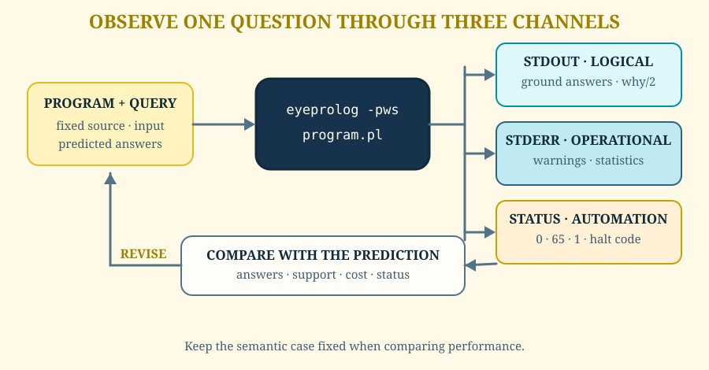
  <figcaption>The CLI exposes three independent channels: answers and proofs on stdout, diagnostics on stderr, and an exit status for the calling process.</figcaption>
</figure>

```text
eyeprolog
eyeprolog [options] [file-or-url.pl|- ...]
```

### Interactive queries

Run `eyeprolog` without arguments to enter the interactive top level. A query
may span several lines and ends with a full stop, as in Scryer Prolog:

```text
?- use_module(library(lists)).
   true.
?- member(X, [prolog, logic]).
   X = prolog
;  X = logic.
?- halt.
```

**Answer control.** When another answer may exist, press `;`, Space, or `n` to
ask for it; no Return is needed. Return or `.` stops, `a` enumerates all
remaining answers, `f` advances to the next five-answer boundary (5, 10, 15,
... answers shown, however many were stepped through individually), and `h`
shows this help. Enumeration is demand-driven: after an answer, the top level
does not run a later branch, or any side effect in it, just to learn whether
that answer was the last. Search that could perform an effect starts only when
you ask to continue. Stopping closes any active `call_cleanup/2` or
`setup_call_cleanup/3` protection exactly once. Because a pending choicepoint
is not explored early, asking for one more answer can end in `false.`.

In scripted, non-TTY input, a new query line stops the preceding enumeration
without being consumed; an explicit `;`, `n`, Space, `a`, or `f` still asks
for more. After the reader accepts a complete query, the next line starts with
two spaces while it runs and a third when the result is ready to format. The
answer prompt `;` has no trailing space while it waits; after an advance
command, one space marks active search and a second an answer ready to format.

While a query runs, EyeProlog releases readline's terminal signal handling, so
`Ctrl-C` ends the process immediately and, on POSIX terminals, `Ctrl-Z`
suspends it. These are top-level conventions, not ISO/IEC 13211-1 features.

**Answer display.** A query with no solutions prints `false.`. A solution
without visible bindings prints `true.` only when no residual goals remain.
Residual constraints are part of the displayed answer even when the attributed variable was created inside a called predicate and is not a
visible query variable; the top level names such variables `_A`, `_B`, and so
on. With `ffalse :- freeze(_, false).`, the query `ffalse.` displays
`freeze:freeze(_A, false).`, and `call_residue_vars(ffalse, Vs).` displays
`Vs = [_A], freeze:freeze(_A, false).`.

Bindings are written as valid Prolog under the current operator table. When a
value would not be a valid right operand of `=/2`, it is parenthesized:
`T = (a = b).`, not `T = a = b.`. When an answer ends in a graphic token, a
space precedes the final full stop so the two cannot merge: `?- X = .* .`
displays `X = .* .`.

**Consulting.** `[file].`, `['file.pl'].`, and `consult(file).` load local
source; `reconsult(file).` is an accepted alias. For an extensionless name the
top level tries `file.pl` before `file`. Consulting has modern reconsult
semantics: loading the same resolved file again replaces its previous clauses,
so clauses deleted from the file disappear. `[user].`, `consult(user).`, and
`reconsult(user).` read source from the terminal until `end_of_file.` or end
of input. `halt.` or `halt(Status).` leaves the top level.

**Reading from the terminal.** When `read/1-2` or `read_term/2-3` reaches
interactive `user_input`, the top level prompts with `|: ` for the next
full-stop-terminated term. The request happens at execution time, so several
reads in one goal, or reads inside called predicates, each prompt separately:

```text
?- read(X), read(Y).
|: hello.
|: world.
   X = hello, Y = world.
```

`Ctrl-D` at an empty `|: ` prompt makes that read return `end_of_file`
without leaving the top level. The prompts and this end-of-file convention are
host behavior; the terms themselves are parsed by the same ISO term reader used
for every text stream. Up and Down recall earlier queries in the session, and
`eyeprolog -h` prints command-line help.

### Selecting goals

A source file states facts, rules, and directives; the command line chooses what
to solve. Pass a callable goal with `-g` or `--goal`:

```sh
eyeprolog --goal 'ancestor(ada, Who)' examples/ancestor.pl
```

Repeat the option to ask several questions in one run; answers appear in the
order the goals were given. `--quiet` suppresses the answer terms while keeping
Prolog output such as `write/1`, which suits command-style goals.

A program can also carry its own question, either as an ISO query or as the
same query in a comment:

```text
?- ancestor(ada, Who).      % run by this and any other ISO processor
%% ?- ancestor(ada, Who).   % run by this one, invisible to the rest
```

Without `-g` or `--goal`, the CLI runs the queries it finds in the sources, in
source order; an explicit goal option overrides them.

Both spellings are extensions in the sense of 7.7.3: "the method by which a user
delivers a goal to the Prolog processor shall be implementation defined". A
Prolog text (6.2.1) contains only directives and clauses, and the standard's
*query* (3.143) is top-level input that a processor need not support. The two
spellings differ in who else runs them. Nearly every Prolog accepts a `?-`
term as a goal, so a program written that way runs in most engines, although
`--iso-strict` rejects it. A `%% ?-` comment is invisible to every other
processor, which keeps a file portable to the external Prologs used by the
conformance harness. The standard's own way to put a goal in a text,
`:- initialization(Goal).` (7.4.2.6), works as well. Prefer an external goal
when a script, shell history, or API call should record which question was
asked.

| Option | Meaning |
| --- | --- |
| `-h`, `--help` | Show usage |
| `-p`, `--proof` | Print a proof (`clause/3` and `step/4` facts) after the answers |
| `--proof-detail abstract\|expanded` | Stop proofs at bundled library predicates, or explain through them; implies `--proof` |
| `--check-proof File` | Check a saved proof against the input program without proof search; write `condition/4`, `failure/3`, `obligation/3`, and `verdict/1` facts; `-` reads the proof from stdin; exit `2` when the proof is not valid. With `--goal`, the goals the proof answers |
| `--strict-proof` | With `--check-proof`, forbid trusted boundaries |
| `--json` | With `--check-proof`, write the report as JSON |
| `-q`, `--quads` | Run embedded quad tests and fail if any do not hold |
| `--quiet` | Suppress answer terms; keep Prolog output and diagnostics |
| `--iso-strict` | Restrict parsing and execution to ISO/IEC 13211-1:1995 + Corrigenda 1–3; reject EyeProlog extensions (including `table` and `:+`) and disable autoloading |
| `--portable` | Enforce the EyeProlog/Trealla/Scryer interoperability profile |
| `--no-autoload` | Disable bundled-library autoloading |
| `-s`, `--stats` | Print solver and memory statistics to stderr |
| `-v`, `--version` | Print the package version |
| `-w`, `--warnings` | Print non-fatal portability warnings |
| `-g`, `--goal Goal` | Solve a callable goal; may be repeated; overrides queries in the source |
| `--` | Treat the remaining arguments as inputs |

Short flags combine, so `-pw` means `-p -w`. Note that `-q` is `--quads`;
`--quiet` has no short form.

`--iso-strict` cannot be combined with `--quads`, because quads and their infix
`(?-)/2` form are an EyeProlog testing extension. Strict mode keeps the Part 1
prefix `(?-)/1` operator and reads `-->/2` as an ordinary operator; it does not
expand grammar rules or provide `phrase/2-3`. It also rejects Part 2 module
directives and EyeProlog libraries, and has neither the `occurs_check` flag nor
the `table` declaration. Normal mode supports Parts 2–3, the EyeProlog
extensions, and autoloading of the bundled `src/lib/` exports.

Inputs may be local files, HTTP(S) URLs, or a single `-` for stdin. Bare
`eyeprolog` starts the normal REPL and `eyeprolog --iso-strict` the strict one.
Other options without a named input read stdin, but because the strict-only
invocation is reserved for the REPL, write `eyeprolog --iso-strict -` to read
strict source from stdin. Several sources are parsed as one program, and a
relative `include/1` resolves from the including file's directory.

```sh
eyeprolog --iso-strict --goal 'p(X)' program.pl
eyeprolog --iso-strict
printf 'p(a).\n' | eyeprolog --iso-strict --goal 'p(X)' -
```

### A reproducible run

Observe one thing at a time:

1. predict the answers, then run without observation flags and compare;
2. add `--proof` when the support for an answer is the question, and save the
   proof and use `--check-proof` when it must cross a process or review
   boundary;
3. add `--warnings` for portability or negative-dependency questions, and
   `--portable` when non-profile dependencies should fail CI;
4. add `--stats` only to compare two runs of the same case.

```sh
eyeprolog --goal 'ancestor(X, Y)' examples/ancestor.pl
eyeprolog --proof --goal 'type(X, Y)' examples/socrates.pl
eyeprolog --proof examples/socrates.pl > socrates.why.pl
eyeprolog --check-proof socrates.why.pl examples/socrates.pl
eyeprolog --warnings --goal 'answer(X)' test/conformance/warnings/negation/unstratified_mutual.pl
eyeprolog --portable --goal 'sudoku9(S)' examples/clpz-sudoku-9x9.pl
eyeprolog --stats --goal 'path(a, X)' examples/path-discovery.pl > answers.pl 2> run.stats
```

Answers and proofs go to stdout, so the output can serve as a golden
file or as input to another run. Warnings and statistics go to stderr and never
mix into that stream. A successful run exits with status `0`; loading, syntax,
option, and other uncaught errors exit with `1`. A program can choose its own
status with `halt/0-1`. `--check-proof` exits with `2` when the checked proof
is not valid, after writing its report.

Statistics are only meaningful in comparison. Keep the program, input, runtime
version, query, answers, and counters together, and accept an optimization only
when the answers are unchanged and the measure improves on the case that
matters.

### Embedded quad tests

A quad places a query directly before a description of its expected answer. The
description is ordinary Prolog syntax, not quoted text, so a test reads like
the interaction it checks:

```eyeprolog
color(red).
color(green).

colors ?- color(X).
   X = red
;  X = green.

?- color(blue).
   false.
```

Run the quads in a file with `eyeprolog --quads file.pl` or `eyeprolog -q
file.pl`. The syntax follows the "queries using answer descriptions" convention
of Trealla and the ISO Prolog working examples.

**Labels and layout.** A label such as `colors` is optional. It is the ordinary
first argument of `(?-)/2`, so it may be any term, including several
comma-separated metadata fields (`9, "case", passes ?- Goal.`), but it must be
ground when the quad runs; a non-ground label is reported as a failure rather
than a parse error. Recognition happens after ordinary parsing, so
`?-(Label, Query).` and `Label ?- Query.` are the same quad. Descriptions are
layout-sensitive: indent each one, and keep clause heads and the next query at
the left margin.

**Running.** Loading a file only records its quads; it neither runs them nor
adds them as clauses. A quad run prints a summary and exits with `1` if any
description fails. Quad mode imports `library(prologue)`, because the ISO
working-example files call its predicates as system predicates, and uses
`unknown=error` unless the source sets the flag, so an undefined predicate is
reported instead of silently failing.

**Description language.**

- `;` separates ordered answers; `|` separates acceptable alternatives.
- `true`, `false`, and standard error terms describe outcomes.
- `unexpected` (synonym `inattendue`) marks an answer that must not occur at
  that position. Once the observed answer differs from the marked leaf, the
  description succeeds without requiring that no further answers follow.
- `...` and `ad_infinitum` accept further answers.
- `maybe` describes a success that still has at least one residual constraint.
  It does not weaken substitution matching: `X = a, maybe` still requires
  `X = a`. A success described without `maybe` must have no residue. Native
  variable constraints, attributed-variable residue, and delayed goals all
  count as residue.
- Variables named in the query keep their identity inside descriptions;
  variables that appear only in a description are fresh. So `throw(g(_X))`
  describes the query `throw(g(X))`, while `throw(g(X)), unexpected` checks
  that `throw/1` did not keep the query variable in the copied ball.

```eyeprolog
?- dif(X,Y), X = a.
   true, unexpected.
   X = a, unexpected.
   X = a, maybe.
   maybe, unexpected.
```

Each indented description after a query is an independent check: it re-runs
the query, is counted in the `quads:` summary, and does not hide later
descriptions when it fails.

**Approximate floats.** `V ~~ '14.2000'` accepts a **float** in the closed
decimal interval 14.19995 to 14.20005. The right-hand side is a decimal atom so
that trailing zeroes keep their meaning; exponent notation such as `'1.42000e1'`
works the same way. An integer never matches, and a numeric right-hand side such
as `V ~~ 14.2000` is rejected because parsing it would discard the written
precision.

```eyeprolog
?- V is 0+(3.2+11).
   V ~~ '14.2000'.
```

`~~` is a normal-profile operator (priority 700, `xfx`, like `=`); there is no
`~~/2` predicate. An approximation is well-formed only when its interval holds
at least three distinct finite floats: the lowest, the one nearest the written
midpoint, and the highest. This rejects spellings that claim more precision
than a float can carry. Endpoints are rounded inward, so binary rounding can
never admit a float that lies outside the decimal interval.

**Input and output.** `inputs/1` supplies exactly the characters the query must
consume. `peeks/1` adds one character that may be looked at but must remain
unread. A sentinel follows the declared input, so a reader cannot use an
artificial end of file to decide that a full stop ends a term:

```eyeprolog
?- read(X).
   inputs("1."), X = 1, unexpected.
   inputs("1."), peeks(" "), X = 1.
   inputs("1. "), peeks(" "), X = 1, unexpected.
```

`outputs/1` checks the characters written while reaching the described answer
or error, including output emitted before a later exception. Its argument is a
character list or string, or a DCG body with terminals, conjunction,
disjunction, `...`/`ad_infinitum` wildcards, and user-defined nonterminals.

**Unordered answers.** Appending `| other_answer_sequence` accepts any
permutation of the preceding complete answer sequence. Substitutions, residue,
per-answer output, and duplicate counts must still match, and a final failure
or exception stays last. Overlapping wildcard or approximate descriptions are
matched one-to-one. Prefix (`...`), `unexpected`, STO, and input annotations
are not allowed in a permuted sequence. For `setof(1, (Y=2 ; Y=1), L)`, the
description `Y=2, L=[1] ; Y=1, L=[1] | other_answer_sequence` accepts either
group order.

#### STO, loops, and undecided results

`sto`, following Trealla's convention, declares that a query is subject to
occurs check. EyeProlog checks this conservatively. During the ordinary run, a
concrete occurs-check event in the unifier is positive evidence; the query is
not run again just to probe. A finite run that ends without such an event
disproves `sto`, while a run cut short by a search or resource bound leaves it
unchecked. The answer part of an `sto` leaf is implementation-dependent and is
not compared, and when STO evidence is observed an unannotated `unexpected`
leaf does not reject the finite-tree outcome. EyeProlog states a result only
where execution gives definite evidence.

```eyeprolog
?- X = s(X).
   X = ..., unexpected.
   false, unexpected.
   sto, false
|  sto, true.

?- true.
   sto.                  % fails: no STO evidence
```

`loops` is distinct from running out of budget. EyeProlog accepts structural
nontermination evidence, such as an active-variant recursion cycle, with depth
and inference bounds as a fallback. A structural cycle also refutes a `false`
description.

```eyeprolog
inf :- inf, inf.

?- inf.
   loops.
```

Ordinary descriptions have an inference budget (100000 by default). Exhausting
it neither establishes `loops` nor turns an unfinished search into `false`;
the description is reported as undecided:

```text
quads: UNDECIDED expensive_case, program.pl:12
   undecided: inference limit reached.
```

A quad run therefore has three outcomes: passed, failed, and undecided. With no
failures but at least one undecided description, the CLI exits with status
`2`. The JavaScript API exposes the same operation without process I/O;
`quadMaxInferences` overrides the search budget, and `loopMaxDepth` and
`loopMaxInferences` bound the `loops` probe:

```js
import { Program, runQuads } from 'eyeprolog';

const program = Program.parse(source);
const report = runQuads(program);
console.log(report.passed, report.failed, report.undecided, report.stdout);
```

### Further examples

<figure>
  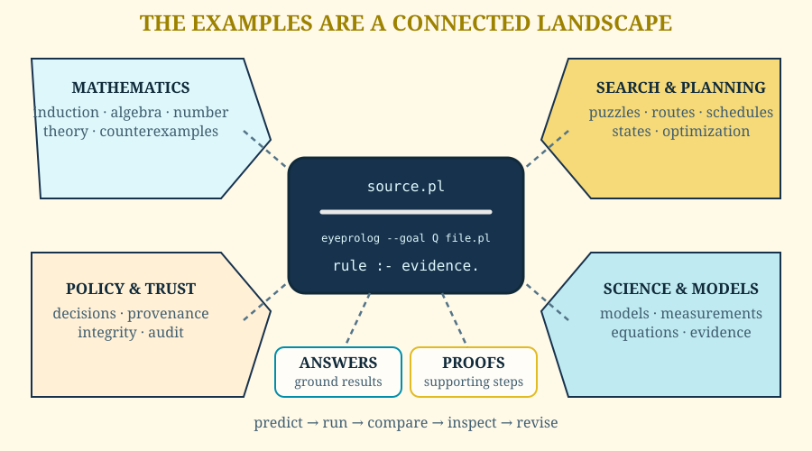
  <figcaption>Every program in the corpus leads from readable source to an answer, the reason for it, and the check of that reason.</figcaption>
</figure>

The [examples directory](https://github.com/eyereasoner/eyeprolog/tree/main/examples/) is the book's executable companion. Its
top-level directory contains **236 self-contained runnable programs**. Every
program has an exact answer file under
[examples/output](https://github.com/eyereasoner/eyeprolog/tree/main/examples/output/), and **236 programs** have a checked
explanation under [examples/proof](https://github.com/eyereasoner/eyeprolog/tree/main/examples/proof/), with the result of that
check under [examples/check](https://github.com/eyereasoner/eyeprolog/tree/main/examples/check/). So each example comes in three
parts, making three different claims:

- the **answer** (`examples/output/`) says what follows;
- the **reason** (`examples/proof/`) says why, as `step/4` facts naming the
  clause each conclusion used and what it rested on;
- the **check** (`examples/check/`) says whether that reason holds, decided
  mechanically and not by the engine that produced the answer. A proof can be
  internally flawless and still record a false value; the check is the part
  that can say no.

A check result is itself ordinary Prolog: `condition/4` for each of the seven
conditions, `failure/3` for anything that did not hold, one `obligation/3` for
each conclusion the check rests on rather than establishes, and `verdict/1`.
`npm test` re-checks every proof, re-performing each recorded inference against
its source clause and recomputing each primitive the proof asserts.

[`examples/book/`](https://github.com/eyereasoner/eyeprolog/tree/main/examples/book/) holds the inline EyeProlog displays, chapter by chapter. They are parsed and their declared goals run, but some depend on facts from the surrounding text; use the top-level examples for self-contained programs with golden answers.

To study an example, predict its answers from the declared queries, run it,
compare with the golden output, then read the proof and change one fact:

```sh
node bin/eyeprolog.js examples/ancestor.pl
node bin/eyeprolog.js --proof examples/ancestor.pl
```

A selection, grouped by theme:

- **First programs.**
  [socrates](https://github.com/eyereasoner/eyeprolog/blob/main/examples/socrates.pl),
  [ancestor](https://github.com/eyereasoner/eyeprolog/blob/main/examples/ancestor.pl),
  [snaf](https://github.com/eyereasoner/eyeprolog/blob/main/examples/snaf.pl) (negation as failure),
  [herbrand-witnesses](https://github.com/eyereasoner/eyeprolog/blob/main/examples/herbrand-witnesses.pl) (function terms as existential witnesses).
- **Standard Prolog.**
  [iso-control-and-errors](https://github.com/eyereasoner/eyeprolog/blob/main/examples/iso-control-and-errors.pl),
  [iso-grouped-solutions](https://github.com/eyereasoner/eyeprolog/blob/main/examples/iso-grouped-solutions.pl),
  [iso-term-io](https://github.com/eyereasoner/eyeprolog/blob/main/examples/iso-term-io.pl),
  [dcg-expression-language](https://github.com/eyereasoner/eyeprolog/blob/main/examples/dcg-expression-language.pl),
  [dif-constraints](https://github.com/eyereasoner/eyeprolog/blob/main/examples/dif-constraints.pl).
- **Constraints.**
  [clpz-sudoku-9x9](https://github.com/eyereasoner/eyeprolog/blob/main/examples/clpz-sudoku-9x9.pl),
  [clpz-n-queens](https://github.com/eyereasoner/eyeprolog/blob/main/examples/clpz-n-queens.pl),
  [clpb-boolean-circuit](https://github.com/eyereasoner/eyeprolog/blob/main/examples/clpb-boolean-circuit.pl).
- **Recursion and graphs.**
  [graph-reachability](https://github.com/eyereasoner/eyeprolog/blob/main/examples/graph-reachability.pl),
  [path-discovery](https://github.com/eyereasoner/eyeprolog/blob/main/examples/path-discovery.pl),
  [service-impact](https://github.com/eyereasoner/eyeprolog/blob/main/examples/service-impact.pl),
  [deep-taxonomy-100000](https://github.com/eyereasoner/eyeprolog/blob/main/examples/deep-taxonomy-100000.pl) (a stress case).
- **Search and planning.**
  [zebra](https://github.com/eyereasoner/eyeprolog/blob/main/examples/zebra.pl),
  [send-more-money](https://github.com/eyereasoner/eyeprolog/blob/main/examples/send-more-money.pl),
  [stable-marriage](https://github.com/eyereasoner/eyeprolog/blob/main/examples/stable-marriage.pl),
  [wolf-goat-cabbage](https://github.com/eyereasoner/eyeprolog/blob/main/examples/wolf-goat-cabbage.pl),
  [blocks-world-planning](https://github.com/eyereasoner/eyeprolog/blob/main/examples/blocks-world-planning.pl).
- **Mathematics.**
  [peano-calculus](https://github.com/eyereasoner/eyeprolog/blob/main/examples/peano-calculus.pl),
  [fundamental-theorem-arithmetic](https://github.com/eyereasoner/eyeprolog/blob/main/examples/fundamental-theorem-arithmetic.pl),
  [d3-group](https://github.com/eyereasoner/eyeprolog/blob/main/examples/d3-group.pl),
  [matrix-noncommutativity](https://github.com/eyereasoner/eyeprolog/blob/main/examples/matrix-noncommutativity.pl),
  [stirling-bell-numbers](https://github.com/eyereasoner/eyeprolog/blob/main/examples/stirling-bell-numbers.pl).
- **Languages and metaprogramming.**
  [vanilla-meta-interpreter](https://github.com/eyereasoner/eyeprolog/blob/main/examples/vanilla-meta-interpreter.pl),
  [partial-evaluator](https://github.com/eyereasoner/eyeprolog/blob/main/examples/partial-evaluator.pl),
  [symbolic-derivative](https://github.com/eyereasoner/eyeprolog/blob/main/examples/symbolic-derivative.pl),
  [sat-solver-dpll](https://github.com/eyereasoner/eyeprolog/blob/main/examples/sat-solver-dpll.pl),
  [knuth-bendix-completion](https://github.com/eyereasoner/eyeprolog/blob/main/examples/knuth-bendix-completion.pl).
- **Program analysis.**
  [abstract-interpretation](https://github.com/eyereasoner/eyeprolog/blob/main/examples/abstract-interpretation.pl),
  [type-inference](https://github.com/eyereasoner/eyeprolog/blob/main/examples/type-inference.pl),
  [declarative-fault-localization](https://github.com/eyereasoner/eyeprolog/blob/main/examples/declarative-fault-localization.pl),
  [universal-vs-existential-termination](https://github.com/eyereasoner/eyeprolog/blob/main/examples/universal-vs-existential-termination.pl).
- **Policies and provenance.**
  [access-control-policy](https://github.com/eyereasoner/eyeprolog/blob/main/examples/access-control-policy.pl),
  [gdpr-compliance](https://github.com/eyereasoner/eyeprolog/blob/main/examples/gdpr-compliance.pl),
  [defeasible-reasoning](https://github.com/eyereasoner/eyeprolog/blob/main/examples/defeasible-reasoning.pl),
  [trust-flow-provenance-threshold](https://github.com/eyereasoner/eyeprolog/blob/main/examples/trust-flow-provenance-threshold.pl).
- **RDF 1.2.**
  [rdf12-triple-term](https://github.com/eyereasoner/eyeprolog/blob/main/examples/rdf12-triple-term.pl),
  [rdf12-trig-named-graph](https://github.com/eyereasoner/eyeprolog/blob/main/examples/rdf12-trig-named-graph.pl),
  [odrl-policy](https://github.com/eyereasoner/eyeprolog/blob/main/examples/odrl-policy.pl),
  [symbiotic-knowledge-graph](https://github.com/eyereasoner/eyeprolog/blob/main/examples/symbiotic-knowledge-graph.pl).
- **Science and engineering.**
  [bayes-diagnosis](https://github.com/eyereasoner/eyeprolog/blob/main/examples/bayes-diagnosis.pl),
  [spacecraft-battery-diagnosis](https://github.com/eyereasoner/eyeprolog/blob/main/examples/spacecraft-battery-diagnosis.pl),
  [least-squares-regression](https://github.com/eyereasoner/eyeprolog/blob/main/examples/least-squares-regression.pl).
- **Larger cases.**
  [auroracare](https://github.com/eyereasoner/eyeprolog/blob/main/examples/auroracare.pl),
  [manufacturing-quality-control](https://github.com/eyereasoner/eyeprolog/blob/main/examples/manufacturing-quality-control.pl).

`node test/run-examples.mjs` runs every answer and proof golden; `npm test`
runs the whole correctness corpus, and its elapsed time doubles as the
project's performance indicator. A new example should name its idea in the
filename, open with a comment stating the lesson and the model's boundary,
keep its queries finite and its output small, include a positive and a
boundary case, and come with its answer, proof, and check files.

**Checkpoint.** Run one example with `--proof --stats`. Which output is the
reusable logical result, which describes this particular run, and which
status does a calling process see? Change one fact and predict all three before
rerunning.

## 41. Standards, limits, and implementation boundaries

This book is the single reference for the EyeProlog implementation.
Chapters 38–40 define its ISO Prolog syntax, directives, execution model,
built-in predicates, and command line; the earlier chapters cover the reasoner,
tabling, proofs, warnings, answer formatting, embedding, and data boundaries.

### Conformance evidence

The file-based corpus under `test/conformance/` covers success, failure,
errors, warnings, proofs, and file loading:

```sh
node test/run-conformance-all.mjs
node test/run-iso-strict.mjs
node test/run-conformance-report.mjs
```

The file-based conformance corpus contains 905 cases, including 479 focused ISO cases derived from the success, failure, mode, and error behavior in ISO/IEC 13211-1 clauses 7 and 8, Part 2 modules, and Part 3 grammar rules.
Separate exact-output suites check every example's answer, proof, and proof
check, and every chapter display is parsed with its declared goals run. The
playground suite drives the production worker through its message protocol and
crawls the served module graph for missing assets, wrong MIME types, and static
Node-only imports (`node test/run-playground.mjs`).

The review documents are:

- `test/conformance/ISO-COMPLIANCE.md`, the Part 1 ledger: an explicit
  disposition for each tracked processor, syntax, semantic, built-in, and
  arithmetic requirement, mapped to executable cases, plus the exit checklist;
- `test/conformance/ISO-IMPLEMENTATION-DEFINED.md`, the ISO 5.4 index of
  implementation-defined decisions and extension families;
- `ISO-TERM-SEMANTICS-MATRIX.md` (7.1–7.3 types, order, unification),
  `ISO-PROLOG-TEXT-EXECUTION-MATRIX.md` (7.4–7.8 preparation, database,
  conversion, execution, control), and `ISO-EVALUABLE-FUNCTOR-MATRIX.md`
  (7.9 and Clause 9 arithmetic);
- `conformance-report.md`, which inventories the corpus and links to
  `NEUMERKEL-LATEST.md`, the live TU Wien conformity results including WG17
  syntax.

WG17 syntax cases are discovered live, not taken from a vendored snapshot; a
small offline file (`test/conformance/wg17-syntax-cases.json`) pins reviewed
strict-reader outcomes for most of them, and every case is checked against the
upstream expectation. Each case the strict reader accepts is also run in the
normal profile and must give the same result: extensions may accept more
texts, but may not reinterpret a standard one.

### The supported profile

The strict-core target is ISO/IEC 13211-1:1995 with Technical Corrigenda 1–3.
Normal mode adds the module compatibility surface, a Part 3-oriented
definite-clause grammar, and the EyeProlog extensions. Chapter 39 lists every
supported predicate indicator. The normal profile covers control and
exceptions, term operations, arithmetic, grouped solutions, dynamic clauses,
operators, atomic terms, flags, character conversion, streams, character, byte,
and term I/O, initialization, source inclusion, modules, and grammar rules.

`--iso-strict` (API option `isoStrict: true`) limits the processor to the
Part 1 baseline. Corrigendum 2 additions such as `subsumes_term/2`,
`acyclic_term/1`, `sort/2`, `keysort/2`, `term_variables/2`, `retractall/1`, and
`call/2-8` belong to that baseline. Modules, grammar-rule expansion and
`phrase/2-3`, quads, libraries, the `occurs_check` flag, `table`,
`call_cleanup/2`, and `setup_call_cleanup/3` do not.

The strict-core review gives explicit dispositions for the Clause 5 processor
obligations, Clause 6 syntax, Clause 7 term, execution, I/O, and error
semantics, the 8.2–8.17 built-in families, and the Clause 9 evaluable functors.
Implementation-defined choices, among them the Unicode-scalar character set,
stream details, flag defaults, floating-point behavior, and signed bitwise and
shift semantics, are indexed in `ISO-IMPLEMENTATION-DEFINED.md`. This is
executable evidence for a documented boundary, not independent ISO
certification.

Notable boundaries:

- zero-arity compound syntax such as `ready()` denotes the atom `ready`;
- module and DCG support (Parts 2 and 3) is a compatibility profile, not a
  certification claim;
- a variable cannot stand in functor or predicate position;
- double-quoted text follows the `double_quotes` flag exactly; the default
  `chars` matches Trealla and Scryer, and `codes` or `atom` may be selected.
  Normal mode also accepts Trealla's `"text"||Tail` splicing for `chars` and
  `codes`; strict mode rejects it;
- `write_term/2-3` implements the Part 1 and Corrigendum 3 options `quoted/1`,
  `ignore_ops/1`, `numbervars/1`, and `variable_names/1`, with their validation
  rules; normal mode adds `double_quotes(true|false)` and
  `spacing(true|false)`, which strict mode rejects;
- unification always performs the occurs check, so rational-tree bindings that
  some systems accept are rejected.

### Security and resource use

EyeProlog has no general host-call primitive, but an untrusted theory is still
executable input: it can request enormous finite searches or build unbounded
terms, and URL inputs cross a network and trust boundary. Restrict accepted
sources and impose limits on input size, time, depth, memory, and solutions.
Proof output can be much larger than the answers and needs its own budget.

## 42. Glossary and notes

### References

These sources give historical and technical background. They describe larger
languages and theories and are not EyeProlog specifications.

- ISO/IEC,
  [*ISO/IEC 13211-1:1995 — Programming languages — Prolog — Part 1:
  General core*](https://www.iso.org/standard/21413.html), with
  [Technical Corrigendum 1:2007](https://www.iso.org/standard/50405.html),
  [Technical Corrigendum 2:2012](https://www.iso.org/standard/58033.html),
  and
  [Technical Corrigendum 3:2017](https://www.iso.org/standard/73194.html).
  Chapter 38 defines EyeProlog's profile against this baseline.
- Leon Sterling and Ehud Shapiro,
  [*The Art of Prolog*, second edition](https://mitpress.ublish.com/book/art-prolog),
  MIT Press, 1994. The model for this book's progression from relations to
  program construction, interpreters, and applications.
- Michael Genesereth,
  [*Introduction to Logic*](http://intrologic.stanford.edu/public/chapters.php),
  Stanford University. A free text on logical syntax, semantics, and proof
  systems.
- Jacques Herbrand,
  [*Recherches sur la théorie de la démonstration*](https://www.numdam.org/item/THESE_1930__110__1_0/),
  doctoral thesis, University of Paris, 1930. Ground instances as a foundation
  of automated deduction (Chapter 3).
- J. A. Robinson,
  [“A Machine-Oriented Logic Based on the Resolution Principle”](https://doi.org/10.1145/321250.321253),
  *Journal of the ACM* 12(1), 1965, pp. 23–41. Resolution and unification.
- Alain Colmerauer and Philippe Roussel,
  [“The Birth of Prolog”](https://softwarepreservation.computerhistory.org/prolog/index.html#history),
  in *History of Programming Languages II*, 1996, pp. 331–367.
- Maarten H. van Emden and Robert A. Kowalski,
  [“The Semantics of Predicate Logic as a Programming Language”](https://doi.org/10.1145/321978.321991),
  *Journal of the ACM* 23(4), 1976, pp. 733–742. Least models and fixed points
  (Chapter 3).
- Robert A. Kowalski,
  [“Algorithm = Logic + Control”](https://doi.org/10.1145/359131.359136),
  *Communications of the ACM* 22(7), 1979, pp. 424–436 (Chapters 17–20).
- Keith L. Clark,
  [“Negation as Failure”](https://www.doc.ic.ac.uk/~klc/neg.html), in *Logic
  and Data Bases*, 1978, pp. 293–322. Finite failure and the completed
  database (Chapter 7).
- Krzysztof R. Apt, Howard A. Blair, and Adrian Walker,
  [“Towards a Theory of Declarative Knowledge”](https://ir.cwi.nl/pub/10404),
  in *Foundations of Deductive Databases and Logic Programming*, 1988,
  pp. 89–148. Stratified negation.
- Weidong Chen and David S. Warren,
  [“Tabled Evaluation with Delaying for General Logic Programs”](https://doi.org/10.1145/227595.227597),
  *Journal of the ACM* 43(1), 1996, pp. 20–74. Tabled evaluation (Chapter 13).
- Yoshihiko Futamura,
  [“Partial Evaluation of Computation Process—An Approach to a Compiler-Compiler”](https://www.jstage.jst.go.jp/article/jssst/21/5/21_5_343/_article/-char/en),
  1971, republished in English translation. Partial evaluation and
  compilation (Part V).
- Kurt Gödel,
  [“Über formal unentscheidbare Sätze der *Principia Mathematica* und verwandter Systeme I”](https://doi.org/10.1007/BF01700692),
  *Monatshefte für Mathematik und Physik* 38, 1931, pp. 173–198; Alonzo
  Church,
  [“An Unsolvable Problem of Elementary Number Theory”](https://www.cis.upenn.edu/~cis5110/Church-UnsolvableProblemElementary-1936.pdf),
  *American Journal of Mathematics* 58(2), 1936, pp. 345–363; and Alan M.
  Turing,
  [“On Computable Numbers, with an Application to the Entscheidungsproblem”](https://doi.org/10.1112/plms/s2-42.1.230),
  *Proceedings of the London Mathematical Society* 42, 1936–1937,
  pp. 230–265. The limits of formal proof and of decision procedures
  (Chapter 30).
- David Hilbert,
  [“Mathematical Problems”](https://www.gutenberg.org/ebooks/71655), Paris,
  1900. The problem-directed axiomatic culture behind Part VI.
- Dörthe Arndt and Stephan Mennicke,
  [“Notation3 as an Existential Rule Language”](https://arxiv.org/abs/2308.07332),
  2023. Semantic Web rules and existential-rule reasoning.

### Glossary

**Aggregate.** A predicate that runs a finite nested search and combines its
solutions, such as `findall/3`, `countall/2`, `sumall/3`, `aggregate_min/5`,
or `aggregate_max/5`.

**Answer.** A ground instance of a query goal produced by successful search.
EyeProlog does not print duplicate answers or answers identical to source facts.

**Answer set.** The distinct answers to a query, regardless of order or number
of proofs.

**Arity.** The number of arguments of a predicate or compound term. `edge/2`
and `edge/3` are different predicates.

**Atom constant.** A symbolic constant such as `alice` or `'a quoted atom'`.
It is data; an atomic formula uses a predicate name as a proposition.

**Atomic formula.** A callable proposition such as `ready` or
`parent(ada, byron)`.

**Base case.** A nonrecursive clause that ends a recursion.

**Binding.** An association between a variable and a term, made by
unification.

**Binding pattern.** Which arguments of a call are bound, unbound, or partly
structured when it is called. See *mode*.

**Body.** The goals to the right of `:-` in a rule; all must succeed for the
rule to apply.

**Built-in.** A predicate implemented by the system rather than by source
clauses. Many built-ins accept only certain modes.

**Call.** A goal selected for solving, with its current bindings.

**Canonical form.** One chosen representative for a class of equivalent
values, so that equivalence can be tested by structural equality.

**Choicepoint.** A remaining alternative that may yield another answer if the
caller asks for more. The engine never runs an unrequested branch or effect to
find out whether one exists.

**Cleanup.** A goal installed by `call_cleanup/2` or `setup_call_cleanup/3`
that runs exactly once when the protected goal completes, is cut, is
abandoned, or raises an exception.

**Clause.** A fact or rule, terminated by a full stop.

**Closed-world assumption.** Treating failure to derive a claim as evidence that
it is false. `\+/1` implements negation as failure; the modeler must justify
the scope in which that is sound.

**Compound term.** A term with a functor and one or more arguments, such as
`point(3, 4)`.

**Conformance corpus.** The executable cases under `test/conformance/` that
define the supported profile.

**Conjunction.** Goals joined by commas, normally solved left to right.

**Constraint.** A goal that restricts the values of its variables. Delayed
constraints such as `dif/2`, `freeze/2`, and CLP(Z) constraints remain as
residual goals until they are decided.

**Declarative reading.** What the ground instances of clauses mean,
independently of search order.

**Definite clause.** A clause with one positive head and a conjunction of
positive body goals. Definite programs have a least Herbrand model.

**Dependency graph.** A graph of predicates with an edge from caller to callee.
Recursive predicates form its cycles.

**Fact.** A clause with no body, such as `parent(ada, byron).`

**Failure.** The absence of a solution along the current branch. It makes the
search try alternatives; it is neither an exception nor a stored negative fact.

**Finite domain.** An explicitly bounded set of candidates that a search can
exhaust. Finiteness belongs to a call and its generators, not to a predicate
name.

**Fixed point.** The stage at which repeated derivation adds no new answers.

**Functor.** The name and arity at the root of a compound term: `point/2` in
`point(3, 4)`.

**Generator.** A goal that produces candidate bindings from facts, lists, or
bounded ranges.

**Goal.** An atomic formula or control construct the solver is asked to prove.

**Golden file.** Checked expected output stored in the repository: answers,
proofs, or proof checks.

**Ground.** Containing no variables. The CLI prints only ground answers.

**Head.** The atomic formula left of `:-`, or the whole of a fact.

**Herbrand base.** All ground atomic formulas built from a program's predicate
symbols and Herbrand universe.

**Herbrand interpretation.** A subset of the Herbrand base, taken as the true
atoms.

**Herbrand universe.** All ground terms built from a program's constants and
function symbols.

**Host goal.** A goal supplied by the CLI or the embedding API to select which
answers to observe.

**Indexing.** Selecting candidate clauses by bound arguments, without changing
the answers.

**Integrity check.** An ordinary predicate whose answers identify invalid input;
the host decides what to do with them.

**Least Herbrand model.** The smallest Herbrand interpretation satisfying a
definite program, reached by repeatedly adding supported ground consequences.

**List.** Either `[]` or `[Head | Tail]` where `Tail` is a list. A partial list
ends in a variable, as in `[X,Y|Xs]`; a variable alone is also a partial list.
`[X,Y|non_list]` is an instance of a partial list that is not a list.

**Mode.** An intended direction of use: which arguments are supplied and which
are produced.

**Negation as failure.** `\+ Goal` succeeds when a terminating search finds no
solution for `Goal`.

**Occurs check.** A unification check that prevents binding a variable to a
term containing that variable. EyeProlog performs it consistently for ordinary
unification as well as `unify_with_occurs_check/2`.

**Operational reading.** How a clause directs computation: which goal is
selected, which bindings it needs and makes, and which alternatives it leaves.

**Predicate indicator.** A predicate name with its arity, written `name/arity`.

**Proof.** A successful derivation showing which clauses, facts, and built-ins
support an answer. It records success, not failed branches.

**Proof tree.** The tree of subgoals supporting one derivation, without the
failed alternatives of the search tree.

**Proper list.** A finite list whose final tail is `[]`.

**Readiness.** The binding condition under which a mode-sensitive built-in can
run safely.

**Recursion.** A predicate depending on itself, directly or through others.

**Relation.** The set of tuples for which a predicate holds.

**Resolution.** The step that unifies a goal with a clause head and replaces the
goal by the instantiated clause body.

**Rule.** A clause with a head and a body: `Head :- Body.`

**Search tree.** All alternatives explored while seeking answers, successful
or not.

**Source fact.** A fact present in the loaded input, as opposed to a derived
conclusion.

**Stratified negation.** Negative dependencies arranged in layers, so that no
predicate depends negatively on itself.

**Substitution.** A mapping from variables to terms, applied consistently
throughout a term or clause.

**Tabling.** Evaluation that shares calls and accumulates their answers up to a
fixed point.

**Term.** An atom, number, variable, or compound term. Double-quoted text
denotes a list or atom according to the `double_quotes` flag.

**Termination measure.** A value in a well-founded order that strictly decreases
on every recursive call in a stated mode.

**Theory.** The facts and rules loaded together, read as claims about a domain.

**Unification.** Solving an equation between two terms by finding a
substitution that makes them identical.

**Variable.** A clause-local name beginning with an uppercase letter or
underscore. Each `_` is a fresh variable.

**Variant.** A term identical to another up to consistent renaming of
variables. Tabling recognizes variant calls.

**Witness.** A ground term demonstrating an existential claim: a path, an
assignment, a factorization, a schedule.

# Part X — Laboratories

## 43. Laboratories

Each laboratory asks for a working artifact, states when it is done, and ends
with one question worth answering in writing.

<figure>
  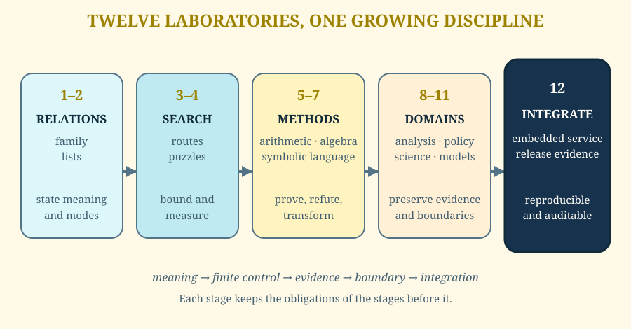
  <figcaption>The laboratories apply one discipline at growing scale: state meaning, control a finite computation, preserve evidence, name the boundary, and finally integrate all four.</figcaption>
</figure>

### Laboratory 1. A family theory

*Chapters 1–5.* Facts for at least six people; relations for parent, sibling,
grandparent, and cousin. State the reading and modes of each predicate, include
a branch with several cousins, query in both directions, and add an integrity
relation that reports anyone recorded as their own parent.

**Done when** the output matches your prediction and one cousin proof passes
through named intermediate relations.
**Reflect:** which conclusions depend on absence, and is that closed-world
assumption justified?

### Laboratory 2. A relational list toolkit

*Chapters 1–5.* Your own membership, concatenation, reversal, and prefix
relations, written with facts, rules, and list syntax only. Document each
finite mode and test empty, singleton, proper, and partial lists.

**Done when** bounded queries comparing each relation with its library
counterpart find no disagreement in either direction.
**Reflect:** which logically meaningful modes fail to terminate?

### Laboratory 3. A cyclic transport network

*Chapters 6–10 and 13.* At least ten stations with cycles, weighted edges, and
two disconnected components. Derive reachability, construct simple paths, and
pick a least-cost path with deterministic tie-breaking. Test a cycle, an
unreachable pair, and equal-cost routes, and compare `--stats` before and after
one justified control change.

**Done when** every path starts and ends at the queried stations, uses known
edges, and repeats no station.
**Reflect:** why can reachability be tabled finitely when the set of walks is
infinite?

### Laboratory 4. A finite puzzle

*Chapters 6–10.* A small Latin square, schedule, or house puzzle. Separate
generation from constraints, remove at least one symmetry, return a structured
witness, and predict the size of the naive and reduced search spaces.

**Done when** every intended solution appears exactly once, with no permuted
duplicates.
**Reflect:** which line of the program does the most pruning?

### Laboratory 5. Arithmetic by construction

*Chapters 19 and 26–29.* Peano addition and multiplication, plus one of
exponentiation, comparison, division with remainder, or factorial. State a
termination measure for each mode, prove one property by induction on paper,
and add a bounded executable test of the same property.

**Done when** the proof and the program visibly share their base and recursive
cases.
**Reflect:** what does the bounded test establish that the proof does not, and
the other way round?

### Laboratory 6. Counterexamples

*Chapters 26–29.* Operation tables over carriers of two or three elements. Test
closure, identity, commutativity, and associativity, searching for a
counterexample before confirming a law, and return each offending tuple.

**Done when** a nonassociative table is rejected with a specific triple and a
group table passes every law.
**Reflect:** why does one counterexample settle a question that a thousand
confirmations cannot?

### Laboratory 7. A symbolic language

*Chapters 19 and 26–29.* An expression language with literals, variables,
addition, conditionals, and local bindings, represented as terms and evaluated
under an explicit environment. Add a size measure and a constant-folding
transformation.

**Done when** folding is idempotent on your test corpus and never changes an
evaluated result.
**Reflect:** where does Prolog syntax end and the object language begin?

### Laboratory 8. A static analyzer

*Chapters 14, 25, and 31–33.* A sign, nullness, taint, or permission analysis
for a tiny statement language. Define a finite abstract domain and its join,
propagate to a fixed point, and report both safe conclusions and warnings.
Include one concrete execution that illustrates an abstract result.

**Done when** every tested concrete behavior is covered by its abstract result
and the chosen unsafe case is never missed.
**Reflect:** why is a warning not proof that a failure can occur?

### Laboratory 9. An auditable policy

*Chapters 14, 25, and 31–33.* An access, consent, eligibility, or compliance
theory with separate layers for sources, normalized concepts, decisions, and
reasons. State every closed-world assumption, add three integrity relations,
record source and theory versions, and keep checked proofs for one permit and
one denial.

**Done when** changing one source fact changes exactly the predicted decision
and its proof.
**Reflect:** which trust claims does the derivation establish, and which need
authentication outside the theory?

### Laboratory 10. A scientific model

*Chapters 14, 25, and 31–33.* A compact model from mechanics, circuits,
chemistry, epidemiology, or statistics. Document every quantity and unit,
expose intermediate quantities, include valid, boundary, and invalid scenarios,
and state the floating-point assumptions.

**Done when** the proof of the final classification shows measurements,
equations, and thresholds in a readable order.
**Reflect:** what has been proved conditionally, and which empirical claim lies
outside the logic?

### Laboratory 11. An input boundary

*Chapters 15–16.* Validate a small external record in JavaScript, convert it to
Prolog facts, and derive one new relation. Keep conversion code apart from the
rules, run the generated program with EyeProlog directly, and document what the
host authenticates.

**Done when** invalid records are rejected before solving and the answer for a
valid one matches a checked golden with its proof.
**Reflect:** which claims belong to host validation and which to the derivation?

### Laboratory 12. A reasoning service

*Chapters 16, 25, and 31–33.* An embedded service that loads facts through a
JavaScript boundary, validates them, and answers with proofs. Test the modes and
solution counts of its public predicates with semantic cases, bounded
properties, metamorphic tests, integrity queries, proof goldens, and one scale
case. Keep source snapshot, theory version, and proof with every result, state
time, memory, and proof-size budgets, and write one page each on what the
service guarantees and what it does not.

**Done when** someone else can clone the repository, run one command, and
reproduce every answer and proof without help.
**Reflect:** if the service makes a wrong real-world decision, which layer
(source, model, engine, or derivation) would reveal the fault?

### Reviewing a laboratory

Judge each project on five independent axes:

| Axis | Strong work shows |
| --- | --- |
| Meaning | every public relation has one clear sentence |
| Logic | the clauses derive the intended answers and reject counterexamples |
| Control | each supported mode terminates for a stated reason |
| Evidence | tests, witnesses, and proofs show why results hold |
| Boundary | sources, assumptions, versions, limits, and host duties are named |

### Selected answers

**Unification (Chapter 2).** `point(X, X)` unifies with `point(red, red)` by
binding `X = red`, but not with `point(red, blue)`: one variable cannot be two
different atoms. `[Head | Tail]` unifies with `[a, b, c]` with `Head = a` and
`Tail = [b, c]`.

**Goal order (Chapter 3).** In `eligible/1`, `age(Person, Years)` binds
`Years` before `Years >= 18` compares it, and `registered(Person)` then checks
the person already chosen. Moving the comparison first leaves the meaning
unchanged but makes `>=/2` raise an instantiation error.

**Appending (Chapter 5).** `joins([a], [b, c], Whole)` uses the recursive clause
once, binding `Whole = [a | Zs]`, then the base clause binds `Zs = [b, c]`.
With only `Whole = [a, b, c]` bound there are four splits: `[]` and
`[a, b, c]`, `[a]` and `[b, c]`, `[a, b]` and `[c]`, `[a, b, c]` and `[]`.

**Negation order (Chapter 7).** `user(U), \+ blocked(U)` asks, for each known
user, whether that user is blocked. `\+ blocked(U), user(U)` first asks whether
*nobody* is blocked, which is a different question. Either reading of "allowed"
still assumes a complete record of users and blocks.

**Empty aggregates (Chapter 8).** Over a search with no solutions, `findall/3`
gives `[]`, `countall/2` gives `0`, and `sumall/3` gives `0`;
`aggregate_min/5` and `aggregate_max/5` fail, since there is no best element.
Finiteness must come from the inner goal, not from the aggregate.

**Mathematical claims (Chapters 26–30).** A witness proves existence. A
counterexample refutes a universal claim. Exhausting a finite carrier proves a
property of that model only. Any number of bounded confirmations does not make
an unbounded theorem.

**Laboratories.** A finished answer is an artifact, not a paragraph: a source
file, the predicted output, the actual output, and one sentence explaining any
difference.
